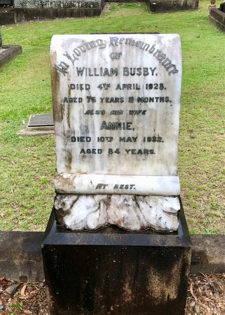

# William Busby

**ca. May 1857 - 14 April 1928**

--8<-- "snippets/william-busby-2.md"

### Headstone

{ width="30%" class="full-width" }

### Inscription

>In loving rememberance  
>of  
>William Busby  
>Died 4^th^ April 1928,  
>Aged 76 years 11 months.  
>Also his wife   
>Annie  
>Died 10^th^ May 1932,  
>Aged 84 years.  
>At rest.

### Learn more 

- [Tombstone Tuesday: William Busby, stonemason of Toowong](http://www.dragongenealogy.com/blog/2011/11/tombstone-tuesday-william-busby-stonemason-of-toowong/)
- [Memorial to the late Lieutenant Caskey](https://trove.nla.gov.au/newspaper/article/19130745) - The Brisbane Courier, 6 December 1901. 

<!--
https://trove.nla.gov.au/newspaper/article/21240123?searchTerm=busby - M.U.I.O.O.F. Brother
https://trove.nla.gov.au/newspaper/article/3485355?searchTerm=busby%20sylvan - drainage
https://trove.nla.gov.au/newspaper/article/19244847 - Made the Marble Memorial to Mr. Percy Lionel Benjamin (3‑12‑7/8).
https://trove.nla.gov.au/newspaper/article/19278904 - Made the Spragg memorial 1904
-->

--8<-- "snippets/add-to-this-story.md"