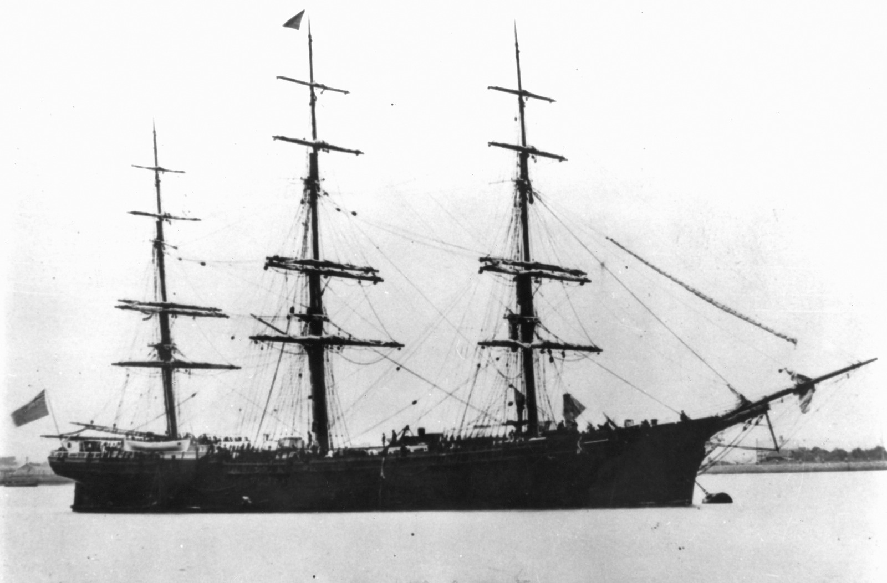
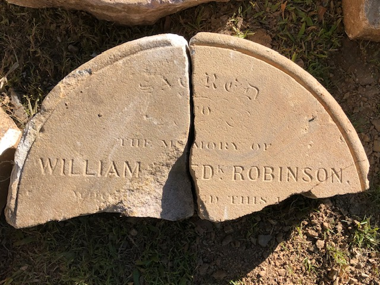

# William Frederick Robinson

**Died 17 September 1874**

## William Frederick Robinson <small>(29A)</small>

William was the son of Caroline Wallace and James John Robinson. William and his wife, Sarah, travelled to Australia on the *Royal Dane* from London, arriving in December 1871. On the trip Harry Adams, a cabin steward, stole Sarah's diamond and emerald ring from her second-class cabin. Harry was caught and the ring returned.

William died on 17 September 1874 and friends and family moved from his residence, Grosvenor House,
George-street, to the Episcopalian section in the North Brisbane Burial Grounds.

<figure markdown>
  { width="30%" class="full-width" }
  <figcaption markdown>[Royal Dane (ship)](https://onesearch.slq.qld.gov.au/permalink/61SLQ_INST/dls06p/alma99183512723702061) — State Library of Queensland.</figcaption>
</figure>

### Headstone  

{ width="30%" }

*<small>William Frederick Robinson's headstone discovered in a Toowong Cemetery Archaeological Dig, 2023.</small>*

- Erected: North Brisbane Burial Grounds, Episcopalian section. ca. 17 September 1874
- Moved to: North Brisbane Burial Grounds, Reserved Area. ca. 1914
- Demolished and disposed of in: Toowong Cemetery, Portion 29A. ca. 1930
- Discovered: Toowong Cemetery, Portion 29A near Section 72. 20 May 2023

### Inscription

>Sacred to the memory of  
>William Fredk Robinson.  
>... ed this 1...

### Learn more 

- [Stealing a Diamond Ring](https://trove.nla.gov.au/newspaper/article/27268950), 23 December 1871, The Brisbane Courier reports a diamond ring stolen from William's wife, Sarah, on their trip to Australia in 1871.
- [Queensland Death Certificate]( https://www.familyhistory.bdm.qld.gov.au/details/964bb00ab3715f12394c6734143504efc218b32372601de833a9155da38a4eec).
- [Family Notice in the Brisbane Courier](https://trove.nla.gov.au/newspaper/article/1388694?searchTerm=William%20robinson), 18 September 1874.

--8<-- "snippets/add-to-this-story.md"