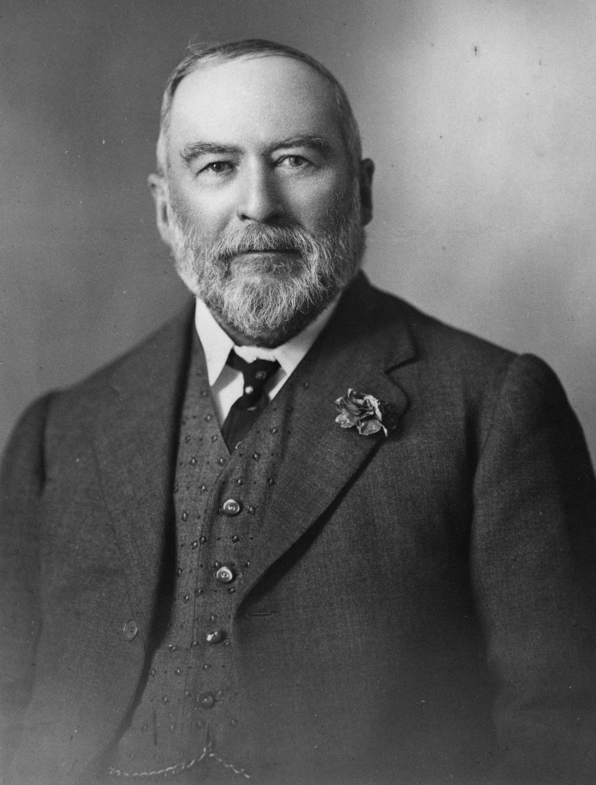

<!--
--8<-- "snippets/sem/stories/1923.json"
-->

# One Year - 1923

Stories about people remembered in Toowong Cemetery with a connection to 1923.

1923 quick facts:

- The Monarch of Australia was George Ⅴ.
- Prime Ministers were Billy Hughes (until 9 Feb 1923) and then Stanley Bruce.
- Governor of Queensland was Lieutenant Colonel the Honourable Sir Matthew Nathan. <!-- 3-13-27 -->
- Premier of Queensland was Ted Theodore.
- North Brisbane Mayor was Harry J. Diddams, and the South Brisbane Mayor was Alf Faulkner. <!-- 11-45-5 -->
- Toowong Mayor was [Charles Patterson](../research/charles-patterson.md). <!-- 13‑30‑10 -->
- The State-sponsored referendum on Prohibition failed.
- The Town of Cairns was proclaimed a city.

<figure markdown>
{ width="70%" } 
  <figcaption markdown>[Aerial view of George Street, Brisbane, 1923](http://onesearch.slq.qld.gov.au/permalink/f/1upgmng/slq_digitool92468), Victoria Bridge can be seen crossing the Brisbane River on the right, and McDonnell and East Ltd. is prominent towards the bottom right of George Street — State Library of Queensland.</figcaption>
</figure>

--8<-- "snippets/no-spoilers.md"

--8<-- "snippets/toowong-cemetery-map.md"

## Alexander Brand Webster <small>(1‑37‑6)</small>

A son of John Webster and Ann Brand, Alexander Brand Webster was born on 31 May 1842 in Montrose, Angus, Scotland.
Alex migrated to Australia aboard the Queensland Government chartered *[ss Netherby](https://en.wikipedia.org/wiki/Netherby_(ship))*, eventually arriving in Brisbane on 6 August 1866 aboard the ss City of Melbourne.

In late 1867, Alex headed to Nashville, now Gympie, where he opened a wholesale store on Mary Street. Early in 1870, Alex put his Gympie premises up for sale for his impending return to Brisbane. Alex joined his brother William's Mary Street, Brisbane, general merchant business, renamed W & AB Webster & Co and subsequently rebranded Webster & Co.

Mary (Minnie) Ogilvie Christian Jane Savage married Alex on 5 November 1874 in Dumfries, Scotland. They had three children born in Brisbane before Minnie's death in Hobart, Tasmania on 09 November 1881.

In 1881, Alex was appointed provisional [consular agent for Belgium](https://trove.nla.gov.au/newspaper/article/20705144/2250309) during E. R. Drury’s absence.

In June 1882 Alex, headed to Europe with a servant and his children. Evangeline Andrew Shoobridge married Alexander in Hobart, Tasmania on 20 August 1884. Alex died at his Deception Bay residence around noon on Sunday 21 January 1923. His widow and six of his nine children survived him.

<figure markdown>
  { width="30%" class="full-width" }
  <figcaption markdown>[A. B. Webster](https://onesearch.slq.qld.gov.au/permalink/61SLQ_INST/tqqf2h/alma99183505839102061) — State Library of Queensland.</figcaption>
</figure>

## Richard Philip Thornton <small>(1‑87‑22)</small>

John William Thornton and Susan Florence (née Brockett)’s son, Richard Philip Thornton, was born in Queensland on 10 September 1908.

On 4 January 1923, Richard and other boys were diving off a boat in Redcliffe, which started drifting into deep water. The boys swam to shore, but, on arrival, Richard looked back and saw one boy in trouble. Richard swam back to the boat, dived to rescue the boy and brought him to shore. Using live-saving knowledge acquired from school, Richard and other boys succeeded in resuscitating the boy.

Eileen Cecelia Pacey married Richard in Brisbane on 25 October 1934. Richard, a fettler, was [murdered](https://trove.nla.gov.au/newspaper/article/203763612) at his residence in Broadway Street, Red Hill on 24 August 1944, becoming Brisbane’s first [Owen submachine gun](https://trove.nla.gov.au/newspaper/article/201979517) fatality.

<figure markdown>
  { width="30%" }
  <figcaption markdown>[Richard Thornton](http://nla.gov.au/nla.news-article178437782) — The Telegraph, 27 January 1923.</figcaption>
</figure>

## John Irwin Moore <small>(21‑1‑17)</small> 

Born on 7 October 1861 in Prahan, Victoria, John Irwin Moore was a son of John Irwin Moore and Julia (née Baker). The family headed for London aboard the *Accrington* in January 1863.

John studied medicine in Ireland before coming to Queensland and registering as a medical practitioner in March 1889. Susan Moore married John at St Paul's Church, Rockhampton on 11 October 1889. John worked in Springsure and Esk before returning overseas to continue his education. Returning to Queensland, John become an officer of the Public Health Department in 1912. John served as Commissioner for Public Heath in Queensland from 26 November 1913 until 30 June 1928, about 15 years. John died in Yasmar Private Hospital, Edmondstone Street, South Brisbane on 29 July 1930.

<figure markdown>
  { width="40%" class="full-width" }
  <figcaption markdown>[Dr. J. I. Moore](https://trove.nla.gov.au/newspaper/article/175463866) — The Telegraph, 18 October 1913.</figcaption>
</figure>

## Tsunetaro Morishima <small>(20‑5‑21)</small>

Tsunetaro Morishima, a son of Masutaro Morishima, was born about 1879. In early 1914, Tsunetaro advertised his laundries at 56 Melbourne Street, South Brisbane, Stanley Street, South Brisbane and Paddington. [Natural causes claimed Tsunetaro](https://trove.nla.gov.au/newspaper/article/20649383), who was found in his bed at Stanley Street, South Brisbane on 26 October 1923. His wife resided in Japan.

## Frank William Soady <small>(20‑38‑20/21)</small>

Frank William Soady was born in Brisbane on 29 August 1904 to Frank William Soady and Ellen Amelia (née Cheshire).

Debuting professionally as a boxer on 30 May 1923, Frank won 4 bouts at the Brisbane Stadium, presenting an opportunity to fight for boxing's Queensland State Lightweight Championship at the Brisbane Stadium on Saturday 3 November 1923. Taken from the bout straight to hospital, Frank, aged 19 years, remained at the Brisbane General Hospital for 9 days before dying on 12 November 1923 of cerebral haemorrhage and congestion of the lungs.

Frank’s Italian marble 3m tall memorial was unveiled in Toowong Cemetery on Sunday 22 February 1925.

<figure markdown>
  { width="50%" class="full-width" }
  <figcaption markdown>[The NEWS in PICTURES](http://nla.gov.au/nla.news-article219079996) — The Daily Mail, 24 February 1925.</figcaption>
</figure>

<!--
The NEWS in PICTURES The Daily Mail PHOTOGRAPHIC PAGE Daily CAMERA Record" The Daily Mail (Brisbane, Qld. : 1903; 1916 - 1926) 24 February 1925: 11. Web. 9 Nov 2022 <http://nla.gov.au/nla.news-article219079996>.
-->

## Ellen Clara Rea <small>(7a‑118‑15)</small>

Ellen Clara Rea was born in Queensland on 8 April 1902 to Charles Walter Rea and Margaret Agnes (née Brown).

At about 10:40pm on 12 January 1923 a party of eight left Belmont in a [Hudson super-six](https://en.wikipedia.org/wiki/Hudson_Super_Six) headed towards Brisbane city along Old Cleveland Road. Travelling at high speed, witnesses reported a horn tooting, wind rushing and a crash all in quick succession. [A devastating sight confronted those who attended the scene](https://trove.nla.gov.au/newspaper/article/218978914) near the corner of Shakespeare Street, Coorparoo.
Ellen, a waitress, residing at the Adelaide Boarding House, Stanley Street, South Brisbane, died at the scene.

## May Rose and Percy Austin Wynn <small>(18‑174‑26)</small>

May Rose Read was born in Norwich, England in 1893. Percy Austin Wynn married May in Norwich, England, on 8 February 1919. They travelled to Australia aboard the *Port Lincoln* in 1919.

Percy Austin Wynn junior was born in Brisbane on 12 December 1920 to Percy Austin Wynn and May Rose (née Read). 

Mary and Percy junior both died in the Brisbane General Hospital on 5 September 1923 from burns received as a [result of an explosion](https://trove.nla.gov.au/newspaper/article/180015539) at their Hartley Street residence in Spring Hill about 3:30pm on 03 September.

<figure markdown>
  { width="70%" class="full-width" }
  <figcaption markdown>[No title](http://nla.gov.au/nla.news-article181751290) — Daily Standard, 4 September 1923.</figcaption>
</figure>

## Thomas Kelly <small>(18‑129‑14)</small>

Thomas Kelly was born on the Isle of Man on 14 January 1881 to Emily & John Kelly. Sarah Jane Lowey married Thomas. They arrived in Brisbane aboard the *ss Oswestry Grange* on 25 March 1909. Sarah died in Brisbane in March 1918.

Tom resided in Fernberg Road, Rosalie and worked as an ornamental sign writer, based at the Salisbury Chambers, George Street, Brisbane.

The [Southside Sensation](https://trove.nla.gov.au/newspaper/article/218980313) occurred about 9:15pm, Monday 5 February 1923 near the Mowbray Park Baths. Conveyed to the Mater Misericordiae Public Hospital, Tom died there on 8 February 1923.

<figure markdown>
  { width="70%" class="full-width" }
  <figcaption markdown>[Mowbray Park Swimming Pool at East Brisbane, Queensland, ca. 1925](https://onesearch.slq.qld.gov.au/permalink/61SLQ_INST/dls06p/alma99183839655202061) — State Library of Queensland. Cropped.</figcaption>
</figure>

## Mary Stewart and Stafford Ralph Gore <small>(12‑53‑4</small>

Mary Stewart Baldock, born 17 April 1823, was a daughter of Lt-Col Christopher Baldock of the Honourable East India Company Service. Robert Corbet Gore, barrister, married Mary Stewart Baldock on 17 March 1841.

Their three children were born in New South Wales; daughter Leonice Souvoroff in Sydney on 17 January 1842 and their two sons, born at Hunters Hill; Strafford Robert on 3 July 1843 and St George Baldock, on 4 April 1845.

Robert, Mary, Strafford and St George boarded the paddle steamer *Sovereign* on 3 March 1847 on its weekly [Brisbane to Sydney run](https://nla.gov.au/nla.news-article12893901). All four Gores aboard the *Sovereign* drowned on 11 March 1847. Only the bodies of Mary and Strafford were recovered.

The loss of the Sovereign prompted the main passage into Moreton Bay to change to the safer Northern Passage and therefore the pilot station shifted from Stradbroke to Moreton Island.

## Henry Cooke Morrow <small>(12‑15‑2/10)</small>

Henry Cooke Morrow was born in Brisbane on 17 December 1878 to Thomas Morrow and Margaret (née Caldwell). Lottie Marston married Henry in Queensland on Friday, 12 September 1902. Henry served as the inaugural Indooroopilly Golf Club President, St Lucia from 1926-32.

Henry, chairman and managing director of Morrows Pty Ltd, confectionery and biscuit manufacturers, who resided in Brisbane at *Glencairn*, Graham Road, Indooroopilly, died at his Surfers Paradise residence, *Warrawilla*, on Tuesday, 2 December 1952, just before his 74^th^ birthday anniversary.

<figure markdown>
  { width="70%" class="full-width" }
  <figcaption markdown>[Morrows Limited](https://trove.nla.gov.au/newspaper/article/185554796) — Daily Standard, 27 November 1925</figcaption>
</figure>
