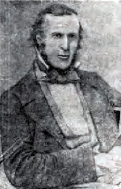

# The Artists 

<!--

???+ directions "Directions" 

    - walking directions
    
    

-->

--8<-- "snippets/le-fevre-james-cranstone.md"

{ width="30%" }  

<!--

??? directions "Directions" 

    - walking directions
    
    

-->

--8<-- "snippets/isaac-walter-jenner.md"

<!--

??? directions "Directions" 

    - walking directions
    
        
-->

--8<-- "snippets/richard-godfrey-rivers.md"

<!--

??? directions "Directions" 

    - walking directions
    
       

-->

--8<-- "snippets/eliza-jeanettie-sheldon.md"

<!--

??? directions "Directions" 

    - walking directions back to the start

-->

## Source

- Bradbury, Keith, *Sheldon, Eliza Jeanettie (1885-1974)*, Australian Dictionary of Biography, Volume 16, Melbourne University Press, 2002, pp 227-228.
- Hogan, Janet, *Rivers, Richard Godfrey (1859?-1925)*, Australian Dictionary of Biography, Volume 11, Melbourne University Press, 1988, pp 397-398.
- Maynard, Margaret, *Jenner, Isaac Walter (1837-1902)*, Australian Dictionary of Biography, Volume 9, Melbourne University Press, 1983, p. 480.
- Smith, Donald, *Lefevre James Cranstone : his life and art*, Richmond, Virginia : Brandylane Publishers, 2004.

<!--

## Brochure

**[Download this walk](../assets/guides/artists.pdf)** - designed to be printed and folded in half to make an A5 brochure.

-->
