# Brisbane Mayors  

These stories cover many of the early Mayors of the Town of Brisbane. The City of Brisbane replaced the Town of Brisbane in 1903, which was then replaced by the new City of Brisbane in 1925.

<!--
???+ directions "Directions" 

    - Start behind Canon Garland Place in Emma Miller Avenue. 
    - walking directions
              
    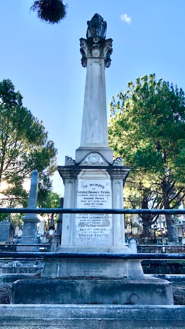{ width="100" }

-->

--8<-- "snippets/john-petrie.md"

<!--
??? directions "Directions" 

    - walking directions 
              
    { width="100" }

-->

--8<-- "snippets/george-edmondstone.md"

<!--
??? directions "Directions" 

    - walking directions
              
    { width="100" }

-->

--8<-- "snippets/thomas-proe.md"

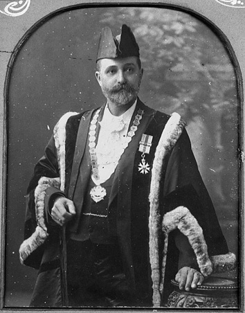{ width="48%" } 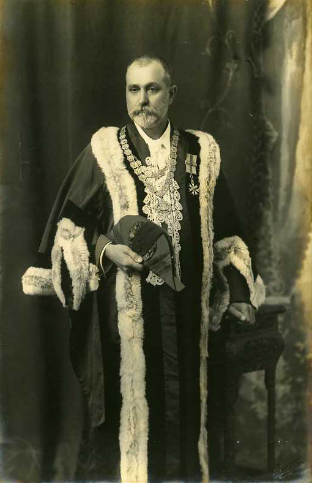{ width="39.7%" }

*<small>[Mayor Thomas Proe](https://library-brisbane.ent.sirsidynix.net.au/client/en_AU/BrisbaneImages/search/results?qu=Mayor+Thomas+Proe&rm=BRISBANEIMAGES0%7C%7C%7C1%7C%7C%7C0%7C%7C%7Ctrue&te=ASSET&lm=ALL_ASSETS) 1901 and 1905 — Brisbane City Council.</small>*

<!--

??? directions "Directions" 

    - walking directions
              
    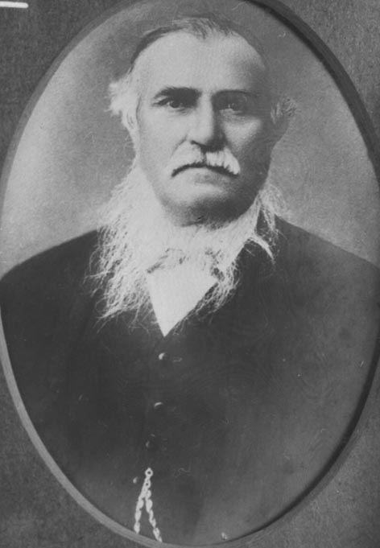{ width="100" }

-->

--8<-- "snippets/john-daniel-heal.md"

{ width="30.3%" } 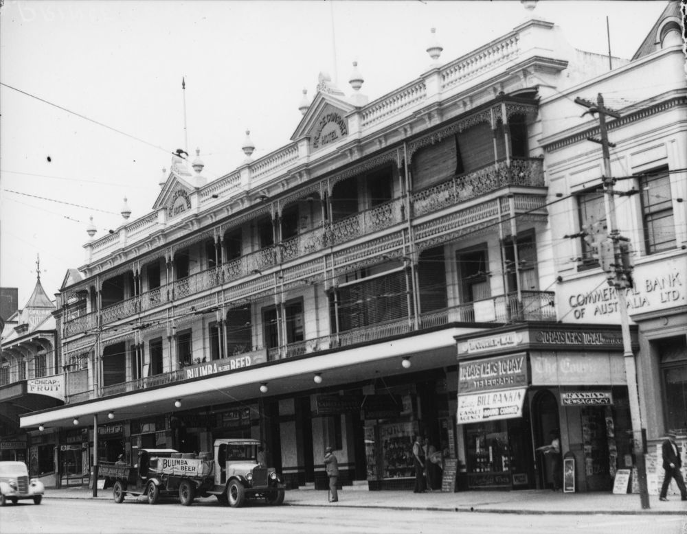{ width="56%" } 

*<small>[Mayor John Daniel Heal](https://library-brisbane.ent.sirsidynix.net.au/client/en_AU/BrisbaneImages/search/results?qu=Mayor+John+Daniel+Heal&rm=BRISBANEIMAGES0%7C%7C%7C1%7C%7C%7C0%7C%7C%7Ctrue&te=ASSET&lm=ALL_ASSETS) — Brisbane City Council.</small>*  
*<small>[Prince Consort Hotel, Brisbane, 1936](http://onesearch.slq.qld.gov.au/permalink/f/1upgmng/slq_alma21218131470002061) — State Library of Queensland.</small>*  

<!--

??? directions "Directions" 

    - walking directions
              
    { width="100" }

-->

--8<-- "snippets/john-sinclair.md"

<!--
??? directions "Directions" 

    - walking directions
              
    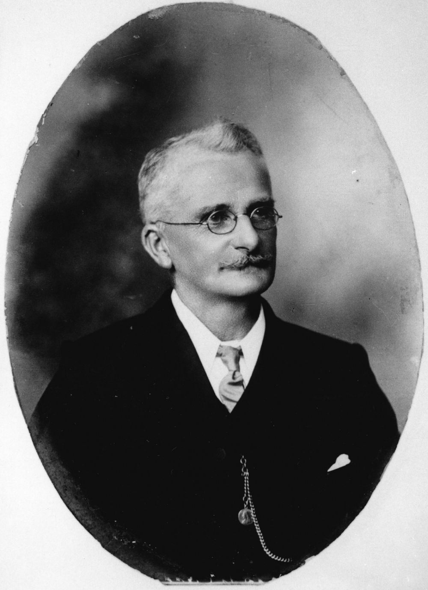{ width="100" }

-->

--8<-- "snippets/alfred-john-raymond.md"

<!--

??? directions "Directions" 

    - walking directions
              
    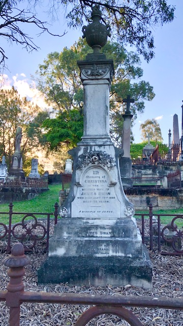{ width="100" }

-->

--8<-- "snippets/james-swan.md"

<!--

??? directions "Directions" 

    - walking directions
              
    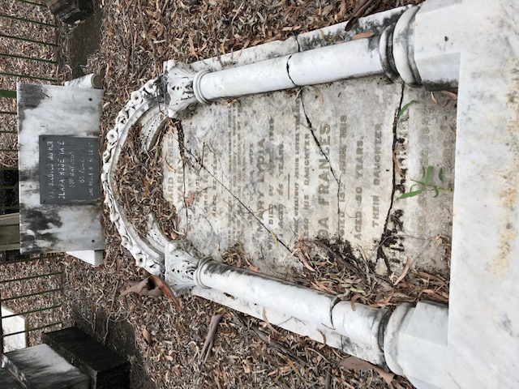{ width="100" }

-->

--8<-- "snippets/richard-symes-warry.md"

<!--

??? directions "Directions" 

    - walking directions
              
    { width="100" }

-->

--8<-- "snippets/richard-southall.md"

<!--
??? directions "Directions" 

    - walking directions
              
    { width="100" }

-->

--8<-- "snippets/john-hardgrave.md"

<!--
??? directions "Directions" 

    - walking directions
              
    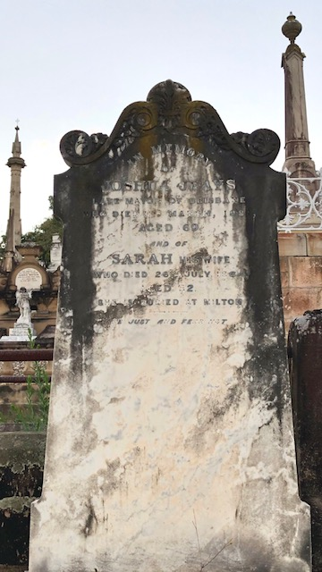{ width="100" }

-->

--8<-- "snippets/joshua-jeays.md"

<!--
??? directions "Directions" 

    - walking directions
              
    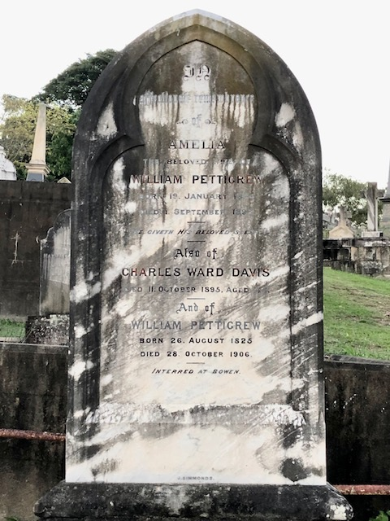{ width="100" }

-->

--8<-- "snippets/william-pettigrew.md"

<!--
??? directions "Directions" 

    - needs picture
              
    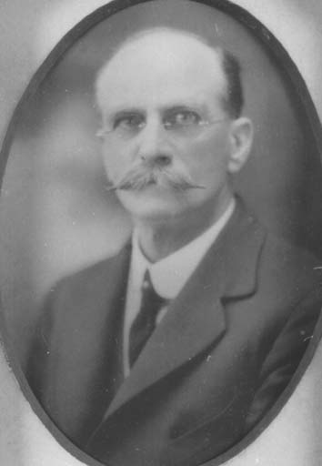{ width="100" }
    
-->

--8<-- "snippets/archibald-watson.md"

<!--

??? directions "Directions" 

    At this point you can either: 
    
    - end the walk by continuing down the hill to the starting point.
    - visit William MacNaughton Galloway's grave in Portion 7A. To do this: 
      - Walk along Emma Miller Avenue to Charles Heaphy Drive.
      - Continue down Charles Heaphy Drive to the Shelter Shed.
      - Walk towards O'Doherty Avenue (previously 11^th^ Avenue) and four graves along you'll find Ned Hanlon. 
      - Walk into Portion 7A about 4 sections, and you'll find...

    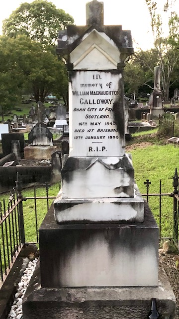{ width="100" }
    
-->

--8<-- "snippets/william-macnaughton-galloway.md"

<!--

??? directions "Directions" 

    - Retrace your steps back to the starting point

-->

## Further Reading

- [Brisbane's Lord Mayors](https://www.brisbane.qld.gov.au/about-council/council-information-and-rates/council-history/brisbanes-lord-mayors)
- [List of mayors and lord mayors of Brisbane](https://en.wikipedia.org/wiki/List_of_mayors_and_lord_mayors_of_Brisbane)

<!--

## Brochure

**[Download this walk](../assets/guides/brisbane-mayors.pdf)** - designed to be printed and folded in half to make an A5 brochure.

-->
