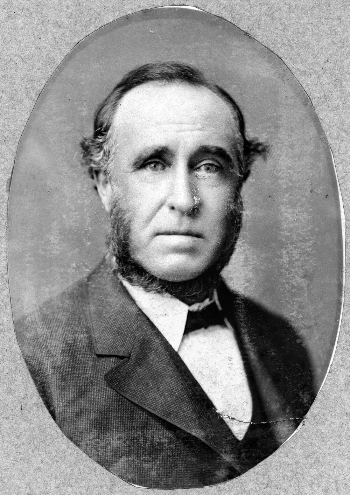
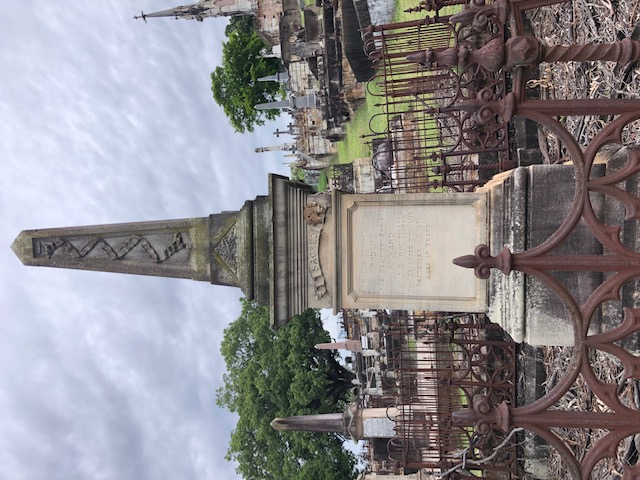
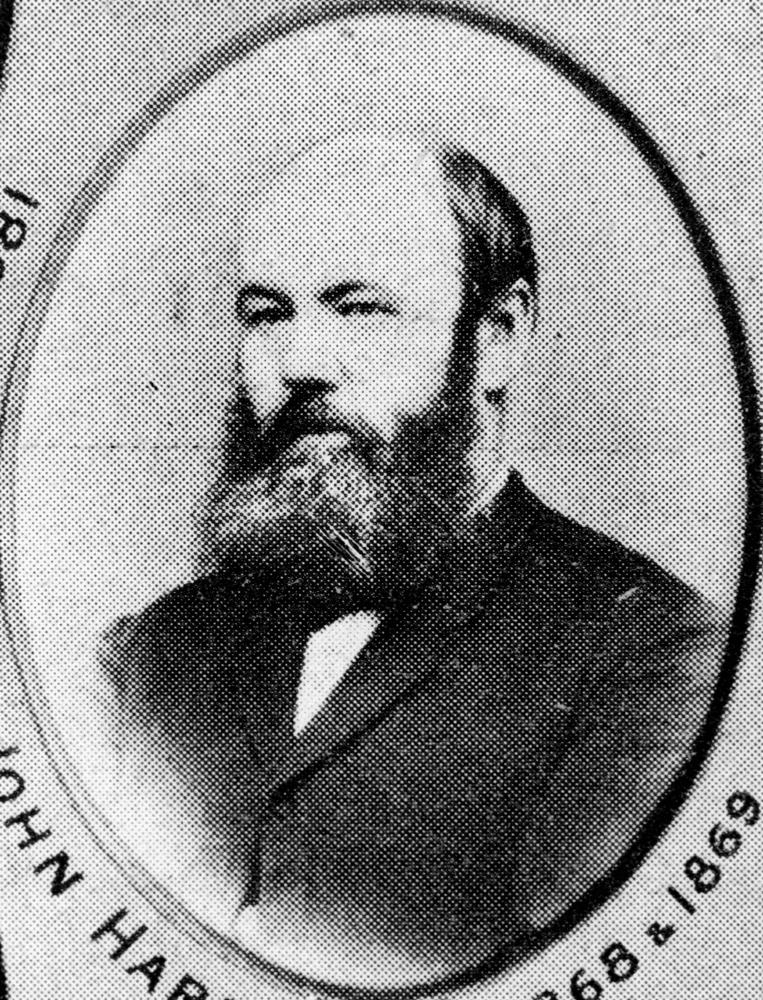

--8<-- "snippets/sem/stories/brisbane-mayors.json"

# Brisbane Mayors  

**Stories about early Brisbane Mayors remembered in Toowong Cemetery**

These stories cover many of the early Mayors of the Town of Brisbane. The City of Brisbane replaced the Town of Brisbane in 1903, which was then replaced by the new City of Brisbane in 1925.

--8<-- "snippets/toowong-cemetery-map.md"

<!--
???+ directions "Directions" 

    - Start behind Canon Garland Place in Emma Miller Avenue. 
    - walking directions
              
    { width="100" }

-->

--8<-- "snippets/john-petrie.md"

<!--
??? directions "Directions" 

    - walking directions 
              
    { width="100" }

-->

--8<-- "snippets/george-edmondstone.md"

<!--
??? directions "Directions" 

    - walking directions
              
    { width="100" }

-->

--8<-- "snippets/thomas-proe.md"

{ width="48%" } { width="39.7%" }

*<small>[Mayor Thomas Proe](https://library-brisbane.ent.sirsidynix.net.au/client/en_AU/BrisbaneImages/search/results?qu=Mayor+Thomas+Proe&rm=BRISBANEIMAGES0%7C%7C%7C1%7C%7C%7C0%7C%7C%7Ctrue&te=ASSET&lm=ALL_ASSETS) 1901 and 1905 — Brisbane City Council.</small>*

<!--

??? directions "Directions" 

    - walking directions
              
    { width="100" }

-->

--8<-- "snippets/john-daniel-heal.md"

{ width="30.3%" } { width="56%" } 

*<small>[Mayor John Daniel Heal](https://library-brisbane.ent.sirsidynix.net.au/client/en_AU/BrisbaneImages/search/results?qu=Mayor+John+Daniel+Heal&rm=BRISBANEIMAGES0%7C%7C%7C1%7C%7C%7C0%7C%7C%7Ctrue&te=ASSET&lm=ALL_ASSETS) — Brisbane City Council.</small>*  
*<small>[Prince Consort Hotel, Brisbane, 1936](http://onesearch.slq.qld.gov.au/permalink/f/1upgmng/slq_alma21218131470002061) — State Library of Queensland.</small>*  

<!--

??? directions "Directions" 

    - walking directions
              
    { width="100" }

-->

--8<-- "snippets/john-sinclair.md"

<!--
??? directions "Directions" 

    - walking directions
              
    { width="100" }

-->

--8<-- "snippets/alfred-john-raymond.md"

<!--

??? directions "Directions" 

    - walking directions
              
    { width="100" }

-->

--8<-- "snippets/james-swan.md"

<!--

??? directions "Directions" 

    - walking directions
              
    { width="100" }

-->

--8<-- "snippets/richard-symes-warry.md"

<!--

??? directions "Directions" 

    - walking directions
              
    { width="100" }

-->

--8<-- "snippets/richard-southall.md"

<!--
??? directions "Directions" 

    - walking directions
              
    { width="100" }

-->

--8<-- "snippets/john-hardgrave.md"

<!--
??? directions "Directions" 

    - walking directions
              
    { width="100" }

-->

--8<-- "snippets/joshua-jeays.md"

<!--
??? directions "Directions" 

    - walking directions
              
    { width="100" }

-->

--8<-- "snippets/william-pettigrew.md"

<!--
??? directions "Directions" 

    - needs picture
              
    { width="100" }
    
-->

--8<-- "snippets/archibald-watson.md"

<!--

??? directions "Directions" 

    At this point you can either: 
    
    - end the walk by continuing down the hill to the starting point.
    - visit William MacNaughton Galloway's grave in Portion 7A. To do this: 
      - Walk along Emma Miller Avenue to Charles Heaphy Drive.
      - Continue down Charles Heaphy Drive to the Shelter Shed.
      - Walk towards O'Doherty Avenue (previously 11^th^ Avenue) and four graves along you'll find Ned Hanlon. 
      - Walk into Portion 7A about 4 sections, and you'll find...

    { width="100" }
    
-->

--8<-- "snippets/william-macnaughton-galloway.md"

<!--

??? directions "Directions" 

    - Retrace your steps back to the starting point

-->

<!-- 
Also

## Leslie Gordon Corrie <small>13‑71‑13/14</small>

Leslie Gordon Corrie (1859–1918) was an architect and the mayor of Brisbane, Queensland from 1902 to 1903.

https://en.wikipedia.org/wiki/Leslie_Corrie

## Edward Joseph Baines	<small>7‑5‑30</small>

https://en.wikipedia.org/wiki/Edward_Joseph_Baines

## Abram Robertson Byram <small>1‑19‑6</small>

https://en.wikipedia.org/wiki/Abram_Robertson_Byram

## Benjamin Harris Babbidge <small>1‑44‑9</small>

https://en.wikipedia.org/wiki/Benjamin_Harris_Babbidge

## George Watson <small>13‑47‑11</small>

https://en.wikipedia.org/wiki/George_Watson_(mayor)

## Robert Fraser <small>11‑52‑9/10</small>

https://en.wikipedia.org/wiki/Robert_Fraser_(politician)

## William Murray Thompson <small>11‑71‑15</small>

https://en.wikipedia.org/wiki/William_Murray_Thompson

## Charles Pakenham Buchanan <small>7‑20‑19</small>

https://en.wikipedia.org/wiki/Charles_Pakenham_Buchanan

## Thomas Wilson <small>8‑61‑33B/4</small>

https://en.wikipedia.org/wiki/Thomas_Wilson_(Queensland_politician)

## Harry Diddams <small>11‑45‑5</small>	

https://en.wikipedia.org/wiki/Harry_Diddams

## Henry (Harry) Doggett <small>11‑16‑3</small>

https://en.wikipedia.org/wiki/Harry_Doggett

## George Down <small>12‑4‑9</small> 

https://en.wikipedia.org/wiki/George_Down

## James Francis Maxwell <small>13‑65‑4</small> 

https://en.wikipedia.org/wiki/James_Francis_Maxwell

## William Alfred Jolly	<small>8‑73‑29</small> 

https://en.wikipedia.org/wiki/William_Jolly

-->

## Brisbane Mayors buried in Toowong Cemetery

28 [Brisbane Mayors](https://en.wikipedia.org/wiki/List_of_mayors_and_lord_mayors_of_Brisbane) are buried in Toowong Cemetery. 

--8<-- "snippets/brisbane-mayors.html"

### Download the data

[Brisbane Mayors buried in Toowong Cemetery](brisbane-mayors.md) by [Friends of Toowong Cemetery Association Inc.](../index.md), is licensed under [CC BY 4.0](https://creativecommons.org/licenses/by/4.0/). You must provide attribution if you reuse this work.

Download the Brisbane Mayors buried in Toowong Cemetery data as a Comma Separated Value file (.csv)

[Download the data][data]{ .md-button .md-button--primary download}

[data]: ../../assets/data/brisbane-mayors-buried-in-toowong-cemetery.csv

## Acknowledgements

Written by [Dr. Hilda Maclean](https://www.linkedin.com/in/dr-hilda-maclean-4819a711/)

## Further Reading

- [Brisbane's Lord Mayors](https://www.brisbane.qld.gov.au/about-council/council-information-and-rates/council-history/brisbanes-lord-mayors)

<!--

## Brochure

**[Download this walk](../assets/guides/brisbane-mayors.pdf)** - designed to be printed and folded in half to make an A5 brochure.

-->
