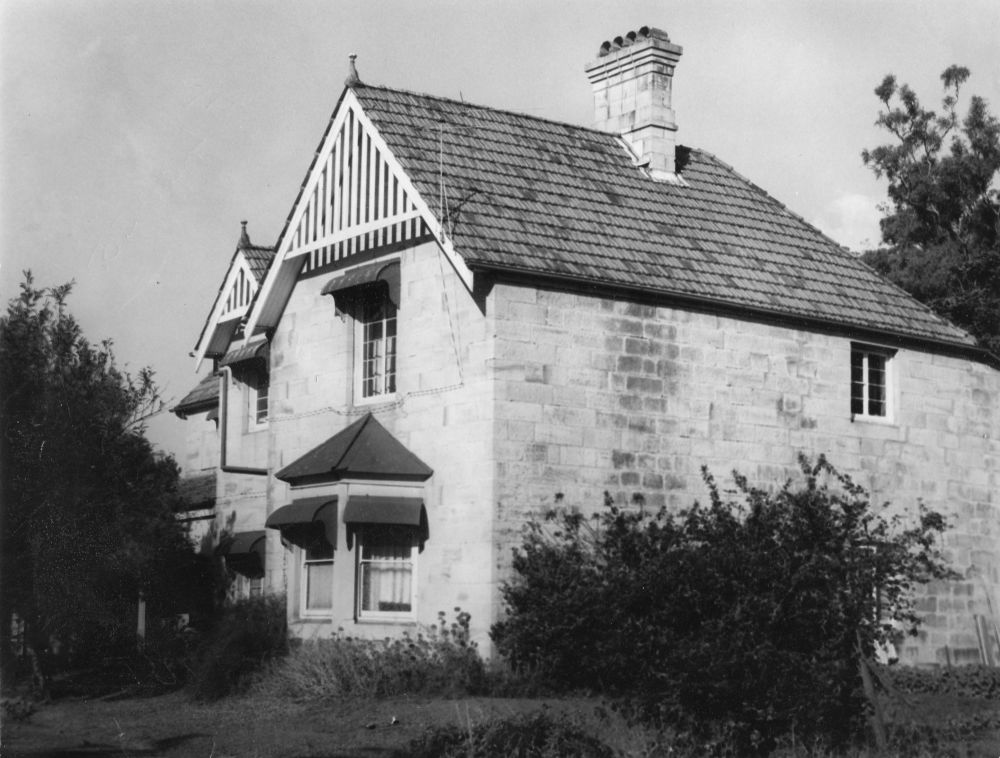
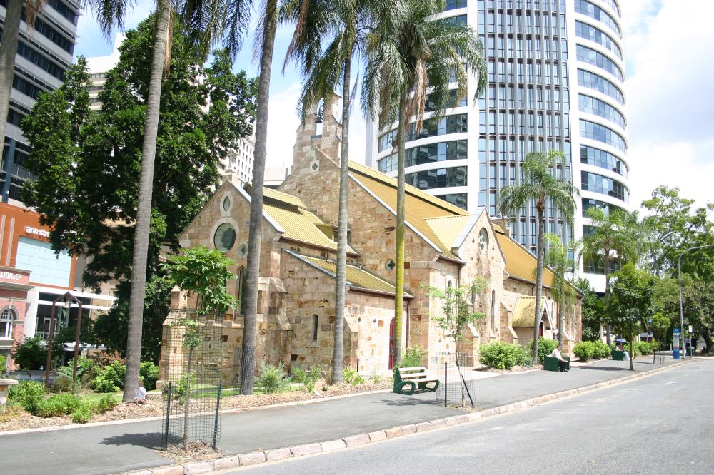

# Building Brisbane 

<!--
Introduction

???+ directions "Directions" 

    Starting point
    Walking directions to first headstone... is the grave of...
    
    { width="15%" }
-->

## Andrew Petrie <small>(13‑5‑5)</small>

Andrew Petrie was born in Fife, Scotland, on 25 June 1798 to Walter Petrie and Margaret (née Hutchison). Mary Cuthbertson married Andrew in Edinburgh 1821. In 1831 the family arrived in Sydney aboard the *Stirling Castle*. In 1837, Andrew, as clerk of works, arrived in Moreton Bay with his family aboard the *James Watt*. Sandy blight robbed Andrew of his eyesight in 1848, but he kept control of his business. Andrew died on 20 February 1872.

### Notable surviving Brisbane works

- [Toogoolawah / Bulimba House](https://apps.des.qld.gov.au/heritage-register/detail/?id=600179), 34 Kenbury St, Bulimba
- [Adelaide House (The Deanery)](https://apps.des.qld.gov.au/heritage-register/detail/?id=600078), 417 Adelaide Street, Brisbane

{ width="70%" }  

*<small>[Bulimba House in Brisbane](http://onesearch.slq.qld.gov.au/permalink/f/1upgmng/slq_alma21218956340002061) — State Library of Queensland.</small>*

{ width="70%" }  

*<small>[Adelaide House or The Deanery, Ann Street, Brisbane, ca. 1882](http://onesearch.slq.qld.gov.au/permalink/f/1upgmng/slq_alma21220456580002061) — State Library of Queensland.</small>*

<!--
??? directions "Directions" 

    Walking directions to next headstone... is the grave of...
    
    { width="15%" }
-->

--8<-- "snippets/william-mccallum-park.md"

### Notable surviving Brisbane works

- Former [Colonial Mutual Chambers](https://apps.des.qld.gov.au/heritage-register/detail/?id=600160), 62 Queen St. 1883
- [Spring Hill Baths](https://apps.des.qld.gov.au/heritage-register/detail/?id=600313), 14 Torrington St. 1886

{ width="40%" }  

*<small>[File:62 Queen Street (2008).jpg](https://commons.wikimedia.org/wiki/File:62_Queen_Street_(2008).jpg) — Heritage branch staff, State of Queensland, via Wikimedia Commons.</small>*

{ width="70%" }  

*<small>[Spring Hill Baths, ca. 1910](http://onesearch.slq.qld.gov.au/permalink/f/1upgmng/slq_alma21218338600002061) State Library of Queensland.</small>*

--8<-- "snippets/william-macfarlane.md"

### Notable surviving Brisbane works

- [Former Museum / State Library](https://apps.des.qld.gov.au/heritage-register/detail/?id=600177), William St. 1877-1879
- [Rothwells](https://apps.des.qld.gov.au/heritage-register/detail/?id=600094) and [Rowes](https://apps.des.qld.gov.au/heritage-register/detail/?id=600095) Buildings, Edward St. 1885

{ width="70%" }  

*<small>[State Library (former)](https://apps.des.qld.gov.au/heritage-register/detail/?id=600177#) — The State of Queensland 2021.</small>*

{ width="70%" }  

*<small>[Rothwells Building](https://apps.des.qld.gov.au/heritage-register/detail/?id=600094) — The State of Queensland 2021.</small>*

<!--
{ width="40%" }  

*<small>[Rowes Building](https://apps.des.qld.gov.au/heritage-register/detail/?id=600095#) — The State of Queensland 2021.</small>*
-->

--8<-- "snippets/henry-holmes.md"

### Notable surviving Brisbane works

- [Spring Hill Reservoirs](https://apps.des.qld.gov.au/heritage-register/detail/?id=600174), 230 Wickham Tce. 1871 and 1882 
- [Florence House](https://heritage.brisbane.qld.gov.au/heritage-places/391), 256 Petrie Tce. 1874

--8<-- "snippets/thomas-dempster.md"

<!-- TODO what did he do? -->

--8<-- "snippets/arthur-midson.md"

### Notable surviving Brisbane works

- [Brisbane Synagogue](https://apps.des.qld.gov.au/heritage-register/detail/?id=600127), 98 Margaret St. 1885-1886
- [Executive Building / Land Administration Building](https://apps.des.qld.gov.au/heritage-register/detail/?id=600123), 142 George St. 1901-1905

{ width="70%" }  

*<small>[Executive Building](https://apps.des.qld.gov.au/heritage-register/detail/?id=600123#) — The State of Queensland 2021.</small>*

--8<-- "snippets/george-john-ely.md"

### Notable surviving Brisbane works

- [All Saints Anglican Church](https://apps.des.qld.gov.au/heritage-register/detail/?id=600168), Wickham Terrace (with Mr Polworth). 1869

{ width="70%" }  

*<small>[All Saints Anglican Church](https://apps.des.qld.gov.au/heritage-register/detail/?id=600168#) — The State of Queensland 2021.</small>*

## Joshua Jeays <small>(13‑62‑13/14)</small>

Joshua Jeays was born in Bardon, Leicester in 1812. Sarah Edwyn married Joshua in Marylebone, Middlesex on 10 June 1839. The family of six arrived in Moreton Bay on 26 February 1853 aboard the *Agricola*. Joshua served as an Alderman between 1859 and 1867 and was Brisbane's fourth mayor in 1864. Joshua died at his North Quay residence on Friday 11 March 1881 aged 69 years.

### Notable surviving Brisbane works

- [Old Government House](https://apps.des.qld.gov.au/heritage-register/detail/?id=600118), 2 George St. 1860-1862
- [Bardon House](https://apps.des.qld.gov.au/heritage-register/detail/?id=600053), 41 The Drive, Bardon. 1863-1864

*<small>[Old Government House](https://apps.des.qld.gov.au/heritage-register/detail/?id=600118) — The State of Queensland 2021.</small>*

--8<-- "snippets/ebenezer-chapman.md"

### Notable surviving Brisbane works

- [Pinkenba State School](https://heritage.brisbane.qld.gov.au/heritage-places/1361), 238 Eagle Farm Rd. 1875
- [Toombul Shire Hall](https://apps.des.qld.gov.au/heritage-register/detail/?id=600272), 1141 Sandgate Rd, Nundah. 1891

{ width="70%" } 

*<small>[Toombul Shire Hall (former)](https://apps.des.qld.gov.au/heritage-register/detail/?id=600272) — The State of Queensland 2021.</small>*

<!--
## Acknowledgements

Compiled and presented by 
-->

## Sources

- [Assisted Immigration](https://www.qld.gov.au/recreation/arts/heritage/archives/search-the-records) The State of Queensland  
- [Family History Research](https://www.familyhistory.bdm.qld.gov.au) - The State of Queensland
- [Trove](https://trove.nla.gov.au) - National Library of Australia
- [Grave Location Search](https://graves.brisbane.qld.gov.au) - Brisbane City Council
- [One Search](https://www.slq.qld.gov.au/search), The State of Queensland (State Library of Queensland) 2016 
- [Trove](https://trove.nla.gov.au) - National Library of Australia

<!--

## Brochure

**[Download this walk](../assets/guides/boh.pdf)** - designed to be printed and folded in half to make an A5 brochure.

-->
