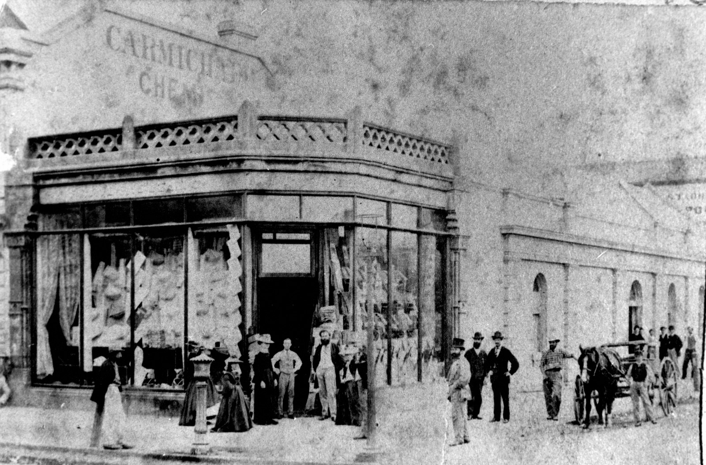
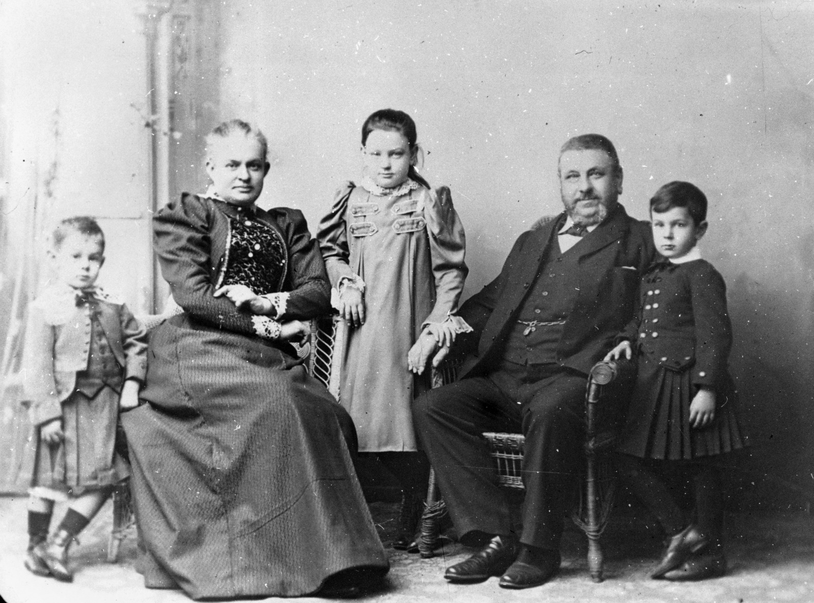
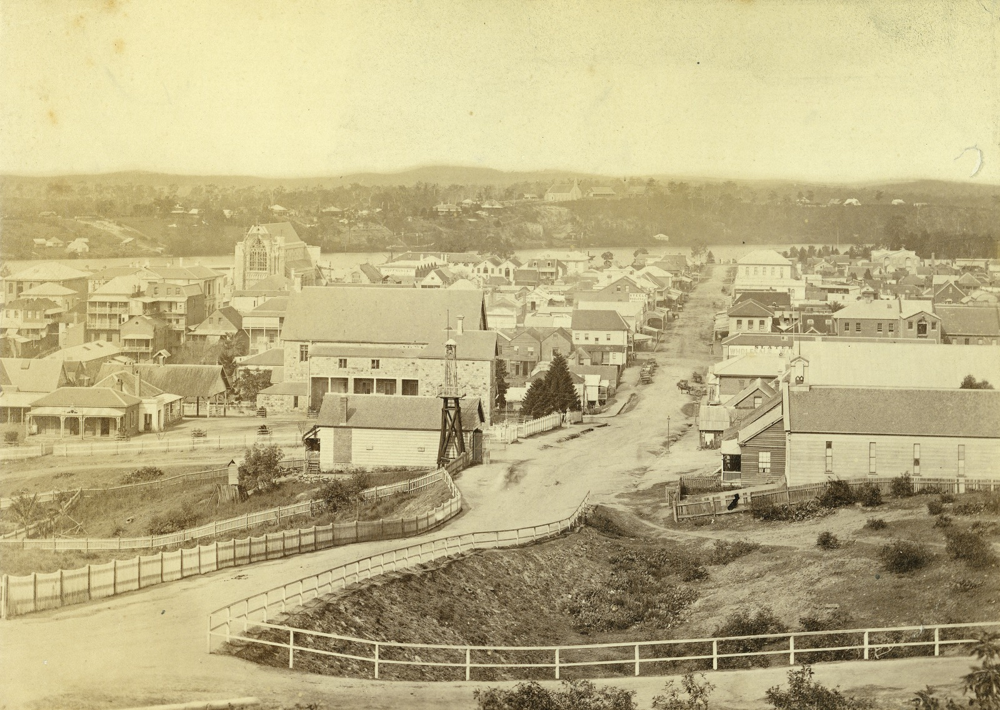
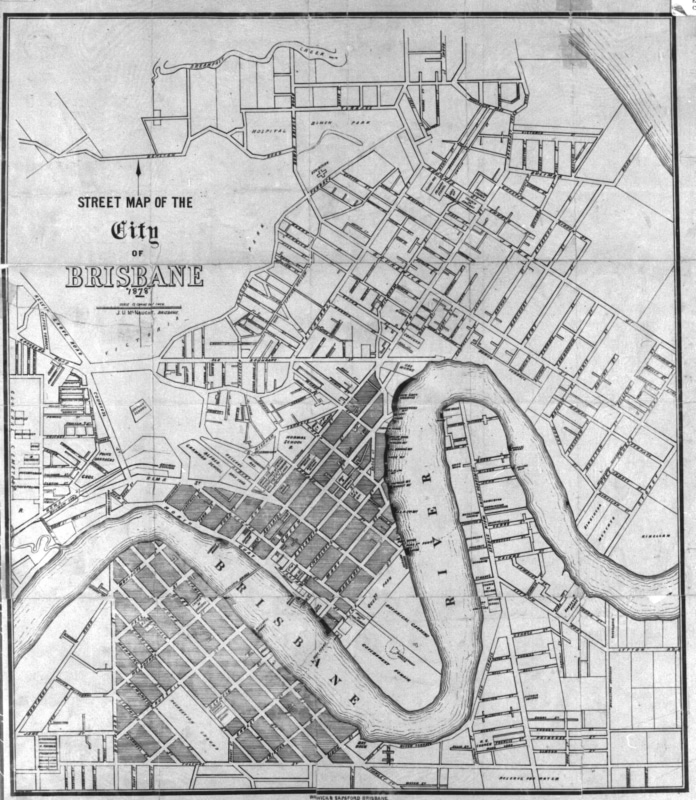
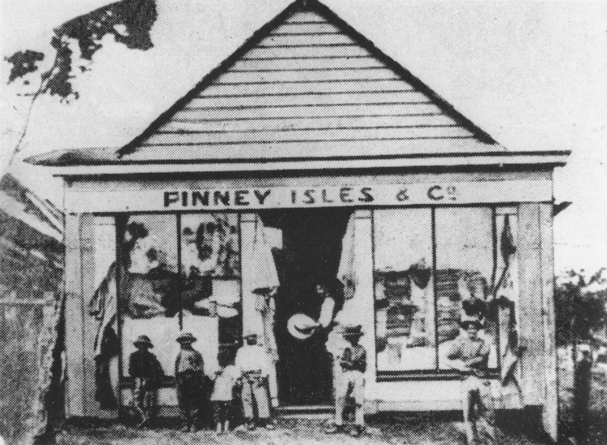
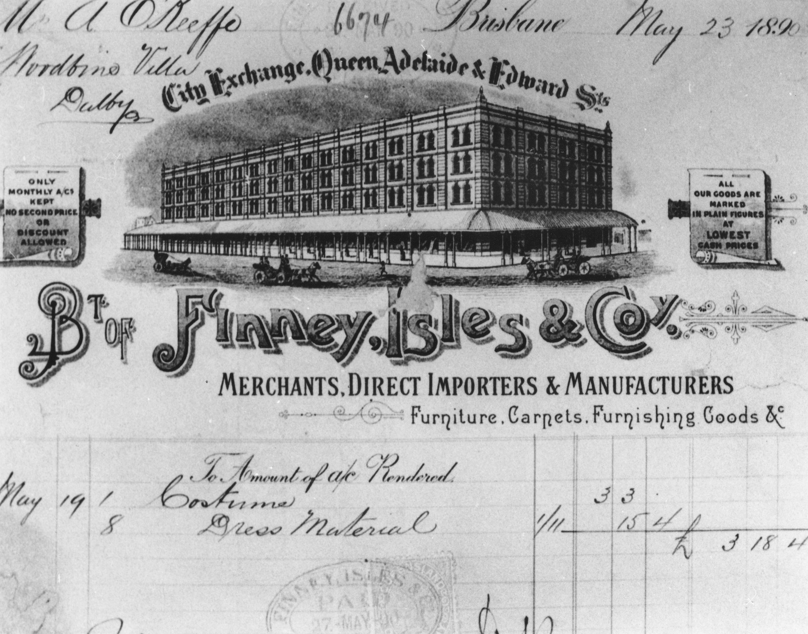
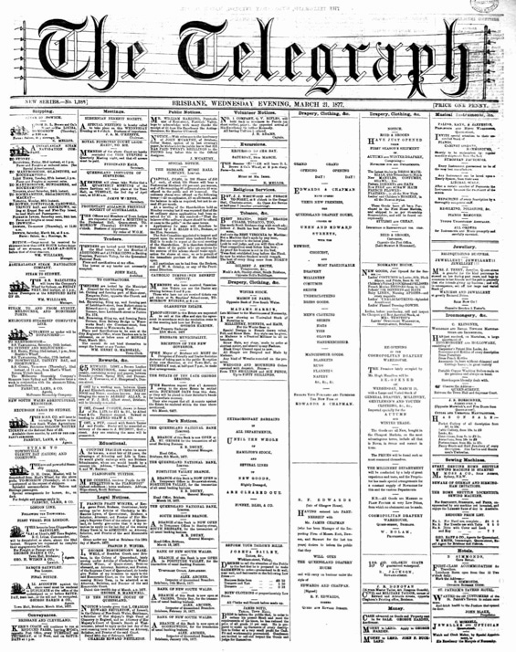
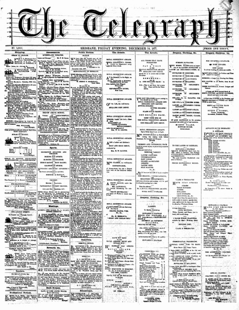
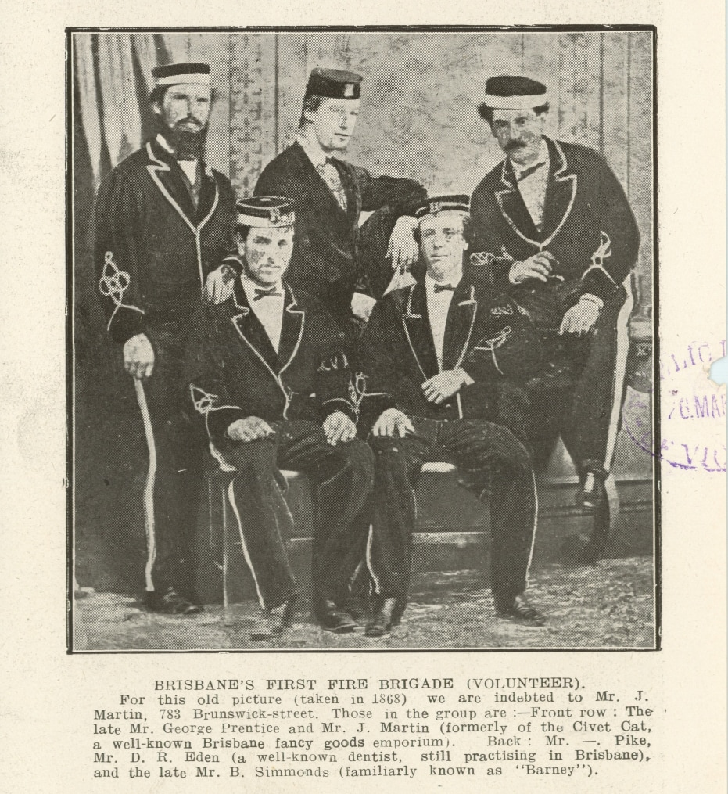

<!--
-- 8< -- "snippets/sem/stories/christmas-shopping-1877.json"
-->

# Christmas Shopping 1877 

**insert description**

<figure markdown>
  { width="70%"  class="full-width" }
  <figcaption markdown>[People gathered in front of Finney, Isles & Co, corner Queen and Edward Streets, Brisbane, ca. 1873](https://onesearch.slq.qld.gov.au/permalink/61SLQ_INST/tqqf2h/alma99183513700802061) — State Library of Queensland.</figcaption>
</figure>

Use the [Toowong Cementry map](../index.md#toowong-cemetery-map) to help you visit the graves in this story.

<!--
???+ directions "Directions" 

    - walking directions
    
     
    
-->
## George Prentice <small>(9-41-4)</small>

George Prentice Jnr was born on 8 February 1841 in Durham England where his father George Snr was a stonemason. In 1854 the family migrated to Victoria, settling in Geelong where they lived for some time before moving to Brisbane. George Jnr operated a sports and tobacconist store in Edward Street in 1877. His father who was in business as a stonemason in Roma Street and a teenage daughter of George drowned in the sinking of the *S.S. Quetta* in Torres Strait in 1890. [George died at Sandgate](https://trove.nla.gov.au/newspaper/article/183135149) on 20 February 1902 after a seizure.

<figure markdown>
  { width="70%"  class="full-width" }
  <figcaption markdown>[George Prentice and family](https://onesearch.slq.qld.gov.au/permalink/61SLQ_INST/dls06p/alma99183507617902061) — State Library of Queensland.</figcaption>
</figure>

<figure markdown>
  { width="70%"  class="full-width" }
  <figcaption markdown>[View of Edward Street looking towards the Brisbane River, 1877](https://onesearch.slq.qld.gov.au/permalink/61SLQ_INST/tqqf2h/alma99183880428502061) — State Library of Queensland.</figcaption>
</figure>

<!-- 
https://trove.nla.gov.au/newspaper/article/19148060  
https://onesearch.slq.qld.gov.au/permalink/61SLQ_INST/tqqf2h/alma99183513698202061 old
https://onesearch.slq.qld.gov.au/permalink/61SLQ_INST/tqqf2h/alma99183906327202061
 edward street
-->

## Francis Ramsay <small>(13-50-6)</small>

Francis was born in Fermanagh, Ireland ca.1836. He married Mary Blakely in Fermanagh on 12 May 1856 and the young couple arrived in Brisbane on 12 October 1856 per *Lady McDonald* from Southampton. Francis was a butcher before leaving Ireland and opened a shop in Refuge Row in Queen Street, moving to Leichhardt Street early in 1877. [Francis died on 10 June 1879](https://trove.nla.gov.au/newspaper/article/888927?searchTerm=Francis%20Ramsay) from injuries sustained after being thrown from his horse the previous month.

<!-- https://onesearch.slq.qld.gov.au/permalink/61SLQ_INST/dls06p/alma99183513578002061 -->

## Richard Symes Warry <small>(13-49-22)</small>

Another of Brisbane's earliest Queen Street shopkeepers was the grocer Richard Warry who was also Mayor of Brisbane 1866-1867. He was born in Somerset, England in 1829, the son of Thomas Warry and his wife Maria (née Symes). Richard married Mary Lydia Pratten on 25 January 1851 in Brisbane. He died on 12 March 1891 at his residence *Timsbury*, Samford Road, Enoggera aged 62, after a long and painful illness. In 1877 his grocery store was situated opposite the Brisbane GPO.

<figure markdown>
  { width="70%"  class="full-width" }
  <figcaption markdown>[Brisbane's General Post Office, ca. 1875](https://onesearch.slq.qld.gov.au/permalink/61SLQ_INST/dls06p/alma99183506926602061) — State Library of Queensland.</figcaption>
</figure>

## John Ure McNaught <small>(13-55-6)</small>

Stationer, bookseller, bookbinder, account book manufacturer, publisher, and lithographer, John McNaught was born in Brisbane on 30 May 1850. His parents, Daniel and Barbara (née Ure) McNaught and his older brother Daniel had arrived in Moreton Bay in 1848 on the *Artemisia* from Scotland. John married Eliza Ann Bothamley on 18 Jun 1873 in Brisbane. He was a long-time Toowong resident and was living at *Kalangur*, Augustus Street Toowong at the time of his death on 24 September 1924.

<figure markdown>
  { width="70%"  class="full-width" }
  <figcaption markdown>[Street map of the city of Brisbane, Queensland, 1878](https://onesearch.slq.qld.gov.au/permalink/61SLQ_INST/dls06p/alma99184004737002061) published by J.U. McNaught — State Library of Queensland.</figcaption>
</figure>

## John Tutty <small>(13-59-11)</small>

Irish-born John Tutty (1844-1879) arrived in Brisbane around 1864. His parents were Edward Tutty and Frances Green. He married Alice Ross in 1872 in Brisbane. In 1873 in partnership with Robert Finney, Tutty and Finney took over the Fortitude Valley store of Finney Isles when that business moved to Queen Street. John was 35 when he died from a head injury from a fall at his home.

<figure markdown>
  { width="70%"  class="full-width" }
  <figcaption markdown>[Finney and Isles store, Fortitude Valley, ca. 1868](https://onesearch.slq.qld.gov.au/permalink/61SLQ_INST/dls06p/alma99183512248602061) — State Library of Queensland.</figcaption>
</figure>

<!-- 
https://collections.slq.qld.gov.au/viewer/IE438725
https://onesearch.slq.qld.gov.au/permalink/61SLQ_INST/dls06p/alma99183512686402061
-->

## James Treleaven (13-65-1)</small>

James Treleaven was a partner with James Clark in Clark & Treleaven, Drapers and Outfitters at 127 Queen Street from early 1874. James Treleaven was born in Launceston Cornwall in 1838, the son of Benjamin Treleaven, a grocer and his wife, Mary (née Harvey). He arrived in Brisbane in the early 1860s and married Emily Agnes Rains in 1867. He was 46 years of age when [he died at his Kelvin Grove home](https://trove.nla.gov.au/newspaper/article/3428543?searchTerm=James%20Treleaven) on 30 March 1884.

## John Anderson Kenion <small>(13-71-10/11)</small>

The proprietor of Kenion & Co, the original Shilling Shop at 19 Queen Street was John Kenion who was born in 1840 in Rock House, Yeadon, Yorkshire where his father William was a wool-stapler. Prior to opening his own shop, John was manager of the Wesleyan Book Depot. [He died at his residence](https://trove.nla.gov.au/newspaper/article/172416188?searchTerm=Kenion) *Terraces* in Wool Street, Toowong on 29 February 1896 at the age of 56.

## Thomas Finney <small>(13-81-6)</small>

The merchant and politician, Thomas Finney was born on 10 January 1837 at *Currakeen House*, Tuam, Galway, Ireland, son of Thomas Finney and his wife Eliza, née Cornwall. In 1862 he arrived in Brisbane on the *Flying Cloud* with his friend, James Isles with whom he went into business as Finney Isles & Co two years later. [Thomas died on 16 December 1903](https://adb.anu.edu.au/biography/finney-thomas-3518) at his home, *Sidney House*, Toowong.

<figure markdown>
  { width="70%"  class="full-width" }
  <figcaption markdown>[Proposed sketch for the premises of Finney Isles & Co. on the corner of Adelaide Edward and Queen Streets, Brisbane, 1888](https://onesearch.slq.qld.gov.au/permalink/61SLQ_INST/dls06p/alma99184003619702061) — State Library of Queensland.</figcaption>
</figure>

## James Isles <small>(13-81-5)</small>

James Isles of Finney Isles & Co was born in Scone, Scotland in 1837, the son of William and Isabella Isles and had been in business with Thomas Finney in Dublin before coming to Brisbane. James died from the effects of a stroke at his Clayfield residence on 3 November 1888 at the age of 51 without having seen Finney Isles & Co's new buildings on the corner of Adelaide & Edward Streets completed.

<figure markdown>
  { width="70%"  class="full-width" }
  <figcaption markdown>[Letterhead showing Finney, Isles & Co. building at the corner of Queen Adelaide and Edward Streets, Brisbane, 1890](https://onesearch.slq.qld.gov.au/permalink/61SLQ_INST/dls06p/alma99183512686402061) — State Library of Queensland.</figcaption>
</figure>

## James Chapman <small>(13-83-6/7)</small>

Soft goods merchant, James Chapman was born in Perthshire, Scotland where he commenced his commercial career before migrating to Queensland arriving in August 1864 in the ship *Earl Russell*. With Richard Edwards, he was a partner in the firm of [Edwards and Chapman](https://trove.nla.gov.au/newspaper/article/181787104?searchTerm=%22Edwards%20Chapman%22). He died at his residence *Kintullo* Gregory Terrace on 4 May 1917.

<!-- 
https://trove.nla.gov.au/newspaper/article/196937137
-->

<figure markdown>
  { width="40%"  class="full-width" }
  <figcaption markdown>Queensland Drapery House opening full column advertisment in the [The Telegraph, 21 March 1877](https://trove.nla.gov.au/newspaper/page/19379817) - National Library of Australia.</figcaption>
</figure>

## Richard George Petty <small>(14-22-13)</small>

Richard Petty, born in 1836, was a native of Yorkshire and came to Queensland in the ship *Whirlwind* in 1862. His parents were Richard Petty and Margaret (née Crier). He went into business with William Grimes in 1863 at the top end of Queen Street. By 1877 they had moved to larger premises further down Queen Street, between Albert & Edward Streets. Richard died on 24 September 1899 at his residence *Coodra* on Gregory Terrace.

## Henry Beesley <small>(13-26-3)</small>

The Shirt and Collar Box, three doors down from the GPO, was the business of Henry Beesley, a draper who migrated to Queensland in 1870 on the Indus with his wife Elizabeth (née Gough). Henry was born on 20 February 1831 in Tewkesbury, Gloucestershire to George Beesley and Eliza (née Hawksley). He died on 5 February 1894 at his home, *Twickenham Lodge*, in West End.

<figure markdown>
  { width="40%"  class="full-width" }
  <figcaption markdown>Advertisments in the [The Telegraph, 14 December 1877](https://trove.nla.gov.au/newspaper/page/19378522) including Herny Beesley's Shirt and Collar Box, Edwards and Chapman, Clark and Treleaven, and Tutty and Finney - National Library of Australia.</figcaption>
</figure>

<!-- 
https://trove.nla.gov.au/newspaper/page/19378522

-->

## Thomas Spilsbury <small>(13-23-2/3)</small>

Thomas Spilsbury's confectionery shop stood at 28 Queen Street. Thomas was born in Bromsgrove Worcestershire to parents Richard (also a confectioner) and Hannah in 1838. He lived in Kiama NSW before coming to Brisbane ca.1861-2. He worked as a compositor before entering the confectionery business in 1876. After his death in 1884, the business passed to his son, Thomas.

## James Martin <small>(13-24-21)</small>

The Civet Cat fancy goods and toy emporium stood in Queen Street where the Myer Centre is today. Its proprietor, James Martin was born in Worcestershire in 1838 to parents, Joseph Martin and Elizabeth (née Teague). He married Henrietta Bradshaw in Brisbane in 1869. [James died at the age of 89](https://trove.nla.gov.au/newspaper/article/180790667) at his home *Mascotte* at New Farm on 25 November 1927

<figure markdown>
  { width="40%"  class="full-width" }
  <figcaption markdown>James Martin and George Pretice were members of Brisbane's first fire brigade in 1868. From [Page 22 of The Queenslander Pictorial, supplement to The Queenslander, 24 March 1917](https://onesearch.slq.qld.gov.au/permalink/61SLQ_INST/tqqf2h/alma99183906327202061) — State Library of Queensland. Cropped.</figcaption>
</figure>

## Acknowledgements

Written by Lyn Maddock

<!--
## Sources

- [Family History Research](https://www.familyhistory.bdm.qld.gov.au) - The State of Queensland
- [Trove](https://trove.nla.gov.au) - National Library of Australia
- [Australian Dictionary of Biography](https://adb.anu.edu.au) - Australian National University
- http://thefashionarchives.org/ *(broken link)*
-->