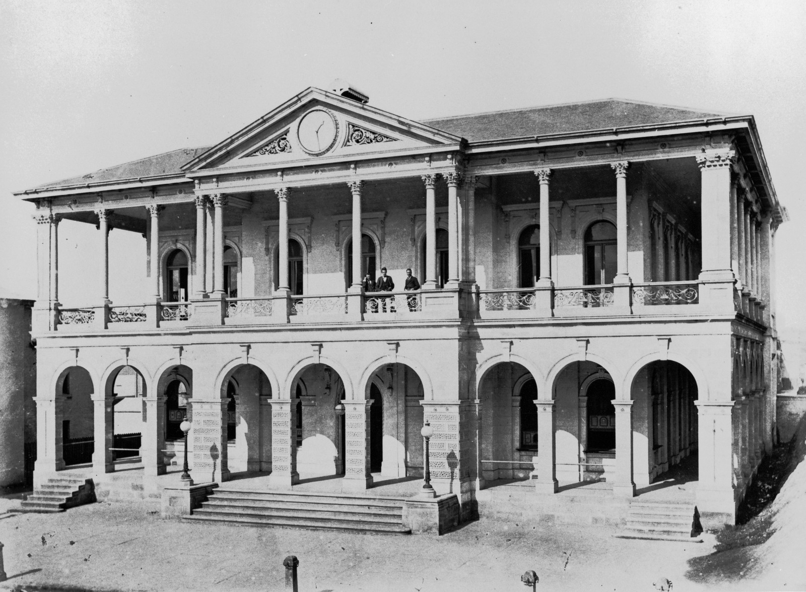
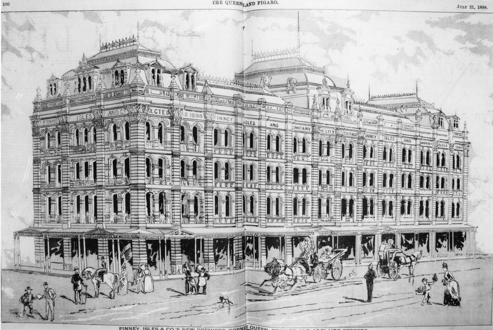

--8<-- "snippets/sem/stories/christmas-shopping-1877.json"

# Christmas Shopping 1877 

**Stories about shop keepers and Christmas in 1877**

<figure markdown>
  { width="70%"  class="full-width" }
  <figcaption markdown>[People gathered in front of Finney, Isles & Co, corner Queen and Edward Streets, Brisbane, ca. 1873](https://onesearch.slq.qld.gov.au/permalink/61SLQ_INST/tqqf2h/alma99183513700802061) — State Library of Queensland.</figcaption>
</figure>

Use the [Toowong Cementry map](../index.md#toowong-cemetery-map) to help you visit the graves in this story.

--8<-- "snippets/george-prentice-jnr.md"

--8<-- "snippets/francis-ramsay.md"

## Richard Symes Warry <small>(13‑49‑22)</small>

Another of Brisbane's earliest Queen Street shopkeepers was the grocer Richard Warry who was also Mayor of Brisbane 1866-1867. He was born in Somerset, England in 1829, the son of Thomas Warry and his wife Maria (née Symes). Richard married Mary Lydia Pratten on 25 January 1851 in Brisbane. He died on 12 March 1891 at his residence *Timsbury*, Samford Road, Enoggera aged 62, after a long and painful illness. In 1877 his grocery store was situated opposite the Brisbane GPO.

<figure markdown>
  { width="70%"  class="full-width" }
  <figcaption markdown>[Brisbane's General Post Office, ca. 1875](https://onesearch.slq.qld.gov.au/permalink/61SLQ_INST/dls06p/alma99183506926602061) — State Library of Queensland.</figcaption>
</figure>

--8<-- "snippets/john-ure-mcnaught.md"

--8<-- "snippets/john-tutty.md"

--8<-- "snippets/james-treleaven.md"

--8<-- "snippets/john-anderson-kenion.md"

## Thomas Finney <small>(13‑81‑6)</small>

The merchant and politician, Thomas Finney was born on 10 January 1837 at *Currakeen House*, Tuam, Galway, Ireland, son of Thomas Finney and his wife Eliza, née Cornwall. In 1862 he arrived in Brisbane on the *Flying Cloud* with his friend, James Isles with whom he went into business as Finney Isles & Co two years later. [Thomas died on 16 December 1903](https://adb.anu.edu.au/biography/finney-thomas-3518) at his home, *Sidney House*, Toowong.

<figure markdown>
  { width="70%"  class="full-width" }
  <figcaption markdown>[Proposed sketch for the premises of Finney Isles & Co. on the corner of Adelaide Edward and Queen Streets, Brisbane, 1888](https://onesearch.slq.qld.gov.au/permalink/61SLQ_INST/dls06p/alma99184003619702061) — State Library of Queensland.</figcaption>
</figure>

<!--
https://en.wikipedia.org/wiki/Thomas_Finney_(politician)#/media/File:StateLibQld_1_103590_Thomas_Finney_of_Finney,_Isles_and_Co.jpg
-->

--8<-- "snippets/james-isles.md"

--8<-- "snippets/james-chapman.md"

--8<-- "snippets/richard-george-petty.md"

--8<-- "snippets/henry-beesley.md"

--8<-- "snippets/thomas-spilsbury.md"

--8<-- "snippets/james-martin.md"

## Acknowledgements

Written by Lyn Maddock

## Learn more 

- [Christmas Eve in Brisbane](https://trove.nla.gov.au/newspaper/article/19763726), 1877, The Queenslander - National Library of Australia

<!--
- https://trove.nla.gov.au/newspaper/article/175544653 1871

-->
<!--
## Sources

- [Family History Research](https://www.familyhistory.bdm.qld.gov.au) - The State of Queensland
- [Trove](https://trove.nla.gov.au) - National Library of Australia
- [Australian Dictionary of Biography](https://adb.anu.edu.au) - Australian National University
- http://thefashionarchives.org/ *(broken link)*
-->
