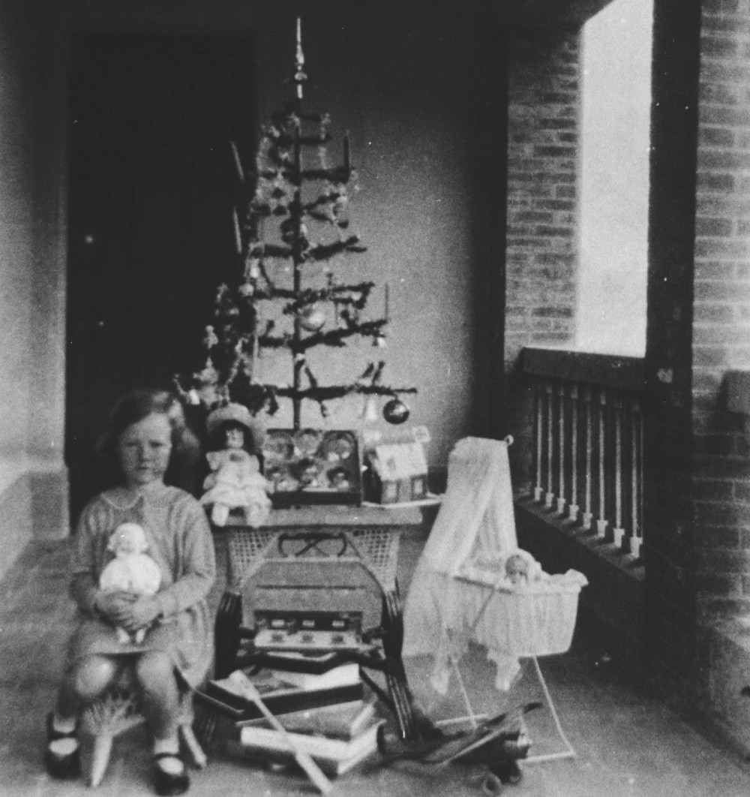

# Christmas

{ width="40%" }  

*<small>[Christmas morning under the Christmas tree, ca. 1935](http://onesearch.slq.qld.gov.au/permalink/f/1upgmng/slq_alma21220399300002061) — State Library of Queensland.</small>*

<!--

???+ directions "Directions" 

    Starting point
    Walking directions to first headstone... is the grave of...
    
    { width="15%" }

-->

--8<-- "snippets/joseph-robert-abbott.md"

<!--

??? directions "Directions" 

    Walking directions to next headstone... is the grave of...
    
    { width="15%" }
    
-->

--8<-- "snippets/george-hansford.md"

--8<-- "snippets/victor-cyril-button.md"

--8<-- "snippets/joseph-cossart.md"

--8<-- "snippets/edward-arthur-gordon.md"

--8<-- "snippets/joseph-mcnamara.md"

## Sources

- [Assisted Immigration](https://www.qld.gov.au/recreation/arts/heritage/archives/collection/immigration) - The State of Queensland
- [Australian Dictionary of Biography](https://adb.anu.edu.au) - Australian National University
- [Grave Location Search](https://graves.brisbane.qld.gov.au) - Brisbane City Council
- [Family History Research](https://www.familyhistory.bdm.qld.gov.au) - The State of Queensland
- [One Search](http://onesearch.slq.qld.gov.au/primo-explore/search?vid=SLQ) - State Library of Queensland
- [Trove](https://trove.nla.gov.au) - National Library of Australia

<!--

## Brochure

**[Download this walk](../assets/guides/one-day-christmas.pdf)** - designed to be printed and folded in half to make an A5 brochure.

-->
