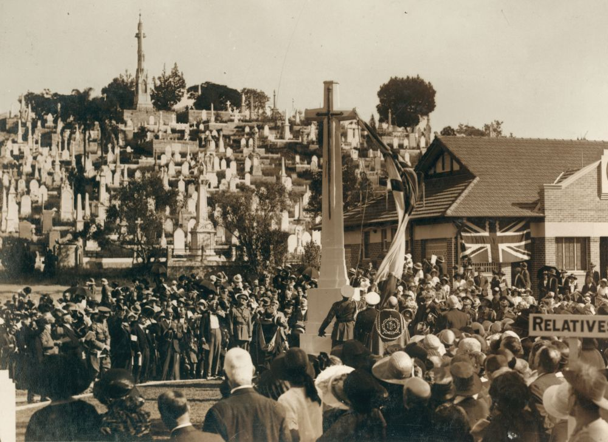
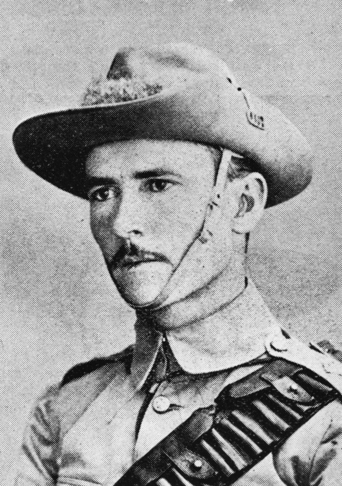

---
hide:
  - navigation
---

# Colonial Conflicts   

**A Remembrance Day Service and guided tour conducted at Toowong Cemetery on the 4^th^ November 2012.**

Portion 10 contains numerous Commonwealth War Graves and received military burials between 1917 and 1942 until they were re-directed to [Lutwyche Cemetery](https://www.brisbane.qld.gov.au/community-and-safety/community-support/cemeteries/lutwyche-cemetery). Flowers were cultivated and sold at the Cemetery from Portion 10 until the 1930s. In 1934 the area set apart for soldiers’ graves within Portion 10 was extended to incorporate the flower gardens and the wooden pavilion was demolished. As the military graves were interspersed amongst civilian burials, this portion lacks the familiar formality of a [Commonwealth War Cemetery](https://www.cwgc.org).

## Soldiers’ Memorial

The Cross of Sacrifice and Stone of Remembrance were unveiled on Anzac Day, 1924, by the Governor‑General, Lord Forster. The Stone of Remembrance is a solid block of Helidon sandstone weighing ten tons. The unveiling ceremony was attended by several thousand people, including relatives of soldiers killed overseas and many dignitaries. 

{ width="70%" }  

*<small>[Official unveiling of the Cross of Sacrifice on Anzac Day at Toowong Cemetery, Brisbane, 1924](https://digital.slq.qld.gov.au/delivery/DeliveryManagerServlet?dps_pid=IE1400763&change_lng=), — [State Library of Queensland](https://www.slq.qld.gov.au).</small>*

The Citizens’ Band provided music as the public laid wreaths at the Stone. So many floral tributes were deposited, that the stone was completely covered. One was even dropped from a plane circling above. The inscription THEIR NAME LIVETH EVERMORE was chosen by Rudyard Kipling and is found on the Stone of Remembrance in every Commonwealth War Cemetery.

{ width="70%" }  

*<small>[Small children looking at wreaths laid at the memorial on Anzac Day, Toowong Cemetery, Brisbane, 1924](http://onesearch.slq.qld.gov.au/permalink/f/1upgmng/slq_alma21271931300002061) — [State Library of Queensland](https://www.slq.qld.gov.au).</small>*

## ‘A’ Battery Memorial

Prior to Federation each of the Australian colonies maintained its own defence force. These forces were largely comprised of part‑time volunteers and a small number of permanent officers and men. This memorial is to the men of Queensland’s permanent force ‘A’ Battery, Queensland Artillery. All of those named on the memorial died while serving in the Battery, but only one, Driver Sydney Walker, died while on active service. Walker was serving on the 1^st^ Queensland Contingent to the South African War when he died of enteric fever at Bloemfontein. This [monument](https://placesofpride.awm.gov.au/memorials/240931) was established in April 1886. A number of soldiers named on the memorial are buried nearby.

## Caskey Memorial

Unveiled in May 1902, this is the first known [monument](https://placesofpride.awm.gov.au/memorials/118226) to the South African War to be erected in Queensland. Lieutenant John Caskey of the Fifth Queensland Imperial Bushmen was killed in action on 27 September 1901 at the Mokari Drift on the Caledon River. The obelisk, made of white Helidon sandstone and draped by a shroud, features emblems of Caskey’s teaching career at Leichhardt Street School, Brisbane and Spring Creek and his sporting interests. A rare memorial to the Anglo‑Boer conflict, this monument is a significant reminder of emerging nationalism and contemporary attitudes to war. Other monuments to him can be found at Clifton RSL and the [Allora State School](https://placesofpride.awm.gov.au/memorials/116791).

{ width="40%" }  

*<small>[Lieutenant Lachlan J. Caskey of the 5^th^ Queensland Contingent](http://onesearch.slq.qld.gov.au/permalink/f/1upgmng/slq_digitool105672) — [State Library of Queensland](https://www.slq.qld.gov.au).</small>*

--8<-- "snippets/john-wyndon-lyon.md"

--8<-- "snippets/charles-heaphy.md"

--8<-- "snippets/john-jennings-imrie.md"

--8<-- "snippets/john-higson.md"

--8<-- "snippets/robert-orton.md"

--8<-- "snippets/george-vowles.md"

## Acknowledgements

<!-- The Remembrance Day Service was arranged by Gavin Stoneley, Metropolitan Funerals -->
- The Remembrance Day Service Address was given by Judy Magub
- Additional Research by Paul Seto

<!--

## Brochure

**[Download this walk](../assets/guides/colonial-conflicts.pdf)** - designed to be printed and folded in half to make an A5 brochure.

-->
