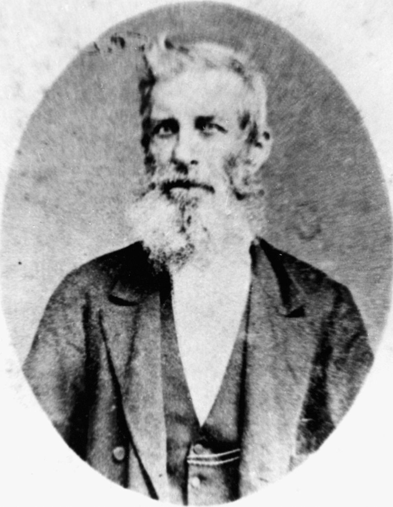

# The Convicts  

**Connections to our Convict past**

--8<-- "snippets/peter-mccauley.md"

--8<-- "snippets/william-henry-roberts.md"

--8<-- "snippets/jane-pittard.md"

## Thomas Dowse <small>(13‑58‑22)</small>

Thomas Dowse was born at Hackney, London. Aged 15, he was accused of theft by his mother, tried at Middlesex on 16 September 1824, convicted and sentenced to life imprisonment. He was transported to New South Wales in the *Florentia* which arrived in January 1828. At St John's, Parramatta, in 19 November 1832 he married Ann Kelly. Only three of their seven children survived infancy. In 1836, Dowse was granted a ticket‑of‑leave and a conditional pardon in 1839. When the Moreton Bay District was opened for free settlement he decided to go there to see what opportunity awaited a man who was in good health and not afraid of hard work. 

The family arrived aboard the *Falcon* on 9 July 1842. Noticing the need of a ferry across the river, he bought a skiff which by 1843 had earned three times its value. By 1846 he was established as an auctioneer and commission agent, and also had the agency for the Sydney Morning Herald. At his premises in Queen Street he sold almost anything from shirts, frock coats, cutlery, looking‑glasses and books to livestock. His auction mart also became a centre for discussion of social reform, for perhaps no one then had a greater horror of the degrading convict system or worked harder to end it. 

A widower at 47, in Brisbane in 1856 he married Sarah Ann Fairfax; they had three sons and two daughters. Because of his work for separation and contributions to the press under the pseudonym of Old Tom, he was appointed with Walter Hill, director of the Botanic Gardens, to arrange the Queensland exhibit at the London Exhibition in 1862. In this task they were successful and received a public testimonial in 1864. When the first town clerk of Brisbane retired, Dowse was elected in January 1862. He retired from office in 1869 but continued in business until he died aged 75 at his home, *Hillside*, Milton, on 9 November 1885.

{ width="40%" }

*<small>[Thomas Dowse](http://onesearch.slq.qld.gov.au/permalink/f/1upgmng/slq_alma21218687340002061) Brisbane Town Clerk 1862-1868 — State Library of Queensland.</small>*

## Agnes Susan Maclean <small>(5‑107‑19)</small>

Agnes Susan Maclean was christened Susannah Agnes Kable, the grand‑daughter of First Fleet Convicts Henry Kable and Susannah Holmes and Second Fleet Marine William Charlton and Convict Mary Gittos. Born in Windsor, NSW; Susannah was the eldest of 6 children. Susannah's father William Nathaniel Kable died when she was 11. 

When Susannah was 19, she married John Shand Maclean, the son of an Equity Court Clerk from Jamaica at St Mary's Cathedral in Sydney. The first of Susannah's 10 children was born in 1847. Susannah followed her husband around his various interests. John attempted farming and for a time taught at a gentlemen's academy in the Richmond area of New South Wales. By 1856, the ever growing family had settled in the Burnett region. Susannah's final four children were born on various cattle properties in the region. 

Tragedy struck in November 1862 when John fell off a horse and died on Gyranda Station near Cracow. Susannah buried her husband between the homestead and the river the assistance of her brother and brother‑in‑law. Susannah was left with 10 children under the age of 15 and a cattle property to manage. She suffered another setback in the 1870s when a fire tore through Gyranda, destroying all her photographs and heirlooms. Susannah brought up her large family with the assistance of her brother and sister‑in‑law on a nearby property. 

Agnes Susannah, as she was now known, claimed the right to vote in 1905, in her 80^th^ year. She is then registered on the electoral roll living with her youngest daughter Elvina and her school‑master husband Charles Marshall at the Nerang State Schoolhouse. Agnes died of nephritis at the Brisbane General Hospital on the 20^th^ of January 1911. She was buried next to her sister‑in‑law Mary Ann Kable.

--8<-- "snippets/edward-mott.md"

## Kevin Izod O’Doherty <small>(7‑58‑27)</small>

Kevin O’Doherty was born in Dublin, son of solicitor William Dougherty and Anne McEvoy. He studied at the Catholic School of Medicine in 1844. He was convicted as a ‘Young Irelander’ and transported to Sydney in 1848 on the Mt Stewart Elphinstone and then on the Emma to Tasmania with fellow conspirators where he served time at Port Arthur. After five years he was given a conditional pardon (not allowed to return to Ireland) and went to Paris before marrying, in London, in 1855 writer Mary Eva Kelly of Galway (Eva of The Nation). In 1856 O’Doherty received a full pardon and went to Dublin to get his Medical Degree from 1857 to 1859.

They then migrated to Victoria in 1860 and to Brisbane where he set up practice in the Forbes Building at Ipswich in 1862. By 1866, he was the leading medical practitioner in George Street, Brisbane, and personal physician to Bishop Quinn. He was also the first President of the Queensland Medical Board. He was an MLA in 1867 and MLC 1877 - 1885 and also returned to Ireland as the Nationalist Member for Meath 1885 - 1888. As a founding member of the Queensland Hibernian Society and the Queensland Irish Association, O’Doherty was well respected and presided over the St. Patrick’s Day Committee in the 1860s. The Queensland Irish Association raised this monument over his grave.

--8<-- "snippets/james-davis.md"

## Sources

- Gunthorpe, S. G. 'Dowse, Thomas (1809 ‑ 1885)', Australian Dictionary of Biography, Volume 4, Melbourne University Press, 1972, pp 101‑102
- Laurie, A. ’Davis, James (1808 ‑ 1889)', Australian Dictionary of Biography, Volume 1, Melbourne University Press, 1966, pp 294-295.
- Patrick, Ross and Heather Exiles Undaunted. St. Lucia : University of Queensland Press, 1989 [Kevin and Mary O’Doherty]
- ‘Death of Old Colonist’ [E. Mott] The Queenslander, 8 September 1900, pp.542-543.

<!--

## Brochure

**[Download this walk](../assets/guides/convicts.pdf)** - designed to be printed and folded in half to make an A5 brochure.

-->
