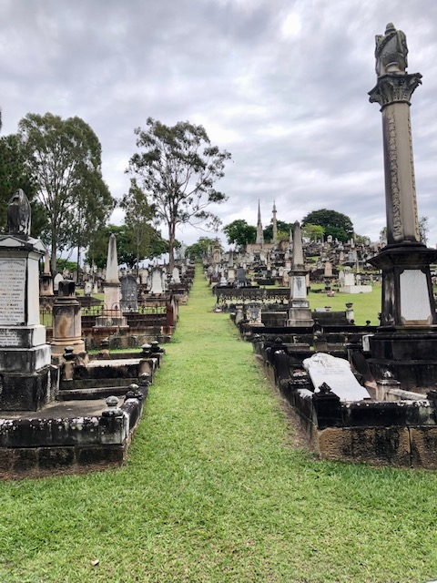
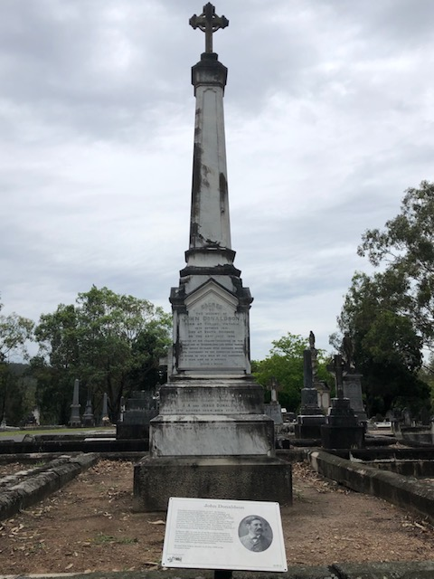

# The Federation walk 

The Federation Walk was produced by the Friends of Toowong Cemetery as a Centenary of Federation project to commemorate the role of the four Queensland delegates to the National Australasian Convention of 1891 who are interred at Toowong Cemetery.

The National Australasian Convention was held in Sydney from the 2^nd^ of March to the 9^th^ of April 1891. The convention was attended by seven delegates from each of the six colonies and three delegates from New Zealand. The Queensland delegates were John Donaldson, Sir Samuel Griffith, John Macrossan, Thomas Macdonald- Paterson, Thomas McIlwraith, Arthur Rutledge and Andrew Thynne. Significant outcomes from this convention included agreement of the name Commonwealth of Australia and more importantly, the production of a draft constitution. Sir Samuel Griffith was Chairman of the committee responsible for writing the draft constitution.

This convention marked Queensland’s greatest role in the path towards Federation as Queensland was not represented at later conventions. For Queenslanders, the Depression, droughts, floods, industrial upheavals such as the [Shearers Strikes](shearers-strike.md) and financial collapses were higher priorities.

Other Queensland issues in the federation debate included Queensland’s use of indentured Melanesian labour that was in contrast the federation movement’s White Australia policy and the possible division of Queensland into two or three separate colonies. 

Despite many arguments against federation, the Federal Referendum on the 2^nd^ of September 1899 narrowly voted in favour of Queensland's joining the new nation. Interestingly, the south-east corner of the colony was against Federation.

*<small>[Crowds looking at the results board at the Courier Building on Referendum Night, Brisbane, Queensland, 1889](http://onesearch.slq.qld.gov.au/permalink/f/1upgmng/slq_alma21297968950002061) - State Library of Queensland. Cropped. </small>* 

--8<-- "snippets/conditions-of-entry.md"

## Map

[{ width="50%" }](../assets/federation-walk.jpg) 

???+ directions "Directions" 

    - :fontawesome-solid-car:{ .deep-purple } If driving, park your car in Emma Miller Avenue.
    - :fontawesome-solid-person-walking:{ .deep-purple } Begin the walk behind Canon Garland Place in Emma Miller Avenue.  
    - Enter Portion 13 on the grass path to the summit between the graves of Pethebridge and Thurlow. 
    
    { width="15%" } 
    
    - Head straight up the hill towards Governor Blackall’s monument.
    - Sir Arthur Rutledge's headstone is half way up and just off to the left.
    
    { width="15%" } 

--8<-- "snippets/arthur-rutledge.md"

???+ directions "Directions" 

    Continue up the hill until you reach the Uhl family monument. Turn right and follow the path until you reach a wide path sloping from the top. Turn left and walk directly towards the Blackall Monument. Here you will find the Federation Pavilion.

## The Federation Pavilion

The Commonwealth of Australia was inaugurated under a pavilion erected for the occasion in Sydney’s Centennial Park. [Our pavilion](../about/federation-pavilion.md), designed by Brisbane architect Ian Sinnamon, honours the Queensland delegates to the 1891 National Australasian Convention who are interred nearby. It was funded by the Federation Community Projects Program and construction was arranged by the Brisbane City Council Cemeteries Division.

???+ directions "Directions" 

    The pavilion is adjacent to the grave of Sir Samuel Griffith. 
    
    { width="30%" } 

--8<-- "snippets/samuel-walker-griffith.md"

???+ directions "Directions" 

    Walk along Federation Avenue to John Donaldson's headstone on the right.
    
    { width="15%" } 

--8<-- "snippets/john-donaldson.md"

???+ directions "Directions" 

    Continue along Federation Avenue to Thomas Macdonald‑Paterson's headstone on the right.
    
    { width="15%" } 

--8<-- "snippets/thomas-macdonald‑paterson.md"

???+ directions "Directions" 

    :fontawesome-solid-person-walking-arrow-loop-left:{ .deep-purple } Retrace your steps along Federation Avenue then return down the hill to the starting point.

{ width="70%" }  

*<small>[Federation celebrations in Queen Street, Brisbane, 1901](http://onesearch.slq.qld.gov.au/permalink/f/1upgmng/slq_alma21218848990002061) - State Library of Queensland </small>*     

## Further Reading

- Irving, H. (ed) *The Centenary Companion to Australian Federation*, Cambridge University Press, 1999
- Kerr, J. (ed) *Griffith, the Law and the Australian Constitution*, Royal Historical Society of Queensland, 1998
- Waterson, D. B. *Biographical Register of the Queensland Parliament*, Australian National University Press, 1972

## Acknowledgements

Research: Sally McGrath

Layout and map: Hilda Maclean 

<!-- Cover drawing: Jeff Turner 

Photographs reproduced with permission of [John Oxley Library](https://www.slq.qld.gov.au/plan-my-visit/spaces-visit/john-oxley-library). 
--> 

Federation Pavilion funded by Federation Community Projects Program.

- Architect: Ian Sinnamon
- Construction facilitated by the Brisbane City Council Cemeteries Division

Restoration of the graves of Griffith, Rutledge, Macdonald‑Paterson and Donaldson funded by the Centenary of Federation Queensland.

<!--

## Brochure

**[Download this walk](../assets/guides/federation-trail.pdf)** - designed to be printed and folded in half to make an A5 brochure.

-->
