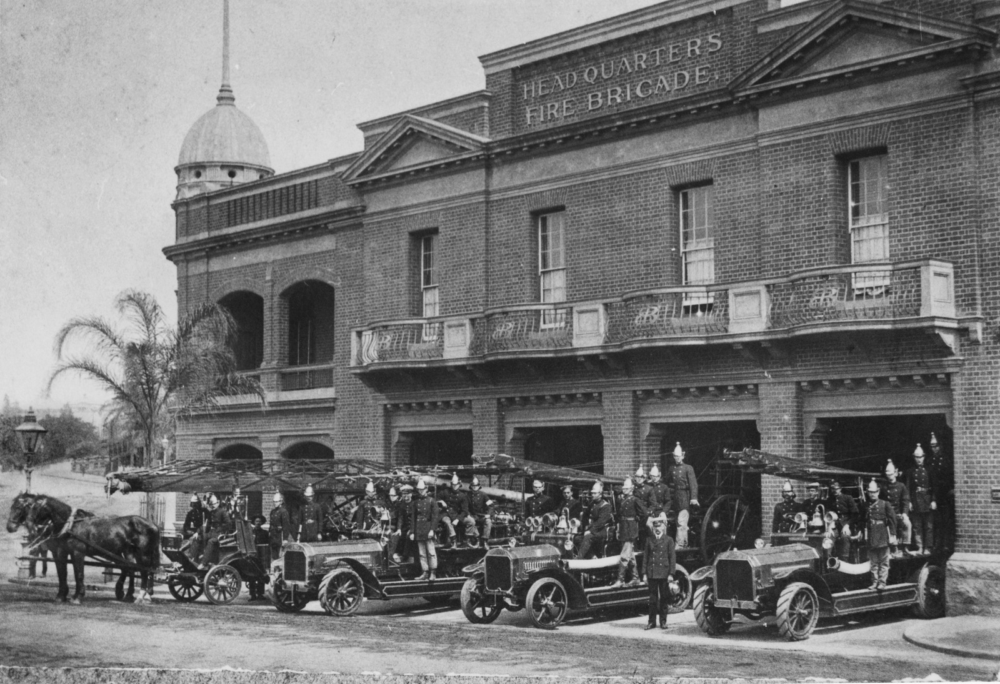
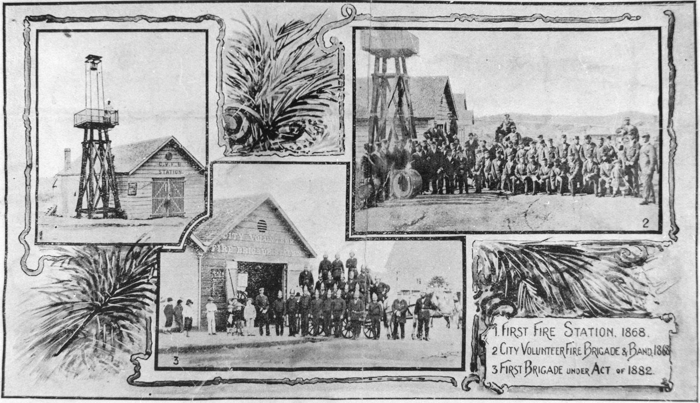
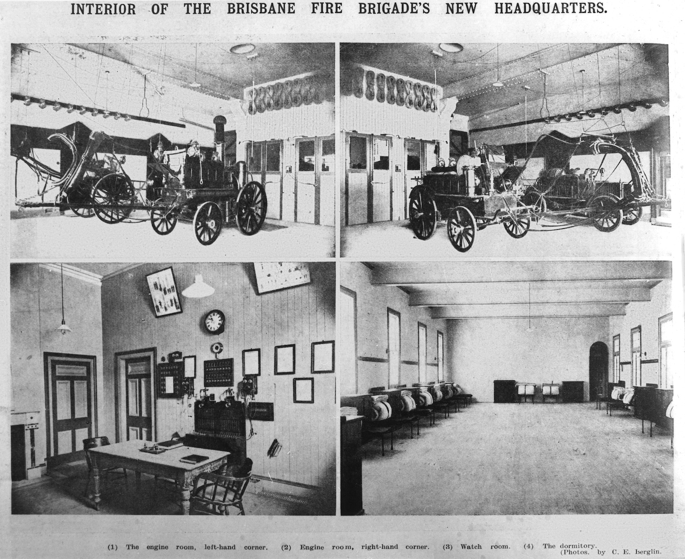
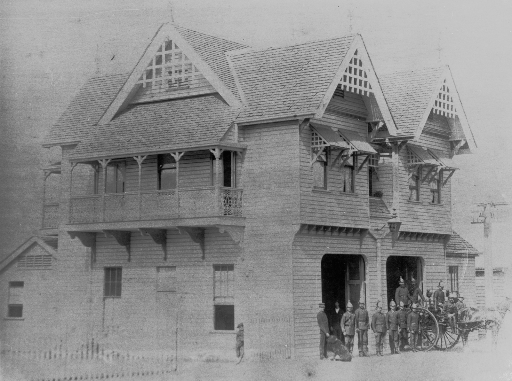
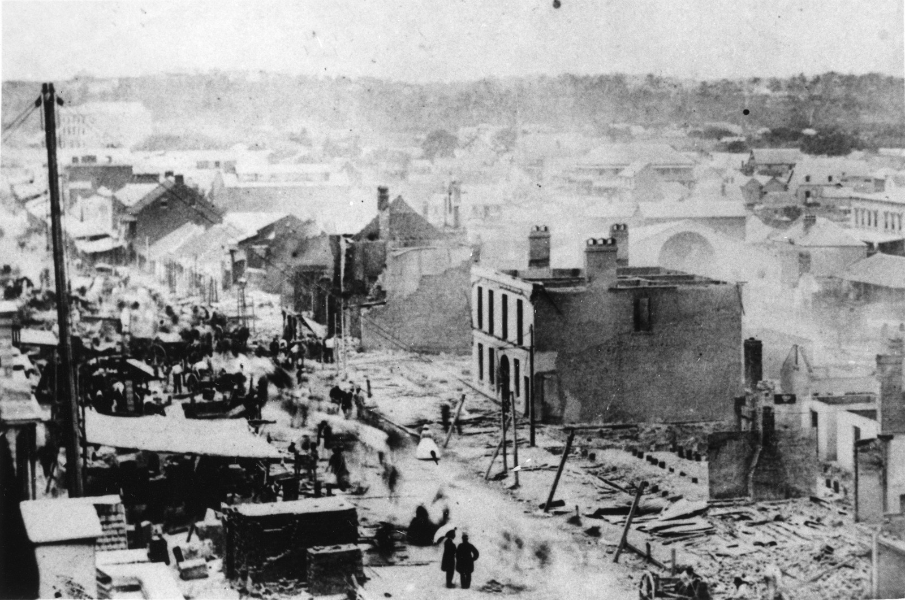
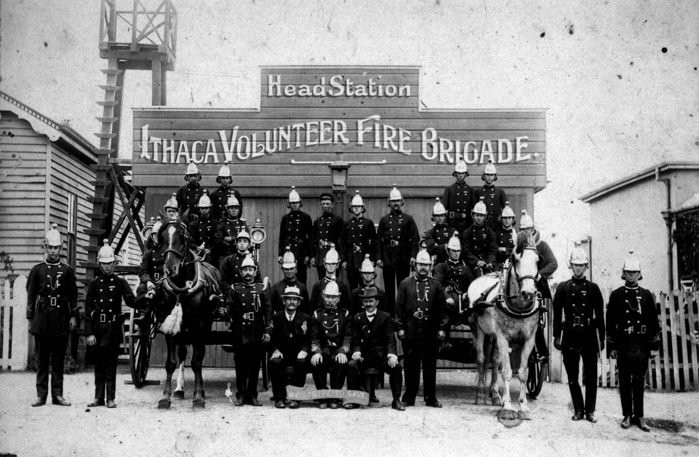
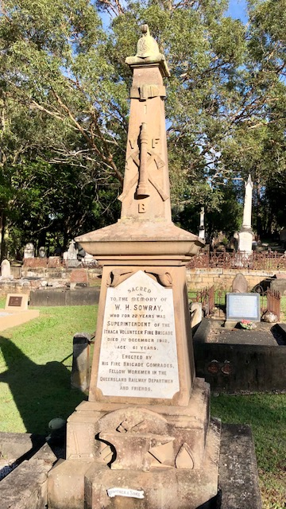

--8<-- "snippets/sem/stories/fire-fighters.json"

# Fire fighters of early Brisbane

**Stories about people remembered in Toowong Cemetery and how fire impacted their lives**

<figure markdown>
  { width="70%" class="full-width" }
  <figcaption markdown>[Brisbane Fire Brigade Station, ca. 1899](https://onesearch.slq.qld.gov.au/permalink/61SLQ_INST/dls06p/alma99183513704502061). Erected on the north east corner of Ann and Edward Street in 1890.  — State Library of Queensland.</figcaption>
</figure>

Use the [Toowong Cementry map](../index.md#toowong-cemetery-map) to help you visit the graves in this story.

## Brisbane Fire Brigades

- 1860: First Brisbane Volunteer Fire Brigade formed. Closes down after six months.
- 1862: Second Brisbane Volunteer Fire Brigade forms. Engine provided by Queensland Insurance Company.
- 1864: Citizens' Volunteer Fire Brigade forms in August under G. B. Cutbush and disbands after Great Fire of Brisbane in December.
- 1865: City Volunteer Fire Brigade forms.
- 1868: First Fire Brigade Board meets. Francis Beattie appointed Deputy Superintendent of City Volunteer Fire Brigade.
- 1881-1882: Brisbane Fire Brigade consolidated as an organisation.
- 1889-1890: First fulltime firemen employed. Headquarters opened in Ann Street.
- 1921: Brisbane Metropolitan Fire Brigades amalgamated under Order of Council.

<figure markdown>
  { width="70%" class="full-width" }
  <figcaption markdown>[First Brisbane Fire Stations, 1868-1882](https://onesearch.slq.qld.gov.au/permalink/61SLQ_INST/tqqf2h/alma99183745019302061) — State Library of Queensland.</figcaption>
</figure>

## Edward Barrow Forrest <small>(9‑37‑1)</small> & Robert Russell Smellie <small>(13‑60‑5/10)</small>

In the early hours of 6 September 1864 [Edward Forrest noticed a bright light](https://trove.nla.gov.au/newspaper/article/1261617) in the home newly constructed for recent Scottish immigrant, Robert Smellie on Bowen Terrace. Mr Forrest raised the alarm, woke the Hingston family whose house was next door to the fire, and rescued two horses from the stable.

[Robert Smellie (1823-1898)]() was later a pioneer of Brisbane's engineering and iron foundry trade. 

[Edward Forrest (1838-1914)](https://adb.anu.edu.au/biography/forrest-edward-barrow-6209) was Queensland director of the Colonial Sugar Refining Company for many years. He was appointed vice-consul for France in 1872 and served in both Houses of Queensland Parliament.

<figure markdown>
  { width="30%" class="full-width" }
  <figcaption markdown>[Edward Barrow Forrest, 1907](https://en.wikipedia.org/wiki/Edward_Barrow_Forrest#/media/File:Edward_Barrow_Forrest,_1907.jpg). — Wikimedia Commons.</figcaption>
</figure>

## Francis Beattie <small>(9‑39‑7)</small>

The fire alarm bell rang just after 4.30am on 21 December 1871. [The Ann Street Presbyterian Church was ablaze](https://trove.nla.gov.au/newspaper/article/1303176). The City Volunteer Fire Brigade under Superintendent [Francis Beattie (1829-1886)](https://en.wikipedia.org/wiki/Francis_Beattie_(Queensland_politician)) attended. Beattie was appointed Deputy-Superintendent of the City Volunteer Fire Brigade in 1868 and Superintendent of the Brigade in 1870 and continued in that role with the Brisbane Fire Brigade from 1878 until he retired in 1883. After settling in Brisbane in 1862, he opened a hat and cap shop. He served as an alderman for the Fortitude Valley Ward and two terms as MLA for the Fortitude Valley electorate.

<figure markdown>
  { width="75%" class="full-width" }
  <figcaption markdown>[Alderman Francis Beattie, ca.1870](https://library-brisbane.ent.sirsidynix.net.au/client/en_AU/BrisbaneImages/search/detailnonmodal/ent:$002f$002fSD_ASSET$002f0$002fSD_ASSET:19696/email?qu=Alderman+Francis+Beattie&rm=BRISBANEIMAGES0%7C%7C%7C1%7C%7C%7C0%7C%7C%7Ctrue&d=ent%3A%2F%2FSD_ASSET%2F0%2FSD_ASSET%3A19696%7E%7E0&te=ASSET&lm=ALL_ASSETS). — Brisbane City Council.</figcaption>
</figure>

## Thomas Proe <small>(13‑35‑9)</small>

Alderman Thomas Proe (1852-1922) was the Brisbane Municipal Council representative on the Metropolitan Fire Brigade Board at the time of a [fire in the warehouse of S Hoffnung & Co Ltd in 1902](https://trove.nla.gov.au/newspaper/article/183137726). He served as Mayor twice, firstly of Brisbane Municipal Council in 1901 and then of Brisbane City Council in 1905.

<figure markdown>
  { width="70%" class="full-width" }
  <figcaption markdown>[Interior of the fire brigade building in Brisbane, 1908](https://onesearch.slq.qld.gov.au/permalink/61SLQ_INST/dls06p/alma99184004708302061). — State Library of Queensland.</figcaption>
</figure>

## Nicholas Frederick Peut <small>(13‑44‑13)</small>

Nicholas Peut (1856-1892) was appointed to the Brisbane Fire Brigade as resident foreman of No 2 station located at Stanley Street, South Brisbane in 1883. He became Superintendent at South Brisbane in January 1888 and continued in that role with the inception of permanent Fire Brigades with full time staff in Brisbane in 1889. [He was fatally injured](https://trove.nla.gov.au/newspaper/article/3552275) on 5 December 1892.

<figure markdown>
  { width="70%" class="full-width" }
  <figcaption markdown>[South Brisbane Fire Station, ca. 1900](https://onesearch.slq.qld.gov.au/permalink/61SLQ_INST/dls06p/alma99183507972502061). — State Library of Queensland.</figcaption>
</figure>

## David Thomas Stewart <small>(13‑7‑19/20)</small>

David Stewart (1826-1897) was a leader in the foundation of the City Volunteer Fire Brigade and succeeded Francis Beattie as Deputy Superintendent of the Brigade in 1870. On 3 April that year he was in charge when the Brigade attended a [fire at the Queensland Club](https://trove.nla.gov.au/newspaper/article/1315243). A boot and shoemaker by trade, he arrived in Sydney in 1834 with his parents and first came to Brisbane in 1860.

## James Dunbar <small>(1‑8‑14)</small>

James Dunbar (ca.1837-1920) was appointed station keeper at the Central Fire Station in Edward Street in 1867 and was [the oldest known fireman in Brisbane](https://trove.nla.gov.au/newspaper/article/179640595) when he died at the age of 83 on 22 November 1920. His service spanned the period from when hand drawn fire appliances were used to the introduction of motor fire trucks.

<figure markdown>
  { width="70%" class="full-width" }
  <figcaption markdown>[Merryweather chemical fire engine ca. 1905](https://onesearch.slq.qld.gov.au/permalink/61SLQ_INST/tqqf2h/alma99184004871002061). Brisbane's first motorised firefighting vehicle. — State Library of Queensland.</figcaption>
</figure>

## Francis Murray <small>(15‑3‑20)</small>

A [fire broke out on 27 July 1872](https://trove.nla.gov.au/newspaper/article/1292111) in the premises used as a workshop by Alderman Francis Murray (1838-1872) who was also an undertaker and cabinetmaker. [Francis Murray died on 15 August 1872](https://trove.nla.gov.au/newspaper/article/27272282) at Maryborough Queensland aged 34 years His coffin was brought to Brisbane on the steamship Lady Bowen for the funeral at St. Stephens Cathedral on 18 August 1872.

## Martin Moffatt <small>(7A‑74‑14)</small>

Martin Moffatt (ca.1843-1905) was the station keeper of the Valley Fire Station in Ann Street. He attended many of the major fires in Brisbane during his 31 years of service, including one at Alfred Shaw & Co in 1891 when [he was seriously injured](https://trove.nla.gov.au/newspaper/article/184253875). He was born in Antrim Ireland in 1842, the son of Luke Moffatt and Isabella McCormick. He married Mary McAlister in 1871 in Brisbane.

<figure markdown>
  { width="70%" class="full-width" }
  <figcaption markdown>[Great fire in Queen Street, Brisbane 1864](https://onesearch.slq.qld.gov.au/permalink/61SLQ_INST/tqqf2h/alma99183505953002061). — State Library of Queensland.</figcaption>
</figure>

## Mary Mayne <small>(7‑49‑9)</small>

On 19 August 1871 a [fire broke out in Mary Mayne's stables](https://trove.nla.gov.au/newspaper/article/1314130) and spread to the adjoining Cobb & Co stables. The City Volunteer Fire Brigade under Francis Beattie was summoned. [Mary Mayne (1826-1889)](https://adb.anu.edu.au/biography/mayne-mary-13272) was the widow of Patrick Mayne and an astute businesswoman who took over management of Patrick's estate and later conducted her own business interests.

## James Thomas Mooney <small>(7‑45‑10)</small>

On 23 March 1877 a fire broke out at the premises of William Hughes, a grocer and wine and spirit merchant in Refuge Row. Superintendent Beattie with several members of [the City Volunteer Fire Brigade attended the fire](https://trove.nla.gov.au/newspaper/article/169510018). The fire was contained but not before one of the firemen, James Thomas Mooney (1855-1877) suffered burns which [resulted in his death](https://trove.nla.gov.au/newspaper/article/181784650) two days later.

<!--
<figure markdown>
  { width="40%" class="full-width" }
  <figcaption markdown>[Grave of James Mooney](https://onesearch.slq.qld.gov.au/permalink/61SLQ_INST/dls06p/alma99183507799802061). — State Library of Queensland.</figcaption>
</figure>
-->

## Walter Thorpe Olding <small>(5‑42‑7)</small>

Walter Thorpe Olding (1888-1912) was born in Queensland. When fire broke out in a new building at the corner of Mary and Edward Streets, Brisbane on 30 April 1912, Walter was one of a party of sailors from the *HMAS Gayundah* who came to assist. [He was killed by falling masonry](https://trove.nla.gov.au/newspaper/page/21126876) from the burning building. [He was accorded a Naval funeral](https://trove.nla.gov.au/newspaper/article/190562675). The officers and men of the *Gayundah* erected a memorial over his grave.

<figure markdown>
  { width="40%" class="full-width" }
  <figcaption markdown>[Warehouse destroyed by fire in Edward Street, Brisbane, 1912](https://trove.nla.gov.au/newspaper/page/21126876), from *The Week*, 3 May 1912. — National Library of Australia.</figcaption>
</figure>

## John Deazeley <small>(1‑37‑4)</small>

Irish-born John Deazeley (1831-1890) operated a photographic studio at the top of Queen Street. On 31 January 1875 a [fire broke out in the studio](https://trove.nla.gov.au/newspaper/article/169480301). The Fire Brigade was quickly on the scene, assisted by officers and crew of the *HMS Barracouta*. After the fire was extinguished, cash and valuable documents were found to be missing from Mr Deazeley's cash box.

## William Henry Sowray <small>(1‑50A‑1)</small>

William Sowray (1851-1912) was born in Staveley, in Derbyshire. William, a blacksmith by trade, was employed by the Railway Department and was vice-president of the Queensland Railway Union. He was also a member of the Ithaca Volunteer Fire Brigade for 23 years and was a superintendent at that organisation. On 1 December 1912 William was walking along Elizabeth Street, Paddington when he collapsed and died in
the street.

<figure markdown>
  { width="70%" class="full-width" }
  <figcaption markdown>[Ithaca Volunteer Fire Brigade officers in front of their headquarters, ca. 1900](https://onesearch.slq.qld.gov.au/permalink/61SLQ_INST/tqqf2h/alma99183507800302061). — State Library of Queensland.</figcaption>
</figure>

A monument over his grave erected by his fire brigade and railway comrades and friends was publicly unveiled by Hon. A. G. C. Hawthorn, M.L.C. on Sunday, 12 April 1914.

<figure markdown>
  { class="full-width" }
  <figcaption markdown>William Henry Sowray's headstone</figcaption>
</figure>

## Acknowledgements

Written by Lyn Maddock

## Learn more 

[Fire! fire! Queensland fire brigade histories](https://www.slq.qld.gov.au/blog/fire-fire-queensland-fire-brigade-histories) - State Library of Queensland.

<!--
## Sources

- [Family History Research](https://www.familyhistory.bdm.qld.gov.au) - The State of Queensland
- [Trove](https://trove.nla.gov.au) - National Library of Australia
- [Australian Dictionary of Biography](https://adb.anu.edu.au) - Australian National University
- http://thefashionarchives.org/ *(broken link)*
-->
