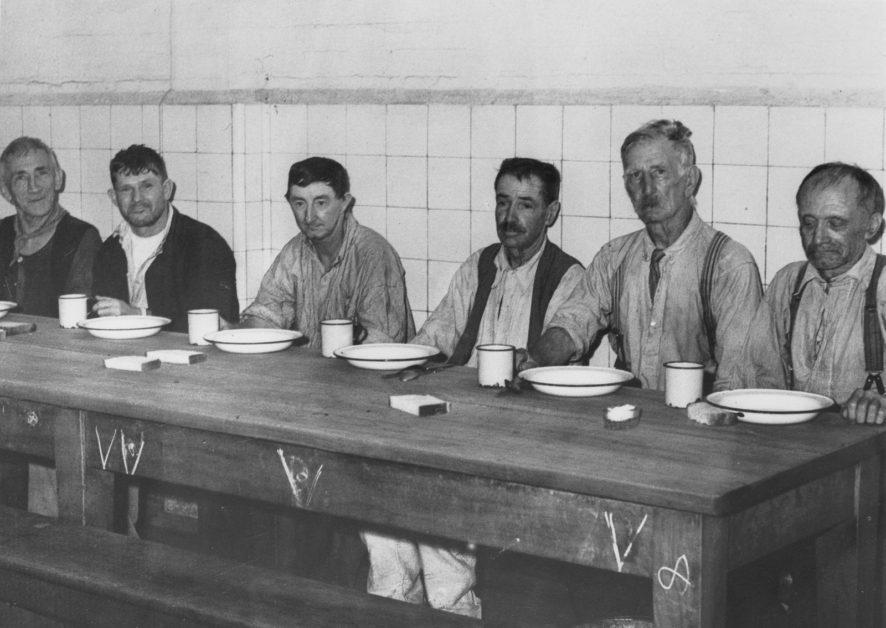
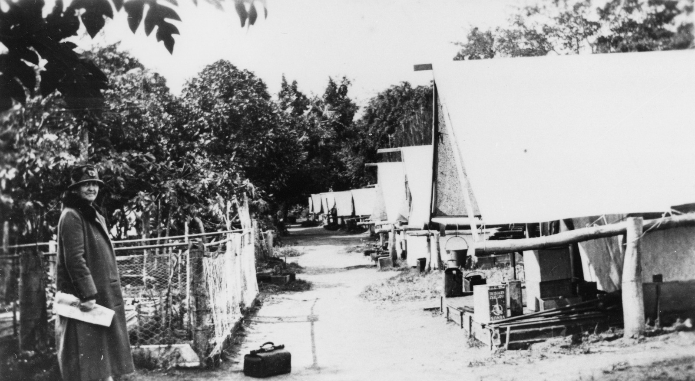
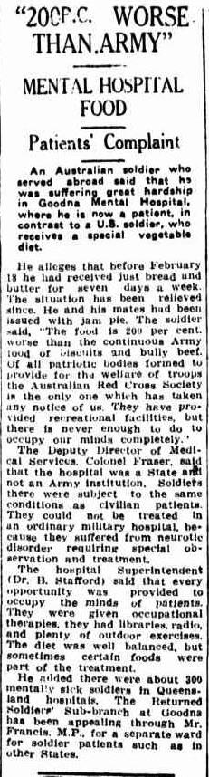

# The Forgotten 

**Stories of World War One soldiers in unmarked graves**

!!! warning "Grumose detail"

    Often the scars of war could not be seen and soldiers suffered from a range of mental illnesses. Many soldiers committed suicide particularly when they could not find work, or bear the pain of their physical or mental illnesses.

    Some of these details are hidden in boxes like this. You can click to open and read them if you chooose.

--8<-- "snippets/toowong-cemetery-map.md"

--8<-- "snippets/john-frederick-inkson.md"

--8<-- "snippets/john-mccall.md"

--8<-- "snippets/lovatt-davidson.md"

## The Dunwich Benevolent Asylum

Many soldiers were sent to Dunwich on Stradbroke Island to convalesce or for treatment for alcoholism. Many died there. 

The Asylum had been established in 1865 to house and care for people who were unable to provide for themselves – the poor and destitute, the disabled, diseased, the old and infirm, and in some cases, those with untreated mental illness. It was a major institution, with over 1,100 inmates at the ==turn of the century==.

Within the Asylum, the Dunwich Inebriate Institution had been established to manage alcoholics. “Inebriates” found drunk on the streets of Brisbane and country towns could be sentenced by a magistrate to serve a period of time in Dunwich, to be “treated” for their condition, or people could refer themselves to the Institution voluntarily. 

For a few years the Inebriate Institution had operated on Peel Island, but it was moved back to Dunwich just as men started returning from war. Over 450 men who had returned from fighting overseas spent time at Dunwich. At least 220 of these were admitted as “inebriates”.

{ width="70%" class="full-width" } 

*<small>[Waiting for their meal at the Dunwich Benevolent Asylum, North Stradbroke Island, 1938](https://onesearch.slq.qld.gov.au/permalink/61SLQ_INST/dls06p/alma99183505775102061) - State Library of Queensland.</small>*

{ width="70%" class="full-width" } 

*<small>[Tent town in Dunwich, Queensland, ca. 1928](https://onesearch.slq.qld.gov.au/permalink/61SLQ_INST/dls06p/alma99183513405702061) - State Library of Queensland.</small>*

[The Last Resort: the experience of First World War returned soldiers in the Dunwich Benevolent Asylum and the Dunwich Inebriate Institution](https://doi.org/10.17082/j.2205-3239.11.1.2020.2020-11), outlines how there was an outcry over the soldier’s treatment in Dunwich.

>From as early as 1918, there was considerable public debate about the treatment of the returned servicemen at Dunwich, with concerns raised about the quality of the medical care, the standard of accommodation and the food. Advocates campaigned for soldiers to have access to an institution dedicated to their needs, noting that men who had made such sacrifices should be offered specialised care, not what was being offered at Dunwich. This letter to the editor reflected community concerns: 
>
> ‘These men want to shake off the horrors of war, so we send them among the broken fragments of civilisation’ 
>
>and
>
>‘I feel, however, that the Returned Soldier who apparently owing to war service has become mentally deficient should not be placed with the ordinary lunatic, but should be in a ward or home where Returned Soldiers in a similar condition to himself only are housed'.

*<small>[Memoirs of the Queensland Museum – Culture 11](https://www.museum.qld.gov.au/collections-and-research/memoirs#index). [:fontawesome-brands-creative-commons::fontawesome-brands-creative-commons-by:][CC-BY]</small>*

[CC-BY]: https://creativecommons.org/licenses/by/4.0/

==Is this text subject to copyright?==

==The Returned Sailors and Soldiers Imperial League of Australia (RSSILA) in 1918 – found that the Inebriate Institution was not a suitable place for the returned servicemen, most of whom had entered voluntarily: It is alleged that it was represented to them that they were being sent to a place where the food and the facilities of Sport and Recreation would enable them to repair damage which has been done to their nervous system by the strain of active service. These men do not seem Inebriates in the ordinary sense of the term, but it is to be remembered that the shell shock and the experiences of men who have undergone a long spell of fighting brings their nervous system into such a state that a slight indulgence in Alcohol or any undue excitement or strain effects them immediately.==

==The RSSILA inquiry was widely reported in the popular press and led to a range of specific improvements to the conditions at Dunwich, including the introduction of Ward 9½ – a specific ward for returned soldiers. The soldiers were no longer required to work inside the Asylum, and the rations provided for them were slightly better and more plentiful. The Red Cross and other charities supplied cricket equipment, care packages and reading material for the men (Australian Red Cross Society 1915-1935). Unfortunately for the soldiers, the Medical Superintendent at the time, Dr James Booth-Clarkson (figure 6), did not approve of these ‘privileges’. Booth-Clarkson had experienced a long military career including service in the Spanish-American War and the Boer War. He was of the opinion that alcoholism indicated a weakness in character, and thought the best treatment was sedation for several days, followed by a regime of abstinence and hard work. He resented what he saw as special treatment for the soldiers. He wrote in his Annual Report: ‘…in many cases there are readmissions, which is not to be wondered at when the surroundings are so comfortable and pleasant’ (Booth-Clarkson 1919). To discourage these soldiers enjoying the ‘luxuries’ of Dunwich, he advocated to the Repat that if a soldier was admitted to the Inebriate Institution more than twice, he should only be further committed to the Benevolent Asylum as an ordinary inmate, where there were expectations of work, fewer rations and a lower standard of accommodation==

--8<-- "snippets/bartholomew-thomas-sharkey.md"

--8<-- "snippets/walter-hammond.md"

--8<-- "snippets/charles-william-baldwin.md"

## The Goodna Mental Asylum 

The asylum at Goodna has had several names, firstly the Woogaroo Lunatic Asylum then Goodna Asylum for the Insane, Brisbane Special Hospital and Wolston Park Hospital.
According to Wikipedia, by January 1942, 110 returned soldiers were inmates of Goodna Mental Hospital and the Australian Government expressed concern about the growing numbers being admitted. War veterans had become a significant minority of the hospital population since the final years of the First World War and Ellerton had decided upon consideration, that using existing institutions was preferable to building new facilities. 

==Can't use *[The Sandy Gallop Asylum](https://www.abc.net.au/news/2020-04-25/queensland-anzac-war-graves-qld-matthew-rennie/12183570)* image due to copyright. Consider [this instead](https://commons.wikimedia.org/wiki/File:Ipswich_Hospital_for_the_Insane,_new_ward_for_the_male_patients,_1908.jpg)==

In 1923 the bad food at Goodna mental asylum made the newspapers where the headline was, “**200% worse than army food**”.

{ width="40%" class="full-width" } 

*<small>"200P.C. WORSE THAN ARMY" (1943, February 22). Queensland Times (Ipswich, Qld. : 1909 - 1954), p. 3 (DAILY). Retrieved March 7, 2025, from [http://nla.gov.au/nla.news-article113999383](https://trove.nla.gov.au/newspaper/article/113999383)</small>*

--8<-- "snippets/thomas-john-mullen.md"

--8<-- "snippets/henry-frederick-manning.md"

--8<-- "snippets/sidney-horace-dutton.md"

--8<-- "snippets/joseph-slack.md"

--8<-- "snippets/william-goldsmith.md"

--8<-- "snippets/john-hartwell-hammond.md"

--8<-- "snippets/thomas-welsh.md"

--8<-- "snippets/frederick-leslie-finney.md"

--8<-- "snippets/william-kalinovsky.md"

--8<-- "snippets/herbert-john-haines.md"

<!--
## Causes of death of World War One soldiers

Info goes here
-->

## Acknowledgements

Compiled and presented by Melissa Wren

## Sources

- [Returned Soldiers in the Dunwich Benevolent Asylum](https://www.slq.qld.gov.au/blog/returned-soldiers-dunwich-benevolent-asylum) - State Library of Queensland

<!--
- [Army – World War I: 1914–18](https://www.naa.gov.au/explore-collection/defence-and-war-service-records/army-world-war-i-1914-18) - Commonwealth of Australia (National Archives of Australia)
- [Memorial search](https://brisbane.discovereverafter.com) - Brisbane City Council
- [Family History Research](https://www.familyhistory.bdm.qld.gov.au) - The State of Queensland
- [Trove](https://trove.nla.gov.au) - National Library of Australia
- [Explore People](https://vwma.org.au/explore/people) - Virtual War Memorial Australia
- [ancestry.com.au](https://www.ancestry.com.au/)
-->