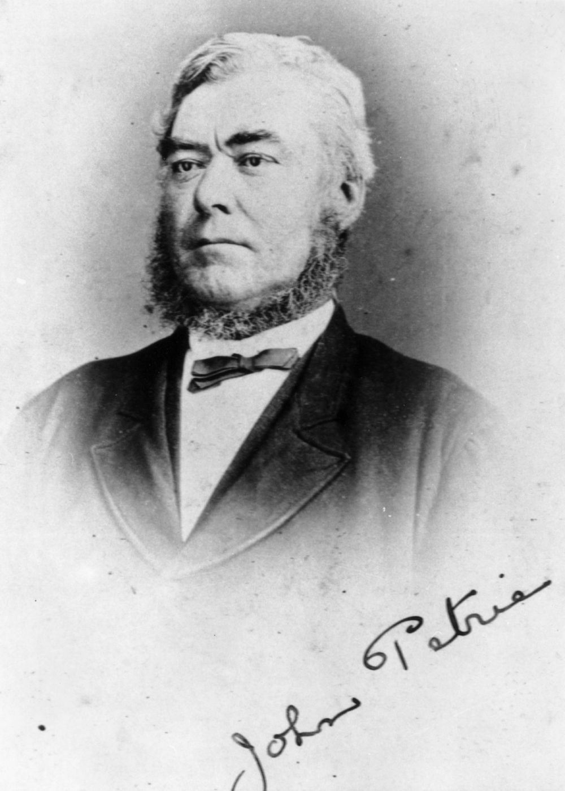
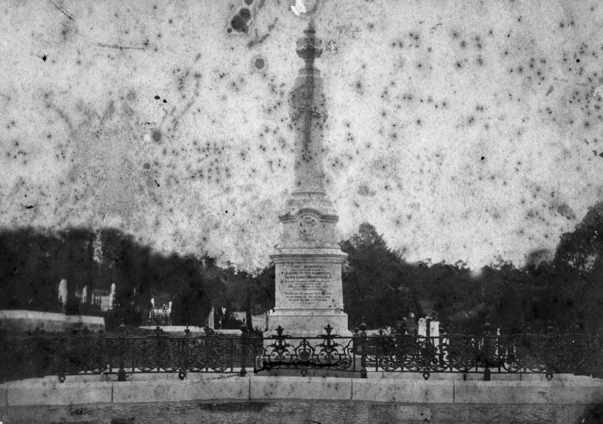
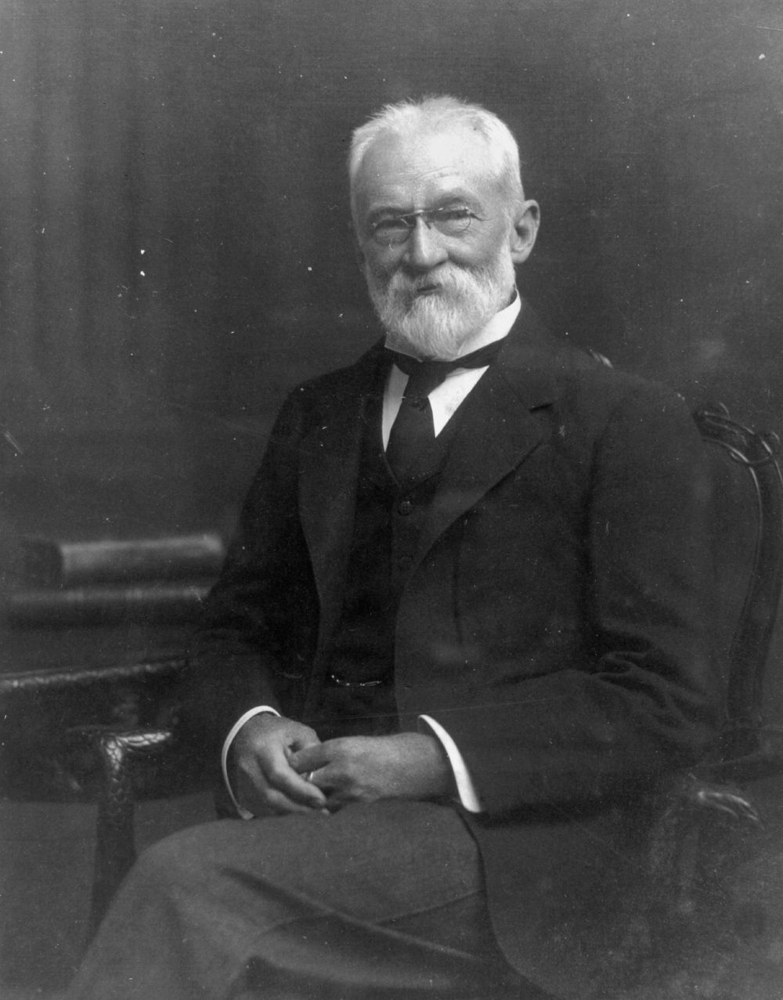
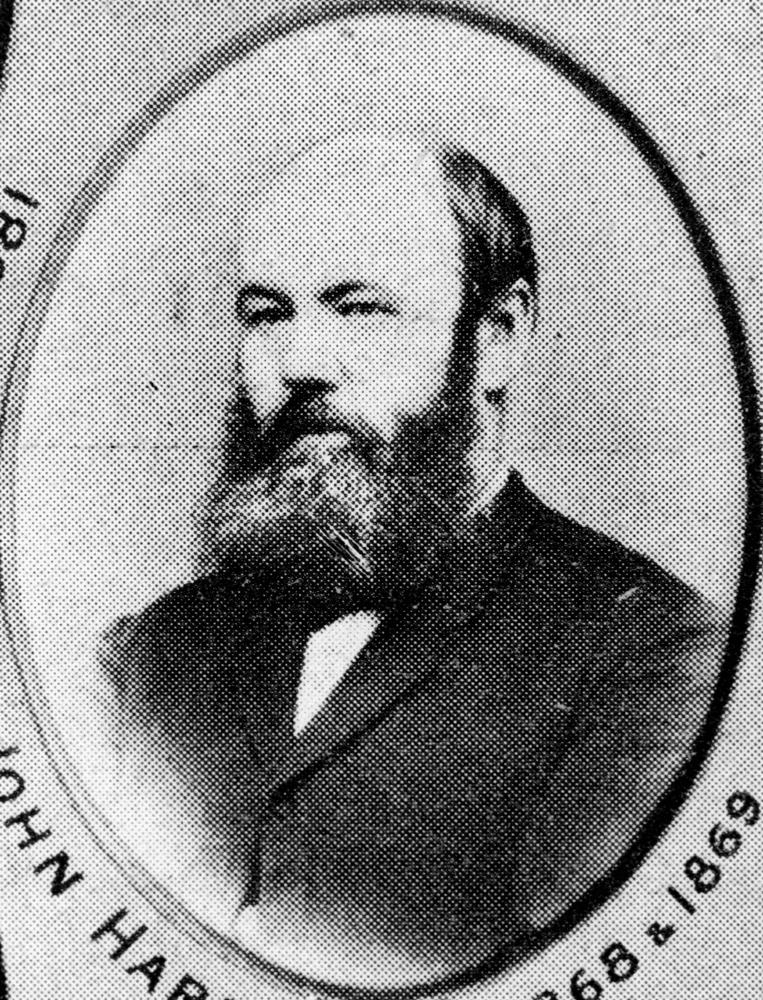

# Founding Fathers   

**Members of the first Brisbane General Cemetery Trust.**

The Brisbane General Cemetery Trust commenced when the first Trustees were appointed on 7 October 1870. They were John Petrie (Chairman), Samuel Walker Griffith, George Edmonstone, John Hardgrave, James Cowlishaw, William Pettigrew, Alexander Raff, Nathaniel Lade and Michael Quinlan. 

The Trust’s first secretary was Henry James Oxley, Griffith’s brother‑in‑law, who held the position for 41 years. John Melville was appointed overseer of the cemetery by the Trustees in 1873. 

On 1 August 1930, Toowong Cemetery and all others with the Brisbane City Council municipality were placed under the management and control of the Council.

## John Petrie <small>(13‑5‑3)</small>

John Petrie was born on 15 January 1822 at Edinburgh, eldest son of Andrew Petrie and his wife Mary, née Cuthbertson. He arrived in Sydney with his family in 1831 and was educated at Reverend John Dunmore Lang's school. In 1837, he arrived aboard the James Watt, the first steamer to enter Moreton Bay, where his father had been appointed clerk of works, and accompanied him on explorations to the Bunya Mountains and Maroochy River. The family stayed on in the Moreton Bay District after the penal settlement closed. After learning the ropes in the family building and contracting business John assumed responsibility for its management after his father's blindness in 1848 forced him to retire. John became sole proprietor and the firm was changed from Petrie & Son to John Petrie. 

On 5 September 1850 Petrie married Jane Keith, daughter of Daniel McNaught of Dunbarton, Scotland. The family grew to five sons and five daughters. John Petrie was public‑spirited and held many important offices. He topped the poll in Brisbane's first municipal election in 1859 and was mayor three times by 1862 and served as an alderman until 1867. He was also an active member of the first Masonic lodge in Queensland. A staunch Presbyterian, he was an elder and worked on building St Paul's Church. John Petrie died on 8 December 1892.

{ width="40%" }  

*<small>[Signed photograph of John Petrie](http://onesearch.slq.qld.gov.au/permalink/f/1upgmng/slq_alma21220089340002061) — State Library of Queensland.</small>* 

## George Edmondstone <small>(13‑20‑5)</small>

George Edmondstone was born in Edinburgh, Scotland, on 4 May 1809 son of William Edmondstone and Alexandrina Farquhar. In 1832, he arrived in New South Wales and had businesses in Sydney and Maitland. On 10 July 1837 in Sydney he married Alexis Watson Tilleray. In 1840 he purchased Normanby Plains Station in Queensland. He sold this in 1842 and was one of the early free settlers in Brisbane, working as a butcher. He was an alderman in Brisbane 1859-66 and the mayor 1863-64. In the Queensland Legislative Assembly he represented East Moreton in 1860-67, Brisbane in 1869-73 and Wickham in 1873-77. He retired from business because of a heart complaint and died at his home in Breakfast Creek on 23 February 1883.

{ width="65%" }  { width="29.425%" } 

*<small>[Monument erected to the memory of George Edmondstone](http://onesearch.slq.qld.gov.au/permalink/f/1upgmng/slq_alma21218962980002061). Died 23 February 1883. His widow Mrs Alexa Edmondstone, who died in Brisbane in 1887, is also buried there. — State Library of Queensland.</small>*   
*<small>[Alderman George Edmonstone](https://library-brisbane.ent.sirsidynix.net.au/client/en_AU/BrisbaneImages/search/results?qu=Alderman+George+Edmonstone&rm=BRISBANEIMAGES0%7C%7C%7C1%7C%7C%7C0%7C%7C%7Ctrue&te=ASSET&lm=ALL_ASSETS) — Brisbane City Council.</small>*

## John Melville <small>(9‑10‑14)</small>

John Melville was born at Boreham Wood, Hertfordshire, England on 10 September 1834 and in 1848 came with his parents to Moreton Bay in January 1849 aboard the Fortitude. In 1851 when the gold diggings broke out in Victoria, John Melville went, to try his luck but returned to Brisbane at Christmas 1854 to visit his family. He then met the Augustus Charles Gregory and was asked to join his Great Northern exploration party for the purpose of exploring the Victoria and Albert Rivers, an invitation which he accepted. They left Brisbane in August 1855. He was the last surviving member of this expedition.

After returning from the expedition John Melville was engaged in survey work until 1871 when he acted as chainman to George Phillips, who had been engaged to survey part of the Toowong cemetery and in 1873 he was appointed overseer of the cemetery, the position he held for 38 years. He died aged 77 on 8 March 1912.

--8<-- "snippets/alexander-raff.md"

--8<-- "snippets/james-cowlishaw.md"

## Sir Samuel Walker Griffith <small>(12‑11‑6/7)</small>

Griffith was born in Merthyr Tydfil, Wales and migrated to Australia as a child. He graduated from Sydney University in 1862 with Honours in maths and classics and commenced practising law in Brisbane. Griffith, considered by many a Liberal, was elected to the Legislative Assembly in 1872. He was Attorney General and twice premier of Queensland. Griffith was a delegate at the Intercolonial Convention 1883. Subsequently, Griffith was Vice‑President of the National Australasian Convention of 1891 and Chairman of the Drafting Committee which prepared the draft constitution. Griffith was president of the Queensland Federation League from 1898. He was knighted in 1886.

In 1893 Griffith left government to become Chief Justice of Queensland and from 1903 to 1919 was the first Chief Justice of the High Court of Australia. During this period he translated Dante’s Divine Comedy from Italian, which was published by Oxford University Press in 1911. He died on 9 August 1920 at his grand home Merthyr which gave its name to a locality in New Farm. The funeral cortege was described by the Daily Mail as the largest ever seen in Brisbane.

{ width="40%" }  

*<small>[Sir Samuel Walker Griffith in 1912-1913](http://onesearch.slq.qld.gov.au/permalink/f/1upgmng/slq_alma21218748680002061) — State Library of Queensland.</small>* 

## John Hardgrave <small>(14‑22‑2/3)</small>

John Hardgrave, a local politician and lord mayor of Brisbane, was born in Wicklow, Ireland, in 1826. He arrived in Sydney in 1843 and moved to Brisbane in 1848. In 1860 he purchased 6 acres (2.4 hectares) of land in the Brisbane suburb of West End. Hardgrave Road in West End is named after him. He was in the boot trade to 1862 and was involved in local government from 1867 to 1890. He was mayor of Brisbane in 1868 and 1870, first chairman of the Woolloongabba Divisional Board, alderman for South Brisbane from 1888 to 1890, and chairman of the Waterworks Board from 1893. He died in Brisbane on 8 November 1906 and was interred in the family grave.

{ width="40%" }  

*<small>[John Hardgrave, early resident and mayor of Brisbane, 1868-1869](http://onesearch.slq.qld.gov.au/permalink/f/1upgmng/slq_digitool111232) — State Library of Queensland.</small>*

--8<-- "snippets/william-pettigrew.md"

--8<-- "snippets/nathaniel-lade.md"
