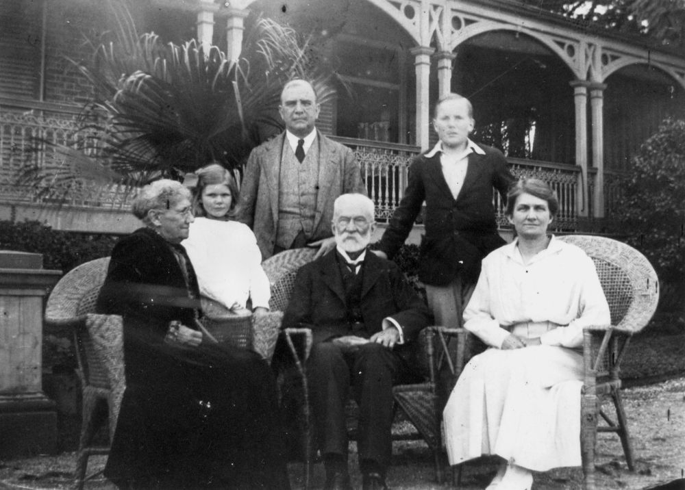
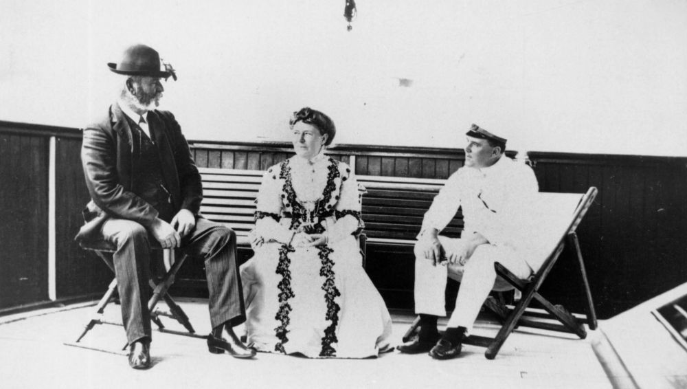

--8<-- "snippets/sem/stories/governors.json"

# Queensland Governors  

**Past Governors, Lieutenant-Governors, and Administrators of Queensland**

--8<-- "snippets/samuel-wensley-blackall.md"

--8<-- "snippets/maurice-charles-o-connell.md"

--8<-- "snippets/joshua-peter-bell.md"

--8<-- "snippets/anthony-musgrave.md"

--8<-- "snippets/arthur-hunter-palmer.md"

## Rt. Hon. Sir Samuel Walker Griffith <small>(12‑11‑6/7)</small>

Lieutenant Governor - 21 December 1901 to 24 March 1902

Griffith was born on 21 June 1845 at Merthyr Tydfil, Wales, son of Rev. Edward Griffith a Congregational minister, and his wife Mary, née Walker. He earned first-class honours in classics and mathematics from the University of Sydney. He also studied law and on 11 May 1863 became an articled clerk at Ipswich. In 1866 he was awarded Mort travelling fellowship and undertook a 'grand tour' of Europe. 

Back in Queensland Griffith completed his articles in September 1867, immediately passed the Bar examinations. He first appeared in a Supreme Court action in 1867 and took silk in 1876. He married Julia Janet Thomson at East Maitland, on 5 July 1870. Griffith then entered politics winning the seat of East Moreton in 1872. Griffith became Liberal party leader in May 1879. Griffith was Premier from 10 November 1883 to 13 June 1888, and was appointed K.C.M.G. in 1886. After his government's defeat in 1888, Griffith spent twenty‑two months in Opposition. He was Premier again in August 1890.

Griffith served as Queensland's chief justice from 13 March 1893 to 6 October 1903, during which he was appointed G.C.M.G. in 1895 and to the Privy Council in 1901. Griffith served several times as Deputy and Lieutenant‑governor. In 1903 Griffith was chosen as the first Chief Justice. 

On 16 March 1917 Griffith suffered a stroke while on the bench and was temporarily retired. His mortgage forced him, aged 72, to return to work. He eventually retired to Brisbane where he died at Merthyr on 9 August 1920.

*<small>[Sir Samuel Walker Griffith and family](http://onesearch.slq.qld.gov.au/permalink/f/1upgmng/slq_alma21218185350002061) - State Library of Queensland </small>*

## Hon. Sir Arthur Morgan <small>(12‑15‑12)</small>

Lieutenant Governor:

  - 27 May 1909 to 2 December 1909
  - 16 July 1914 to 15 March 1915

Morgan was born on 19 September 1856 near Warwick, son of James Morgan and his wife Kate, née Barton. Morgan’s schooling was curtailed when his father bought the Warwick Argus in June 1868. By 18 he was manager and he became editor and proprietor of the Argus a few months before his father died in 1878. On 26 July 1880 Morgan married Alice Clinton at Warwick. 

Morgan entered local politics in 1885 when elected to the Warwick Municipal Council; he served as Mayor in 1886‑90 and 1898. On 18 July 1887 he was elected to the Legislative Assembly for Warwick and represented this electorate until 4 April 1896 when he stood aside to allow [T. J. Byrnes](../research/thomas-joseph-byrnes.md) to pursue the premiership via the seat. Morgan regained Warwick on 2 October 1898 at the by‑election after Byrnes's death and served the assembly as Queensland's first native‑born Speaker from May 1899 until September 1903. He resigned after a series of dramatic political events surrounding the defeat of the Philp government. Labor leader [W. H. Browne](../research/william-henry-browne.md), unable to form a government, recommended that the Governor send for Morgan. The Morgan‑Browne coalition ministry was sworn in on 17 September 1903. The coalition was returned overwhelmingly in 1904. It introduced the franchise for women in State elections. Morgan relinquished the premiership, accepting the presidency of the Legislative Council from 19 January 1906 after the death of Sir Hugh Nelson. 

In 1907 the Governor Lord Chelmsford reluctantly appointed Morgan lieutenant‑governor, by‑passing Sir Pope Cooper. Morgan deputised in 1907 and 1908 during Chelmsford's absences and, in 1909 and 1914, was Lieutenant‑governor on the retirement of Governors Chelmsford and Sir William MacGregor. He was still President of the Legislative Council when he died on 20 December 1916 after a long illness. He was buried here after a state funeral at St John's Cathedral.

*<small>[Sir Arthur and Lady Morgan on board the S.S. Mourilyan, Queensland, 1910](http://onesearch.slq.qld.gov.au/permalink/f/1upgmng/slq_alma21256749450002061) - State Library of Queensland </small>*

--8<-- "snippets/pope-alexander-cooper.md"

## Further Reading
 
Forrest, Peter and Sheila Forrest, *[All for Queensland: The Governors and the People](http://onesearch.slq.qld.gov.au/permalink/f/1oppkg1/slq_alma21131046020002061)*, Darwin, Shady Tree, 2009

<!--

## Brochure

**[Download this walk](../assets/guides/governors-past.pdf)** - designed to be printed and folded in half to make an A5 brochure.

-->
