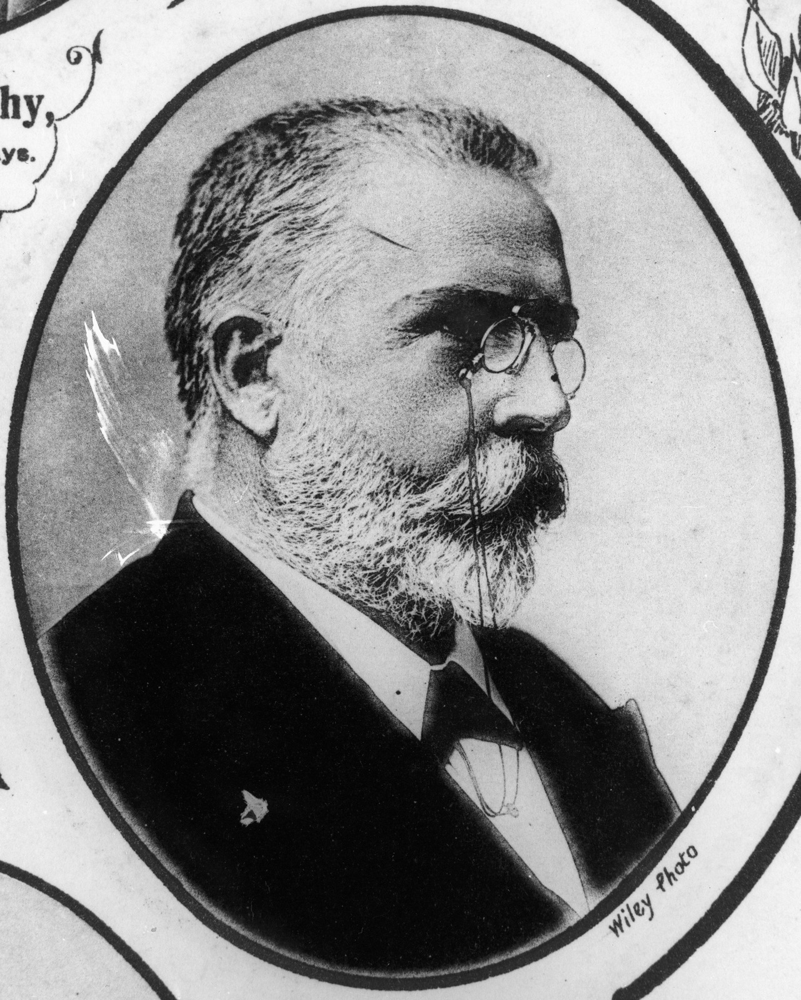
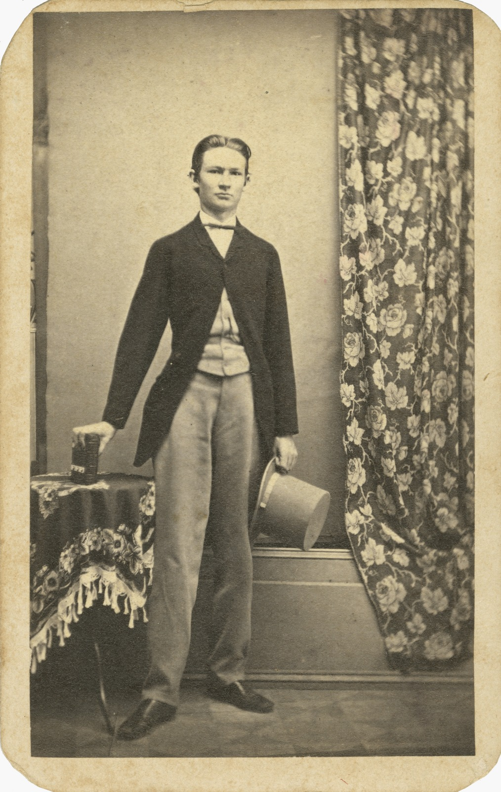

--8<-- "snippets/sem/stories/judiciary.json"

# Judiciary  

**Early Judiciary buried in Toowong Cemetery**

--8<-- "snippets/toowong-cemetery-map.md"

<!-- 
???+ directions "Directions" 

    Starting point
    Walking directions to first headstone... is the grave of...
    
    { width="15%" }
-->

--8<-- "snippets/george-william-paul.md"

<!--
??? directions "Directions" 

    Walking directions to next headstone... is the grave of...
    
    { width="15%" }
-->

## The Honourable Virgil Power <small>[(7A‑103‑24)](https://brisbane.discovereverafter.com/profile/31872946 "Go to Memorial Information" )</small>

Born in Brisbane 2 August 1849 to Michael Power and Anna Marie Connolly. Virgil Power was admitted as a barrister in London and Dublin prior to his admission as a barrister of the Supreme Court of Queensland in 1875. He served as Crown Prosecutor for the Northern District of the Supreme Court, the Southern District Court and the Southern District of the Supreme Court before his appointment as the first Queensland-born Judge of the Supreme Court of Queensland in 1895. Appointed first Judge of the Central Court based in Rockhampton, he served there until his retirement in 1910. He died at Southport on 2 June 1914.

<figure markdown>
  { width=40% class="full-width" }
  <figcaption markdown>[Virgil Power](https://onesearch.slq.qld.gov.au/permalink/61SLQ_INST/dls06p/alma99183788010502061) - State Library of Queensland.</figcaption>
</figure>

--8<-- "snippets/patrick-real.md"

## The Honourable George Rogers Harding <small>[(1‑82‑15)](https://brisbane.discovereverafter.com/profile/31757389 "Go to Memorial Information" )</small>

Born Taunton. Somerset England on 3 December 1838 to Rev. George Rogers Harding and Elizabeth Winter. In 1861 he was admitted as a barrister at Lincoln's Inn, London. With his wife, Elizabeth and family he migrated to Brisbane where he was admitted as a barrister of the Supreme Court of Queensland in 1866. In July 1879 he became Senior Puisne Judge. Many books held in the Queensland Supreme Court Library today were collected when he was chairman of the Library Committee. He died in his chambers on 31 August 1895.

<figure markdown>
  { width=40% class="full-width" }
  <figcaption markdown>[Justice George Rogers Harding, 1879](https://onesearch.slq.qld.gov.au/permalink/61SLQ_INST/dls06p/alma99184004781202061) - State Library of Queensland.</figcaption>
</figure>

--8<-- "snippets/william-henry-abbot-hirst.md"

## Sir Pope Alexander Cooper <small>[(13‑37‑1)](https://brisbane.discovereverafter.com/profile/31799132 "Go to Memorial Information" )</small>

Born Lake George, NSW on 12 May 1846 to Francis Cooper and Sarah Jenkins. He undertook his legal studies in London before bringing his wife and family to Brisbane where he was admitted as a barrister of the Supreme Court of Queensland in 1874. After a period in private practice, he became Northern Crown Prosecutor then entered politics as MLA for Bowen, serving as Attorney-General 1881-83. In January 1883 he was appointed a Judge of the Queensland Supreme Court, the youngest and first Australian-born judge of that court. In 1903 he became the fourth Chief Justice of Queensland. He died on 30 August 1923.

<figure markdown>
  { width=40% class="full-width" }
  <figcaption markdown>[Portrait of Honourable Sir Pope Alexander Cooper](https://onesearch.slq.qld.gov.au/permalink/61SLQ_INST/dls06p/alma99183506900402061) - State Library of Queensland.</figcaption>
</figure>

## Sir Arthur Rutledge KC <small>[(13‑49‑15)](https://brisbane.discovereverafter.com/profile/32021020 "Go to Memorial Information" )</small>

Born Penrith, NSW on 29 August 1843 to James Rutledge and Lucy Field. Arthur Rutledge was a Wesleyan clergyman before he left the ministry to study law. He was admitted to the Queensland Bar in 1878 and the same year became the MLA for Enoggera. After periods alternating between the Bar and politics when he served three times as Attorney-General, Rutledge was appointed QC in 1899 and knighted in 1902. He was appointed a Judge of the District Court in 1906 and held that position until his death in Sydney on 8 February 1917.

<figure markdown>
  { width=40% class="full-width" }
  <figcaption markdown>[Portrait of the Honourable Sir Arthur Rutledge](https://onesearch.slq.qld.gov.au/permalink/61SLQ_INST/dls06p/alma99183507091902061) - State Library of Queensland.</figcaption>
</figure>

--8<-- "snippets/ratcliffe-pring.md"

--8<-- "snippets/charles-stuart-mein.md"

## Sir Samuel Walker Griffith GCMG QC <small>[(12‑11‑6/7)](https://brisbane.discovereverafter.com/profile/31688994 "Go to Memorial Information" )</small>

Born Merthyr Tydfil, Glamorganshire, Wales on 21 June 1845 to Rev. Edward Griffith and Mary Walker. Griffith was articled to Arthur Macalister in Ipswich and admitted as a barrister of the Queensland Supreme Court in 1867. He was elected to Queensland Legislative Assembly in 1872, serving as Attorney-General and Premier and combined politics with his work as a barrister until 1893 when he was appointed a Judge of the Queensland Supreme Court and third Chief Justice of Queensland. He was appointed QC in 1876. In 1903 he became the first Chief Justice of the High Court of Australia. He retired in 1919 and died on 9 August 1920 at New Farm.

<figure markdown>
  { width=40% class="full-width" }
  <figcaption markdown>[Samuel Walker Griffith](https://onesearch.slq.qld.gov.au/permalink/61SLQ_INST/dls06p/alma99183845698002061) - State Library of Queensland.</figcaption>
</figure>

## Sir Charles Lilley QC <small>[(12‑15‑15)](https://brisbane.discovereverafter.com/profile/32018715 "Go to Memorial Information" )</small>

Born Newcastle-upon-Tyne, Northumberland England on 27 August 1827 to Thomas Lilley and Jane Shipley. Charles Lilley began studying law in England before settling in Moreton Bay in 1856 and undertaking further articles to Robert Little. In 1858 he was the first solicitor admitted to practice by the Supreme Court at Moreton Bay. In 1860 he was elected to Queensland's first Legislative Assembly where he served for the next 14 years. He was admitted to the Bar in 1861, becoming the colony's first QC in 1865. In 1874 he was appointed a Judge of the Queensland Supreme Court and became Queensland's second Chief Justice in 1879. He died on 20 August 1897, four years after retiring.

<figure markdown>
  { width=40% class="full-width" }
  <figcaption markdown>[Sir Charles Lilley](https://onesearch.slq.qld.gov.au/permalink/61SLQ_INST/dls06p/alma99183514119802061), 1879 - State Library of Queensland.</figcaption>
</figure>

--8<-- "snippets/john-laskey-woolcock.md"

--8<-- "snippets/charles-stumm.md"

## Acknowledgements

Compiled and presented by Lyn and Darcy Maddock

## Sources

- [Sir Harry Gibbs](https://legalheritage.sclqld.org.au) - Legal Heritage Centre
- [National Archives of Australia](https://www.naa.gov.au) - Commonwealth of Australia
- [Family History Research](https://www.familyhistory.bdm.qld.gov.au) - The State of Queensland
- [Trove](https://trove.nla.gov.au) - National Library of Australia
- [Australian Dictionary of Biography](https://adb.anu.edu.au) - Australian National University
- [The Prosecution Project - Queensland Courts](https://prosecutionproject.griffith.edu.au/other-resources/queensland-courts/)

<!--

## Brochure

**[Download this walk](../assets/guides/judiciary.pdf)** - designed to be printed and folded in half to make an A5 brochure.

-->
