 
# Labor Luminaries  

**Stories recognising people involved in the Labor movement.**

<!--
???+ directions "Directions" 

    - Start behind Canon Garland Place in Emma Miller Avenue. 
    - Walk North towards William Brown Avenue (previously 14th Avenue).
    - At the end of the second row back from Emma Miller Avenue, you'll find Emma Miller's memorial stone.  
    
     { width="15%" }
-->

--8<-- "snippets/emma-miller.md"

{ width="40%" }  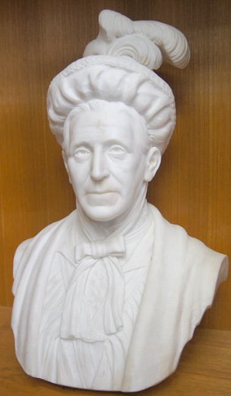{ width="35.75%" }

*<small>[Portrait of Mrs. Emma Miller](http://onesearch.slq.qld.gov.au/permalink/f/1c7c5vg/slq_alma21220238260002061) - State Library of Queensland. </small>*  
*<small>[Marble Bust of Emma Miller held at Queensland Council of Unions by sculptor James Laurence Watts](https://en.wikipedia.org/wiki/File:Marble_Bust_of_Emma_Miller_held_at_Queensland_Council_of_Unions.jpg) by Alphi123, used under [CC BY-SA 4.0](https://creativecommons.org/licenses/by-sa/4.0/).  </small>*

<!--
??? directions "Directions" 

    - :fontawesome-solid-walking:{ .deep-purple } Walk up the steep grass path that leads directly to the Governor Blackall Memorial, the largest monument at the top of the hill
    - :fontawesome-solid-car:{ .deep-purple } To avoid the steep walk, drive or walk up Walter Hill Drive. When you come to the Shelter Shed at the top of the hill, take a sharp right turn into Federation Avenue and park on the edge of the road at the turning circle at the end.
    - Walk back down Federation Avenue (previously 15^th^ Avenue), on your immediately on your left about 4 rows after the end of the turning circle, you'll find Thomas Glassey and his wife Margaret. 

    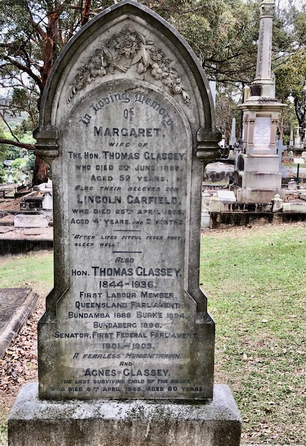{ width="15%" }
-->
    
--8<-- "snippets/thomas-glassey.md"

{ width="26.72%" }  { width="55%" }

*<small>[Senator Thomas Glassey delivering a speech to the women electors of Queensland](http://onesearch.slq.qld.gov.au/permalink/f/1upgmng/slq_alma21218794910002061) - State Library of Queensland.  </small>*   
*<small>[Glassey family, ca. 1926](http://onesearch.slq.qld.gov.au/permalink/f/1upgmng/slq_alma21218562540002061) - State Library of Queensland. </small>*

<!--
??? directions "Directions" 

    - Continue to walk down 15th Avenue to and stop at 11‑51‑3, on your left, where you'll find the 3 graves close to each other. 
    
      { width="15%" } 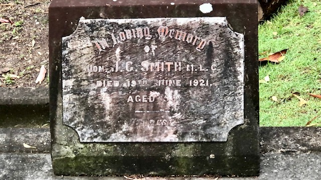{ width="20%" } 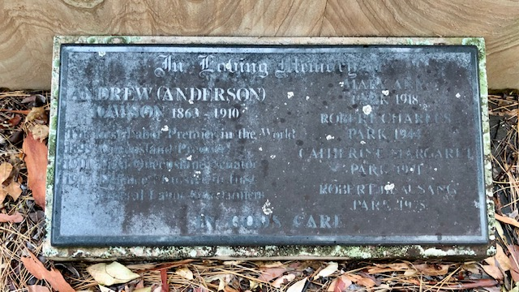{ width="20%" } 
-->

--8<-- "snippets/william-henry-browne.md"

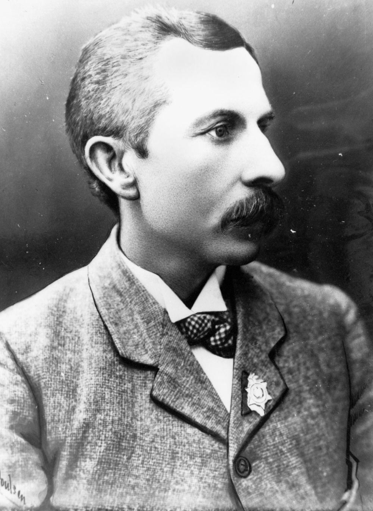{ width="35%" }  

*<small>[Honourable William Henry Browne](http://onesearch.slq.qld.gov.au/permalink/f/1upgmng/slq_alma21218188950002061) - State Library of Queensland </small>* 

--8<-- "snippets/john-gordon-smith.md"

--8<-- "snippets/anderson-dawson.md"

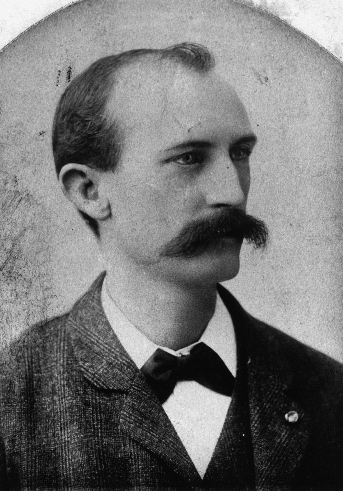{ width="30%" }  { width="54.5%" }  

*<small>[Honourable Anderson (Andrew) Dawson](http://onesearch.slq.qld.gov.au/permalink/f/1upgmng/slq_alma21218521750002061) 1899 - State Library of Queensland </small>*  
*<small>[After the swearing in of the Dawson ministry of the Labor Party Brisbane, Queensland](http://onesearch.slq.qld.gov.au/permalink/f/1upgmng/slq_digitool46636) - State Library of Queensland </small>* 

<!--
??? directions "Directions" 

    - Continue to walk down 15th Avenue. Three rows before the Shelter Shed, on your left, stop at 11‑76‑12/13. 

    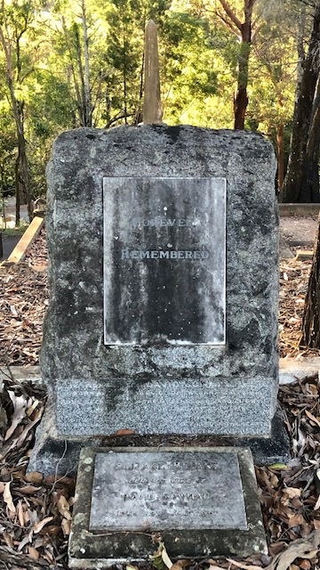{ width="15%" }  
-->

--8<-- "snippets/david-bowman.md"

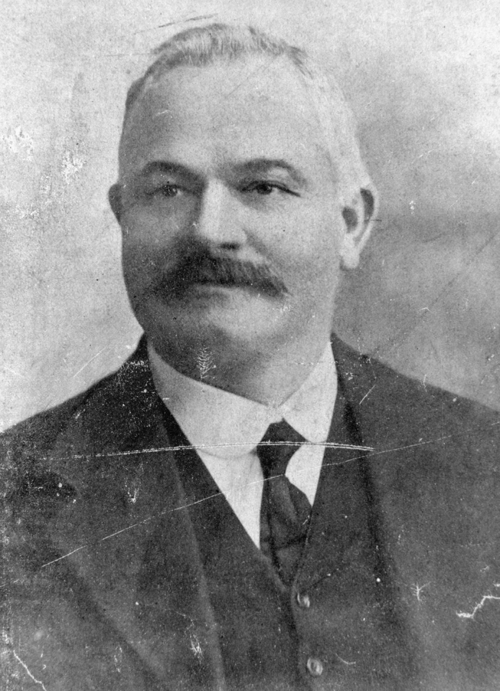{ width="40%" }  

*<small>[David Bowman](http://onesearch.slq.qld.gov.au/permalink/f/1upgmng/slq_alma21218753330002061) - State Library of Queensland </small>* 

<!--
??? directions "Directions" 

    - Continue past the Shelter Shed, walking North West along Dr. Lilian Cooper Drive (Boundary Road), on your left, stop at the Forgan-Smith grave, 8‑25‑20/21.
    - On the opposite side of the road you'll find the Gillies grave, 18‑106‑20.
    
    { width="20%" }  { width="15%" } 
-->

--8<-- "snippets/william-forgan-smith.md"

{ width="59%" }  { width="30.2%" }

*<small>[Construction of the Forgan Smith Building, University of Queensland , St Lucia, Brisbane, Queensland, 1940](http://onesearch.slq.qld.gov.au/permalink/f/1upgmng/slq_alma21218117600002061) - State Library of Queensland </small>*  
*<small>[William Forgan Smith](http://onesearch.slq.qld.gov.au/permalink/f/1upgmng/slq_alma21218884950002061) ca. 1935 - State Library of Queensland </small>*

--8<-- "snippets/william-neal-gillies.md"

{ width="40%" }  

*<small>[William Gillies, 1920](https://commons.wikimedia.org/wiki/File:William_Gillies_1920.jpg) - Queensland State Archives </small>* 

<!--
??? directions "Directions" 

    - :fontawesome-solid-walking:{ .deep-purple } Walk down the row, across the gully, and across 8^th^ Avenue to the Shelter Shed.
    - :fontawesome-solid-car:{ .deep-purple } To avoid the steep walk down the hill, return to your car and drive down Federation Avenue back to the Shelter Shed, then contine on Dr. Lilian Cooper Drive. Turn right into 9^th^ Avenue, then right into Pat Hill Drive and park near the Shelter Shed. 
    - Walk towards O'Doherty Avenue (previously 11^th^ Avenue) and four graves along you'll find Ned Hanlon. 

    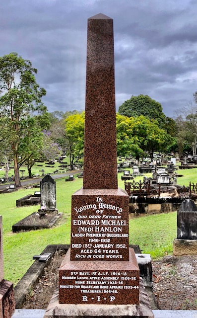{ width="15%" }  
-->

--8<-- "snippets/edward-michael-hanlon.md"

{ width="59%" }  

*<small>[Edward Michael Hanlon, premier of Queensland, addressing the Legislative Assembly on the occasion of the Industrial Law Amendment Bill, 1948](http://onesearch.slq.qld.gov.au/permalink/f/1upgmng/slq_alma21217956320002061) - State Library of Queensland </small>* 

<!--
??? directions "Directions" 

    - Six graves on you'll find the Hoolan family.

    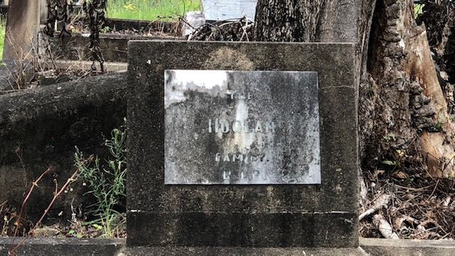{ width="15%" } 
-->

--8<-- "snippets/john-hoolan.md"

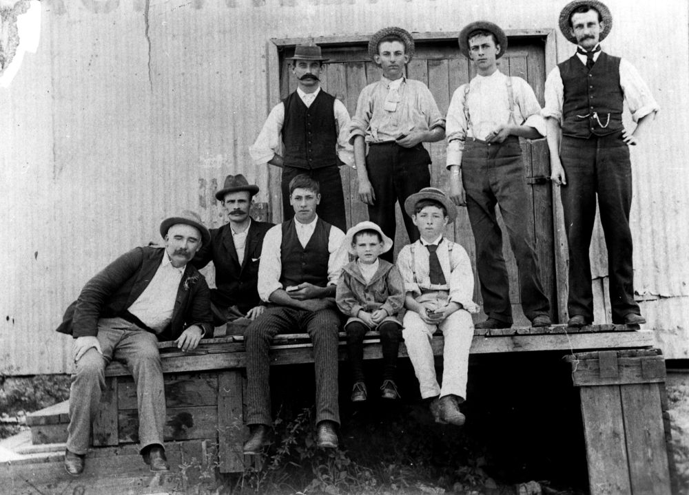{ width="70%" }  

*<small>[John 'Plumper' Hoolan, ca. 1902](http://onesearch.slq.qld.gov.au/permalink/f/1upgmng/slq_alma21218562430002061) - State Library of Queensland </small>* 

<!--
??? directions "Directions" 

    - Walk back to the Shelter Shed, turn left into Charles Heaphey Drive (previously 8^th^ Avenue). 
    - Before you get to Elizabeth Dale Walk, on your right, and almost to the end of the row, near the gully, you'll find Albert Whitford.

    { width="15%" }  
-->

--8<-- "snippets/albert-edward-victor-whitford.md"

{ width="70%" }  

*<small>[Delegates to the Queensland Police Union third annual conference. Whitford is in the front row, second on the left.](https://en.wikipedia.org/wiki/Albert_Whitford_(politician)#/media/File:Delegates_to_the_Queensland_Police_Union_Third_Annual_Conference.jpg) - Queensland Police Museum. [CC BY-SA 4.0](https://creativecommons.org/licenses/by-sa/4.0/) </small>* 

<!--
??? directions "Directions" 

    - Continue along Charles Heaphey Drive and return to your starting point. 
-->

## Further Reading 

Waterson, D. B. *Biographical Register of the Queensland Parliament*, Australian National University Press, 1972

## Acknowledgements

Research on Albert Whitford provided by Shelley Steel.

Compiled by Hilda Maclean. 
<!-- Hilda Maclean https://social-science.uq.edu.au/profile/603/hilda-maclean h.maclean@uq.edu.au -->

<!--

## Brochure

**[Download this walk](../assets/guides/labor-luminaries.pdf)** - designed to be printed and folded in half to make an A5 brochure.

-->
