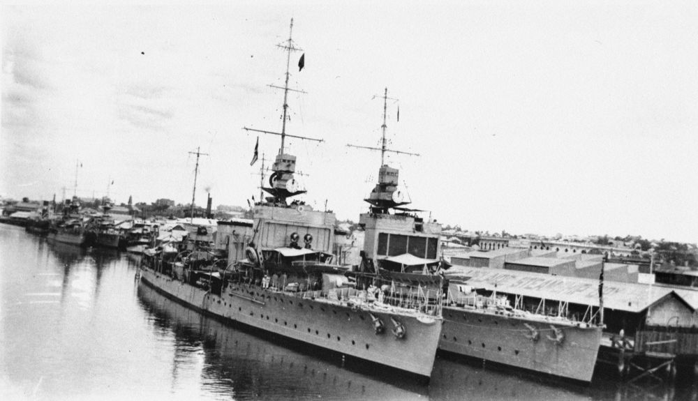

---
hide:
  - navigation
search:
  boost: 0.5  
---

--8<-- "snippets/sem/stories/lest-we-forget-navy.json"

# Lest We Forget: Naval  

**These stories were created to mark the centenary of the Royal Australian Navy, 1911—2011.**

Those represented here are only a small number of the [men and women who gave their lives in service to this country](https://www.cwgc.org/find-records/find-war-dead/search-results/?CemeteryExact=true&Cemetery=BRISBANE%20GENERAL%20(TOOWONG)%20CEMETERY&Size=100&Page=1) who are either buried or memorialised at Toowong Cemetery.

--8<-- "snippets/toowong-cemetery-map.md"

<!-- imange and caption 
Royal Australian Navy Official Badge Design of 1949
-->

## Able Seaman W. J. Harrhy, RN <small>[(4‑16‑4)](https://brisbane.discovereverafter.com/profile/31685023 "Go to Memorial Information" )</small>

Welshman, William John Harrhy, a sailor on *HMS Dauntless*, in Brisbane for a Goodwill Visit, was drowned in the Brisbane River in the early hours of Good Friday, 1924. Members of the ship’s crew were in Brisbane to participate in the unveiling of the War Memorial at Toowong Cemetery on Anzac Day 1924. His body was found the following Monday downstream. It is believed that he tripped over an obstacle on the ship’s deck in the early hours of the morning. 

Harrhy, aged 36, had been in the navy for over fifteen years and had a splendid war records. The funeral left the ship for the cemetery and many wreaths were laid including one shaped like an anchor and another, a model of the ship. The officers and crew arranged a dance in aid of Harrhy’s family aboard the *Dauntless*.

*<small>[Royal Navy ships HMS Danae, HMS Dauntless, HMS Dragon and HMS Delhi docked at South Brisbane wharves, 1924](http://onesearch.slq.qld.gov.au/permalink/f/1upgmng/slq_alma21220252580002061) - State Library of Queensland </small>*

## Maurice Headford <small>[(10‑72‑35)](https://brisbane.discovereverafter.com/profile/31988140 "Go to Memorial Information" )</small>

Headford was born in Port Melbourne, Victoria on 23 February 1898. He entered the RAN as a Boy Class II on the 5 November 1912 training aboard the *Tingira*. He was transferred to the newly completed *Australia* when he was promoted to Boy Class I a year later. In August 1916, he was promoted to Ordinary Seaman, then to Able Bodied Seaman in January 1918. While aboard the *Australia* Headford saw service in Rabaul and the North Sea. The Australia missed the battle of Jutland as she had collided with the New Zealand. 

After the end of World War I, Headford transferred briefly to the *Sydney* before ending his naval career aboard the depot ship the Penguin in January 1920, having served his term of seven years. He died of pulmonary tuberculosis at the Rosemount Hospital, Windsor on 18 June 1936. He was the son of Louis and Teresa Headford (née Mottershead).

## Stoker II class Arthur Kilminster Beaven <small>[(10‑52‑9)](https://brisbane.discovereverafter.com/profile/31774998 "Go to Memorial Information" )</small>

Beaven was born on 28 January 1895 in Wiltshire, England. He enlisted for a five-year term on 17 February 1915 as a stoker, the position he retained for the rest of his naval service. He served aboard the Cerberus, Encounter, Australia, Sydney and finally the Franklin from January to April 1920. He died of heart failure at the Rosemount Hospital, Windsor on 9 June 1921. He was the son of Arthur and Edith Beaven (née Kilminster).

## Stoker Victor Cyril Button <small>[(10‑53‑14)](https://brisbane.discovereverafter.com/profile/31702971 "Go to Memorial Information" )</small>

Button was born in Hobart on 1 January 1924. He was the son of Cyril and Jessie Button (née Woods). He enlisted in the Royal Australian Navy Reserve on the 20 November 1941 training at *HMAS Cerberus* and *Londsdale*. After serving briefly aboard *Australia (II)*, Button was transferred to the *HMAS Moreton*. He drowned in the Brisbane River on Christmas Day, 1942. He was the last military burial in Portion 10.

## Able Seaman Archibald Edward Bartsch <small>[(10‑44‑20)](https://brisbane.discovereverafter.com/profile/31781459 "Go to Memorial Information" )</small>

## Warrant Officer Henry Theeman <small>[(10‑44‑21)](https://brisbane.discovereverafter.com/profile/31808968 "Go to Memorial Information" )</small>

## Steward Eric Ross Harrison <small>[(10‑43‑7)](https://brisbane.discovereverafter.com/profile/31798041 "Go to Memorial Information" )</small>

--8<-- "snippets/bartsch-theeman-harrison.md"

## Lieutenant Watkin Llewellyn Whitaker, RN <small>[(10‑83‑13)](https://brisbane.discovereverafter.com/profile/31685954 "Go to Memorial Information" )</small>

[Whitaker](https://www.cwgc.org/find-records/find-war-dead/casualty-details/2242991/watkin-llewellyn-whitaker/) was the son of Frank and Elizabeth Maria Whitaker and the husband of Jane Ellen Whitaker, of St. Budeaux, Plymouth, England. He was on loan from the Royal Navy. He had not long completed retraining for the RAN when he died at the St Helen’s Hospital at South Brisbane on 3 October 1942 of a haemorrhaging duodenal ulcer, aged 55.

## Portion 10

This portion contains over 370 Commonwealth War Graves from the three forces. ‘Soldiers’ Corner’ was established in 1919. Flowers were cultivated and sold at the Cemetery from Portion 10 until the 1930s. In 1934, the area set apart for soldiers’ graves within Portion 10 was extended to incorporate the flower gardens and the wooden pavilion was demolished. Military burials ceased in December 1942 when the military portion at the [Lutwyche Cemetery](https://www.brisbane.qld.gov.au/community-and-safety/community-support/cemeteries/lutwyche-cemetery) was established.

## Netherlands Merchant Navy 

Two sailors from the Netherlands Merchant Navy are also buried at Toowong Cemetery. They are mentioned in the [Brisbane General Cemetery citation](https://www.cwgc.org/visit-us/find-cemeteries-memorials/cemetery-details/13707/brisbane-general-toowong-cemetery/) on the [Commonwealth War Graves Commission’s website](https://www.cwgc.org).

## Matroos Boesidien <small>[(30‑22‑21)](https://brisbane.discovereverafter.com/profile/31722603 "Go to Memorial Information" )</small>

[Sailor Boesidien](https://www.cwgc.org/find-records/find-war-dead/casualty-details/7510728/boesidien/) was born in Bengkalan, Java in 1909. He died, aged 30, in Brisbane on 27 August 1942 while serving aboard the KPM line’s *MV Maetsuycker*. The vessel had evacuated from the Dutch East Indies and was redeployed transporting Australian troops to New Guinea.

## Samanuddin <small>[(29‑9‑11)](https://brisbane.discovereverafter.com/profile/31842498 "Go to Memorial Information" )</small>

[Sailor Samanuddin](https://oorlogsgravenstichting.nl/personen/133335/samanuddin) was born in Dacca in 1906 and was a sailor in the Dutch Merchant Navy. He died in Brisbane on 16 July 1943 aged 37.

## Further Reading

- Nunan, P. Tragedy in Moreton Bay, Wartime: Official Magazine of the Australian War Memorial. Issue 34, 2006. p.55-57
- [Commonwealth War Graves Commission](https://www.cwgc.org/) 
- [Netherlands War Graves Foundation](https://oorlogsgravenstichting.nl) 
- The Australian Merchant Navy, http://www.merchant-navy-ships.com/allied-fleets/dutch-fleets/ *(broken)*

## Acknowledgements 

The Lest We Forget Naval guided tour was first conducted as part of a Remembrance Day Service on 6 November 2011 at the Toowong Cemetery. 

The service was performed by Celebrant, Judy Magub, and Commander Tony Roper, RANR. 

Written by [Dr. Hilda Maclean](https://www.linkedin.com/in/dr-hilda-maclean-4819a711/)

<!--

## Brochure

**[Download this walk](../assets/guides/lest-we-forget-navy.pdf)** - designed to be printed and folded in half to make an A5 brochure.

-->

--8<-- "snippets/abbreviations.md"
