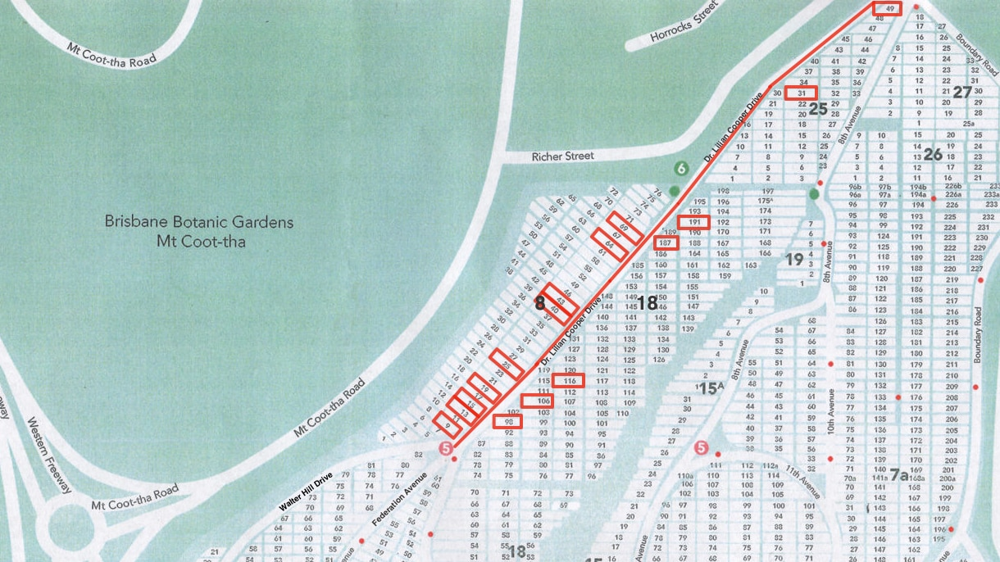
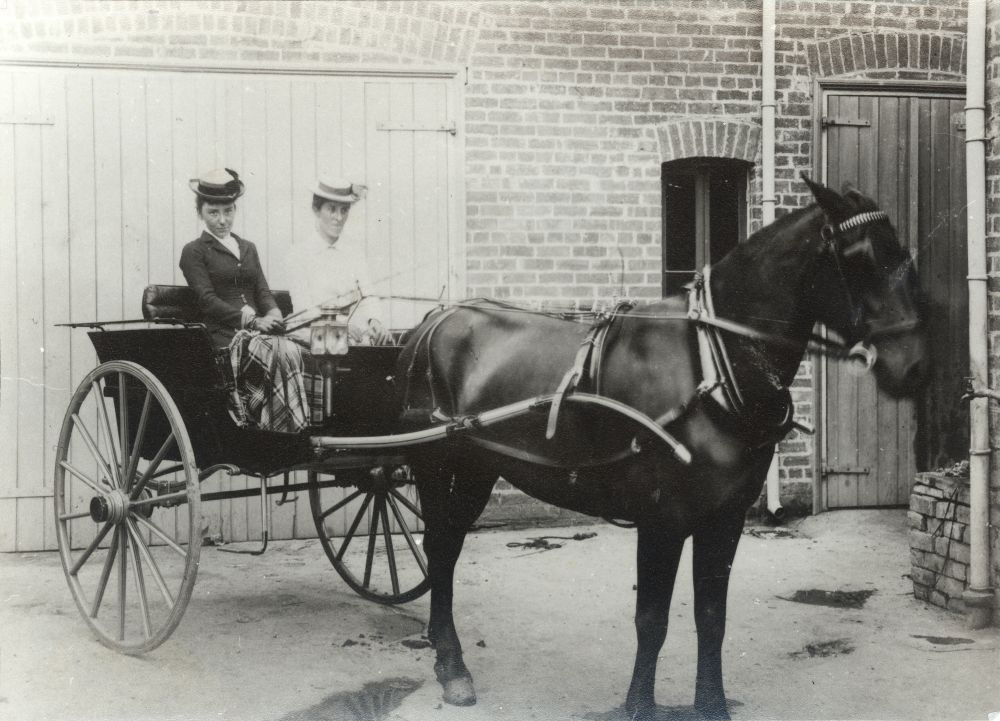

---
search:
  exclude: true
hide:
  - navigation
icon: fontawesome/solid/person-walking
---

# Lilian Cooper walk

This gently sloping walk shares some of the history and stories to be found along Dr. Lilian Cooper Drive.

--8<-- "snippets/conditions-of-entry.md"

## Map

<!-- insert photo of Shelter Shed -->

???+ directions "Directions" 

    - :fontawesome-solid-car:{ .deep-purple } If driving, park your car at the end of Federation Avenue. 
    - :fontawesome-solid-person-walking:{ .deep-purple } Begin the walk at Shelter Shed at the start of Federation Avenue. 
    - Opposite the Shelter Shed is the grave of Lachlan Chisholm Wilson.

--8<-- "snippets/lachlan-chisholm-wilson.md"

???+ directions "Directions" 

    - Return to the road and move along two rows.
    - Close to the edge of the road is the grave of George Henderson.

--8<-- "snippets/george-henderson.md"

???+ directions "Directions" 

    Moving further along the road and off to the right is the black granite monument of the McWhirter family.

--8<-- "snippets/james-mcwhirter.md"

???+ directions "Directions" 

    Immediately to the other side of the road is the monument of Charles Foggitt.

--8<-- "snippets/charles-foggitt.md"

???+ directions "Directions" 

    Almost immediately in line with this grave, but three rows further along, is the grave of George Harrap.

--8<-- "snippets/george-harrap.md"

???+ directions "Directions" 

    Moving back across the road and approximately four graves in, is the headstone of William Neil Gillies.
    
    { width="15%" } 

## William Neil Gillies <small>(18‑106‑20)</small> 

1868‑1928

[William Neil Gillies](https://adb.anu.edu.au/biography/gillies-william-neil-6388/text10917) spent his early years with his parents, sugar farming in New South Wales. After marrying his wife Margaret and the birth of their two children in the early 1900s, he moved to Queensland where he farmed sugar, timber and dairy. 

Later however, he began his move into political life as a member of the Labor party. Initially, as a member of the Tintenbar Shire Council, he was unsuccessful in vying for the state and federal seats of Richmond. Somewhat controversially however, he later won the new Queensland Legislative Assembly seat of Eacham created in 1912, after having been charged with falsely stating his period of residence on an electoral claim.  

Here began Gillies’ rapid rise within the party. He was elected to Cabinet on 25 April 1918 after the general election and then gained the important post of Secretary for Agriculture and Stock and later, minister for the portfolio. Then in February 1925 when E.G. Theodore resigned as premier, Gillies narrowly defeated William McCormack to begin a short and turbulent premiership involving clashes with and between the unions.  

Upon his resignation, Gillies accepted a position in the Industrial Court which was later replaced by the Board of Trade and Arbitration. Here, in a position much better suited to his role as an administrator, he was regarded as a fair Commissioner by employers until his sudden death on 9 February 1928 in Brisbane of hypertensive heart disease.

For those travelling between Cairns and Atherton, you may find yourself travelling the Gillies Highway, named after William Gillies, noted for its 263 corners and 800 metre elevation. 

{ width="30%" }  

*<small>[William Gillies, 1920](https://commons.wikimedia.org/wiki/File:William_Gillies_1920.jpg) - Queensland State Archives </small>*

???+ directions "Directions" 

    Heading back to the road and moving further along approximately four rows, turn left down the path to see the white and blue painted monuments of William Forgan Smith.
    
    { width="20%" }  

## William Forgan Smith <small>8‑25‑20/21</small> 

1887‑1953

[William Forgan Smith](https://adb.anu.edu.au/biography/smith-william-forgan-bill-8489/text14933) was born on 15 February 1887 and came from humble beginnings as the child of Mary Forgan and George Smith, the head gardener of a Scottish family at Airlie Castle Estate. He was a painting and decorating apprentice in Glasgow and helped paint the interior of the Municipal Chambers, where later he was granted the Freedom of the City.

In 1911, William moved to Mackay in Queensland under medical advice that a warmer climate would assist his chronic bronchial condition and where he met his wife Euphemia (Effie) Margaret Wilson. From this time, between 1913‑1942, until his resignation, he led a great career in Australian public life breaking all state parliamentary records at the time. He held office for a longer period than any other Labor Premier in Australia and was the only Queensland political leader to win the people's confidence at four successive elections, leading the Queensland Labor Party for 13 years. His record term at the head of the Queensland Government was one day short of 10 years and three months, from 17 June 1932 to 16 September 1942.  

After his time as Premier he took over the chairmanship of the Central Sugar Cane Prices Board, and later also chairmanship of the Sugar Board. Despite strained relations with the University of Queensland over funding and development, he was also granted an honorary Doctorate of Laws in 1935 and later appointed Chancellor in 1944, a position he retained until his death in 1953. The main arts building at the St Lucia campus is named in his honour. 

{ width="59%" }  { width="30.2%" }

*<small>[Construction of the Forgan Smith Building, University of Queensland , St Lucia, Brisbane, Queensland, 1940](http://onesearch.slq.qld.gov.au/permalink/f/1upgmng/slq_alma21218117600002061) - State Library of Queensland </small>*  
*<small>[William Forgan Smith](http://onesearch.slq.qld.gov.au/permalink/f/1upgmng/slq_alma21218884950002061) ca. 1935 - State Library of Queensland </small>*

???+ directions "Directions" 

    Returning to the road, move immediately across to the right and locate the row beginning with the grave of Economidis. Moving along this row see an older grave commemorating Sir Manuel Hornibrook and his son. Look carefully, from the side this monument reads MACDIARMID.

## Sir Manuel Richard Hornibrook <small>(18‑116‑18)</small> 

1893‑1970

[Sir Manuel Richard Hornibrook](https://adb.anu.edu.au/biography/hornibrook-sir-manuel-richard-10547/text18729) is perhaps best known in Brisbane for his association with bridge building. His first bridge of note was constructed for the Department of Main Roads across the Burrum River in 1925. This is recorded as the earliest, publicly‑funded, reinforced‑concrete bridge in Queensland. In an effort to create employment and provide support for families during the depression, the Hornibrook Highway was constructed during the 1930s and included what was [Australia's longest bridge](https://youtu.be/qqA41Fvj55k) at the time of its construction. The Hornibrook Group built more than 100 bridges, some of the better‑known including the William Jolly, Story and New Victoria bridges in Brisbane, the Northbridge and Iron Cove Bridge in Sydney, and the Kings Avenue and Commonwealth Avenue bridges in Canberra.  

Along with bridges, Manuel Hornibrook and his brothers, constructed drainage and sewerage works around Brisbane, Longreach, Roma and other towns in western Queensland. In fact, over a period of 40 years their companies built wool stores, wheat silos, wharves, sugar‑sheds, tank farms, water mains, factories and electricity power‑stations. Of course another highlight was the successful completion in the 1960s of the superstructure of the Sydney Opera House, including the sail‑like roof.

Personally, Manuel Hornibrook was known for his spirit, courage and determination and his genuine interest and concern for people, as evidenced by his work during the Great Depression. He was also president of the Hamilton Bowls club, a Rotarian and worked tirelessly for International House, at the University of Queensland. Married with three children, Hornibrook died on 30 May 1970 at the Holy Spirit Private Hospital, Wickham Terrace, Brisbane and was cremated.  

<iframe width="560" height="315" src="https://www.youtube.com/embed/sa20j2Tx6VQ" title="YouTube video player" frameborder="0" allow="accelerometer; autoplay; clipboard-write; encrypted-media; gyroscope; picture-in-picture" allowfullscreen></iframe>

<!-- 
https://www.slq.qld.gov.au/blog/sir-manuel-hornibrook-father-australian-building-industry
https://vimeo.com/176117452

-->

???+ directions "Directions" 

    Returning to the road and moving ahead approximately 20 meters, immediately to the left of the road are the graves of Alois Wilhelm Leitner and Robert William Black.

--8<-- "snippets/alois-wilhelm-leitner.md"

--8<-- "snippets/william-robert-black.md"

???+ directions "Directions" 

    Enter the Orthodox section of the cemetery, signified by the many Orthodox crosses. Almost at the end of this section, turn left down the row and walk down the hill under the trees to find the white headstone of Ataman Tolstoff.

--8<-- "snippets/vladimir-tolstoff.md"

???+ directions "Directions" 

    Coming back to the road and across to the opposite side, at the edge of the road is white walled monument of Christy Freeleagus.

--8<-- "snippets/christy-freeleagus.md"

???+ directions "Directions" 

    Immediately back across the road stands a monument consisting of a large cross draped in a number of strands of beads. These are regularly placed there by those who come to remember Dr Lilian Cooper.
    
    { width="15%" } 

--8<-- "snippets/lilian-cooper.md"

{ width="31%" }  { width="60.15%" } 

*<small>[Doctor Lilian Violet Cooper](http://onesearch.slq.qld.gov.au/permalink/f/1upgmng/slq_alma21218595360002061) - State Library of Queensland. </small>*  
*<small>[Two friends seated in a horsedrawn buggy, Brisbane, ca. 1900](http://onesearch.slq.qld.gov.au/permalink/f/1oppkg1/slq_alma21272255460002061). Miss Josephine Bedford (left) and Dr. Lilian Cooper - State Library of Queensland </small>* 

???+ directions "Directions" 

    Continuing further along the road, almost to the Richer Street entrance, immediately off the right is the white vaulted monument of Anthony Fatseas.

--8<-- "snippets/anthony-fatseas.md"

???+ directions "Directions" 

    From here continue along Dr Lilian Cooper Drive past the Richer Street entrance to where the trees are standing along the right side of the road. At the third tree locate the grave of Kramer.  Heading along this row and slightly down the hill, three graves in, to the left is the grave of Frederic Charles Urqhart.
    
    { width="15%" }

## Frederic Charles Urquhart <small>(25‑31‑8)</small>

<!-- 1858‑1935  -->

[Frederic Charles Urquhart](https://adb.anu.edu.au/biography/urquhart-frederic-charles-8901/text15637) was reputedly an accomplished horseman who, after moving from England, joined the Queensland Native Mounted Police Force on 27 April 1882 as a cadet and installed as sub‑inspector in charge of the Gulf, Cape York and Torres Strait districts. He later transferred in 1889 to the general police. During his service he was known for his involvement in the search for survivors from the ill‑fated Quetta in Torres Strait in 1890 and the bush verse he wrote, which included Camp Canzonettes (1891) and Blood Stains (1919).

Transferred to Brisbane in 1896, Urquhart was promoted to Inspector, Second Class, and in 1898 took charge of the Criminal Investigation Branch. Unfortunately, during this service Urquhart became known not for his work but for his 'impulsive and exacting temperament' and his 'vindictive and tyrannical nature', which was highlighted during a Royal Commission into policing in 1889. Despite such criticism Urquhart remained supported by the current Police Commissioner and other political friends, to be appointed Chief Inspector on 1 July 1905.  During this period of his service he rose to prominence in the police action during the 1912 general strike and despite some objections, was appointed Queensland's fourth Commissioner of Police on 1 January 1917, a position he held until 16 January 1921.  

After this time, Urquhart moved and was appointed administrator of the Northern Territory and sent to Darwin to manage the North Australian Industrial Union. Upon his retirement in 1926, Urquhart settled at Clayfield, Brisbane with his family, passing away at St Helen's Private Hospital on 2 December 1935.

{ width="45%" }

*<small>[Queensland Police Force Commissioner and two officers, c 1905](https://flic.kr/p/XKdjuz), Inspector 2/c Geraghty, Commissioner Cahill and Chief Inspector Urquhart at the Depot Ceremonial Arch; original photo believed to be taken ca. 1905 — Queensland State Archives*</small>

???+ directions "Directions" 

    Coming back to the road and heading all the way to the top of the hill, on the very corner of the intersection with Pat Hill Drive is the grave displaying a boxing ring, the grave of Patrick Francis Hill.

--8<-- "snippets/pat-hill.md"

{ width="90%" }

???+ directions "Directions" 

    :fontawesome-solid-person-walking-arrow-loop-left:{ .deep-purple } retrace your steps and return to the Federation Pavilion.

## Copyright and Attribution 

The walk is based on [Toowong Cemetery Tour Two](https://www.brisbane.qld.gov.au/community-and-safety/community-support/cemeteries/toowong-cemetery) © [Brisbane City Council](https://www.brisbane.qld.gov.au) 2016, used under the [Creative Commons Attribution 4.0 Licence](https://creativecommons.org/licenses/by/4.0/).  
