# Brisbane's Early Monumental Masons

There are many beautiful monuments and headstones in Toowong Cemetery. 
<!--
that reflect the skills of the stonemasons that carved them. Some stonemasons, preferred to call themselves ‘[Sculptors](https://trove.nla.gov.au/newspaper/article/39008541?searchTerm=Sculptor)’. 
-->

{ width="33%" } { width="33%" }
 { width="33%" }

These headstones were created by Brisbane's early Monumental Masons. In 1909, the [Stonemasons' Trade Board stated](https://trove.nla.gov.au/newspaper/article/19575621):

>'Monumental mason' shall mean a stonemason who is engaged in preparing or fixing all stone for cemetery purposes, or in preparing marble or cutting in inscriptions for cemetery or other work.

<!--
In 1909 the Stonemasons' Trade Board divided Masons into [Building, Monumental, and Porphyry masons](https://trove.nla.gov.au/newspaper/article/19575621), each with different minimum wages, working conditions, and apprenticeship rules. 
-->

<!--
It could be [expensive to bury a loved one in Toowong Cemetery](https://trove.nla.gov.au/newspaper/article/169490124?searchTerm=headstones):

- £1 for the plot
- 15 shillings to open the grave
- 

https://www.fosbc.com/history/cemetery##people/the-stonemasons/

https://trove.nla.gov.au/newspaper/article/3709356?searchTerm=headstones - first cemetery 1852

https://onesearch.slq.qld.gov.au/permalink/61SLQ_INST/dls06p/alma99183857293602061 - anzac day 

-->

Read the stories of Brisbane's early Monumental Masons who are remembered in Toowong Cemetery.

--8<-- "snippets/toowong-cemetery-map.md"

??? warning "Research"

    [Pugh's 1901 MONUMENTAL MASONS](https://nla.gov.au/nla.obj-3029986054/view?sectionId=nla.obj-3036927085&searchTerm=monumental+mason&partId=nla.obj-3030127117#page/n733/mode/1up):

    - ~~Batstone, Alfred. Boggo road~~
    - ~~Crawford and Co., corner Brunswick and Leichhardt streets~~  
    - Downes, F. M., Wickham street  
    - ~~Hawkins, Alfred, Lytton road, East Brisbane~~  
    - Lowther, J., Turbot street  
    - Petrie. Andrew, office, Darragh’s Buildings, Queen street; and at Toowong  
    - ~~Prout and Thumin, George street~~  
    - Simmonds, J., Ann street, near Creek st.  

    Extra Pugh's beyond 1901

    - M. Busby, Cemetery road, Toowong
    - Parsons & Payne, Makerston street, off Roma street <!-- William Edward Parsons & Henry Payne -->
    - J. H. Simmonds, Ann street, near Creek st.  

    Other early Brisbane Monumental Masons included:

    - George Caldwell - Milton
    - George Prentice 
    - John Petrie
    - John Heal

    *Meryll had:*

    - John Munro Paton (6-36-7/8) 
    - Frank Martin Downes (13‑4‑8)
    - Andrew Lang Petrie (13‑10‑7)
    - George Prentice (9‑41‑1)
    - William Edward Parsons (6‑3‑1)
    - William Henry Bowser (13‑2‑11)
    - Henry Payne (18‑102‑5)
    - John Lowther (12‑5‑3/4)
    - William Busby (4‑3‑22)
    - John Simmonds (4‑3‑27)
  
<!--
The marks of Brisbane's Monumental Masons can be found on headstones in Toowong Cemetery.

<figure markdown>
  { width=40% class="full-width" }
  <figcaption markdown>[insert Example carving]()</figcaption>
</figure>
-->

## John Munro Paton <small>(6-36-7/8)</small> 

ca. 1891 - 29 October 1974 

??? warning "Research"

    - Can't find anything on Trove - too recent
    - age 83

## Frank Martin Downes <small>(13‑4‑8)</small>

1848 - 26 August 1918

Frank Martin Downes was [born in 1848](https://www.familyhistory.bdm.qld.gov.au/details/8519478a9dd500f066995d5b3ed0b3e9840b9c3cc8040d7b631c767b9bf2f705) to Henry Downes and his wife Mary Ann, née Martin. He was a [Manager at John Petrie & Son](https://trove.nla.gov.au/newspaper/article/97526386?searchTerm=MONUMENTAL) monumental works until the firm went bankrupt in 1894. The [F.M. Downes](https://trove.nla.gov.au/newspaper/article/70863391?searchTerm=DOWNES) monumental works started business in April 1894 in Wickham and Gotha Streets, Fortitude Valley. 

Frank was the [Brisbane District, Provincial Grand Master](https://trove.nla.gov.au/newspaper/article/172140710?searchTerm=M.U.I.O.O.F.) of the Manchester Unity Independent Order of Odd Fellows in 1896, when the Friendly Society explored the formation of Female Lodges.

On 26 August 1918, Frank was severly injuried in an accident at his monumental works when a crane jib broke and struck him, crushing his right knee, fracturing his left leg, and injuring his right ribs. [Frank died in the General Hospital early that evening](https://trove.nla.gov.au/newspaper/article/174824552?searchTerm=monumental%20mason).

<figure markdown>
  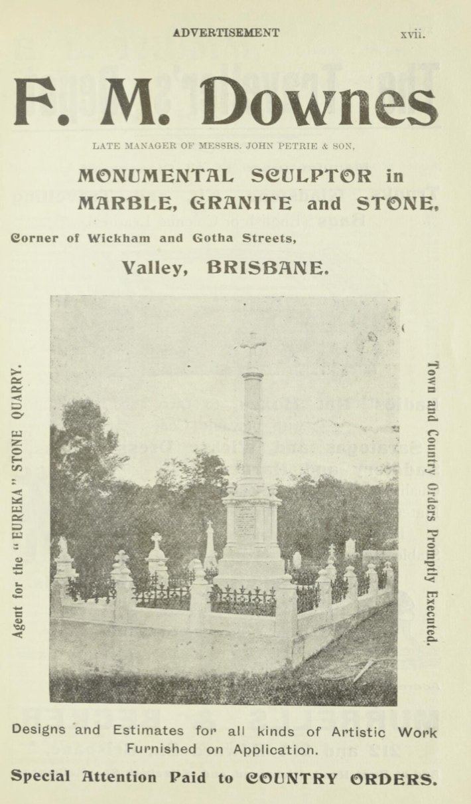{ width="40%" class="full-width" }
  <figcaption markdown>[F.M. Downes Advertisement in Pugh's Queensland almanac and directory, 1901](https://nla.gov.au/nla.obj-3029986054/view?sectionId=nla.obj-3036927085&searchTerm=monumental+mason&partId=nla.obj-3030027520#page/n22/mode/1up).</figcaption>
</figure>

??? warning "Research"

    - [126 Annie Street, New Farm](https://www.realestate.com.au/news/piece-of-brisbane-history-with-family-ties-to-channel-9-newsreader-melissa-downes-is-for-sale/) The rare piece of Brisbane’s history was built circa 1865 by a father and son team of stonemasons from Essex, England. Featured in [Homes with History on the New Farm Peninsula](https://newfarmhistorical.org.au/new-book-homes-with-history-on-the-new-farm-peninsula/)
    - Was Frank born overseas? 
    - Example works: 
        - tba

<!-- 
    - [Wyandotte eggs, Clayfield](https://trove.nla.gov.au/newspaper/article/175310957?searchTerm=%22F.%20M.%20DOWNES%22)
    - [WANTED strong, willing Youth. F. M. Downes, Monumental Works, Wickham street. 3 August 1899](https://trove.nla.gov.au/newspaper/article/175312839?searchTerm=%22F.%20M.%20DOWNES%22)
    - [Prov. Grand Master, Female Lodge](https://trove.nla.gov.au/newspaper/article/172140710?searchTerm=%22F.%20M.%20DOWNES%22) - 4 November 1896
    - [M.U.I.O.O.F. Installation of District Officers, Presentation of Jewel and Regalia of office to Bro. F. M. Downes](https://trove.nla.gov.au/newspaper/article/172149901?searchTerm=%22F.%20M.%20DOWNES%22) - 1 March 1897
    - [Ad, 15/9/1900](https://trove.nla.gov.au/newspaper/article/162120457?searchTerm=%22F.%20M.%20DOWNES%22)
    - [ad 1901 with photo. LATE MANAGER OF MESSRS. JOHN PETRIE & SON](https://nla.gov.au/nla.obj-3029986054/view?sectionId=nla.obj-3036927085&searchTerm=monumental+mason&partId=nla.obj-3030027520#page/n22/mode/1up)
-->

<!--
## John Petrie <small>(13‑5‑3)</small>

John was born on 15 January 1822 at Edinburgh, eldest son of Andrew Petrie (1798–1872) and his wife Mary, née Cuthbertson. John assumed responsibility for the management of Petrie & Son after his [father's blindness](https://gutenberg.net.au/ebooks20/2000451h.html#ch2-10) in 1848 forced him to retire. John became sole proprietor and changed the firm's name to John Petrie.

On 5 September 1850 Petrie married Jane Keith, daughter of Daniel McNaught of Dunbarton, Scotland. The family grew to five sons and five daughters. John Petrie topped the poll in Brisbane's first municipal election in 1859 and was mayor three times by 1862 and served as an Alderman until 1867. He was also an active member of the first Masonic lodge in Queensland. A staunch Presbyterian, he was an elder and worked on building St Paul's Church. John Petrie died on 8 December 1892.

<figure markdown>
  { width="30%" class="full-width" }
  <figcaption markdown>[Andrew and John Petrie](http://onesearch.slq.qld.gov.au/permalink/f/1upgmng/slq_alma21220096510002061) — State Library of Queensland.</figcaption>
</figure>

??? warning "Research"

    - https://www.fotc.au/research/john-petrie/
    - https://adb.anu.edu.au/biography/petrie-john-4394
    - [ad 1894](https://trove.nla.gov.au/newspaper/article/216440929?searchTerm=headstones)
    - [Union movement](https://research-repository.griffith.edu.au/bitstream/handle/10072/30437/59325_1.pdf?sequence=1)
    - https://www.petrie.com.au/family
    - https://www.petrie.com.au/history
    - Example works: 
        - Ann Hill second burial in TC 1871
-->

## Andrew Lang Petrie <small>(13‑10‑7)</small>

Named after his grandfather, Andrew Lang Petrie was the eldest son of John Petrie. He was born 25 June 1854 in his father’s house at Petrie Bight. He was one of the first students enrolled at the Brisbane Normal School. 

<figure markdown>
  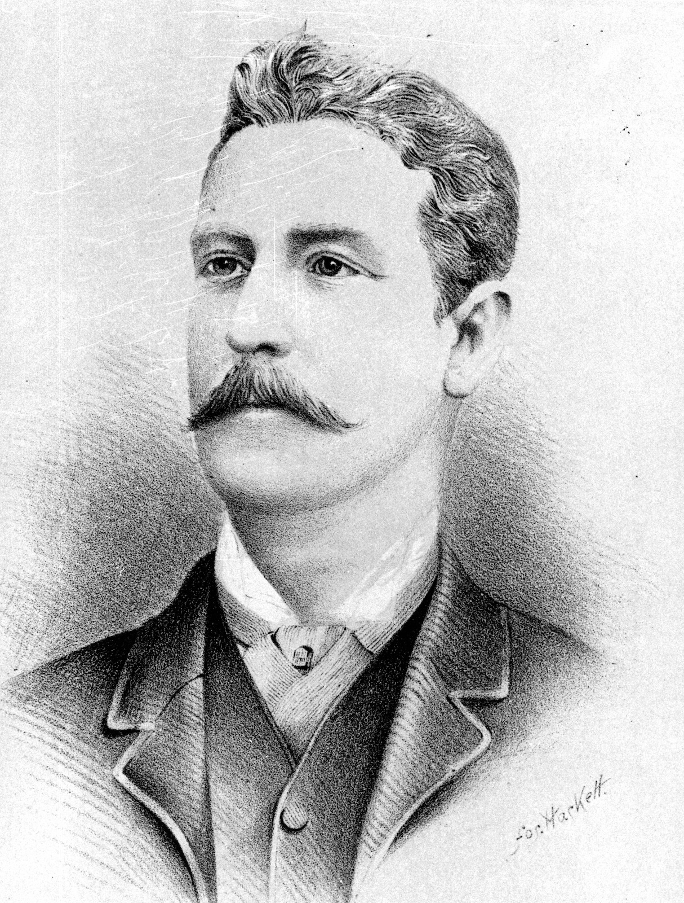{ width="30%" }
  <figcaption markdown>[Sketch of Andrew Lang Petrie](https://onesearch.slq.qld.gov.au/permalink/61SLQ_INST/dls06p/alma99184003784302061) — State Library of Queensland.</figcaption>
</figure>

<figure markdown>
  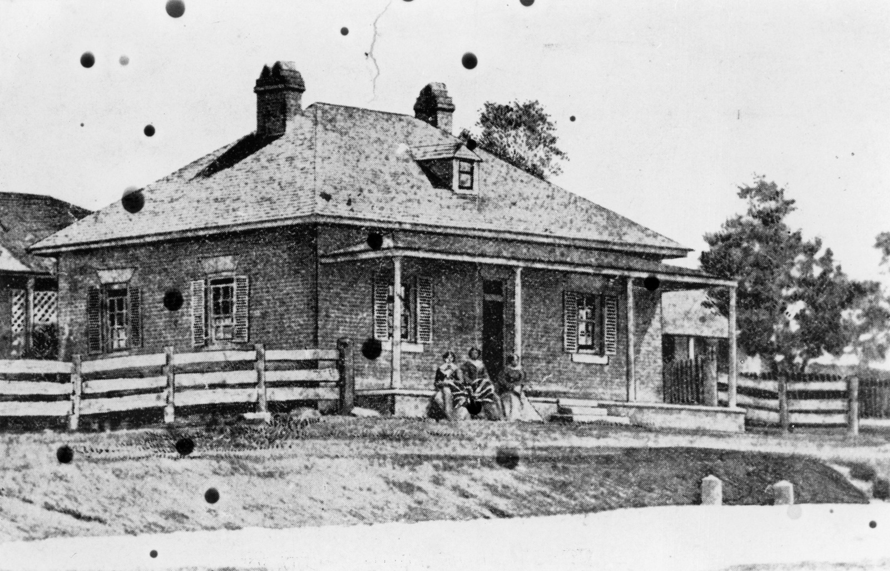{ width="70%" class="full-width" }
  <figcaption markdown>[Andrew Petrie's house at the corner of Queen and Wharf Streets, Brisbane, ca. 1859](https://onesearch.slq.qld.gov.au/permalink/61SLQ_INST/dls06p/alma99183512990302061) — State Library of Queensland. Andrew Petrie was the father of John Petrie and grandfather of Andrew Lang Petrie.</figcaption>
</figure>

In 1882 Andrew Lang Petrie became a partner in, and took over management of, his father’s reconstructed firm, John Petrie & Son. By then the business focused on cabinet making and joinery, brick and tile making and monumental masonry. 

<figure markdown>
  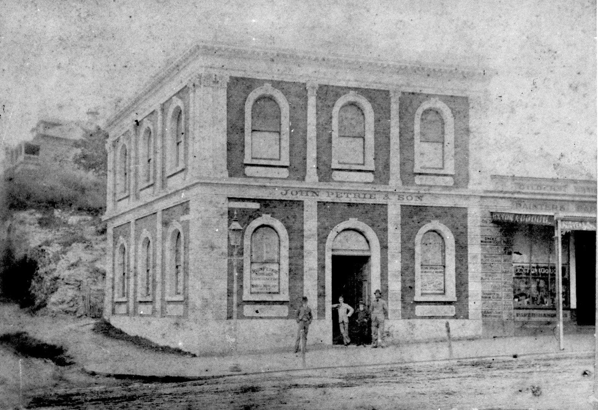{ width="70%" }
  <figcaption markdown>[Premises of John Petrie & Son, Brisbane, ca. 1882](https://onesearch.slq.qld.gov.au/permalink/61SLQ_INST/dls06p/alma99183506004802061) — State Library of Queensland.</figcaption>
</figure>

The firm went bankrupt in the depression of 1894 but was later revived as monumental masons only. The [Monumental Works](https://trove.nla.gov.au/newspaper/article/216440929?searchTerm=headstones) was located opposite the main Toowong Cemetery gates. Andrew was a member of the Brisbane General Cemetery Board.

<figure markdown>
  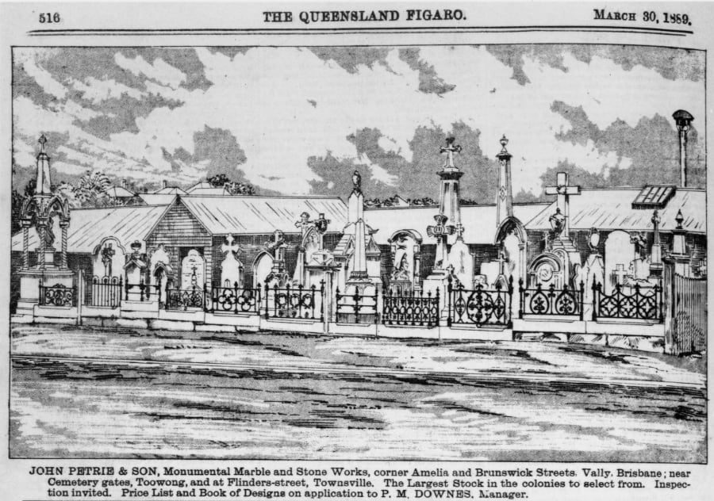{ width="72%" }
  <figcaption markdown>[Advertisement and etching for John Petrie & Sons, stonemasons in Brisbane, 1889](http://onesearch.slq.qld.gov.au/permalink/f/1upgmng/slq_digitool110812) — State Library of Queensland.</figcaption>
</figure>

He was elected a member of the Toombul Divisional Board and held the position for about five years until 1890 when the Hamilton Division split from Toombul. He went on to become the first chairman of the Hamilton board until the end of 1892. The following year he contested the Toombul seat in the Queensland Legislative Assembly and was elected with a large majority. He continued to represent this seat until his retirement in 1926. 

[Andrew Lang Petrie died on 1 April 1928](https://trove.nla.gov.au/newspaper/article/179319365?browse=ndp%3Abrowse%2Ftitle%2FT%2Ftitle%2F840%2F1928%2F04%2F02%2Fpage%2F19871822%2Farticle%2F179319365) after being ill for the previous 12 months. His residence, *[Mooloomburram](https://heritage.brisbane.qld.gov.au/heritage-places/157)* became part of St Margaret’s Anglican Girls’ School at Albion. 

<figure markdown>
  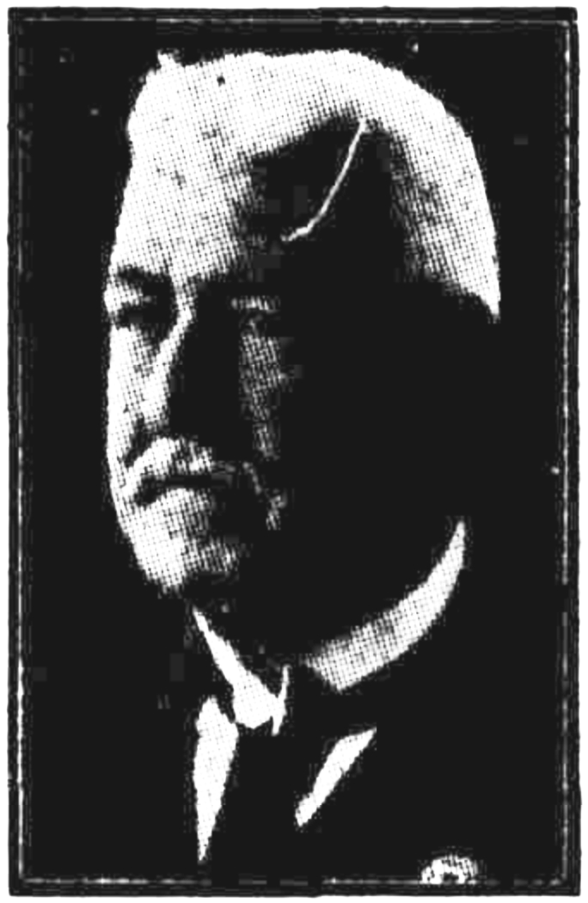{ width="30%" }
  <figcaption markdown>[Photograph of Andrew Lang Petrie](hhttps://trove.nla.gov.au/newspaper/article/179319365) in the Telegraph, 2 April 1928. Photo lightened.</figcaption>
</figure>

??? warning "Research"

    - https://www.fotc.au/research/andrew-lang-petrie/
    - https://trove.nla.gov.au/newspaper/article/179319365?searchTerm=monumental%20mason
    - https://trove.nla.gov.au/newspaper/article/21116002?searchTerm=monumental%20mason - Dr Rowe
    - https://www.flickr.com/photos/11000366@N02/6464581535
    - https://www.flickr.com/photos/11000366@N02/albums/72157604627922580
    - [From the OGA President - St Margaret's Anglican Girls School](https://www.google.com/url?sa=t&rct=j&q=&esrc=s&source=web&cd=&ved=2ahUKEwj4ru7OvKX8AhUD7zgGHYRwALMQFnoECEcQAQ&url=https%3A%2F%2Fwww.stmargarets.qld.edu.au%2FArticleDocuments%2F394%2FOGA%2520Newsletter_Issue_2_2014.pdf.aspx&usg=AOvVaw3Zy8TDuGgYSY__F4WmvR5N) - The name comes from the Maroochy Aboriginal dialect combining ‘mooloom’ (shady tree) with ‘burram’ (parrot).
    - Works:
        - Toowong Soldiers’ Memorial in Toowong Memorial Park.
        - [Trooper Cobb's Grave](https://apps.des.qld.gov.au/heritage-register/detail/?id=600333) 
        - [Carved R.R.Smellie's headstone](https://www.flickr.com/photos/11000366@N02/albums/72157604627922580)

    - [Advertisement for the manufacturer of stone memorials Andrew L. Petrie](https://onesearch.slq.qld.gov.au/permalink/61SLQ_INST/dls06p/alma99184003606302061), 1897.

## George Prentice <small>(9‑41‑1)</small>

In 1864, George Prentice & Son operated [a stone yard in Charlotte Street](https://trove.nla.gov.au/newspaper/article/1264492?searchTerm=prentice), Brisbane. They executed "every description of monumental work", and supplied "hearthstones, window sills, steps, coping, and paving". The business may have been impacted by the March 1864 flood.

<figure markdown>
  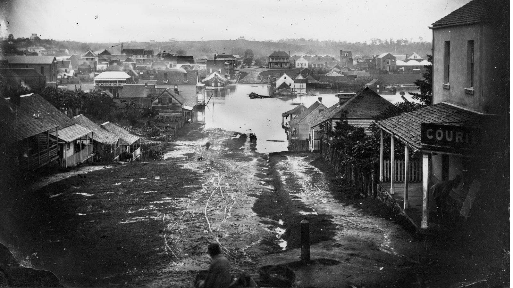{ width=70% class="full-width" }
  <figcaption markdown>[Charlotte Street, Brisbane, during the 1864 flood](https://onesearch.slq.qld.gov.au/permalink/61SLQ_INST/dls06p/alma99183513987102061). <!-- Looking north along Charlotte Street from the corner of George Street during the flood of 19-22 March 1864, Brisbane. This area was known then as 'Frog's Hollow'. --> — State Library of Queensland. Cropped</figcaption>
</figure>

In August 1867 the Monumental Stone Works was advertised as operating in "[Turbot-Street, between George and Roma streets](https://trove.nla.gov.au/newspaper/article/1286460?searchTerm=headstones)". Other advertisements described the location as, 
"[opposite Masonic Hall, Roma street](https://trove.nla.gov.au/newspaper/article/1305361?searchTerm=headstones)", and "[near Reservoir, Roma-street](https://trove.nla.gov.au/newspaper/article/1268319?searchTerm=headstones)".

<figure markdown>
  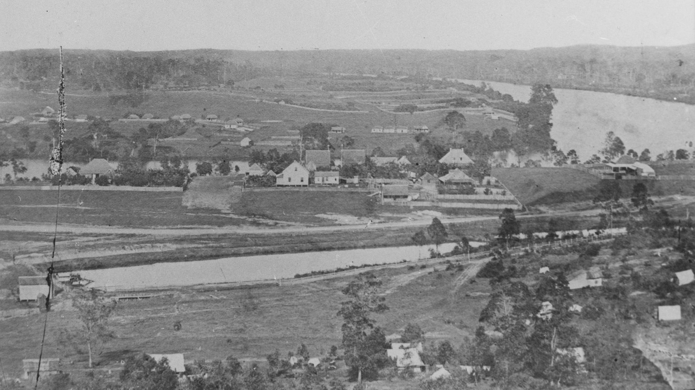{ width=70% class="full-width" }
  <figcaption markdown>[Roma Street Reservoir during the early settlement of Brisbane, ca. 1862](https://onesearch.slq.qld.gov.au/permalink/61SLQ_INST/dls06p/alma99183797696702061) — State Library of Queensland. The Reservoir was built in 1838 to store water for the colony and convicts, and later replaced by the Enoggera dam.</figcaption>
</figure>

In later life, George Prentice was an Alderman in the Sandgate Municipal Council. He lost his wife, Ellenor, on [1 September 1889](https://www.familyhistory.bdm.qld.gov.au/details/a34bdd96820cd34b81078add37450ccc48775f538919a62a613fe10838647c21) and [resigned from the council in December 1889](https://trove.nla.gov.au/newspaper/article/234908618?searchTerm=prentice) and [resolved to pay a visit to the "old country"](https://trove.nla.gov.au/newspaper/article/192521302?searchTerm=prentice). Despite his [son's apprehension](https://trove.nla.gov.au/newspaper/article/192521401), George Prentice and his grand-daugther, Jessie Blanche Prentice, departed on the on the *S.S. Quetta* for a trip to England. Both were lost in [the wreck *S.S. Quetta* in the Torres Strait](https://trove.nla.gov.au/newspaper/article/3512322) on 28 February 1890 when it struck an uncharted rock and sank claiming 134 lives, mostly women and children.

<figure markdown>
  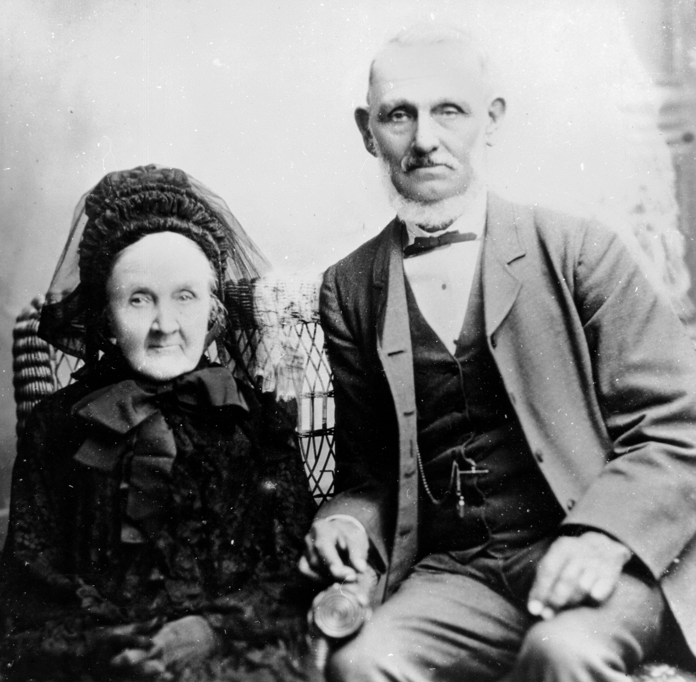{ width="40%" }
  <figcaption markdown>[George and Mrs. Prentice](https://onesearch.slq.qld.gov.au/permalink/61SLQ_INST/dls06p/alma99183513698202061) — State Library of Queensland.</figcaption>
</figure>

??? warning "Research"

    - [Masonic Hall image](https://www.google.com/url?sa=t&rct=j&q=&esrc=s&source=web&cd=&cad=rja&uact=8&ved=2ahUKEwjtrNCusqD8AhUV1zgGHX5FBqoQFnoECA8QAQ&url=https%3A%2F%2Fdigitalcollections.qut.edu.au%2Fview%2Fsub-collections%2F3727%2FRobert_Augustus_Henry_L%3D27Estrange_-_Copies_-_Brisbane.keywords.html&usg=AOvVaw2qlGflxoODto8xV2PAATTP)
    - [ad 1/4/1865](https://trove.nla.gov.au/newspaper/article/1270333?searchTerm=prentice)
    - [Ad, 1869](https://trove.nla.gov.au/newspaper/article/1308327?searchTerm=headstones)
    - [Ad, 1872](https://trove.nla.gov.au/newspaper/article/1290973?searchTerm=headstones)
    - [Ad, 1873. Est. 1864](https://trove.nla.gov.au/newspaper/article/1306060?searchTerm=headstones)
    - [Ad, 1876, image, Est. 1864](https://trove.nla.gov.au/newspaper/article/185000255?searchTerm=headstones)
    - [Ad, 1877](https://trove.nla.gov.au/newspaper/article/1365196?searchTerm=headstones)
    - Mr. Prentice was a long-standing supporter and [friend of the Hospital for Sick Children](https://trove.nla.gov.au/newspaper/article/192521513?searchTerm=prentice).
    - [eldest grand-daughter](https://trove.nla.gov.au/newspaper/article/183135149?searchTerm=Quetta%20prentice)
    - [Mayor of Sandgate Municipal Council](https://trove.nla.gov.au/newspaper/article/171593706?searchTerm=prentice)
    - [ALBERT CRICKET CLUB](https://trove.nla.gov.au/newspaper/article/884180?searchTerm=George%20prentice%20mayor%20sandgate)
    - [Quetta account](https://trove.nla.gov.au/newspaper/article/52332544/5063949)
    - [Quetta survivor account](https://trove.nla.gov.au/newspaper/article/52329953?searchTerm=prentice)
    - [Notice](https://trove.nla.gov.au/newspaper/article/3507979?searchTerm=prentice)
    - Headstone crafted by George Prentice & Son include: 
        - tba 

## William Edward Parsons <small>(6‑3‑1)</small>

William Edward Parsons was born in Staffordshire ca. 1860. He learnt stone masonry at Bristol before arriving in Brisbane in 1884. He worked as a journeyman stone mason before commencing [his own business in Makerston street, off Roma street](https://nla.gov.au/nla.obj-3065199767/view?partId=nla.obj-3065306795#page/n685/mode/1up).

<figure markdown>
  { width="30%" }
  <figcaption markdown>Insert image of W.E. Parsons' mark. Carving and Plaque on Sarah Jane Webster (4-19-2/3)</figcaption>
</figure>

William was an Alderman for the Town of Windsor from 1905-1914, and [Mayor in 1912](https://trove.nla.gov.au/newspaper/article/175081469?searchTerm=mayor%20Windsor%20PARSONS).

After a long period of ill health, [William died in hospital on 1 April 1919](https://trove.nla.gov.au/newspaper/article/192735376?searchTerm=parsons). He left behind his wife, Ellen, and two sons, Ernest and Charlie. [Ellen died in November 1923](https://trove.nla.gov.au/newspaper/article/20678107?searchTerm=Ellen%20Parsons) and is buried with her husband.

??? warning "Research"

    - Parsons & Payne, Makerston street, off Roma street <!-- William Edward Parsons & Henry Payne -->
    - https://trove.nla.gov.au/newspaper/article/192735376?searchTerm=parsons%20Rechabite - Upper Roma Street
    - https://trove.nla.gov.au/newspaper/article/175052108?searchTerm=parsons%20monumental%20mason
    - https://trove.nla.gov.au/newspaper/article/174357824?searchTerm=parsons%20monumental%20mason - William Edward Parsons 1905
    - O'Connelltown = Windsor - https://adb.anu.edu.au/biography/wight-george-4850
    - ald 1905 - https://trove.nla.gov.au/newspaper/article/19423377?searchTerm=alderman%20Windsor%20PARSONS, https://trove.nla.gov.au/newspaper/article/19307494?searchTerm=alderman%20Windsor%20PARSONS
    - alderman 1906 with W.h. Bowser https://trove.nla.gov.au/newspaper/article/19453246?searchTerm=alderman%20Windsor%20PARSONS
    - ald 1907 - https://trove.nla.gov.au/newspaper/article/178246971?searchTerm=alderman%20Windsor%20PARSONS
    - ald 1908 - https://trove.nla.gov.au/newspaper/article/19537045?searchTerm=alderman%20Windsor%20PARSONS
    - ald 1909 - https://trove.nla.gov.au/newspaper/article/19571638?searchTerm=mayor%20Windsor%20PARSONS
    - moyor 1912 - https://trove.nla.gov.au/newspaper/article/175081469?searchTerm=mayor%20Windsor%20PARSONS
    - sons, Ernest and Charlie. - https://trove.nla.gov.au/newspaper/article/20535131?searchTerm=William%20Edward%20Parsons%20Ellen
    - [Windsor Town Council chambers](https://apps.des.qld.gov.au/heritage-register/detail/?id=600349) - [Newspaper payment](https://trove.nla.gov.au/newspaper/article/3637019) 

<!--
## William John Parsons <small>(1‑63‑17)</small>

No relation!

d ca. 19-10-1936 age 87

!!! warning "Research"

    - [helped Richard Ramo make the Temple of Peace](https://trove.nla.gov.au/newspaper/article/22873160?searchTerm=parsons%20monumental%20mason) - 8 Dec 1924
    - [Protest against increased charges](https://trove.nla.gov.au/newspaper/article/19641409?searchTerm=parsons%20monumental%20mason) - 23 June 1910 - Which W. Parsons?
    - [Heritiage listed house at 68 Sixth Avenue, Windsor, constructed circa 1888 for stonemason William Parsons](https://heritage.brisbane.qld.gov.au/heritage-places/1815)
    - William Roy Parsons d ~12-07-1932 age 31 Years
-->

## William Henry Bowser <small>(13‑2‑11)</small>

22-04-1954 age 93

Bowser & Co Ltd - Quarries not Monumental Masons

??? warning "Research"

    - https://trove.nla.gov.au/newspaper/article/171569096 - Ad, Daily Mercury Mackay, 1 Feb 1906  
    - https://trove.nla.gov.au/newspaper/article/180045354?searchTerm=Bowser%20%20MONUMENTAL%20MASONS - Sandgate Cenotaph. W.H. Bowser owned a quarry at Samford.
    - https://trove.nla.gov.au/newspaper/article/20675472?searchTerm=Bowser%20%20MONUMENTAL%20MASONS - W.H's brother buried in Toowong ~7 Nov 1924
    - https://trove.nla.gov.au/newspaper/article/50569828?searchTerm=William%20Henry%20bowser - dies, 3 quarries mayor
    - https://trove.nla.gov.au/newspaper/article/217146865?searchTerm=William%20Henry%20bowser - family notice
    - https://trove.nla.gov.au/newspaper/article/217212679?searchTerm=William%20Henry%20bowser - WILLIAM HENRY BOWSER late of "Cardiff" Main Road North Tamborine in the State of Queensland Retired Quarry Master deceased who died at 66 Legeyt Street, Windsor Brisbane in the said State on the twenty second day of April 1954
    - https://trove.nla.gov.au/newspaper/article/206147467 - photo 1928
    - https://trove.nla.gov.au/newspaper/article/97675541?searchTerm=w.h.%20Bowser%20%20quarry - photo 1930

<!--
## Henry Payne <small>(18‑102‑5)</small>

d. ca. 20-01-1944 age 84 ➜ b. ca. 1860

Parsons & Payne, Makerston street, off Roma street - [Pugh's Queensland almanac and directory, 1905](https://nla.gov.au/nla.obj-3065199767/view?partId=nla.obj-3065306795#page/n685/mode/1up).

Mark "[H. Payne North Quay](https://www.fosbc.com/history/cemetery-people/the-stonemasons/)"

-->

## John Lowther <small>(12‑5‑3/4)</small>

John Lowther ran the firm of "Lowther & Sons" on Ann Street, Brisbane. John and his wife lived at Free street, Kelvin Grove, and had five children, Phillip, Ernest, Charles, Arthur and Lottie. John Lowther died 4 April 1918 aged 66.

<figure markdown>
  { width="30%" }
  <figcaption markdown>Insert image of Lowther & Sons' carving on Sydney Samuel Levy (3-2-7)</figcaption>
</figure>

The business continued after John's death, with his eldest son, Phillip J. Lowther, operating the firm "[Phillip Lowther and Son](https://trove.nla.gov.au/newspaper/article/39008541?searchTerm=monumental)" Monumental and Building Masons at 108 Lutwyche Road. Notable works include:

- the [Sandgate Cenotaph](https://trove.nla.gov.au/newspaper/article/180045354?searchTerm=Bowser%20%20MONUMENTAL%20MASONS)
- [Cross of Sacrifice at Lutwyche Cemetery](https://onesearch.slq.qld.gov.au/permalink/61SLQ_INST/dls06p/alma99184003729202061)
- [Australian-American Memorial](https://www.qldwarmemorials.com.au/memorial?id=1405) at Newstead Park, Newstead

<figure markdown>
  { width="30%" }
  <figcaption markdown>Insert image of P.J. Lowther & Sons' mark on James Hetch Bulter (11-40-8)</figcaption>
</figure>

  
Phillip's son, [Leslie John Lowther](https://trove.nla.gov.au/newspaper/article/50225005), was the managing director of P. J. Lowther and Son, Pty., Ltd., masonry contractors, Bowen Bridge Road. Leslie is buried in Toowong Cemetery (8‑71‑26/27).

<figure markdown>
  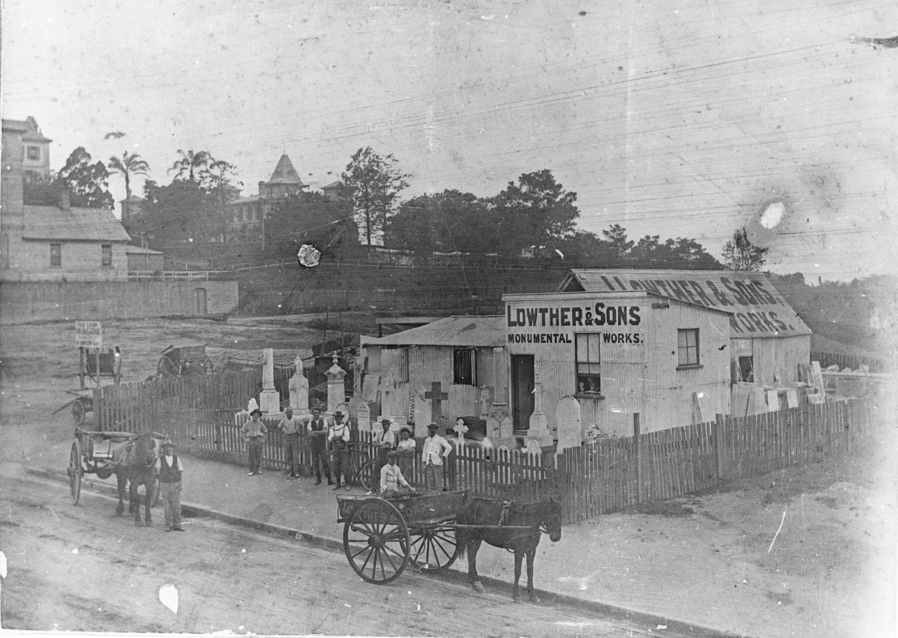{ width="70%" class="full-width" }
  <figcaption markdown>[Firm of Lowther & Sons on Ann Street, ca. 1907](https://onesearch.slq.qld.gov.au/permalink/61SLQ_INST/dls06p/alma99183513705502061). The business of Lowther and Sons, monumental headstones was situated on Ann Street, between Boundary Street and Antrim Street - State Library of Queensland. Cropped.</figcaption>
</figure>

<!--
??? warning "Research"

    - [Daughter Nellie died September 1914](https://trove.nla.gov.au/newspaper/article/176396437?searchTerm=%22John%20Lowther%22). Funeral left from their home in Free street, Kelvin Grove.
    - [Charles](https://trove.nla.gov.au/newspaper/article/22211615?searchTerm=%22John%20Lowther%22)
    -  https://trove.nla.gov.au/newspaper/article/20357396?searchTerm=%22John%20Lowther%22 
    -  [buried in Toowong Cemetery](https://trove.nla.gov.au/newspaper/article/176070446?searchTerm=%22John%20Lowther%22)
-->

## William Busby <small>(4‑3‑22)</small>

William and his wife Annie departed Plymouth aboard the *Mhari Bhan* on 29 August 1882 and arrived in Brisbane 29 November 1882. William worked as an Inspector of Works until he [controversially lost his job for using obscene language](https://trove.nla.gov.au/newspaper/article/3521969?searchTerm=INSPECTOR%20Busby). 

William established himself as a stonemason and had a workshop and home in Sylvan Road, Toowong. Notable works include:

- the heritage-listed Caskey Monument. [William won the competition](https://trove.nla.gov.au/newspaper/article/19130745) to design a memorial to the late Lieutenant Caskey and it is the first known South African War memorial in Queensland. 
- a memorial to [Mr. Percy Lionel Benjamin](https://trove.nla.gov.au/newspaper/article/19244847) erected by the
directors of Messrs. Hoffnung and Co. At the time the marble obelisk was said to be the largest piece of marble cut in Queensland.
- a memorial to [Stephen Alonzo Spragg](https://trove.nla.gov.au/newspaper/article/19278904), a member of Australia's first full International Rugby Union team.
  
William was a member of the Manchester Unity Independent Order of Odd Fellows and continued working until [his death in 1928](https://trove.nla.gov.au/newspaper/article/179318668?searchTerm=Busby).

{ width="33%" } { width="33%" } { width="33%" }

*<small>From left to right: Caskey Monument (4-?-?), Percy Lionel Benjamin Memorial (3-12-7/8), Stephen Alonzo Spragg Memorial (5-15-26)</small>*  

<!-- 
<figure markdown>
  { class="full-width" }
  <figcaption markdown>[Caskey Monument](!!!)</figcaption>
</figure>

<figure markdown>
  { class="full-width" }
  <figcaption markdown>[Percy Lionel Benjamin Memorial](!!!)</figcaption>
</figure>

<figure markdown>
  { class="full-width" }
  <figcaption markdown>[Stephen Alonzo Spragg Memorial](!!!)</figcaption>
</figure>
-->

??? warning "Research"
    - [Tombstone Tuesday: William Busby, stonemason of Toowong](http://www.dragongenealogy.com/blog/2011/11/tombstone-tuesday-william-busby-stonemason-of-toowong/)

<!--
    - [Memorial to the late Lieutenant Caskey](https://trove.nla.gov.au/newspaper/article/19130745) - The Brisbane Courier, 6 December 1901. William Busby won the design competition to design a memorial to the late Lieutenant Caskey
    - https://trove.nla.gov.au/newspaper/article/21240123?searchTerm=busby - M.U.I.O.O.F. Brother
-->

## John Simmonds <small>(4‑3‑27)</small>

ca. 1829 - 23-01-1889

John Simmonds operated a monumental masory business Brisbane. He created a fountain that was placed in the lawns immediately in front of the Queensland Houses of Parliament. In [*The Queenslander*, 9 December 1882](https://trove.nla.gov.au/newspaper/article/19788278?searchTerm=Simmonds%20monumental%20mason) an article about the Brisbane Botanic Gardens, reported:

>A very pleasing and attractive addition has been made recently in the shape of a fountain, chaste and neat in its design rather than elaborate, but which, in the opinion of many, will not detract in the least from its usefulness or general effect. This addition is placed conspicuously on one of the lawns immediately in front of the Houses of Parliament, and when connected with the Enoggera main, and put into play, will have a very pleasing and salutary effect. This work of art — for such it may be termed — is the production of Mr. J. Simmonds, monumental mason and sculptor, of Adelaide street.

<figure markdown>
  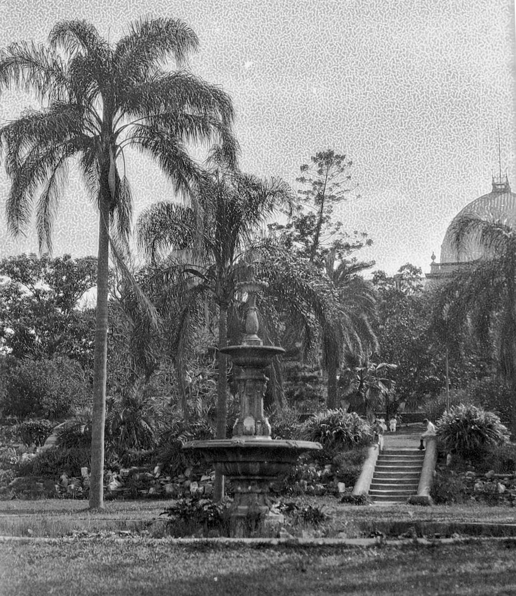{ width=40% class="full-width" }
  <figcaption markdown>[Fountain and stairs in the Botanic Gardens with Parliament House in the background, Brisbane, 1920](https://onesearch.slq.qld.gov.au/permalink/61SLQ_INST/dls06p/alma99184033059802061). ==Confirm this is the Simmonds fountain.==  — State Library of Queensland. Cropped and rotated.</figcaption>
</figure>

In 1888, John created [a marble drinking fountain for Women's Christian Temperance Union](https://trove.nla.gov.au/newspaper/article/176707482) that was erected on the corner of Ann and Edward streets just outside the Temperance Hall.

<!--
<figure markdown>
  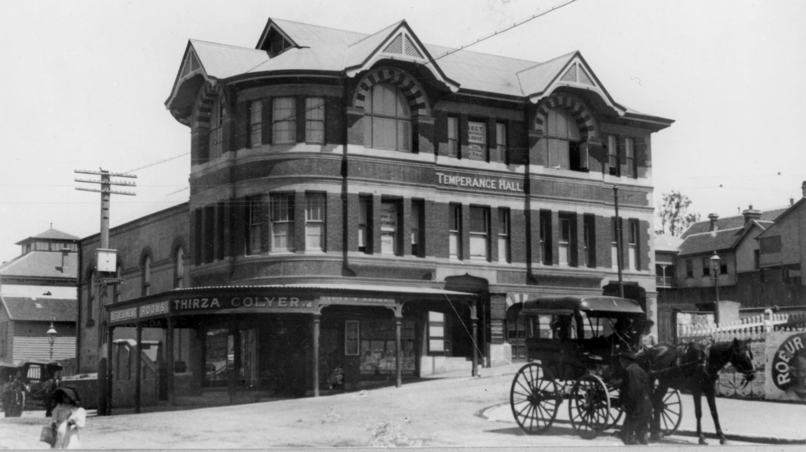{ width=70% class="full-width" }
  <figcaption markdown>[Temperance Hall and the Colyer Refreshment Rooms on the corner of Ann Street and Edward Streets](https://onesearch.slq.qld.gov.au/permalink/61SLQ_INST/dls06p/alma99183505877102061) ca. 1912. The Temperance Hall in Brisbane was built in 1900. — State Library of Queensland.</figcaption>
</figure>

<figure markdown>
  { width=70% class="full-width" }
  <figcaption markdown>[View of Brisbane city's central business district, ca. 1895](https://onesearch.slq.qld.gov.au/permalink/61SLQ_INST/dls06p/alma99183787998202061) — State Library of Queensland.</figcaption>
</figure>
-->

John Simmonds took on his son, John Howard Simmonds (1862-1955), <!-- born in Calton Vic. --> as an apprentice stonemason in 1880. He ran the business after his [Father's death in 1889](https://www.familyhistory.bdm.qld.gov.au/details/b26ee2454ca983d88a44de85d949647c8e514f213f0884dc188c50bb4bdc7c2c) until he retired in 1920. 

<figure markdown>
  { width="30%" }
  <figcaption markdown>Insert image of  John Simmonds' carving on Arthur Lowe (11‑15‑16/17)</figcaption>
</figure>

J.H. Simmonds made a point of photographing the tombstones he worked on and introduced photography to his wife, [Rose Simmonds](https://adb.anu.edu.au/biography/simmonds-rose-11691/text20893), who studied art with Godfrey Rivers at the Brisbane Technical College. [A collection of Rose Simmonds' work](https://blog.qagoma.qld.gov.au/rose-simmonds-a-nostalgia-for-queenslands-pastoral-past/) is held by the Queensland Art Gallery. [J.H. Simmonds was also a Naturalist](https://www.eoas.info/biogs/P006858b.htm) who collected fossils and botanical specimens that are now held in the Queensland Museum and Queensland Herbarium.

<figure markdown>
  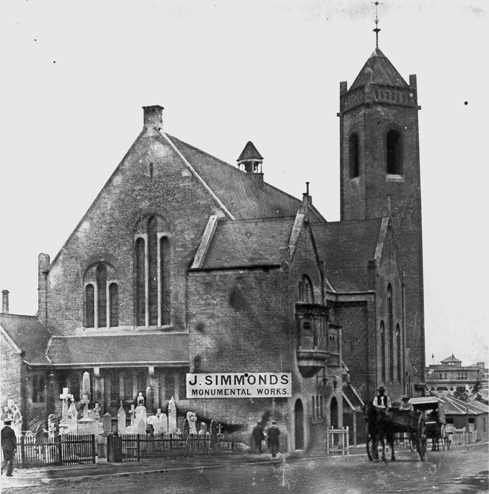{ width="70%' class="full-width" }
  <figcaption markdown>[St Andrew's Presbyterian Church on Ann Street, Brisbane, with stonemason next door, ca. 1915](https://onesearch.slq.qld.gov.au/permalink/61SLQ_INST/tqqf2h/alma99183505905002061) - State Library of Queensland. In March 1896 [John Simmonds moved his business to Ann-street](https://trove.nla.gov.au/newspaper/article/20446535?searchTerm=Simmonds%20monumental%20mason), near Creek-Street and the Central Station.</figcaption>
</figure>

??? warning "Research"

    - https://trove.nla.gov.au/newspaper/article/70862389?searchTerm=headstones - Ad 26 Nov 1892 - Roma Street
    - https://trove.nla.gov.au/newspaper/article/20767681 - DISPLAY AD 19 December 1896 - ANN-STREET, near Creek-street
    - John Howard Simmonds 15 July 1862 - 11 June 1955
        - A [Naturalist and Stonemason](https://www.eoas.info/biogs/P006858b.htm)
        - Son of J. Simmonds (Dad was 33 when born)
        - 1880 Apprenticed to J. Simmonds, Stonemason
        - 1889 - 1920 - Owner, J. Simmonds, Stonemason =(took over after father's death)
        - https://trove.nla.gov.au/newspaper/article/202661707?searchTerm=Simmonds%20monumental%20mason - John Howard Simmonds robbery and illustration - 26 April 1914
        - https://trove.nla.gov.au/newspaper/article/19404247?searchTerm=Simmonds%20monumental%20mason - Ad Nov 1907
    - [Simmonds, Rose (1877-1960)](https://trove.nla.gov.au/people/1464177) (née Culpin). She married John Howard Simmonds on 30 March 1900 and they had two sons. John Simmonds was a stonemason who made a point of photographing the tombstones he worked on.
        - https://adb.anu.edu.au/biography/simmonds-rose-11691/text20893
        - Rose studied art with Godfrey Rivers at the Brisbane Technical College.
        - Simmonds died on 3 July 1960 at Auchenflower and was cremated with Presbyterian forms. 
        - [A collection of her photographs](https://blog.qagoma.qld.gov.au/rose-simmonds-a-nostalgia-for-queenslands-pastoral-past/) is held by the Queensland Art Gallery. https://www.qagoma.qld.gov.au/search/?s=Simmonds%2C+Rose&facet=collection
        - [Rose Simmonds, Queensland photographer](https://onesearch.slq.qld.gov.au/permalink/61SLQ_INST/dls06p/alma99183513388802061)

<!--
## John Heal <small>(13‑40‑9)</small>

!!! warning "Research"

    - https://www.fotc.au/research/john-daniel-heal/
    - https://trove.nla.gov.au/newspaper/article/70865093?searchTerm=John%20Heal

-->

<!--
## George Caldwell <small>(n/a)</small>

George Caldwell was a [stone cutter and sculptor operating near Catholic Cemetery](https://trove.nla.gov.au/newspaper/article/3164385?searchTerm=caldwell) in Milton in 1863.

<figure markdown>
  { class="full-width" }
  <figcaption markdown>[View of the Brisbane suburb of Milton, ca. 1870](http://onesearch.slq.qld.gov.au/permalink/f/1upgmng/slq_alma21219311070002061). Photograph taken in the vicinity of Caxton Street, Petrie Terrace, looking due west across the intersection of Judge and Hale Streets and across the Milton Cemetery. The mortuary chapel visible in the centre of the photograph was converted to a church in 1873, and was demolished when Christ Church (Milton) was constructed in 1874-76 — State Library of Queensland. Cropped.</figcaption>
</figure>

!!! warning "Research"

    John Clarke	Caldwell (13‑48‑22)	[moved from Paddington](https://www.fotc.au/headstones/moved-paddington-headstones/).

-->

<!--
## Batstone & Smith

==Batstone & Smith established as a business in 1885 (tbc)==

William Batstone and P. Smith [ended their partnership](https://trove.nla.gov.au/newspaper/article/174764465?searchTerm=Batstone%20monumental) as Stone and Marble Workers on December 3, 1887.

The business continued to operate as "W. Batstone and Son" in the same premises in Boggo road, South Brisbane.

==Henry Batstone was William's son (tbc)==. Henry's occupation was listed as "Mason" in the [SUPPLEMENTARY ANNUAL ELECTORAL LIST, 6 October 1900](https://trove.nla.gov.au/newspaper/article/175288017?searchTerm=Batstone). He was 21 at that time and living at "Monumental works, Boggo road, twelfth house on left from Clarence corner".

==means born 1879==

Henry Edward Batstone died aged 70 and was buried in Toowong Cemetery on 29 July 1960. ==visit grave 29-16-14 for dates==

==means born 1890. Not the same Henry? Many more Henrys!!! 3 buried in Toowong==

Henry, son of Henry of Shorte Street Paddington, [died April 1910](https://trove.nla.gov.au/newspaper/article/188180077) and was buried in Toowong Cemetery.

Henry, of Swann Road Taringa, [died 1945](https://trove.nla.gov.au/newspaper/article/48949585?searchTerm=%22Henry%20Batstone%22) and was buried in Toowong Cemetery.

[Henry Edward died May 1944](https://trove.nla.gov.au/newspaper/article/48949522?searchTerm=%22Henry%20Batstone%22)

https://trove.nla.gov.au/newspaper/article/176946410?searchTerm=Batstone%20monumental - worker wanted

https://trove.nla.gov.au/newspaper/article/234907975?searchTerm=%22Batstone%22 - 1889 Ad

## William Batstone <small>(n/a)</small>

https://www.batstonesmemorials.com.au/history

>One of Brisbane's oldest memorial stands in Mowbray Park Brisbane and was built by William Alfred Batstone. 
>Our family have been making monuments in Queensland since 1885 when William Batstone opened his stonemasonry workshop in Woolloongabba, Brisbane.

## Alfred Batstone <small>(n/a)</small>

http://www.batstones.com.au/BATSTONES_STONE_MASONRY/MONUMENTAL.html
-->

<!--
## James Gordon <small>(8‑88‑3)</small>

James Gordon [died on 9 July 1904](https://trove.nla.gov.au/newspaper/article/19290130?searchTerm=%22James%20Gordon%22), age 82

https://trove.nla.gov.au/newspaper/article/22263085?searchTerm=%22James%20Gordon%22%20mason - returned from Sydney

No evidence of being a mason
-->

<!--
## Clarence Grundy Pilling  <small>(n/a)</small>

https://trove.nla.gov.au/newspaper/article/183476576?searchTerm=C.%20Pilling - daughter engagement
https://trove.nla.gov.au/newspaper/article/183456229?searchTerm=C.%20G.%20Pilling - wedding

Mark: "[C. G. Pilling Late Mansbridge](https://www.fosbc.com/history/cemetery-people/the-stonemasons/)"

## Frank Mansbridge <small>(n/a)</small>

-->

<!--
## William E. Prout <small>(n/a)</small>

!!! warning "Research"

    - https://trove.nla.gov.au/newspaper/article/172392656?searchTerm=Prout - alive 1897
    - LATE Prout and Thumm
    - 9-11-17?

-->

<!--
## Edward Logan Thumm

!!! warning "Research"

    - https://trove.nla.gov.au/newspaper/article/20143091?searchTerm=parsons%20monumental%20mason
    - https://nla.gov.au/nla.obj-3029986054/view?sectionId=nla.obj-3036927085&searchTerm=monumental+mason&partId=nla.obj-3030027786#page/n24/mode/1up

-->

<!--
## Frank E. Ives <small>(n/a)</small>

## L. Young <small>(tba)</small

## H.G. Jones <small>(tba)</small
-->

<!--
## Timothy Wrafter <small>(n/a)</small>

The name T. Wrafter, dates back to the late 1800’s when Timothy Wrafter, a stonemason from Ireland, set up a monumental business in Nudgee.  As time progressed and the firm grew, he encouraged his nephew, Timothy, also a stonemason from Ireland, to emigrate to Australia and work in his business.

Timothy eventually procured the business from his uncle and as work increased and his two sons Denis and Joseph grew older, they were apprenticed as stonemasons, hence the beginning of the firm, T. Wrafter & Sons.

!!! warning "Research"

    - https://trove.nla.gov.au/newspaper/article/182626313?searchTerm=Wrafter - Hurling Club 1887
    - https://trove.nla.gov.au/newspaper/article/3432002?searchTerm=Wrafter - partition
    - https://trove.nla.gov.au/newspaper/article/179926171?searchTerm=Timothy%20Wrafter%20monumental
    - https://twstone.com.au/brisbane-monumental-stonemasons/
    - https://twstone.com.au/stonemason-brisbane-northside-about/ - Nudgee

-->

<!-- 
## Chambers and Clutten (Melbourne)
## Peter Sturrock (Woonona, NSW)
## Hind (London)
## G. Maile & Son (London)
## Frank Williams (Ipswich)
## Ernest Greenway (Ipswich)
## E. Fortescue (Ipswich)
## Rudolph Ziegler (Toowoomba)
-->