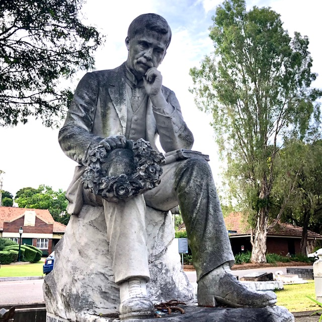
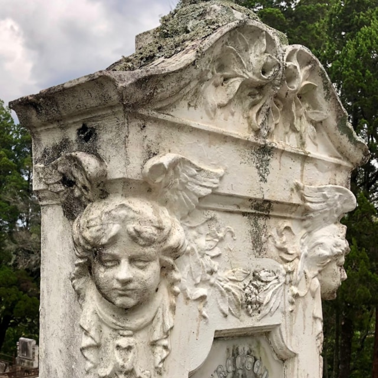
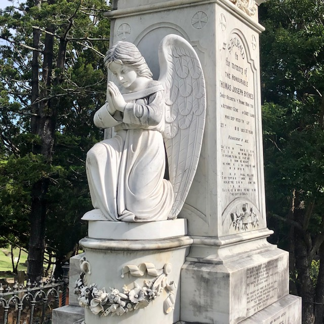
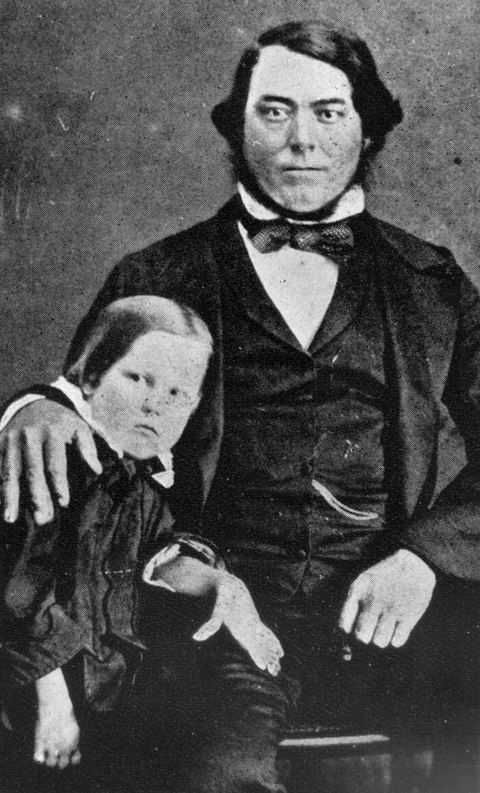

--8<-- "snippets/sem/stories/monumental-masons.json"

# Brisbane's Early Monumental Masons

Brisbane's early Monumental Masons sculpted many beautiful monuments and headstones in Toowong Cemetery.

<!--
{ width="32.33%" } { width="32.33%" } { width="32.33%" { width="32.33%" }} 
-->

{ width="32.33%" } { width="32.33%" } { width="32.33%" } 

In 1909, the [Stonemasons' Trade Board stated](https://trove.nla.gov.au/newspaper/article/19575621):

>'Monumental mason' shall mean a stonemason who is engaged in preparing or fixing all stone for cemetery purposes, or in preparing marble or cutting in inscriptions for cemetery or other work.

<!--
It could be [expensive to bury a loved one in Toowong Cemetery](https://trove.nla.gov.au/newspaper/article/169490124?searchTerm=headstones):

- £1 for the plot
- 15 shillings to open the grave
- 

https://www.fosbc.com/history/cemetery##people/the-stonemasons/

https://trove.nla.gov.au/newspaper/article/3709356?searchTerm=headstones - first cemetery 1852

https://onesearch.slq.qld.gov.au/permalink/61SLQ_INST/dls06p/alma99183857293602061 - anzac day 

-->

Read the stories of Brisbane's early Monumental Masons who are remembered in Toowong Cemetery.

--8<-- "snippets/toowong-cemetery-map.md"

<!--
??? warning "Research"

    [Pugh's 1901 MONUMENTAL MASONS](https://nla.gov.au/nla.obj-3029986054/view?sectionId=nla.obj-3036927085&searchTerm=monumental+mason&partId=nla.obj-3030127117#page/n733/mode/1up):

    - ~~Batstone, Alfred. Boggo road~~
    - ~~Crawford and Co., corner Brunswick and Leichhardt streets~~  
    - Downes, F. M., Wickham street  
    - ~~Hawkins, Alfred, Lytton road, East Brisbane~~  
    - Lowther, J., Turbot street  
    - Petrie. Andrew, office, Darragh’s Buildings, Queen street; and at Toowong  
    - ~~Prout and Thumin, George street~~  
    - Simmonds, J., Ann street, near Creek st.  

    Extra Pugh's beyond 1901

    - M. Busby, Cemetery road, Toowong
    - Parsons & Payne, Makerston street, off Roma street (William Edward Parsons & Henry Payne)
    - J. H. Simmonds, Ann street, near Creek st.  

    Other early Brisbane Monumental Masons included:

    - George Caldwell - Milton
    - George Prentice 
    - John Petrie
    - John Heal

    *Meryll had:*

    - John Munro Paton (6-36-7/8) 
    - Frank Martin Downes (13‑4‑8)
    - Andrew Lang Petrie (13‑10‑7)
    - George Prentice (9‑41‑1)
    - William Edward Parsons (6‑3‑1)
    - William Henry Bowser (13‑2‑11)
    - Henry Payne (18‑102‑5)
    - John Lowther (12‑5‑3/4)
    - William Busby (4‑3‑22)
    - John Simmonds (4‑3‑27)
-->

<!--
The marks of Brisbane's Monumental Masons can be found on headstones in Toowong Cemetery.

<figure markdown>
  { width=40% class="full-width" }
  <figcaption markdown>[insert Example carving]()</figcaption>
</figure>
-->

<!--
## John Munro Paton <small>(6-36-7/8)</small> 

ca. 1891 - 29 October 1974 

??? warning "Research"

    - Can't find anything on Trove - too recent
    - age 83
-->

--8<-- "snippets/frank-martin-downes.md"

<!--
## John Petrie <small>(13‑5‑3)</small>

John was born on 15 January 1822 at Edinburgh, eldest son of Andrew Petrie (1798–1872) and his wife Mary, née Cuthbertson. John assumed responsibility for the management of Petrie & Son after his [father's blindness](https://gutenberg.net.au/ebooks20/2000451h.html#ch2-10) in 1848 forced him to retire. John became sole proprietor and changed the firm's name to John Petrie.

On 5 September 1850 Petrie married Jane Keith, daughter of Daniel McNaught of Dunbarton, Scotland. The family grew to five sons and five daughters. John Petrie topped the poll in Brisbane's first municipal election in 1859 and was mayor three times by 1862 and served as an Alderman until 1867. He was also an active member of the first Masonic lodge in Queensland. A staunch Presbyterian, he was an elder and worked on building St Paul's Church. John Petrie died on 8 December 1892.

<figure markdown>
  { width="30%" class="full-width" }
  <figcaption markdown>[Andrew and John Petrie](http://onesearch.slq.qld.gov.au/permalink/f/1upgmng/slq_alma21220096510002061) — State Library of Queensland.</figcaption>
</figure>

??? warning "Research"

    - https://www.fotc.au/research/john-petrie/
    - https://adb.anu.edu.au/biography/petrie-john-4394
    - [ad 1894](https://trove.nla.gov.au/newspaper/article/216440929?searchTerm=headstones)
    - [Union movement](https://research-repository.griffith.edu.au/bitstream/handle/10072/30437/59325_1.pdf?sequence=1)
    - https://www.petrie.com.au/family
    - https://www.petrie.com.au/history
    - Example works: 
        - Ann Hill second burial in TC 1871
-->

## Andrew Lang Petrie <small>(13‑10‑7)</small>

Named after his grandfather, Andrew Lang Petrie was the eldest son of John Petrie. He was born 25 June 1854 in his father’s house at Petrie Bight. He was one of the first students enrolled at the Brisbane Normal School. 

<figure markdown>
  { width="30%" }
  <figcaption markdown>[Sketch of Andrew Lang Petrie](https://onesearch.slq.qld.gov.au/permalink/61SLQ_INST/dls06p/alma99184003784302061) — State Library of Queensland.</figcaption>
</figure>

<figure markdown>
  { width="70%" class="full-width" }
  <figcaption markdown>[Andrew Petrie's house at the corner of Queen and Wharf Streets, Brisbane, ca. 1859](https://onesearch.slq.qld.gov.au/permalink/61SLQ_INST/dls06p/alma99183512990302061) — State Library of Queensland. Andrew Petrie was the father of John Petrie and grandfather of Andrew Lang Petrie.</figcaption>
</figure>

In 1882 Andrew Lang Petrie became a partner in, and took over management of, his father’s reconstructed firm, John Petrie & Son. By then the business focused on cabinet making and joinery, brick and tile making and monumental masonry. 

<figure markdown>
  { width="70%"  class="full-width" }
  <figcaption markdown>[Premises of John Petrie & Son, Brisbane, ca. 1882](https://onesearch.slq.qld.gov.au/permalink/61SLQ_INST/dls06p/alma99183506004802061) — State Library of Queensland.</figcaption>
</figure>

The firm went bankrupt in the depression of 1894 but was later revived as monumental masons only. The [Monumental Works](https://trove.nla.gov.au/newspaper/article/216440929?searchTerm=headstones) was located opposite the main Toowong Cemetery gates. Andrew was a member of the Brisbane General Cemetery Board.

<figure markdown>
  { width="72%"  class="full-width" }
  <figcaption markdown>[Advertisement and etching for John Petrie & Sons, stonemasons in Brisbane, 1889](http://onesearch.slq.qld.gov.au/permalink/f/1upgmng/slq_digitool110812) — State Library of Queensland.</figcaption>
</figure>

He was elected a member of the Toombul Divisional Board and held the position for about five years until 1890 when the Hamilton Division split from Toombul. He went on to become the first chairman of the Hamilton board until the end of 1892. The following year he contested the Toombul seat in the Queensland Legislative Assembly and was elected with a large majority. He continued to represent this seat until his retirement in 1926. 

[Andrew Lang Petrie died on 1 April 1928](https://trove.nla.gov.au/newspaper/article/179319365?browse=ndp%3Abrowse%2Ftitle%2FT%2Ftitle%2F840%2F1928%2F04%2F02%2Fpage%2F19871822%2Farticle%2F179319365) after being ill for the previous 12 months. His residence, *[Mooloomburram](https://heritage.brisbane.qld.gov.au/heritage-places/157)* became part of St Margaret’s Anglican Girls’ School at Albion. 

<figure markdown>
  { width="30%" }
  <figcaption markdown>[Photograph of Andrew Lang Petrie](hhttps://trove.nla.gov.au/newspaper/article/179319365) in the Telegraph, 2 April 1928. Photo lightened.</figcaption>
</figure>

<!--
??? warning "Research"

    - https://www.fotc.au/research/andrew-lang-petrie/
    - https://trove.nla.gov.au/newspaper/article/179319365?searchTerm=monumental%20mason
    - https://trove.nla.gov.au/newspaper/article/21116002?searchTerm=monumental%20mason - Dr Rowe
    - https://www.flickr.com/photos/11000366@N02/6464581535
    - https://www.flickr.com/photos/11000366@N02/albums/72157604627922580
    - [From the OGA President - St Margaret's Anglican Girls School](https://www.google.com/url?sa=t&rct=j&q=&esrc=s&source=web&cd=&ved=2ahUKEwj4ru7OvKX8AhUD7zgGHYRwALMQFnoECEcQAQ&url=https%3A%2F%2Fwww.stmargarets.qld.edu.au%2FArticleDocuments%2F394%2FOGA%2520Newsletter_Issue_2_2014.pdf.aspx&usg=AOvVaw3Zy8TDuGgYSY__F4WmvR5N) - The name comes from the Maroochy Aboriginal dialect combining ‘mooloom’ (shady tree) with ‘burram’ (parrot).
    - Works:
        - Toowong Soldiers’ Memorial in Toowong Memorial Park.
        - [Trooper Cobb's Grave](https://apps.des.qld.gov.au/heritage-register/detail/?id=600333) 
        - [Carved R.R.Smellie's headstone](https://www.flickr.com/photos/11000366@N02/albums/72157604627922580)

    - [Advertisement for the manufacturer of stone memorials Andrew L. Petrie](https://onesearch.slq.qld.gov.au/permalink/61SLQ_INST/dls06p/alma99184003606302061), 1897.
-->

## George Prentice <small>(9‑41‑1)</small>

In 1864, George Prentice & Son operated [a stone yard in Charlotte Street](https://trove.nla.gov.au/newspaper/article/1264492?searchTerm=prentice), Brisbane. They executed "every description of monumental work", and supplied "hearthstones, window sills, steps, coping, and paving". The business may have been impacted by the March 1864 flood.

<figure markdown>
  { width=70% class="full-width" }
  <figcaption markdown>[Charlotte Street, Brisbane, during the 1864 flood](https://onesearch.slq.qld.gov.au/permalink/61SLQ_INST/dls06p/alma99183513987102061). <!-- Looking north along Charlotte Street from the corner of George Street during the flood of 19-22 March 1864, Brisbane. This area was known then as 'Frog's Hollow'. --> — State Library of Queensland. Cropped</figcaption>
</figure>

In August 1867 the Monumental Stone Works was advertised as operating in "[Turbot-Street, between George and Roma streets](https://trove.nla.gov.au/newspaper/article/1286460?searchTerm=headstones)". Other advertisements described the location as, 
"[opposite Masonic Hall, Roma street](https://trove.nla.gov.au/newspaper/article/1305361?searchTerm=headstones)", and "[near Reservoir, Roma-street](https://trove.nla.gov.au/newspaper/article/1268319?searchTerm=headstones)".

<figure markdown>
  { width=70% class="full-width" }
  <figcaption markdown>[Roma Street Reservoir during the early settlement of Brisbane, ca. 1862](https://onesearch.slq.qld.gov.au/permalink/61SLQ_INST/dls06p/alma99183797696702061) — State Library of Queensland. The Reservoir was built in 1838 to store water for the colony and convicts, and later replaced by the Enoggera dam.</figcaption>
</figure>

In later life, George Prentice was an Alderman in the Sandgate Municipal Council. He lost his wife, Ellenor, on [1 September 1889](https://www.familyhistory.bdm.qld.gov.au/details/a34bdd96820cd34b81078add37450ccc48775f538919a62a613fe10838647c21) and [resigned from the council in December 1889](https://trove.nla.gov.au/newspaper/article/234908618?searchTerm=prentice) and [resolved to pay a visit to the "old country"](https://trove.nla.gov.au/newspaper/article/192521302?searchTerm=prentice). Despite his [son's apprehension](https://trove.nla.gov.au/newspaper/article/192521401), George Prentice and his grand-daugther, Jessie Blanche Prentice, departed on the on the *S.S. Quetta* for a trip to England. Both were lost in [the wreck *S.S. Quetta* in the Torres Strait](https://trove.nla.gov.au/newspaper/article/3512322) on 28 February 1890 when it struck an uncharted rock and sank claiming 134 lives, mostly women and children.

<figure markdown>
  { width="40%" }
  <figcaption markdown>[George and Mrs. Prentice](https://onesearch.slq.qld.gov.au/permalink/61SLQ_INST/dls06p/alma99183513698202061) — State Library of Queensland.</figcaption>
</figure>

<!--
??? warning "Research"

    - [Masonic Hall image](https://www.google.com/url?sa=t&rct=j&q=&esrc=s&source=web&cd=&cad=rja&uact=8&ved=2ahUKEwjtrNCusqD8AhUV1zgGHX5FBqoQFnoECA8QAQ&url=https%3A%2F%2Fdigitalcollections.qut.edu.au%2Fview%2Fsub-collections%2F3727%2FRobert_Augustus_Henry_L%3D27Estrange_-_Copies_-_Brisbane.keywords.html&usg=AOvVaw2qlGflxoODto8xV2PAATTP)
    - [ad 1/4/1865](https://trove.nla.gov.au/newspaper/article/1270333?searchTerm=prentice)
    - [Ad, 1869](https://trove.nla.gov.au/newspaper/article/1308327?searchTerm=headstones)
    - [Ad, 1872](https://trove.nla.gov.au/newspaper/article/1290973?searchTerm=headstones)
    - [Ad, 1873. Est. 1864](https://trove.nla.gov.au/newspaper/article/1306060?searchTerm=headstones)
    - [Ad, 1876, image, Est. 1864](https://trove.nla.gov.au/newspaper/article/185000255?searchTerm=headstones)
    - [Ad, 1877](https://trove.nla.gov.au/newspaper/article/1365196?searchTerm=headstones)
    - Mr. Prentice was a long-standing supporter and [friend of the Hospital for Sick Children](https://trove.nla.gov.au/newspaper/article/192521513?searchTerm=prentice).
    - [eldest grand-daughter](https://trove.nla.gov.au/newspaper/article/183135149?searchTerm=Quetta%20prentice)
    - [Mayor of Sandgate Municipal Council](https://trove.nla.gov.au/newspaper/article/171593706?searchTerm=prentice)
    - [ALBERT CRICKET CLUB](https://trove.nla.gov.au/newspaper/article/884180?searchTerm=George%20prentice%20mayor%20sandgate)
    - [Quetta account](https://trove.nla.gov.au/newspaper/article/52332544/5063949)
    - [Quetta survivor account](https://trove.nla.gov.au/newspaper/article/52329953?searchTerm=prentice)
    - [Notice](https://trove.nla.gov.au/newspaper/article/3507979?searchTerm=prentice)
    - Headstone crafted by George Prentice & Son include: 
        - tba 
-->

--8<-- "snippets/william-edward-parsons.md"

<!--
## William Henry Bowser <small>(13‑2‑11)</small> 

22-04-1954 age 93

Bowser & Co Ltd - Quarries not Monumental Masons

### George Montague Bowser <small>(9‑5‑26)</small>

??? warning "Research"

    - https://trove.nla.gov.au/newspaper/article/171569096 - Ad, Daily Mercury Mackay, 1 Feb 1906  
    - https://trove.nla.gov.au/newspaper/article/180045354?searchTerm=Bowser%20%20MONUMENTAL%20MASONS - Sandgate Cenotaph. W.H. Bowser owned a quarry at Samford.
    - https://trove.nla.gov.au/newspaper/article/20675472?searchTerm=Bowser%20%20MONUMENTAL%20MASONS - W.H's brother buried in Toowong ~7 Nov 1924
    - https://trove.nla.gov.au/newspaper/article/50569828?searchTerm=William%20Henry%20bowser - dies, 3 quarries mayor
    - https://trove.nla.gov.au/newspaper/article/217146865?searchTerm=William%20Henry%20bowser - family notice
    - https://trove.nla.gov.au/newspaper/article/217212679?searchTerm=William%20Henry%20bowser - WILLIAM HENRY BOWSER late of "Cardiff" Main Road North Tamborine in the State of Queensland Retired Quarry Master deceased who died at 66 Legeyt Street, Windsor Brisbane in the said State on the twenty second day of April 1954
    - https://trove.nla.gov.au/newspaper/article/206147467 - photo 1928
    - https://trove.nla.gov.au/newspaper/article/97675541?searchTerm=w.h.%20Bowser%20%20quarry - photo 1930
    - https://www.flickr.com/photos/basalamant/50310203258

-->

--8<-- "snippets/henry-payne.md"

--8<-- "snippets/john-lowther.md"

--8<-- "snippets/william-busby-2.md"

<!--
{ width="32.33%" } { width="32.33%" } { width="32.33%" }

*<small>From left to right: Caskey Monument (4-17-18), Percy Lionel Benjamin Memorial (3-12-7/8), Stephen Alonzo Spragg Memorial (5-15-26)</small>*  
-->

--8<-- "snippets/john-simmonds.md"

<!--
## John Heal <small>(13‑40‑9)</small>

!!! warning "Research"

    - https://www.fotc.au/research/john-daniel-heal/
    - https://trove.nla.gov.au/newspaper/article/70865093?searchTerm=John%20Heal

-->

<!--
## George Caldwell <small>(n/a)</small>

George Caldwell was a [stone cutter and sculptor operating near Catholic Cemetery](https://trove.nla.gov.au/newspaper/article/3164385?searchTerm=caldwell) in Milton in 1863.

<figure markdown>
  { class="full-width" }
  <figcaption markdown>[View of the Brisbane suburb of Milton, ca. 1870](http://onesearch.slq.qld.gov.au/permalink/f/1upgmng/slq_alma21219311070002061). Photograph taken in the vicinity of Caxton Street, Petrie Terrace, looking due west across the intersection of Judge and Hale Streets and across the Milton Cemetery. The mortuary chapel visible in the centre of the photograph was converted to a church in 1873, and was demolished when Christ Church (Milton) was constructed in 1874-76 — State Library of Queensland. Cropped.</figcaption>
</figure>

!!! warning "Research"

    John Clarke	Caldwell (13‑48‑22)	[moved from Paddington](https://www.fotc.au/headstones/moved-paddington-headstones/).

-->

<!--
## Batstone & Smith

==Batstone & Smith established as a business in 1885 (tbc)==

William Batstone and P. Smith [ended their partnership](https://trove.nla.gov.au/newspaper/article/174764465?searchTerm=Batstone%20monumental) as Stone and Marble Workers on December 3, 1887.

The business continued to operate as "W. Batstone and Son" in the same premises in Boggo road, South Brisbane.

==Henry Batstone was William's son (tbc)==. Henry's occupation was listed as "Mason" in the [SUPPLEMENTARY ANNUAL ELECTORAL LIST, 6 October 1900](https://trove.nla.gov.au/newspaper/article/175288017?searchTerm=Batstone). He was 21 at that time and living at "Monumental works, Boggo road, twelfth house on left from Clarence corner".

==means born 1879==

Henry Edward Batstone died aged 70 and was buried in Toowong Cemetery on 29 July 1960. ==visit grave 29-16-14 for dates==

==means born 1890. Not the same Henry? Many more Henrys!!! 3 buried in Toowong==

Henry, son of Henry of Shorte Street Paddington, [died April 1910](https://trove.nla.gov.au/newspaper/article/188180077) and was buried in Toowong Cemetery.

Henry, of Swann Road Taringa, [died 1945](https://trove.nla.gov.au/newspaper/article/48949585?searchTerm=%22Henry%20Batstone%22) and was buried in Toowong Cemetery.

[Henry Edward died May 1944](https://trove.nla.gov.au/newspaper/article/48949522?searchTerm=%22Henry%20Batstone%22)

https://trove.nla.gov.au/newspaper/article/176946410?searchTerm=Batstone%20monumental - worker wanted

https://trove.nla.gov.au/newspaper/article/234907975?searchTerm=%22Batstone%22 - 1889 Ad

## William Batstone <small>(n/a)</small>

https://www.batstonesmemorials.com.au/history

>One of Brisbane's oldest memorial stands in Mowbray Park Brisbane and was built by William Alfred Batstone. 
>Our family have been making monuments in Queensland since 1885 when William Batstone opened his stonemasonry workshop in Woolloongabba, Brisbane.

## Alfred Batstone <small>(n/a)</small>

http://www.batstones.com.au/BATSTONES_STONE_MASONRY/MONUMENTAL.html
-->

<!--
## James Gordon <small>(8‑88‑3)</small>

James Gordon [died on 9 July 1904](https://trove.nla.gov.au/newspaper/article/19290130?searchTerm=%22James%20Gordon%22), age 82

https://trove.nla.gov.au/newspaper/article/22263085?searchTerm=%22James%20Gordon%22%20mason - returned from Sydney

No evidence of being a mason
-->

<!--
## Clarence Grundy Pilling  <small>(n/a)</small>

https://trove.nla.gov.au/newspaper/article/183476576?searchTerm=C.%20Pilling - daughter engagement
https://trove.nla.gov.au/newspaper/article/183456229?searchTerm=C.%20G.%20Pilling - wedding

Mark: "[C. G. Pilling Late Mansbridge](https://www.fosbc.com/history/cemetery-people/the-stonemasons/)"

## Frank Mansbridge <small>(n/a)</small>

-->

<!--
## William E. Prout <small>(n/a)</small>

!!! warning "Research"

    - https://trove.nla.gov.au/newspaper/article/172392656?searchTerm=Prout - alive 1897
    - LATE Prout and Thumm
    - 9-11-17?

-->

<!--
## Edward Logan Thumm

!!! warning "Research"

    - https://trove.nla.gov.au/newspaper/article/20143091?searchTerm=parsons%20monumental%20mason
    - https://nla.gov.au/nla.obj-3029986054/view?sectionId=nla.obj-3036927085&searchTerm=monumental+mason&partId=nla.obj-3030027786#page/n24/mode/1up

-->

<!--
## Timothy Wrafter <small>(n/a)</small>

The name T. Wrafter, dates back to the late 1800’s when Timothy Wrafter, a stonemason from Ireland, set up a monumental business in Nudgee.  As time progressed and the firm grew, he encouraged his nephew, Timothy, also a stonemason from Ireland, to emigrate to Australia and work in his business.

Timothy eventually procured the business from his uncle and as work increased and his two sons Denis and Joseph grew older, they were apprenticed as stonemasons, hence the beginning of the firm, T. Wrafter & Sons.

!!! warning "Research"

    - https://trove.nla.gov.au/newspaper/article/182626313?searchTerm=Wrafter - Hurling Club 1887
    - https://trove.nla.gov.au/newspaper/article/3432002?searchTerm=Wrafter - partition
    - https://trove.nla.gov.au/newspaper/article/179926171?searchTerm=Timothy%20Wrafter%20monumental
    - https://twstone.com.au/brisbane-monumental-stonemasons/
    - https://twstone.com.au/stonemason-brisbane-northside-about/ - Nudgee

-->

<!-- 
## Chambers and Clutten (Melbourne)
## Peter Sturrock (Woonona, NSW)
## Hind (London)
## G. Maile & Son (London)
## Frank Williams (Ipswich)
## Ernest Greenway (Ipswich)
## E. Fortescue (Ipswich)
## Rudolph Ziegler (Toowoomba)
-->