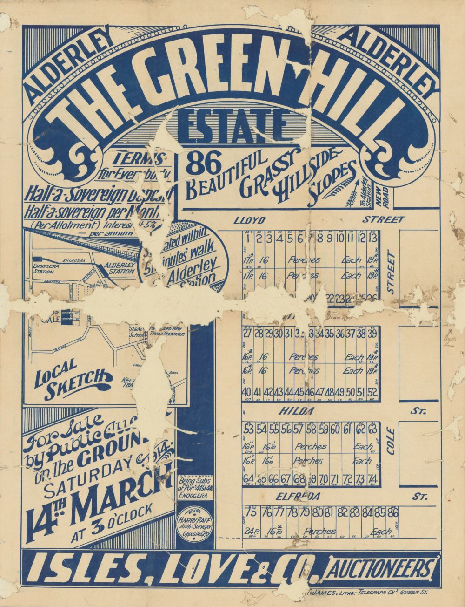

# Mothers 

<!--
???+ directions "Directions" 

    Starting point
    Walking directions to first headstone... is the grave of...
    
    { width="15%" }
-->

## Elizabeth Moffat <small>(13‑21‑15)</small>

Elizabeth Holdway was born in Bundamba on 3 March 1858 to John Holdway and Sarah (née Willis). The family moved to Toowong in 1874 and
Elizabeth resided in that suburb for the remainder of her life. William McCombie Moffat married Elizabeth at her parent's residence, Toowong on 28 March 1882. 

The couple had four sons and three daughters. The Moffat's seven children were Francis McCombie (1883-1947), William Robert Murray (1885-1964), Nettie Elizabeth (1888-1954), John Willis (1892-1981), Frederick (1896-1969), Alice Holdway (1899-1987) and Jessie Mcleod (1904-1904). 

Elizabeth died at her residence, *Crandart*, Maryvale Street, Toowong on Friday 3 December 1920.

<!--
??? directions "Directions" 

    Walking directions to next headstone... is the grave of...
    
    { width="15%" }
-->

## Honorah Mary Teresa Ross <small>(15‑9‑42)</small>

Born in Warwick, Queensland on 6 December 1858, Honorah Foley was a daughter of John Foley (aka James Horrigan) and Honorah (née Fitzgibbon). William Monsoon Ross married Honorah in the Presbyterian Church, James Street, Toowoomba on Monday 6 January 1879. 

The couple had five sons and three daughters. The Ross' eight children were William Hardy (1879-1952), Edmund Angus (1881-1955), Alexander Herbert (1883-1947), Lillian Alice (1885-1886), James Edwin (1887-1923), Bertram Thomas (1889-1971), May (1892-1979) and Ivy Monsoon (1896-1994). 

Honorah, of Morgan Street, Fortitude Valley, died on 13 April 1926.

## Ottilia Ufer <small>(7‑103‑32)</small>

Born in Niederheimbach, Germany on 23 February 1861, Ottilia Lucia Alexandrina Drenk was a daughter of Mathias Drenk and Maria (née Schrenk). Johann Ufer married Ottilia. The family of seven arrived in Brisbane from London on 21 February 1888 aboard the *Bulimba*.

Four children born in Queensland made a total of nine Ufer children in Queensland - Maria Anne (ca. 1881-1921), Ottilia Sybilla (ca. 1882-1971), Matthias (Matthew) (ca. 1883-1911), Margaretta (ca. 1886-1889), Bulimba Elizabeth (1887-1889), Andrew Alonis (1890-1915), Charlotte Johanna Louisa (1892-1941), Gustav Andrew (1896-1947) and Henry Jacob (1898-1960). 

Ottilia, a resident of Ripple Creek, near Ingham, was a farmer. Ottilia died in Brisbane on 13 January 1935 from heart failure.

## Mary Catherine Lusk <small>(7‑114‑8/9)</small>

Mary Catherine Tierney was born in Queensland to Patrick Tierney, railway worker and his wife Norah (née McCarthy) on 11 May 1892. William Alexander Lusk married Mary in Brisbane on 14 May 1913. Their only daughter, Kathleen May, known as Kitty, was born in Brisbane on 1 April 1914. 

The family resided at *Green Hill*, Alderley. Mary and Kitty died on 13 March 1918 following a sulky accident on Bowen Bridge Road.

{ width="50%"}

*<small>[The Green Hill Estate Alderley / Isles Love & Co., Auctioneers ; Harry Raff, Surveyor.](http://onesearch.slq.qld.gov.au/permalink/f/1upgmng/slq_alma21124184580002061) Plan of allotments to be sold by public auction, Saturday, 14th March, 1914. Land for sale is subdivisions of portions 445 & 446, Enoggera - State Library of Queensland.</small>*

--8<-- "snippets/sarah-woulfe.md"

## Martha Fredericke Stone <small>(18‑104‑22/23/24)</small>

Carl Heinrich Stritzke and Fredericke Caroline Lane (née Bergemann) were the parents of Martha Fredericke Stritzke, who was born in Queensland on 18 June 1884. Edward John Stone married Martha at her parent's residence, Church Street, Fortitude Valley, on 7 February 1906. Their son, Henry James Stone, was born in Brisbane on 5 April 1907. Martha died on 8 April 1907 and her son died four days later.

## Elizabeth Phillips <small>(18‑103‑23/24)</small>

Elizabeth Nelson was born in Gilford, County Down, Ireland to James Nelson and Elizabeth (née Priestly). James Phillips married Elizabeth in Gilford on 23 September 1859. The family of three sailed on 23 September 1863, arriving in Brisbane on 27 January 1864 aboard the *Light of the Age*. They settled on land on the banks of Oxley Creek before moving to Fig Tree Pocket. 

The Phillips' eleven children were Ellen (ca. 1863-1957), Annie (-1919), Mary (1865-1928), William (1866-1950), Elizabeth (1868-1963), James Robert (1870-1954), John George (1871-1947), Sarah Jane (1873-1966), Emily (1875-1937), Jessie Morrison (1876-1964) and Margaret Evangeline (1878-1966).

Elizabeth died at her residence, Fig Tree Pocket on 25 February 1931 

## Marie Theresa Lightolier <small>(11‑77‑1)</small>

Marie Theresa Haly, known as Minnie, was born at Tamrookum, Queensland, on 13 September 1855 to Charles Robert Haly and Rosa (née Harpur), Harry Martin Lightoller married Minnie at St Paul's Church, Ipswich on 9 September 1879. 

The couple had four sons and two daughters. The Lightoller's six children were Charles Haly (1880-1881), George Henry Standish (1881-1944), Cyril Haly (1882-1885), William Claude (1884-1948), Minnie Rose (1886-1911) and Lizzie Kate (1887-1949). 

The family resided in Ipswich until Dr Lightoller travelled to Europe from March 1897 until December 1899. On his return the Lightoller family settled into *[Palmarosa](https://apps.des.qld.gov.au/heritage-register/detail/?id=600219)*, Breakfast Creek. By mid 1899 the Lightollers had moved into *Highlands*, Albion. Minnie died at her residence on 9 August 1924.

<!-- TODO seems to conflict with https://apps.des.qld.gov.au/heritage-register/detail/?id=600219 -->

{ width="100%" }

*<small>[Floodwaters in Newstead, 1893](http://onesearch.slq.qld.gov.au/permalink/f/1upgmng/slq_alma21218173890002061), looking north-east from Jordan Terrace, Bowen Hills. On the hillside beyond, the house 'Palma Rosa' at 9 Queens Road, Hamilton, is visible.  - State Library of Queensland. Cropped. Annotation added.</small>*

{ width="100%" }

*<small>[Highlands, a residence in Albion, Brisbane, 1930](http://onesearch.slq.qld.gov.au/permalink/f/1upgmng/slq_digitool50472)  - State Library of Queensland. Cropped.</small>*

## Helen Dugald Street <small>(12‑39‑24)</small>

Helen Dugald Robertson was born in Wisconsin, USA in 1858 to Charles Robertson, a blacksmith and Christina (née Shallcross). William Street, white ant and borer expert, married Helen, a woollen mill clerk, on Thursday 25 August 1881 at the residence of the bride's father, Patch Grove, Grant County, Wisconsin, USA. The couple sailed from Glasgow on 11 October 1881, arriving in Moreton Bay on 28 January 1882 aboard the *Brodick Bay*. 

The Streets had two Queensland-born sons, Charles Abram (1883-1938) and Richard Joseph, known as RJ (1884-1959). Helen died on 7 October 1907 in South Brisbane.

## Eliza Finney <small>(13‑81‑6/13)</small>

Eliza Cornwall was born to Thomas Cornwall and Mary (née Thomas) in County Galway, Ireland ca. 1805. Thomas Finney, farmer, married Eliza in Tuam, County Galway in 1823. Eliza's newspaper obituaries stated she was mother to "[no fewer than 21 children](https://trove.nla.gov.au/newspaper/article/176474296)", while others indicated she was the "[mother of 23 children](https://trove.nla.gov.au/newspaper/article/148031679?searchTerm=Eliza%20Finney)". 

Some of the couple's children include. Mary Jane (1823-1841), Rachel (1829-1880), Frances Martha (1930-1882), Lewis William (ca. 1832-1910), Robert Cornwall (1835-?), Thomas (1837-1903), Susan (ca. 1840-1923), Elizabeth Emma (1841-1912), Alfred Richard (1844-1901), Mary (ca. 1850-1924), Jane Margaret (ca. 1851-1927) and Helen Henrietta (ca. 1853-1908). 

Thomas died ca. 1852. Eliza and three daughters sailed to Brisbane aboard the *Royal Dane*, arriving on 16 January 1873. Eliza died in the arms of one of her daughter's on the afternoon of Friday 22 July 1898.

<!--

TODO Confirm this is Eliza 

*<small>[Mrs T. Finney](http://onesearch.slq.qld.gov.au/permalink/f/1upgmng/slq_alma21218142500002061  - State Library of Queensland.</small>*
-->

## Annie Watson Turner <small>(13‑70‑7/8)</small>

Annie Hall, born in Ayr, Scotland on 16 October 1868, was the eldest child of George Hall, schoolmaster and Jeanie Pratt (née Watson). The family of nine arrived in Victoria aboard the *Loch Shiel* in November 1883. The family moved to Queensland for the following school year. Leonard Haslewood Turner married Annie in the Presbyterian Church, Wickham Terrace in 1888. 

The couple's two children were Jean Adelaide Haslewood (1891-1983) and Geoffrey Haslewood (1895-1983). 

Leonard died in 1906 and Annie then divided her time between Australia, England and continental Europe. Annie died in Brisbane on the 23 October 1939.

<!--

## Brochure

**[Download this walk](../assets/guides/mothers.pdf)** - designed to be printed and folded in half to make an A5 brochure.

-->
