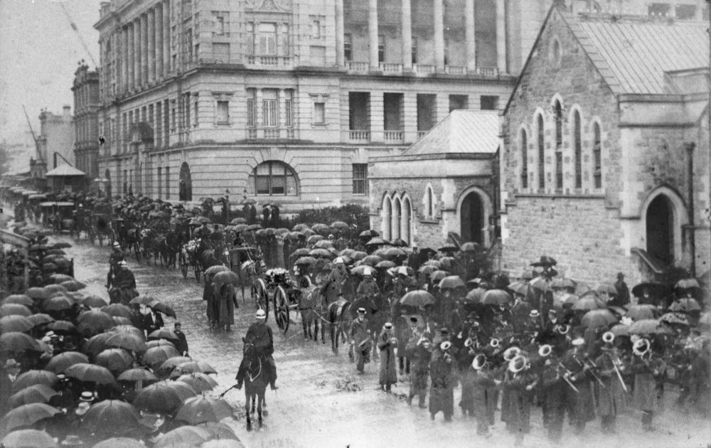
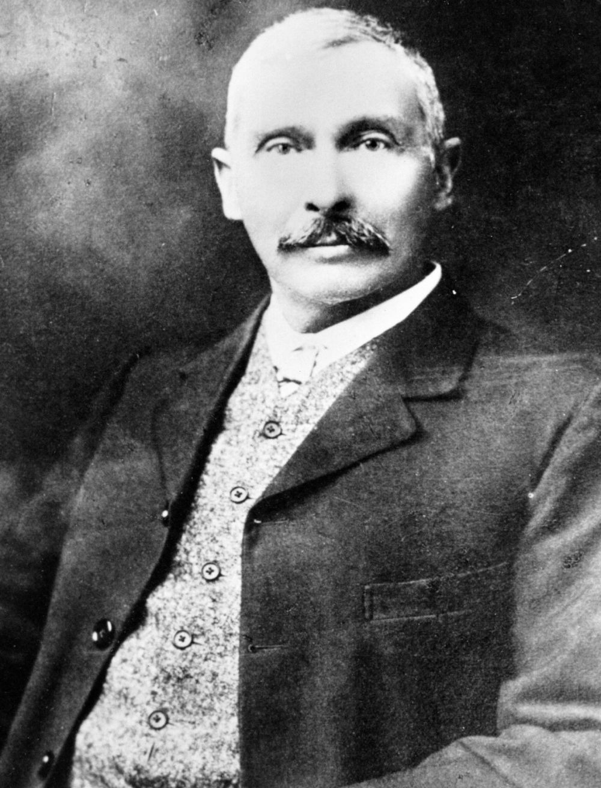
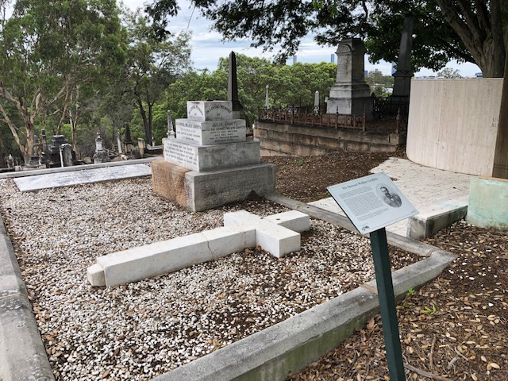

---
search:
  exclude: true
hide:
  - navigation
icon: fontawesome/solid/person-walking  
---

# Mount Blackall walk 

A walk along Federation Avenue and then down the slopes of Mount Blackall before exploring significant monuments in and around Canon Garland Place.

--8<-- "snippets/conditions-of-entry.md"

## Map 

## The Federation Pavilion

???+ directions "Directions" 

    Begin the heritage walk at the Federation Pavilion and head south-east along Federation Avenue to the impressive fenced monument of Lieutenant-Colonel James Forsyth Thallon.
    

{ width="96%" } 

## Lieutenant-Colonel James Forsyth Thallon <small>(11‑71‑14)</small>

1847‑1911

Lieutenant-Colonel James Forsyth Thallon was the Queensland Commissioner for Railways from 1902-1911. [His obituary in The Daily Telegraph](https://trove.nla.gov.au/newspaper/article/175257059/19207453) stated he was born in Markinch, Fifeshire in 1847, the son of a Scottish engineer of the old school. At age 15 he entered service in Edinburgh on the Edinburgh, Perth and Dundee Railway as an apprentice. He was eventually promoted to General Traffic Manager for Queensland in 1889 and to Deputy Commissioner of Railways in 1896. On the death of the Commissioner for Railways, Mr Gray in November 1902, Thallon was appointed to the role initially for a term of seven years, and on the expiration of that term, for a further five years. 

Thallon died at the Mater Hospital in Brisbane on 24 March 1911 from a cerebral haemorrhage after contracting Dengue fever. At the time of his death, Thallon was regarded as the most distinguished Railways Commissioner in Australia, and one of the most loved men in Queensland. More than 10,000 people stood in drenching rain as his funeral procession passed toward his final resting place in Toowong Cemetery. The procession moved from his Clayfield residence, led by four mounted policemen, followed by the Railway Band who were playing the ‘Dead March from Saul’. Family members and dignitaries from all levels of government and representatives of industry followed the carriage bearing the coffin.

{ width="42%" }  { width="54.5%" }   

*<small>[James F, Thallon](http://onesearch.slq.qld.gov.au/permalink/f/1upgmng/slq_alma21220418430002061), Queensland Railways Commissioner, at the interstate railway commissioners and general managers' conference Melbourne in May 1909 - State Library of Queensland </small>*  
*<small>[State funeral for James Forsyth Thallon, Queensland Commissioner for Railways, Brisbane, Queensland, 27 March 1911](http://onesearch.slq.qld.gov.au/permalink/f/1upgmng/slq_alma21218753520002061), 1915 - State Library of Queensland </small>* 

???+ directions "Directions" 

    Continue along Federation Avenue to graves of George Phillips and James Cowlishaw on either side of the road.

## George Phillips <small>(11‑51‑2)</small>

1843‑1921

George Phillips died on 3 June 1921 at the age of 77 after being known as one of the pioneers who opened up North Queensland, the possibilities of the Gulf country, and who laid out the town of Normanton. A surveyor and civil engineer, he also made [many valuable contributions to The Daily Telegraph](https://trove.nla.gov.au/search/category/newspapers?keyword=%22G%20Phillips%22&l-state=Queensland&l-title=840&l-decade=191&l-category=Article) on the physical aspects, climatology, natural and artificial products of the country, and the life and manners of its people. For many years he was a leading member and fellow of the Royal Geographical Society, and contributed several valuable papers. During his funeral service at the City Tabernacle, Reverend Richer, a good friend of George Phillips, spoke of the man and his great service to Queensland. 

{ width="30%" }  

*<small>[George Phillips, Sandgate, 1907](http://onesearch.slq.qld.gov.au/permalink/f/1upgmng/slq_alma21218158200002061) - State Library of Queensland </small>* 

 
## James Cowlishaw <small>(11‑41‑7A)</small>

1834‑1913

James Cowlishaw was an architect, newspaper director, trustee and politician. He was born in Sydney in 1834 and came to Brisbane in 1861 to practise as an architect. He designed a few private homes including *Hanworth House* at East Brisbane and *Oakwal* at Windsor, both of which still exist, but he was mostly concerned with commercial buildings and designed some of the finest buildings of the period, including Brisbane Grammar School. He acquired a large interest in the Queensland Trustees Limited, and was a founder of the Brisbane Gas Company in 1864. He was also one of the founding trustees of the Toowong Cemetery.

Cowlishaw was Chairman of Directors of *The Daily Telegraph* for many years. Later his brother George, who is also buried in this grave, became Director of *The Daily Telegraph* for an unbroken period of 20 years from 1893 until his sudden death from a seizure on 6 January 1913. 

Cowlishaw’s wife, Charlotte (née Owen) was the second burial in the grave following her death in 1914.

{ width="96%" }  

*<small>[Brisbane Grammar School, ca. 1881](http://onesearch.slq.qld.gov.au/permalink/f/1upgmng/slq_digitool194651) - State Library of Queensland. Cropped. </small>* 

???+ directions "Directions" 

    Proceed to the end of the avenue and to the left find the Federation Pavilion. In the area to the left of the pavilion are Sir Charles Lilley and Sir Samuel Walker Griffith.
    
    { width="15%"} { width="15%" } 

## Sir Charles Lilley <small>(12‑15‑15)</small>

1830‑1897

Born at Newcastle upon Tyne, England in 1830, Charles Lilley arrived in Sydney in 1856 as an assisted immigrant. That year he was articled in Brisbane to Robert Little, the district’s senior solicitor. On completing his articles, he joined the printer William Bellbridge to lease the Moreton Bay Courier and became involved in the separation movement. 

Following separation, Lilley narrowly won the Fortitude Valley seat and continued to represent the electorate until the end of his parliamentary career. In 1865 he became Attorney‑General in the Herbert Ministry and in 1868 gained the unusual dual role of Premier and Attorney‑General. In 1869, as colonial secretary, he was responsible for establishing free education throughout Queensland, making it the first Australian state to do so. In 1874 he was appointed Judge of the Supreme Court and in June 1879 became Chief Justice. He accepted a knighthood in October 1881. 

## Sir Samuel Walker Griffith <small>(12‑11‑6/7)</small>

1845‑1920

This modest grave contradicts the vital contribution this man made to Queensland and Australian politics and law. Griffith’s political career began in 1872 when he won the seat of East Moreton. He served as Attorney‑General from 1874‑1878 and in May 1879 replaced John Douglas as Liberal Party leader. During this rise to leadership he held three portfolios: Attorney‑General, Secretary for Public Instruction (1876‑1879) and Secretary for Public Works (1878‑1879). Griffith was a ‘founding father’ of Australia’s Constitution and Federation. In 1891 he chiefly drew up a draft constitution. From 1899‑1903 he was Lieutenant Governor of Queensland. Griffith died in his New Farm home ‘Merthyr’ and is buried here with his wife and eldest son Llewelyn, an engineer who died aged 29. 

<!-- insert photo -->

???+ directions "Directions" 

    Turning around, see the largest monument in the cemetery belonging to Governor Blackall.

## Governor Blackall <small>(Mount Blackall)</small>

1809‑1871

Samuel Wensley Blackall was the second Governor of Queensland, serving between 1868 and 1871. Born in Dublin, Blackall’s colonial service began in 1851 when he was appointed Lieutenant Governor of Dominica for six years. From 1862‑1865 he was Governor of Sierra Leone and in 1865 became Governor‑in‑Chief of the West African Settlements. During his three years as a Governor of Queensland he became extremely popular, willing to help public causes. While on a picnic in this area, Blackall’s ill health prompted him to choose this hilltop for his grave. In January 1871, Blackall was the first to be buried in Toowong Cemetery and his impressive memorial continues to dominate the hill now named Mount Blackall. 

<!-- insert photo -->

???+ directions "Directions" 

    Leaving the crest of Mount Blackall, take time to appreciate one of the best views of Brisbane. Walk down the hill to see Sir Arthur Palmer.

## Sir Arthur Palmer <small>(13‑88‑7)</small>

1819‑1898

Arthur Hunter Palmer was the seventh Premier of Queensland, serving from 1870‑1874. Irish born, Palmer immigrated to New South Wales in 1838 where he worked on H. Dangar’s stations for 23 years, rising to the position of general manager. In 1861 he moved to Queensland and became a pastoralist. In 1866 he entered the Legislative Assembly and pursued a political career which included ministerial positions such as Minister of Lands and Works, and Public Instruction, the Colonial Secretary in various governments and a term as Premier. From 1881‑1898 Palmer was President of the Legislative Council. 

<!-- insert photo -->

???+ directions "Directions" 

    See information about Sir Maurice O’Connell and the Bell family.

## Sir Maurice O’Connell <small>(13‑83‑4)</small>

1812‑1879

Maurice Charles O’Connell was the grandson of Governor William Bligh, commander of the infamous HMS Bounty and Governor of New South Wales from 1805. Born in Sydney and educated in Europe, he raised and led a regiment of Irish volunteers in the Spanish Carlist wars, rising to the rank of General in the British Auxiliary Legion. Before leaving for Spain, he married Eliza Emily Ie Geyt at Jersey. When the legion was disbanded, O’Connell sailed back to New South Wales with several Spanish decorations and in 1845 was elected to the New South Wales Legislative Council. He was a founding member of Queensland’s Legislative Council, following the colony’s separation from New South Wales in 1859. He was granted a knighthood in 1868 when, as administrator of the government, he was host to the Duke of Edinburgh. He died in Parliament House on 23 March 1879, leaving no children. 

<!-- insert photo -->

## The Bell family <small>(13‑84‑8)</small>

Sir Joshua Peter Bell (1827‑1881), was a squatter and politician. Bell’s Jimbour Station became one of the most successful on the Darling Downs. At the Grange Stud in Ipswich he was a prize breeder of horses much sought after in the United States, winning all important races on the Queensland racing calendar. For many years he was president of the Queensland Turf Club. The highlights of Bell’s political career, which began in 1860, are listed on his headstone. On December 1881 Bell died suddenly in a cab in Queen Street. 

Joshua Thomas Bell (1863‑1911), a barrister and politician, was the eldest son of Joshua Peter Bell. He was a skilful electioneer and public speaker, but his elegant appearance and pompous attitude alienated many of his peers. He was a keen rower, rifle shooter and patron of the arts, securing the first cultural grant in Queensland. 

<!-- insert photo -->

???+ directions "Directions" 

    Take a sharp left across the top of the hill and head down the path to the left to see Sir Anthony Musgrave.

## Sir Anthony Musgrave <small>(14‑23‑7)</small>

1828‑1888

Governor Musgrave was born and educated in the West Indies where he established his diplomatic career. He became Governor of South Australia in March 1873, was knighted in 1875 and in 1883, after six years as Governor of Jamaica, became Governor of Queensland. With Samuel Griffith he shared a deep enthusiasm for Australian Federation. 

<!-- insert photo -->

???+ directions "Directions" 

    Across the path lies a series of tombs beginning with a large family grave. Notice on the far left a plaque commemorating Dorothy Hawthorn, MBE.

## Dorothy Hawthorn, MBE <small>(13‑83‑1/2)</small>

1900‑1983

Dorothy Hawthorn’s many achievements and contributions to the community are well documented on her grave. Also buried here are her father, a federal cabinet minister, and her grandparents, Alexander and Ann Stewart, foundation members of St Andrews Church, Brisbane. Hawthorn made an outstanding contribution to the Girl Guides Association. As Deputy State Commissioner and Commissioner in charge of training, she toured extensively throughout Queensland establishing Guide companies. 

<!-- insert photo -->

???+ directions "Directions" 

    Moving down the hill along the path to the left and the next row are Finney and Isles.

## Finney and Isles <small>(13‑81‑6)</small>

The graves of Thomas Finney and James Isles who together established Finney Isles and Co. in 1864, lie side by side. In 1862 the pair arrived in Brisbane from Ireland and two years later bought a drapery business in Ann Street, Fortitude Valley. The business rapidly expanded and in 1909 the well‑known Queen Street store was built. In 1866, following the death of his first wife, Thomas Finney married Sidney Ann Jackson whose sister married James Isles. 

<!-- insert photo -->

???+ directions "Directions" 

    Continue along the road and to the right to find a low‑set grave to the left, of Kenneth Hutchinson.

## Kenneth Hutchinson <!-- () -->

1850‑1902

Hutchinson joined Queensland’s volunteer defence force in 1870. In 1890 he was appointed to the Permanent Force as a Major, and in 1899 promoted to Lieutenant Colonel. He commanded the second Queensland Contingent to the South African War and saw active service from 1899‑1901. At the time of his death, he was involved with the reorganisation and structuring of the new Commonwealth Military Forces. Lieutenant Colonel Hutchinson was tragically hit and killed by a train at Roma.

<!-- insert photo --> 

???+ directions "Directions" 

    Walk two rows down the hill past the pine tree. On the left stand the Raff family monuments capped with shrouded urns which refer to the urns used in ancient Greece to hold cremated ashes.

## Raff family <small>(13‑79‑1)</small>

George Raff (1815‑1889), born in Forres, Morayshire, Scotland, was a successful merchant, sugar‑grower and a founding Queensland politician. Raff arrived in Sydney in January 1839 on the Earl Durham. His efforts were largely responsible for the direct wool trade between Brisbane and London. Raff strongly believed in Queensland separation from New South Wales and, after this was achieved in 1859, represented Brisbane in the first parliament. 

Alexander Raff (1820‑1914) was a pastoralist on the Darling Downs and a company director. He was a director of the Scottish Australian Land and Mortgage Company and National Mutual Life Association. From 1884 until 1910 he was a member of the Legislative Council.

<!-- insert photo -->

???+ directions "Directions" 

    At this point in the walk, continue the tour down the hill and complete Tour A, or take a small detour to complete Tour B.  
 
    Tour A - Continue down the hill and at the end of this row is the tall obelisk of [John Turner](#john-turner-1826-1900).

    Tour B - Walking to the right at the Raff memorial, proceed all the way along the row before moving down the hill to the next row to visit the grave of Carl Feilberg.

## Carl Feilberg <small>(13‑71‑15)</small>

1844‑1887

Carl Feilberg was born in Copenhagen in 1844. At age five, Feilberg was placed with relatives in Edinburgh, Scotland. Suffering from a serious case of tuberculosis, Feilberg was advised to migrate to Australia in the hope a better climate would improve his health. He arrived in Sydney in 1867 and travelled to Rockhampton carrying a letter of introduction to Scottish squatter Archibald Buchanan. He gained ‘colonial experience’ working on Mr Buchanan’s properties as a shepherd, store and bookkeeper. The knowledge he gained in the outback, including his experiences with the Native Police and the darker sides of the colony’s frontier policies would later influence his work as a journalist, political commentator and author. 

After leaving Maryborough in 1875 he moved to Cooktown, then Brisbane where he became part‑proprietor and editor of the Queensland Patriot newspaper, later renamed The Daily News. Feilberg was arguably the most persistent human rights advocate and pioneer of compassion in the history of colonial Queensland. 

After the closure of the Daily News at the beginning of 1879, he found employment at the Brisbane Courier as a political commentator and lead writer as the editor of The Queenslander. A change in the proprietorship of the Brisbane Newspaper Company in December 1880, found his views at odds with the new owners and he was gradually relegated to more subordinate positions. He resigned and some years later he was offered the position of editor‑in‑chief of the Brisbane Newspaper Company. He remained fully active in this position until a few weeks before his death on 25 October 1887, at only 43 years of age. 

<!-- insert photo -->

???+ directions "Directions" 

    Turning right at Feilberg’s grave, walk down the hill to the left between the graves of Skyring and Pettigrew, two original trustees of this cemetery and walk along the row to the low‑lying grave of Trooper John Cobb.

## Trooper John Cobb <!-- () -->

1857‑1901

A volunteer in the third Queensland Mounted Infantry Contingent to the South African War, John Cobb sailed from Brisbane in March 1900 and saw action at the relief of Mafeking. In operations west of Pretoria they took part in the defence of Elands River camp during August 1900 and later in November at Rhenoster Kop, both significant battles of that conflict. Contrary to popular belief, Trooper Cobb was not wounded in South Africa and returned unscathed to Brisbane where the contingent was disbanded on 20 June 1901. Trooper Cobb died of an apparent stroke on 3 July 1901 and was buried with full military honours.

<!-- insert photo -->

???+ directions "Directions" 

    Proceed along the path to the Murray‑Prior family vault, turn left at Heussler’s headstone, then immediately right after the Dorsett’s grave, continue back along the row to the pathway and at the end of this row is the tall obelisk of John Turner.

## John Turner <!-- () -->

1826‑1900

John Sargent Turner was born in Wangaroa, New Zealand, to Reverend Nathaniel Turner (1793‑1864), a Wesleyan Missionary (whose tomb lies behind this monument), and Anne Turner (née Sargent). In 1852 John Turner migrated to Brisbane and opened the Brisbane branch of the Union Bank. In 1871 he relinquished his management position to join the established firm of George Raff and Company. Turner retired from business when his company dissolved in 1882. He was director of several businesses including Queensland Mercantile, the Australian Mutual Providence Society, the South Australian Mutual Providence Society and the South Australian Land and Mortgage Company. On 18 April 1878 he entered the Legislative Council where he remained until his death. He is regarded as the founder of the Albert Street Uniting Church. 

<!-- insert photo -->

???+ directions "Directions" 

    Walk further down the hill and to the left to see the graves of James Wassell and R.R. Smellie.

## James Wassell <small>(13‑65‑10)</small>

1841‑1926

James W. Wassell arrived in Queensland in 1864 and immediately joined the Water Police in Brisbane. For many years he was in charge of the prison at Proserpine and the Reformatory School for Boys at Lytton. He assisted in founding the Boys’ Home at Enoggera, the Hospital for Sick Children, the Lady Lamington Hospital, and the Institute of Social Service. Wassell was also a staunch supporter of the crèche and kindergarten movements and Trustee of Toowong Cemetery. 

<!-- insert photo -->

## R.R. Smellie <!-- () -->

1823‑1898

Robert Russell Smellie was a pioneer of the engineering and iron foundry trade and in the 1860s, he established Smellie and Co. With the discovery of gold, Smellie also imported mining machinery while still manufacturing agricultural implements, general hardware and some boat building. The old [Smellie and Co. Warehouse](https://apps.des.qld.gov.au/heritage-register/detail/?id=600097), still situated at 32 Edward Street, City is heritage listed.

<!-- insert photo -->
 
???+ directions "Directions" 

    Returning to the main pathway, walk down the hill and on the left come to the Bancroft family.

## Bancroft family <small>(13‑35‑3)</small>

The Bancroft’s are among Queensland’s most notable medical families. After emigrating from England to Australia in 1864, Doctor Joseph Bancroft achieved world recognition for discovering the adult worm (mosquito borne) which caused the disease filariasis. The son of Doctor Bancroft, Thomas Lane Bancroft’s career included the positions of Quarantine Officer of Brisbane, Government Medical Officer, and Medical Officer on Palm Island. Shy, generous and kindly, Thomas shunned publicity, and although his desire for a full‑time research appointment was never fulfilled, his contribution to natural science amounted to 84 research papers including furthering his father’s work on filariasis. Doctor Bancroft was a general practitioner of the best type – a first‑rate all‑round surgeon, physician, gynaecologist and midwife. 

<!-- insert photo -->

???+ directions "Directions" 

    Turn left here and walk the length of the row to the memorial of David Seymour.

## David Seymour <!-- ()  -->

ca. 1831‑1916

David Thomson Seymour was born at Ballymore Castle, County Galway, Ireland, and educated at Ennis College. He arrived in Brisbane in 1861 as a Lieutenant in a detachment of the 12^th^ Regiment. For a time, Aide‑de‑Camp to the colony’s Governor, Sir George Bowen, he was appointed Commissioner of Police in 1864, a post he held with distinction for 31 years. Commissioner Seymour was responsible for developing and organising the Queensland Police into an effective crime prevention force. He retired in 1895 and passed away on a trip to England and is buried there. His father‑in‑law, Queensland’s last Sheriff’s headstone recovered in an archaeological dig elsewhere in the cemetery has been repaired and placed on the Seymour family grave. His father‑in‑law still rests under Suncorp Stadium.

<!‑- insert photo -->

???+ directions "Directions" 

    Turning around, walk down to the next row to the right along the length of the row and find the Celtic Cross, which marks the grave of George Rilatt.

## George Rilatt <small>(13‑33‑12)</small>

1844‑1924

George Rilatt was the dedicated janitor of Brisbane Grammar School for 51 years from 1872 until his death in 1924, aged 80. He selected the present site of Brisbane Grammar School, built in 1880. In addition to performing typical janitorial duties, he ran the tuckshop from the front of his own cottage, conducted an orchestra, attended to the school’s banking and was involved in many aspects of the school’s life. The Old Boys’ Association paid tribute to Rilatt’s contribution to the school by erecting a memorial bell in the school grounds and a headstone in the Toowong Cemetery in his honour. 

<!-- insert photo -->

???+ directions "Directions" 

    Continue a short distance further, turn left and walk down the hill one row at Pilot Officer Munro Robin Ryder’s memorial, distinctive for the white marble angel on a crucifix. Turn right and stroll the length of the row back to the main path to the red granite headstone of Charles Patterson.

## Charles Patterson <small>(13‑30‑10)</small>

1844‑1926

Charles Patterson emigrated from his birthplace in Aberdeenshire, Scotland, and arrived in Brisbane in 1871. In 1875 he entered the sawmill business and with his brothers, established the Bon Accord Sawmill at Brookfield. In the 1880s he moved to Toowong and built another sawmill. He was active in community politics, serving as Chairman in the Indooroopilly and Taringa Shire Councils, as one of the first members of the Toowong Municipal Council and as Toowong’s first Mayor, a position he held for three terms. Patterson was made life‑Governor of the Children’s Hospital and claimed fame for being the first man to drive a horse drawn wagon to the summit of Mt Coot‑tha. He was also responsible for ‘Patterson’s Folly’, the stone‑walled islands of lawns and trees in the middle of High Street, Toowong, which he built to minimise upkeep of the wide street. 

<!-- insert photo -->

???+ directions "Directions" 

    Cross the path and just up to the right on the corner lies the Prentice family.

## Prentice family monument <small>(9‑41‑1)</small>

This memorial is for two of the 133 passengers who drowned in the Quetta disaster of 1890. The vessel carrying prominent Queensland citizens was enroute to Brisbane when it struck a rock in the Torres Strait. Only 158 passengers survived the tragedy.

<!-- insert photo -->

???+ directions "Directions" 

    Back on the main path, continue down the hill four rows and to the left at the end of the row, find the head and foot stones of the three Pioneer children.

## Pioneer children <small>(13‑10‑4)</small>

Esther Roberts, mother of **William Henry Roberts** who is buried here, was the first teacher in the Moreton Bay settlement. Charles Roberts was transferred to Dunwich to take charge of the government store in August 1828. After the death of their son, the Roberts family returned to Sydney in 1834.  

**Peter McCauley** was the son of Private Peter McCauley, who was a member of the 17^th^ Leicestershire Regiment. It was the longest serving regiment in Moreton Bay, having arrived around October 1830 and departed in November 1835. Private McCauley is memorialised at Redcliffe. His wife Mary was Matron of the Brisbane Town Female Factory. Young Peter drowned in the Brisbane River in 1832.

**Jane Pittard** was the infant daughter of John Pittard, the late Colour Sergeant of the 57^th^ Regiment who drowned in Van Diemen’s Land shortly before his daughter’s birth. Jane’s mother remarried and came to Moreton Bay with Colour Sergeant David Collins, also of the 57^th^ Regiment. Jane died in 1833 and her family returned to Sydney the following year.

<!-- insert photo -->

???+ directions "Directions" 

    At the roadway turn left and continue along ==Emma Miller Avenue== and note on the right the graves of the Petrie family. 

## Petrie family <small>(13‑5‑3)</small>

The Petrie family is one of Queensland’s oldest and most prominent. Andrew Petrie (not buried at Toowong Cemetery) is regarded as Queensland’s first free settler, emigrating on the Stirling Castle from Edinburgh to Sydney in 1831, then moving to Brisbane in 1837 to become Superintendent of Works. In 1840 he established the family stonemason business, which from 1882‑1981, was located opposite the main gates of Toowong Cemetery. This long‑established business was responsible for many headstones in this cemetery and their trademark can be found on some graves. The Petrie’s also built the GPO, Customs House and Parliament House, among other public buildings. 

John Petrie (1822‑1892), Andrew’s eldest son, was Brisbane’s first Mayor from 1859‑1862 and was an alderman for several years. As Mayor, he had the honour of receiving Sir George Bowen as Queensland’s first Governor when the colony achieved separation in 1859. 

Also a stonemason, John Petrie’s best remembered work is the conversion of the windmill on Wickham Terrace to a signal station in 1861. John’s son, Andrew Lang Petrie (1854‑1928), a monumental mason and contractor, entered the Legislative Assembly on 29 April 1893 and remained a member until 7 May 1926. 

???+ directions "Directions" 

    Cross the road and walk toward the entrance to the cemetery. Look to the right opposite the brick tool shed to find the urn topped column commemorating Ann and Walter Hill.

<!-- insert photo -->

## Ann and Walter Hill <small>(6‑21‑9)</small>

Ann Hill (1850‑1871) was the second person buried in Toowong Cemetery, after Governor Blackall. Walter Hill, her father, was appointed first Superintendent of the Brisbane Botanic Gardens in 1855. As a tribute to Walter Hill, the Walter Hill fountain was erected in the City Botanic Gardens in 1867. This explanatory plaque was unveiled by the Lord Mayor Clem Jones in 1972

???+ directions "Directions" 

    Cross the road again to pass the Soldiers Memorial.

## Soldiers Memorial 

The Cross of Sacrifice and Stone of Remembrance were unveiled on Anzac Day, 1924, by the Governor‑General, Lord Forster. The Stone of Remembrance is a solid block of Helidon sandstone weighing 10 tonne. The unveiling ceremony was attended by several hundred people including many prominent Queenslanders. Canon Garland raised the funds for this memorial.

<!-- insert photo -->

???+ directions "Directions" 

    End the tour with a wander in the shaded garden area, or read the story of **Canon David Garland**, after who this place in the cemetery was named.

    To see more, cross ==Soldiers Parade== toward the cemetery’s front gates to see the only marble statue in Toowong Cemetery of Edward McGregor.

## Edward McGregor <small>(4‑16‑17/18)</small>

1862‑1939

Edward McGregor worked on the Queensland railways for 20 years before purchasing the Grosvenor Hotel. A few years later he built the Lyceum Theatre on George Street, Brisbane, which he ran until his death. McGregor spoke several languages and toured the world twice. He was a keen music lover and was Patron of the Scottish and Curlew Choirs. McGregor was president of the Schoolboys’ Soccer Association and was largely responsible for the visit of the English soccer team in 1937. 

Beneath a rough cross directly behind Edward McGregor lies Able Seaman W.J. Harrhy who accidently drowned in the Brisbane River on Good Friday in 1924.

<!-- insert photos -->

???+ directions "Directions" 

    Turning right, see the Caskey Memorial.

## Caskey Memorial <!-- () -->

Unveiled in May 1902, this is the [first known monument to the South African War](https://apps.des.qld.gov.au/heritage-register/detail/?id=600335) to be erected in Queensland. Lieutenant Caskey, of the 5^th^ Queensland Imperial Bushmen was killed in action in September 1901. This obelisk made of white Helidon sandstone and draped by a shroud, features emblems of Caskey’s teaching career and sporting interests. A rare memorial of the Anglo‑Boer conflict, this monument is a significant reminder of the emerging nationalism and contemporary attitudes to war.  

<!-- insert photo -->

???+ directions "Directions" 

    Adjacent to this is a tall obelisk for the ‘A’ Battery Memorial, a shape which originates from the architecture of ancient Egypt.

## ‘A’ Battery Memorial <!-- () -->

Prior to Federation, each of the Australian colonies maintained its own defence force. These forces were largely comprised of part‑time volunteers and a small number of permanent officers and men. This memorial is to the men of Queensland’s permanent force, ‘A’ Battery, Queensland Artillery. All of those named on the memorial died while serving in the Battery, but only one, Driver Sydney Walker, died while on active service. Walker was serving with the first Queensland Contingent to the South African war when he died of enteric fever at Bloemfontein. 

<!-- insert photo -->

???+ directions "Directions" 

    Walking parallel with the fence and turning right at Ludlow’s grave end the tour at the leadlight windowed Temple of Peace which lies beneath shady trees at the entrance to the cemetery.

## Temple of Peace <small>(4‑38‑14)</small>

This [state‑heritage‑listed monument](https://apps.des.qld.gov.au/heritage-register/detail/?id=600334) was designed and largely constructed by Richard Ramo in memory of his three sons killed in World War I, to his adopted son Fred who died tragically in 1923, and later to the family dog. The dedication of the mausoleum was attended by several thousand people, largely pacifists, socialists and members of the Industrial Workers of the World. The temple bears several leaded marble inscriptions expressing Ramo’s bitter hatred of war and details of the deaths of his sons. One particularly sombre inscription reads: “*All my hope lies buried here*”. 

<!-- insert photo -->

## Copyright and Attribution 

The walk is based on [Toowong Cemetery Self‑Guided Walk One](https://www.brisbane.qld.gov.au/community-and-safety/community-support/cemeteries/toowong-cemetery#selfguidedwalks) © [Brisbane City Council](https://www.brisbane.qld.gov.au) 2016, used under the [Creative Commons Attribution 4.0 Licence](https://creativecommons.org/licenses/by/4.0/).
