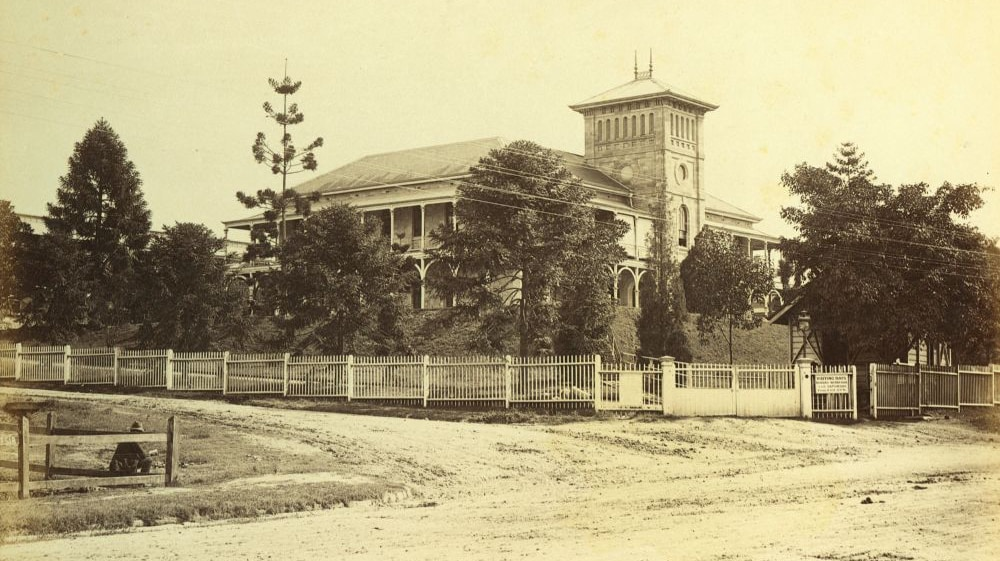

# In their caring hands  

**Commemorating the role of nurses, doctors and other health professionals**

At Toowong Cemetery are many health professionals; nurses, doctors, dispensers and others, some of whom gave their lives in the course of their duties. This is just a small number of those people who spent their working lives caring for others.

<!-- 

-->

## Mary Elizabeth Weedon and Annie Griffiths <small>(4‑3‑20)</small>

Mary Weedon, who trained at London’s Charing Cross Hospital, was the first head nurse of the Brisbane Hospital, holding the position for five years from 1885. She was the Vice‑President of the Australasian Trained Nurses’ Association (ATNA), Queensland Branch from 1904 to 1905 and a councillor from 1905 to 1906. 

Mary and her friend, Annie Griffiths, shared a house called *Garton* in Terrace Street, Toowong for many years. They were also members of the congregation of St Thomas Anglican Church. They died within eighteen months of each other; Mary in March 1942 and Annie in July 1943.

*<small>[Royal Brisbane Hospital, ca. 1885](http://onesearch.slq.qld.gov.au/permalink/f/1upgmng/slq_alma21271923160002061) — State Library of Queensland. Cropped.</small>*

--8<-- "snippets/edith-harriett-rennie.md"

--8<-- "snippets/nina-robertson-mcdonald.md"

--8<-- "snippets/elsie-muriel-jones.md"

--8<-- "snippets/julia-harriett-blaycock.md"

--8<-- "snippets/alice-maud-mary-le-bas.md"

--8<-- "snippets/emily-owen.md"

<!-- TODO add headstone photo -->
<!-- page -->

--8<-- "snippets/mary-constance-crosse.md"

--8<-- "snippets/james-gray.md"

--8<-- "snippets/florence-truelove.md"

--8<-- "snippets/rose-jane-walker.md"

--8<-- "snippets/sarah-stevens-lygo.md"

--8<-- "snippets/arthur-charles-frederick-halford.md"

--8<-- "snippets/vera-evelyn-james.md"

--8<-- "snippets/mary-jane-brown.md"

## Nora Halford and Catherine Fitzgerald <small>(7A‑102‑23A)</small>

--8<-- "snippets/nora-halford-and-catherine-fitzgerald.md"

--8<-- "snippets/agnes-kathrine-isambert.md"

--8<-- "snippets/ellen-margaret-kavanagh.md"

--8<-- "snippets/zita-stella-lyons.md"

--8<-- "snippets/gertrude-daly.md"

--8<-- "snippets/susannah-josephine-mcgann.md"

--8<-- "snippets/elizabeth-margaret-hulett.md"

--8<-- "snippets/ethel-ivy-ellen-amess.md"

--8<-- "snippets/katherine-glasson-taylor.md"

## Lilian Violet Cooper and Mary Josephine Bedford <small>(8‑69‑13/14)</small>

Dr Lilian Cooper was the first woman to practise medicine in Queensland. She studied medicine at the London School of Medicine for Women and obtained an MD from Durham. While studying there, Lilian met and shared lodgings with Mary Bedford who was to become her lifelong companion. 

Dr Cooper commenced private practise in Brisbane in 1891 at The Mansions, in George Street. She was a great advocate of sterilisation and the use of protective clothing during surgery. Lilian died on 19 August 1947 aged 86. Mary Bedford died in 1955. Mt Olivet Hospital stands on the site of their Main St home at Kangaroo Point.

{ width="70%" }  

*<small>[Two friends seated in a horsedrawn buggy, Brisbane, ca. 1900](http://onesearch.slq.qld.gov.au/permalink/f/1oppkg1/slq_alma21272255460002061). Miss Josephine Bedford (left) and Dr. Lilian Cooper. Dr Cooper made house calls in a horse and sulky by day and a bicycle by night. Her surgery was in George Street, Brisbane. - State Library of Queensland </small>* 

--8<-- "snippets/lillian-leitch.md"

--8<-- "snippets/isabella-jane-mason.md"

--8<-- "snippets/lilian-gertrude-ramsay.md"

<!--
!!! Warning "Nurses buried in Portion 22" 

    Portion 22 is steep in parts. These graves are best approached from Francis Forde Avenue, which runs parallel to Birdwood Terrace. These graves are not included on the walk.    
-->

--8<-- "snippets/mary-hogan.md"

--8<-- "snippets/patricia-marion-hull.md"

--8<-- "snippets/annie-mcgarrigal.md"

--8<-- "snippets/helena-veronica-luton.md"

<!--
!!! Warning "Portion 30" 

    This grave is not included on the walk.
-->

--8<-- "snippets/agnes-helen-storie.md"

## Further Reading  

- Goodman, R. *Our War Nurses: The History of the Royal Australian Army Nursing Corps 1902 - 1988*, Brisbane: Boolarong, 1988
- Goodman, R. *Queensland Nurses: Boer War to Vietnam*, Brisbane: Boolarong with Returned Sisters Sub‑Branch of the Returned Services League (Queensland), 1985
- Gregory, H. *A tradition of care: a history of nursing at the Royal Brisbane Hospital*, Brisbane: Boolarong, on behalf of the Graduate Nurses Association, Royal Brisbane Hospital, 1988
- Gregory, H. and Brazil, C. *Bearers of the tradition: nurses of the Royal Brisbane Hospital 1888-1993*, Brisbane: Boolarong with Royal Brisbane Hospital Graduate Nurses Association, 1993
- Patrick, R. *The Royal Women’s Hospital, Brisbane - the first fifty years*, Brisbane: Boolarong with Royal Women’s Hospital Board, 1988 Schultz, B. *A tapestry of service: the evolution of nursing in Australia*, Melbourne: Churchill Livingstone, 1991
- Strachan, G. *Labour of Love: The History of the Nurses’ Association in Queensland 1860 - 1950*, St Leonards: Allen & Unwin, 1996
- Tyrer, J. *History of the Brisbane Hospital and its affiliates: a pilgrims progress*, Brisbane: Boolarong with Royal Brisbane Hospital, 1993

## Acknowledgements

- Additional information provided by Cecilia Brazil, Curator, [Museum of Nursing History](https://metronorth.health.qld.gov.au/rbwh/about-us/museum-of-nursing-history), Lady Lamington Nurses’ Home, Royal Brisbane Hospital.
- Information of Mary Hogan provided by Ray and Lizzie Sergeant.
- Compiled by Hilda Maclean, assisted by Margaret Graham and Margaret Campbell.

<!--

## Brochure

**[Download this walk](../assets/guides/in-their-caring-hands.pdf)** - designed to be printed and folded in half to make an A5 brochure.

-->
