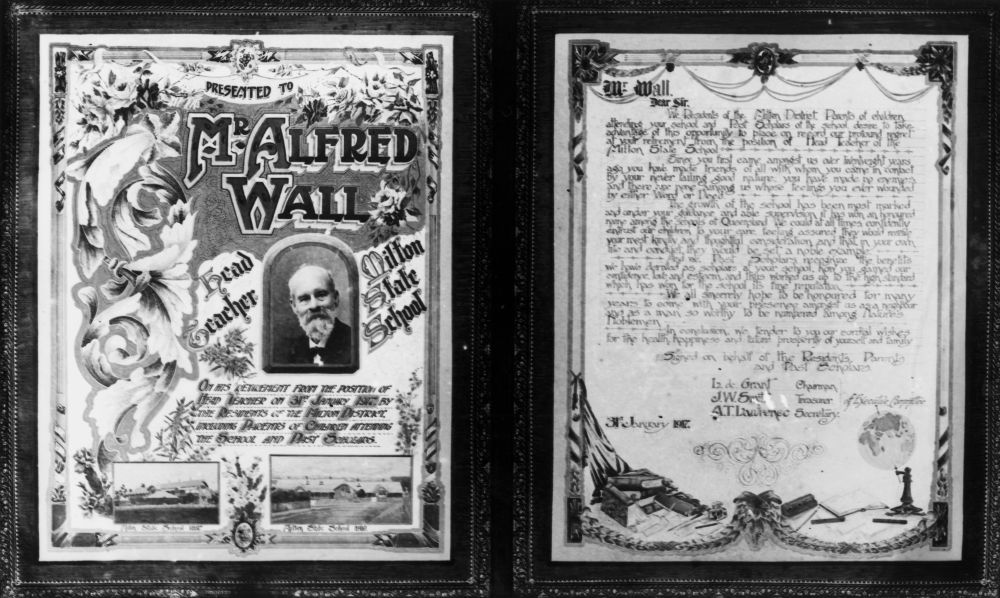

# Stories from Portion 5 (part 1)  

## Jonas and Mary Malouf <small>(5‑26‑2/3)</small>

Jonas Malouf and his wife, Mary (née Hadad) were both born in the town of Zahlah in what is now Lebanon but was still part of Palestine at the time. Jonas was born in December 1849 and Mary in 1869. In 1889, together with their sons and Jonans's two brothers, they fled their native country to escape the political troubles of the time. They came to Queensland where they [founded a successful drapery and general store at Ipswich](https://trove.nla.gov.au/newspaper/article/188745751). They later settled at Gatton where they continued to carry on in business. 

<!-- 
https://trove.nla.gov.au/newspaper/article/177221470?searchTerm=Malouf%20Draper
https://trove.nla.gov.au/newspaper/article/188734720
Jonas d. 	11-01-1940 https://trove.nla.gov.au/newspaper/article/40873705?searchTerm=Jonas%20Malouf 
Mary d. ca. 04-01-1930
-->

## Alfred Wall and Alfred George Curtis Wall <small>(5‑27‑16)</small>

Alfred Wall was born in England before migrating to Queensland in the ship *Young Australia* in 1866. He spent head several years as head teacher at Bowen State School and in 1899 became head teacher at Milton State School until his retirement in 1917.

His son, [Alfred George Curtis Wall](http://onesearch.slq.qld.gov.au/permalink/f/fhnkog/slq_alma21285295720002061) served in WWI in the Australian Flying Corps No 2 Squadron where he was designated 1^st^ Air Mechanic.

{ width="100%" }

*<small>[Illuminated address for Mr Alfred Wall](http://onesearch.slq.qld.gov.au/permalink/f/fhnkog/slq_alma21218453260002061), presented on his retirement from his position as Head Teacher at the Milton State School, Brisbane from 1888 to 1916 - State Library of Queensland. </small>*

--8<-- "snippets/john-theophillus-symons-bird.md"

## Angus McDonald, Robert Alexander McDonald and Stanley Angus McDonald <small>(5‑30‑1/2)</small>

Angus McDonald who was born in Ayr, Scotland, came to Queensland with his parents at the age of 10. He lived in Ipswich and Harrisville before retiring to Brisbane. His son, Robert Alexander McDonald was the chief Clerk of Prisons in the Queensland Prison Department. [He disappeared in August 1913](https://trove.nla.gov.au/newspaper/article/79111444) and his body was not found for three months. Another son, [Stanley died on *RMS Celtic*](https://trove.nla.gov.au/newspaper/article/220493577) in 1918.

--8<-- "snippets/john-lamacraft-richards.md"

--8<-- "snippets/elizabeth-powell.md"

## Edmond Filmer Craven and Caroline Craven <small>(5‑32‑7)</small>

Edmond Filmer Craven was the son of Fulwar William Craven and Louisa Orde of Brockhampton Park, Gloucestershire and was a descendent of the Earls of Craven. He was appointed to the Queensland public service in 1881, and later became police magistrate at Aramac, followed by a posting at Gayndah. He subsequently held similar appointments at various country centres including Muttaburra, Eidsvold where he was also the mining warden, and Roma, where he remained until he retired in September 1906. His wife Caroline ran a guest house at Shorncliffe after his death on 4 August 1910.

--8<-- "snippets/george-william-paul.md"

--8<-- "snippets/arthur-tewdyr-davies-berrington.md"

--8<-- "snippets/samuel-frederick-lawrence.md"

--8<-- "snippets/robert-arthur-johnstone.md"

## Susan Boyce, Ellen Victoria Board, Ann Ellen Boyce, Stuart Leslie Board <small>(5‑38‑9)</small>

There are no actual burials in this grave. These headstones were originally on graves in the North Brisbane Burial Ground and were later moved to this site. 

Susan Boyce was the wife of Brisbane's first Town Clerk, William Martin Boyce. Their daughter, Ellen Victoria Board died in Melbourne and was memorialised on her mother's headstone.

## Alfred John Potier, Reginald Alfred Maines Potier, and Lewis William Potier <small>(5‑39‑20)</small>

Alfred John Potier was born on 16 October 1842 in Southwark Surrey England. In 1862 he married Emma Purvis. Alfred, Emma and their first child migrated to Queensland in the mid-1860s. In 1869 Alfred was one of the original gold prospectors of the Chatsworth Reef just outside Gympie. In partnership with Ernest H Webb, trading as Webb Brothers and Potier, he carried on a business as merchants and commission agents and also operated a bone mill at Breakfast Creek. 

By 1873 Alfred was the principal legal manager of tin mines at Stanthorpe and was also an extensive tin buyer. He later became an agent for an insurance company. Alfred Potier died on 21 August 1929 at the age of 88.

His sons Reginald and Lewis carried on business under the name of Potier Brothers as manufacturers' agents in Townsville and Brisbane.

--8<-- "snippets/joseph-hughes.md"

## Acknowledgements

Compiled and presented by Lyn Maddock

## Sources

- [Australian Dictionary of Biography](https://adb.anu.edu.au) - Australian National University
- [Trove](https://trove.nla.gov.au) - National Library of Australia
- [The Australian Flying Corps](https://www.awm.gov.au/articles/first-world-war-flying) - Australian War Memorial
- [White Star Line History](https://www.whitestarhistory.com/celtic)
- [Stanley McDonald, SS Celtic](https://www.slq.qld.gov.au/blog/stanley-mcdonald-ss-celtic) - State Library Queensland
- [Bonzle Digital Atlas of Australia](http://www.bonzle.com/)
- [Judge George W Paul's Japanese house: a case study](https://eprints.qut.edu.au/46533/) - Jill Barker
- *Who's Who in the Far East*, (June) 1900-7 p 19-20
- Nicholas, Thomas, 2000, *Annals and Antiquities of the Counties and County Families of Wales*, Genealogical Publishing Com, Wales
- Johnstone, R A, 1843-1905, *Spinifex and wattle: reminiscences of pioneering in North Queensland* 
- https://sites.google.com/site/cqfamilyhistory/articles-indexes/history/biography-of-bird *(broken)*
- http://japanesehouse.com.au/about.php *(broken)*
- www.airforce.gov.au/History *(broken)*

<!--

## Brochure

**[Download this walk](../assets/guides/portion5-part1.pdf)** - designed to be printed and folded in half to make an A5 brochure.

-->
