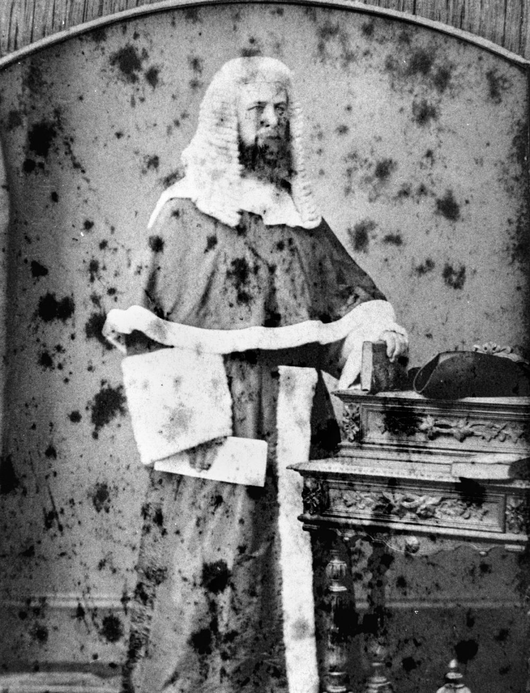

# Stories from Portion 5 (part 2)  

--8<-- "snippets/daniel-george-bloomfield.md"

--8<-- "snippets/hereward-humfy-henchman.md"

## The Harding Family <small>(5‑101‑30)</small>

George Rogers Harding (1868-1940), grazier and Walter Charles Harding (1870-1939), solicitor, were the sons of the Hon. George Rogers Harding, a senior Puisne Judge of the Queensland Supreme Court in the 19^th^ century. George's son, also named George Rogers Harding (1905-1937) and his brother, Christopher Winter Harding (1913-1982) were the founders of Harding Brothers, a wholesale merchandising business at Toowong.

{ width="40%" } <!-- { width="52.6%" } -->

*<small>[Justice George Rogers Harding, 1879](http://onesearch.slq.qld.gov.au/permalink/f/1upgmng/slq_alma21218166050002061) — State Library of Queensland.</small>* <!--  
*<small>[People outside the residence and store of T. Harding at Toowong](http://onesearch.slq.qld.gov.au/permalink/f/1upgmng/slq_alma21289902580002061) — State Library of Queensland.</small>* -->

<!-- also http://onesearch.slq.qld.gov.au/permalink/f/1upgmng/slq_digitool66263 -->

## Atwill Buxton Kenrick <small>(5‑71‑2)</small>

Atwill Buxton Kenrick (1863-1922), station manager and grazier, was born in Newcastle NSW the son of Atwill Kenrick and his wife Hannah (née Brookes). In February 1917, Mr. Kenrick married Miss Vans Macartney, the youngest daughter of John Arthur Macartney, of Ormiston House, Ormiston, Brisbane.

## Adolph Frederick Milford Feez <small>(5‑68‑3)</small>

Brisbane-born [Adolph Feez](https://adb.anu.edu.au/biography/feez-adolph-frederick-6150) (1858-1944) was a surveyor for a number of years before studying for the legal profession. He was admitted as a solicitor in December 1885 and commenced practice as a partner in MacPherson, Miskin & Feez. Later he was in partnership with Mr A.F.T. Ruthning. Feez Ruthning & Co operated until 1996.

## John Henry Flower <small>(5‑69‑2)</small>

John Henry Flower (1852- 1918) was a senior partner in the long established law firm of Flower & Hart. He was born in Port Fairy, Victoria but educated in England where he studied law. In 1886 he married Dora Kirk in Victoria. Their hilltop home at Windsor is now [heritage-listed](https://apps.des.qld.gov.au/heritage-register/detail/?id=600351).

--8<-- "snippets/john-arthur-macartney.md"

## Edward Vincent Pollock <small>(5‑62‑12)</small>

Irish-born Edward Vincent Pollock (1851-1911) was attached to the Admiralty branch of the British Civil Service. Later he and his wife Elizabeth migrated to Queensland arriving in Mackay in 1884. In 1889 he became Staff Paymaster-in-Charge and Secretary to Senior Naval Officer, Queensland Naval Defence Force and Fleet Paymaster and Secretary to the Naval Commandant of the Commonwealth Naval Force on 2 February 1904.

 

--8<-- "snippets/richard-william-curtis.md"

## Richard Langler Drew <small>(5‑43‑2)</small>

[Richard Langler Drew](https://adb.anu.edu.au/biography/drew-richard-langler-13302) (1823-1869) served with the Royal Navy before migrating from England to Victoria with his wife [Ann](https://adb.anu.edu.au/biography/drew-ann-anne-12893) c 1858. In 1861 they [moved to Brisbane](https://trove.nla.gov.au/newspaper/article/50044315) where he was appointed shipping master and secretary to the Marine Board. He donated land in Curlew Street Toowong overlooking the Burns Road cutting, for the first Church of St Thomas the Apostle, and was one of its original trustees.

--8<-- "snippets/william-atwell.md"

## Acknowledgements

Compiled and presented by Darcy and Lyn Maddock

## Sources

- [Family History Research](https://www.familyhistory.bdm.qld.gov.au) - The State of Queensland
- [Trove](https://trove.nla.gov.au) - National Library of Australia
- [The Honourable Hereward Henchman](https://www.sclqld.org.au/judicial-papers/judicial-profiles/profiles/hhhenchman) - Supreme Court Library Queensland
- Who's Who in Australia, 1921-1950 
- [Brisbane Lawyers – Splendid Men of the Old School](http://www.brisbanehistory.com/brisbane_lawyers.html) - www.brisbanehistory.com
- American Civil War Round Table Queensland 
- http://www.sampfordarundel.org.uk/sampage60.php *(broken)*
- http://archival-classic.sl.nsw.gov.au/item/itemDetailPaged.aspx?itemID=886767 *(broken)*

<!--

## Brochure

**[Download this walk](../assets/guides/portion5-part2.pdf)** - designed to be printed and folded in half to make an A5 brochure.

-->
