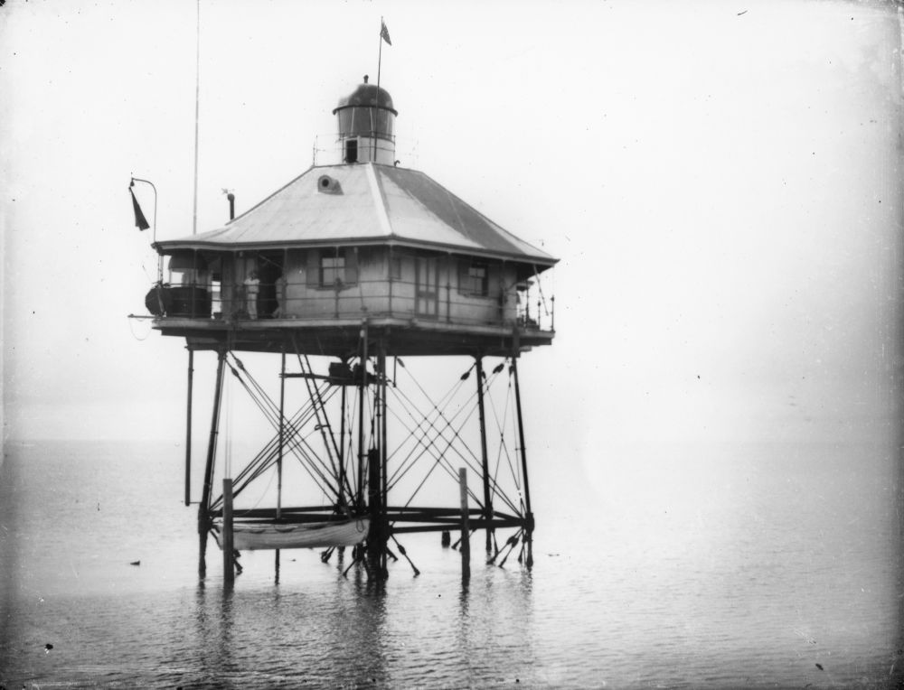
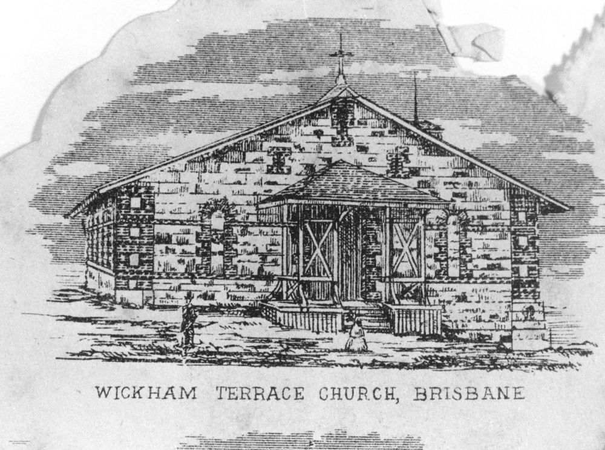

# Stories from Portions 6 and 24  

## Captain George and Jane Simpson <small>(24‑13‑16)</small>

George Simpson was born in the district of Eassie and Nevay in Forfarshire, Scotland on 15 December 1858 to parents George Simpson and Agnes Young. He came to Queensland as a young man and, on 22 February 1888 he married Jane Brady, daughter of David Brady and Mary Ann McMullen. Jane had arrived here with her family on the *Indus* in 1870 when she was 16. George was appointed to the Queensland Defence Department prior to Federation, served in the Boer War with the Light Horse and commanded the training camp at the Brisbane Exhibition Ground during WWI. George died on 22 January 1938 and Jane on 19 May 1945.

{ width="70%" }  

*<small>[Reviewing the troops in Brisbane during World War I](http://onesearch.slq.qld.gov.au/permalink/f/1upgmng/slq_alma21220035150002061) 1914 to 1918. The review of the armed forces probably took place in the Parade ring at the Exhibition Grounds, Brisbane. Dignitaries are stood on the reviewing stand facing the assembled members of the forces. — State Library of Queensland.</small>*

## John Robert and Emma Wilkinson <small>(24‑7‑13/14)</small>

John Robert Wilkinson was the third son of Robert Wilkinson and Mary (née Farrell). On 22 September 1886 he married Emma Oldham, youngest daughter of George and Emma Oldham. Both were from early Ipswich pioneer families. John was employed by the Railways Department as an engine driver and later, after moving to Brisbane, he became a building contractor. Three of their daughters and a son-in-law are also buried in the same grave.

## James Edward and Emily Jane Halliday <small>(24‑1‑8)</small>

James Edward Halliday was born in Glasgow Scotland in 1852 to parents James Crow Halliday and Alice Olker. A seaman in the Royal Navy, he married Emily Jane Leatherbarrow on 8 July 1874 in Salford, Manchester, England. Emily, born in 1852, was the daughter of Joseph and Mary Ann Leatherbarrow. James and Emily and their two children left Plymouth for Brisbane in 1880. Sadly one child died before reaching their destination. In 1899 James was appointed Superintendent of the Moreton Bay Pile Light and held that position until at least 1917. James died at his home named Mascot in South Pine Road Enoggera on 23 April 1930. Emily died on 26 March 1933.

{ width="70%" }  

*<small>[Early view of the Pile Lights in Moreton Bay, ca. 1895](http://onesearch.slq.qld.gov.au/permalink/f/1upgmng/slq_alma21220381070002061). Operational from 1882 and destroyed after collision with 'Wave Protector' in October 1949. — State Library of Queensland.</small>*

## Canon Thomas Jones <small>(6‑3‑8/9)</small>

Born in Preston, England, on 30^th^ July, 1836 to David Jones and Mary Ann Giles, Thomas Jones was teaching in England when Bishop Edward Wyndham Tufnell persuaded him to take Holy Orders. He was one of the 'Band of Brothers' who accompanied Bishop Tufnell to Brisbane in 1860. 

In 1861 he was the first Anglican priest ordained in Brisbane. He served in Rockhampton until the end of 1864 when he was appointed Vicar at the Wickham Terrace Episcopalian Church, the forerunner of All Saints' Church on 1 January 1865. 

In 1881 he became Rector of Toowoomba and later Archdeacon of the Downs and Western District. In 1890, Bishop Webber recognised his long and devoted service to the Diocese by appointing him a Canon of St John's. He was connected with the Anglican Church Grammar School from its beginnings in 1912. Canon Thomas Jones died on 14 August 1918 two weeks after his retirement.

{ width="30%" }  

*<small>[Reverend Cannon Thomas Jones, All Saints Church](http://onesearch.slq.qld.gov.au/permalink/f/1upgmng/slq_alma21220132750002061) 1865 — State Library of Queensland.</small>*

{ width="49.5%" } { width="48%" }  

*<small>[Original All Saints Church, Brisbane, ca. 1868](http://onesearch.slq.qld.gov.au/permalink/f/1upgmng/slq_alma21220196940002061) This image is taken from an engraving of W. Buxton. It depicts the original All Saints Church, designed by Benjamin Backhouse and constructed on Wickham Terrace in 1861-1862, opening on 23 February, 1862. It was replaced by a new church in 1869 — State Library of Queensland.</small>*  
*<small>[Some children in front of All Saint's Church in Wickham Terrace, Brisbane, ca. 1885](http://onesearch.slq.qld.gov.au/permalink/f/1upgmng/slq_alma21219373780002061) Photograph taken at the corner of Wharf Street and Wickham Terrace, Brisbane, looking along the latter street towards the Observatory. All Saint's Church (1869) is at left, whilst the original St Andrew's Presbyterian Church (1864) is in the middle distance — State Library of Queensland.</small>*

## Canon Walter and Mary Lorna Thompson <small>(6‑3‑11)</small>

Walter Thompson was born in Chelsea London in 1863 to a farmer, William John Thompson and his wife Mary Trevithick. Walter was ordained on 4 January 1891 in St John's Pro-Cathedral. Following appointments at the Holy Trinity Church Woolloongabba and at Jondaryan, he took up the first part of an incumbency at St Michael and All Angels' Church New Farm that would last over 40 years. 

On 27 November 1912 in St Michael and All Angels' Church, Walter married Mary Hopkins who was born on 8 September 1890 at Gooda Station, the eldest daughter of the squatter Edward Bor Hopkins and his wife Blanche (née Eglinton). Mary Thompson died on All Saints Day 1 November 1931 and Canon Walter Thompson on 8 January 1952.

<!--
{ width="70%" }  

*<small>[Holy Trinity Church of England at Woolloongabba, 1949](http://onesearch.slq.qld.gov.au/permalink/f/1upgmng/slq_alma21219189770002061) — State Library of Queensland.</small>*
-->

## Charles and Harriott Eleanor Highfield <small>(6‑11‑15/15A)</small>

Charles Highfield was born at Birkenhead Cheshire on 6 June 1840, the son of Samuel Highfield, a merchant and at one time English Consul at Livorno Italy and his wife, Ellen Jackson. In 1864 Charles left England on the ship *Royal Albert*. Upon arrival in Queensland, he took up land on the Logan River. 

Later in his life he became secretary of the Brisbane Merchants' Association, which position he occupied up to the time of his retirement from active business life about 1918. 

On 5 November 1870 he married a music teacher, Harriott Eleanor Munce, the daughter of William John Munce and Elizabeth Eleanor Mckinney. Harriott was born in Sydney on 6 October 1853. [Charles died on 10 September 1923](https://trove.nla.gov.au/newspaper/article/178411902) and [Harriott on 16 December 1937](https://trove.nla.gov.au/newspaper/article/184106204).

## Thomas, Fanny and Jessie McWatters <small>(6‑12‑20/21)</small>

Thomas was born in Belfast and arrived in Queensland with his parents, Hugh McWatters and his wife Jane (née Hillis), and brother James, in the sailing ship *Montmorency*, in 1863 when he was six months old. He grew up in Maryborough and the small village of Dundathu. He married Fanny Graham in 1896 and moved to Brisbane where they settled in Toowong, firstly in Sherwood Road and then in Woodstock St.

Thomas took a deep interest in the work and welfare of the Toowong Presbyterian Church. Fanny died in 1913. In 1916 Thomas married his second wife, Jessie Banks. [Thomas died](https://trove.nla.gov.au/newspaper/article/184103941) as a result of [an accident](https://trove.nla.gov.au/newspaper/article/37921425) on 17 December 1937.

## William John Dunstan <small>(6‑12‑15)</small>

[William John Dunstan](https://adb.anu.edu.au/biography/dunstan-william-john-6060) was born on 13 October 1873 at Eldorado, near Beechworth, Victoria, son of Ralph Henry Dunstan, a Cornish farmer, and his Irish wife Bridget (née Morrissey). He was a shearer, trade union official, and Labor member of the Queensland Legislative Council from 1920 to 1922, when the Council was abolished. A serious street accident in 1926 permanently affected his health, and he died on 13 September 1930.

## Rev Theodore Osborne <small>(6‑27‑17)</small>

Theodore Osborne was born in the State of New Jersey USA in 1837. He studied law before leaving the US during the American Civil War and arrived in Sydney penniless and friendless after the ship on which he was a passenger was wrecked off Raratonga in 1864. 

He became a school teacher until he was persuaded to join the church by the Rev Dr J D Lang. After qualifying he was appointed to various Presbyterian parishes in NSW. He retired to Lismore and passed away while undergoing medical treatment in Brisbane on 18 November 1940.

## Acknowledgements

Compiled and presented by Lyn Maddock

## Sources

- [Family History Research](https://www.familyhistory.bdm.qld.gov.au) - The State of Queensland
- [Trove](https://trove.nla.gov.au) - National Library of Australia
- [Former Members Register](https://www.parliament.qld.gov.au/Members/Former-Members/Former-Members-Register) - Parliament of Queensland
- [History](https://stmichaelsnewfarm.org.au/publications/history) - St Michael's and All Angels
- [St Michael & All Angels' Anglican Church Brunswick Street, New Farm](https://www.ohta.org.au/organs/organs/NewFarmAng.html) - Organ Historical Trust of Australia
- [About](https://www.allsaintsbrisbane.com/about-1) <!-- www.allsaintsbrisbane.com/about_all_saints --> - All Saints' Anglican Church Brisbane
- Northern Star Lismore, 4 December 1914 
- [All Saints' Anglican Church](https://www.ohta.org.au/confs/Qld/WickhamTerrace.html) - Organ Historical Trust of Australia
- [All Saints' Church, Brisbane 1862-1937](http://anglicanhistory.org/aus/wickham_kissick1937/03.html) - Project Canterbury
- [Moreton Bay Pile Light](https://lighthouses.org.au/qld/moreton-bay-pile-light/) <!--, www.lighthouses.org.au/lights/QLD/Moreton%20Bay/Moreton%20Bay.htm --> - Lighthouses of Australia Inc. 

<!--

## Brochure

**[Download this walk](../assets/guides/portion5-part2.pdf)** - designed to be printed and folded in half to make an A5 brochure.

-->
