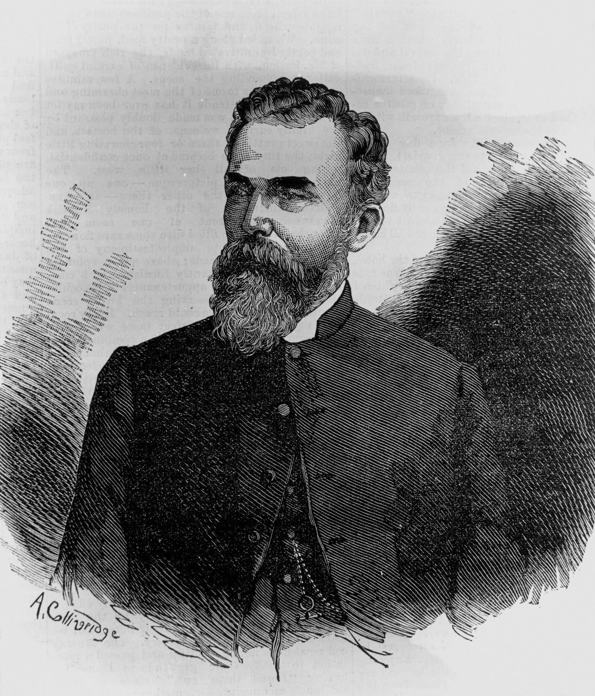
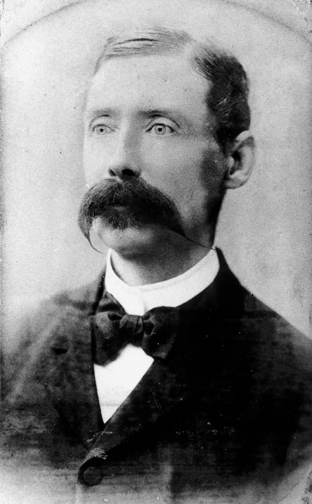

# Print Media Identities of Early Brisbane  

>**…our liberty depends on freedom of the press, and that cannot be limited without being lost.** 

<small>Thomas Jefferson 1787</small>

--8<-- "snippets/toowong-cemetery-map.md"

--8<-- "snippets/samuel-gill-mee.md"

--8<-- "snippets/thomas-wontner.md"

--8<-- "snippets/carl-adolf-feilberg.md"

<figure markdown>
  { width=40% class="full-width" }
  <figcaption markdown>[Carl Adolf Feilberg, ca. 1872](https://onesearch.slq.qld.gov.au/permalink/61SLQ_INST/dls06p/alma99183859582102061) - State Library of Queensland.</figcaption>
</figure>

--8<-- "snippets/walter-john-morley.md"

--8<-- "snippets/david-frederick-tudor-jones.md"

--8<-- "snippets/george-woolnough.md"

<figure markdown>
  { width=40% class="full-width" }
  <figcaption markdown>[Reverend George Woolnough, 1875](https://onesearch.slq.qld.gov.au/permalink/61SLQ_INST/dls06p/alma99183513706202061) - State Library of Queensland.</figcaption>
</figure>

--8<-- "snippets/james-and-george-cowlishaw.md"

--8<-- "snippets/john-james-knight.md"

<figure markdown>
  { width=40% class="full-width" }
  <figcaption markdown>[J. J. Knight](https://onesearch.slq.qld.gov.au/permalink/61SLQ_INST/1dejkfd/alma99184003594102061) - State Library of Queensland.</figcaption>
</figure>

--8<-- "snippets/james-george-drake.md"

<figure markdown>
  { width=40% class="full-width" }
  <figcaption markdown>[Hon. James George Drake](https://onesearch.slq.qld.gov.au/permalink/61SLQ_INST/dls06p/alma99183507087102061) - State Library of Queensland.</figcaption>
</figure>

--8<-- "snippets/richard-sanderson-taylor.md"

<figure markdown>
  { width=70% class="full-width" }
  <figcaption markdown>[Editor's office at the Brisbane Courier, ca. 1922](https://onesearch.slq.qld.gov.au/permalink/61SLQ_INST/dls06p/alma99183512990902061). Richard Sanderson Taylor, who was the editor at this time, is seated at his desk. - State Library of Queensland.</figcaption>
</figure>

--8<-- "snippets/robert-dunn.md"

--8<-- "snippets/martha-soutter.md"

<figure markdown>
  { width=70% class="full-width" }
  <figcaption markdown>[Soutter family pictured in a garden setting, Brisbane, 1910](https://onesearch.slq.qld.gov.au/permalink/61SLQ_INST/dls06p/alma99183505973802061). Pattie Soutter (seated) on the left - State Library of Queensland.</figcaption>
</figure>

--8<-- "snippets/edmund-james-thomas-barton.md"

## Acknowledgements

Compiled and presented by Lyn Maddock

## Sources

- Lack, Clem, [A Centuary of Brisbane Journalism](https://espace.library.uq.edu.au), 1951
- [Trove](https://trove.nla.gov.au) - National Library of Australia
- [Australian Dictionary of Biography](https://adb.anu.edu.au) - Australian National University
- [Grave Location Search](https://graves.brisbane.qld.gov.au) - Brisbane City Council

<!--

## Brochure

**[Download this walk](../assets/guides/printers.pdf)** - designed to be printed and folded in half to make an A5 brochure.

-->
