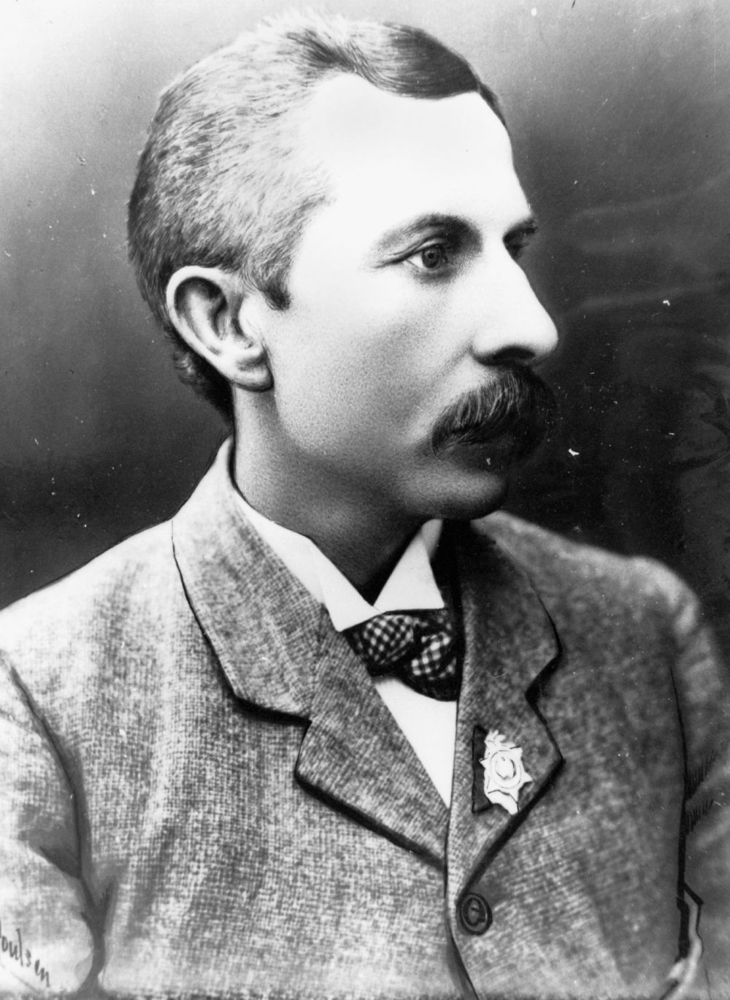

# Prospectors

<!--
???+ directions "Directions" 

    Starting point
    Walking directions to first headstone... is the grave of...
    
    { width="15%" }
-->

--8<-- "snippets/william-francis-faine.md"

{ width="70%" } 

*<small>[Horsedrawn whim at a goldfield in Gympie, 1870-1880](http://onesearch.slq.qld.gov.au/permalink/f/1upgmng/slq_alma21220354010002061) - State Library of Queensland </small>* 

<!--
??? directions "Directions" 

    Walking directions to next headstone... is the grave of...
    
    { width="15%" }
-->

--8<-- "snippets/william-james-muldoon.md"

--8<-- "snippets/sidney-spencer-broomfield.md"

--8<-- "snippets/frederick-achilles.md"

--8<-- "snippets/thomas-james-mattingley.md"

--8<-- "snippets/john-wilson-weir.md"

--8<-- "snippets/john-edward-maidens.md"

--8<-- "snippets/william-henley-rawlings.md"

## William Henry Browne <small>(11‑51‑3)</small>

<!-- TODO consolidate multiple entries into story page -->

William was born on 13 September 1846 in Pimlico, London to William Henry Browne and Eliza (née Barton). William was a Royal Navy seaman in 1857 before joining the merchant marines. William moved to Araluen, New South Wales in 1866, where he worked as a gold miner. 

He was the president and secretary Amalgamated Miners Association of Croydon and chairman of the Croydon Hospital Committee. His political career started in 1893 as the MLA for Croydon, the seat he held until his death on 12 April 1904. William was the leader of the Opposition and chairman of the Parliamentary Labor Party from 1900 to 1903 and then became Minister for Mines. William did not marry.

{ width="35%" }  

*<small>[Honourable William Henry Browne](http://onesearch.slq.qld.gov.au/permalink/f/1upgmng/slq_alma21218188950002061) - State Library of Queensland </small>* 

--8<-- "snippets/hugh-mosman.md"

--8<-- "snippets/william-chalmers-brown.md"

 

## Sources

- [Cemetery Search](https://graves.brisbane.qld.gov.au/) - Brisbane City Council  
- [Family History Research](https://www.qld.gov.au/law/births-deaths-marriages-and-divorces/family-history-research) - The State of Queensland
- [Queensland Parliament: Former Members](https://www.parliament.qld.gov.au/Members/Former-Members) - Queensland Parliament website
- [Trove](https://trove.nla.gov.au) - National Library of Australia

<!--

## Brochure

**[Download this walk](../assets/guides/prospectors.pdf)** - designed to be printed and folded in half to make an A5 brochure.

-->
