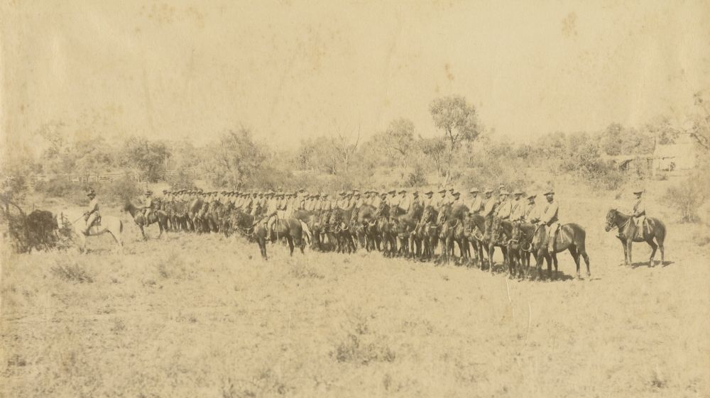
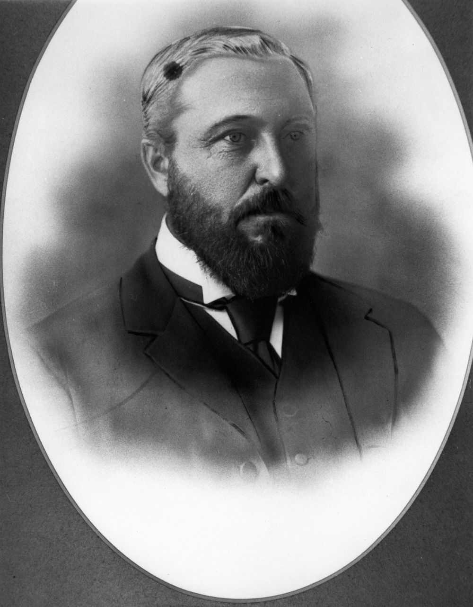

# The Great Shearers' Strike of 1891

**The Great Shearers' Strike occurred in central Queensland where shearers fought against wealthy squatters for better working conditions.**

*<small>[Contingent of soldiers preparing to ride west during the shearer's strike, 1891](http://onesearch.slq.qld.gov.au/permalink/f/1upgmng/slq_alma21270205600002061) -  State Library of Queensland. Cropped.</small>*

--8<-- "snippets/william-hamilton.md"

--8<-- "snippets/kenneth-hutchison.md"

## Sir Samuel Walker Griffith <small>(12‑11‑6/7)</small>

Welsh-born Sir Samuel Walker Griffith (1845-1920) was Premier of Queensland during the Shearers' Strike. A brilliant and hard-working lawyer, he prepared the first draft of the Australian Constitution in 1891 and was absent from Queensland for the first three months of the strike attending meetings in Hobart and Sydney, the latter for the first National Australasian Convention. 

He was Chief Justice of the Queensland Supreme Court from 1893 until 1903 when he was appointed the first Chief Justice of the High Court of Australia, a position he held until his retirement in 1919.

{ width="40%" }

*<small>[Sir Samuel Walker Griffith, 1889](http://onesearch.slq.qld.gov.au/permalink/f/1upgmng/slq_alma21220189370002061) -  State Library of Queensland</small>*

## Sir Horace Tozer <small>(12‑11‑8)</small>

Sir Horace Tozer (1844-1916) was born in Port Macquarie, NSW where his father, Horatio Thomas Norris Tozer was a chemist. Horace Tozer was admitted as a solicitor of the Supreme Court of Queensland in December 1867 and established a law practice at Gympie before entering politics. 

He was elected to the Legislative Assembly as the member for Wide Bay in 1888. From 12 August 1890 until his retirement from parliament in 1898, Tozer was never out of ministerial office. During the shearers' strike he held the position of Colonial Secretary and was left to manage the intricate affairs in which the Government was involved at the time.

{ width="40%" }

*<small>[Politician Sir Horace Tozer, 1890](http://onesearch.slq.qld.gov.au/permalink/f/1upgmng/slq_alma21218122630002061) -  State Library of Queensland</small>*

--8<-- "snippets/robert-archibald-ranking.md"

--8<-- "snippets/edwyn-mitford-lilley.md"

## John Ahern <small>(7‑51‑4)</small>

Inspector John Ahern (1840-1893) came to Queensland from his native Ireland and joined the Police Force in September 1864. Ahern was sent to Springsure in October and promoted to Senior Constable/Acting Sergeant in July 1868. He became Inspector of Slaughterhouses in the Mitchell district in February 1870 and received the substantial reward of £15 in September 1872 for ‘energetic perseverance in suppressing cattle-stealers in the Barcoo and Walgett districts’. 

Ahern was promoted to Senior Sergeant in January 1874 and Sub-Inspector 2^nd^ class in 1877. He served at Blackall in 1880 where he became Sub-Inspector 1^st^ class. By 1890, he had been promoted to Inspector 1^st^ class in charge of all brands throughout the colony. Ahern was generally recognised as one of the most able and experienced officers in the police force in the early 1890s and he was ordered to Clermont to maintain order during the strike. 

{ width="40%" }

*<small>[John Ahern](http://onesearch.slq.qld.gov.au/permalink/f/1upgmng/slq_alma21218566240002061) -  State Library of Queensland</small>*

--8<-- "snippets/virgil-power.md"

--8<-- "snippets/george-rogers-harding.md"

## Emma Miller <small>(13‑6‑5/6)</small>

Emma Miller (1839-1917) was known as a pioneer of the trade union movement and the Labour Party in Queensland. She championed equal pay and equal opportunity for women and in 1890 helped to form a female workers’ union, mainly of tailoresses. In 1891 she gave evidence to the royal commission into shops, factories and workshops and marched with shearers’ strike prisoners when they were released.

{ width="40%" }  

*<small>[Portrait of Mrs. Emma Miller](http://onesearch.slq.qld.gov.au/permalink/f/1c7c5vg/slq_alma21220238260002061) - State Library of Queensland. </small>* 

## Acknowledgements

- Compiled and presented by Lyn Maddock

## Sources

- [Trove](https://trove.nla.gov.au) - National Library of Australia 
- [The Honourable Virgil Power](https://www.sclqld.org.au/judicial-papers/judicial-profiles/profiles/vpower) - Supreme Court Library Queensland 
- [The Honourable George Harding](https://www.sclqld.org.au/judicial-papers/judicial-profiles/profiles/grharding) - Supreme Court Library Queensland
- [Harding, George Rogers (1838–1895)](https://adb.anu.edu.au/biography/harding-george-rogers-3712) - Australian Dictionary of Biography
- www.naa.gov.au/collection/explore/federation/constitution-website/stories/call-to-action/pods/sir-samuel-griffith-1891/index.html *(broken link)*

## Learn more 

- [Shearers’ Strike 1891](https://www.slq.qld.gov.au/blog/shearers-strike-1891) - State Library of Queensland

<!--

## Brochure

**[Download this walk](../assets/guides/???.pdf)** - designed to be printed and folded in half to make an A5 brochure.

-->
