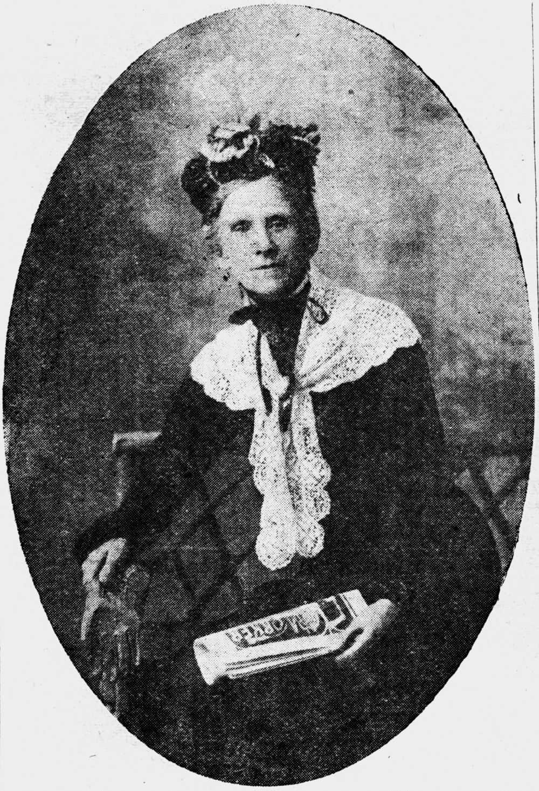

# One Adult, One Vote

**Queensland's own suffrage story** 

<!--
???+ directions "Directions" 

    Starting point
    Walking directions to first headstone... is the grave of...
    
    { width="15%" }
-->

--8<-- "snippets/leontine-cooper.md"

<!--
??? directions "Directions" 

    Walking directions to next headstone... is the grave of...
    
    { width="15%" }
-->

--8<-- "snippets/justin-fox-greenlaw-foxton.md"

## Emma Miller <small>(13‑6‑5/6)</small>

Emma was born in June 1839 in Chesterfield, Derbyshire. Her parents were Daniel Holmes a Chartist, and Martha (née Hollingworth). Emma arrived in Brisbane in 1879. She led the campaign for women's suffrage in Queensland as well as being at the forefront of the struggle for better working conditions for women workers. She was a foundation member of the Australian Labor Party. She campaigned tirelessly for freedom from conscription. Emma was president of the Women's Equal Franchise Association for the whole period of its existence, from 1894 to 1905 when white women in Queensland won the right to vote in state elections. Emma Miller died of cancer on 22 January 1917, two days after making her last speech to the Toowoomba Anti‑conscription League.

{ width="40%" }  

*<small>[Portrait of Emma Miller](http://onesearch.slq.qld.gov.au/permalink/f/1upgmng/slq_alma21218036320002061) — State Library of Queensland.</small>*

--8<-- "snippets/elizabeth-edwards.md"

--8<-- "snippets/robert-philp.md"

--8<-- "snippets/horace-tozer.md"

--8<-- "snippets/charles-lilley.md"

--8<-- "snippets/boyd-dunlop-morehead.md"

--8<-- "snippets/david-hay-dalrymple.md"

--8<-- "snippets/arthur-morgan.md"

*<small>[Women inside the gate of the city polling station, voting for the first time in a Queensland state election, May 1907](http://onesearch.slq.qld.gov.au/permalink/f/1upgmng/slq_digitool72579) — State Library of Queensland. Cropped. </small>*

## Acknowledgements

Compiled and presented by Lyn Maddock

## Sources

- [Australian Dictionary of Biography](https://adb.anu.edu.au) - Australian National University
- [Trove](https://trove.nla.gov.au) - National Library of Australia
- [Queensland Premiers](https://www.qld.gov.au/about/about-queensland/history/premiers) - The State of Queensland
- [Leading lights Leontine Cooper](https://womenssuffragepetitions.wordpress.com/2014/03/31/leading-lights-leontine-cooper/) - Women's Suffrage Petitions – Queensland
- Young, P, 2002: Emma Miller and the Campaign for Women's Suffrage in Queensland, 1984-1905. Memoirs of the Queensland Cultural Series 2(2): 223-230, Brisbane. ISSN 1440-4788
- [Sir Charles Lilley QC](https://www.sclqld.org.au/judicial-papers/judicial-profiles/profiles/clilley) - Supreme Court Library Queensland

<!-- https://hecate.communications-arts.uq.edu.au/files/4639/Centenary%20of%20Women%27s%20Suffrage%20in%20Queensland.pdf -->
