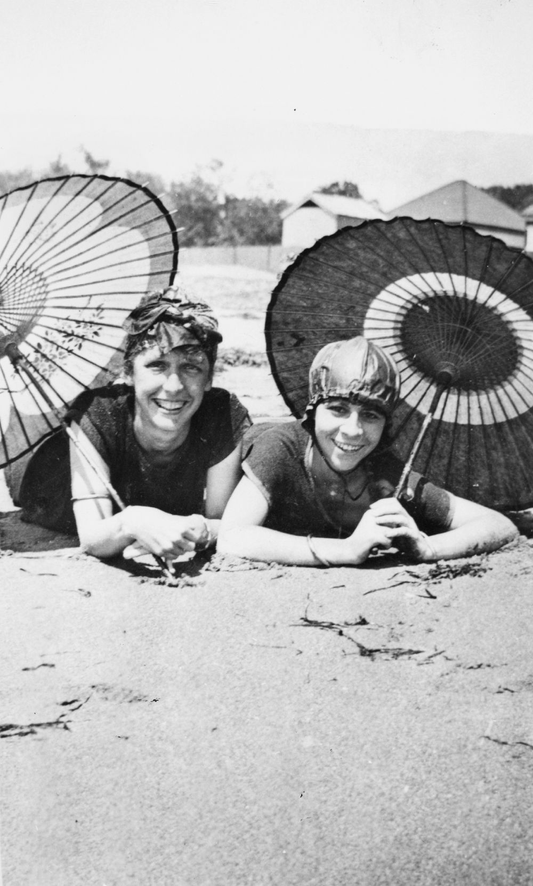
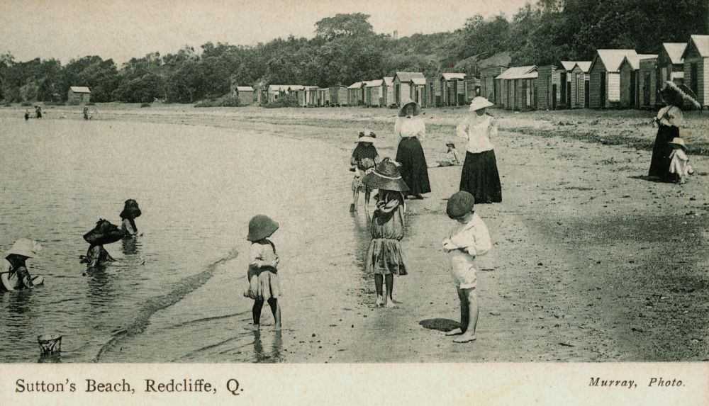
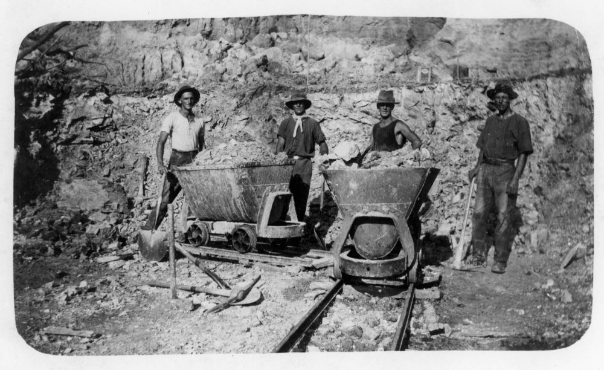
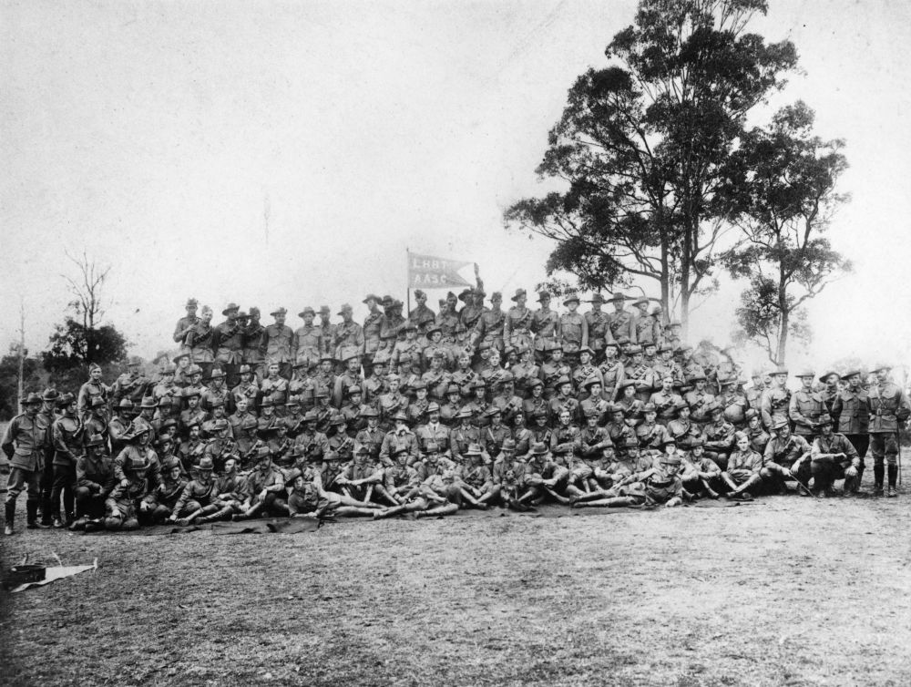

# Taken before their time

**Stories about people remembered in Toowong Cemetery that were taken before their time**.

<!--
???+ directions "Directions" 

    Starting point
    Walking directions to first headstone... is the grave of...
    
    { width="15%" }
-->

## Valentine Edward Spendelove <small>(2A‑10‑21/22)</small>

Valentine Edward Spendelove, the eldest son of Benjamin Spendelove and Ann (née Rowe), was born on the 14 February 1854 in Lutterworth, Leicestershire. Priscilla Shipley married Valentine, a carter, on 25 December 1876 in Walsall, Staffordshire.

They had six children, including three born in Queensland. The extended family arrived in Brisbane on 8 April 1885, aboard the *Merkara*. Valentine, a resident of Deighton Street, Dutton Park, [died in an accident](https://trove.nla.gov.au/newspaper/article/173719441) just after 10pm on 1 June 1904 at his work, the [Eureka Sanitary Works](https://www.timetravelclub.com.au/2016/05/eureka.html), Boggo Road, South Brisbane.

<!--
??? directions "Directions" 

    Walking directions to next headstone... is the grave of...
    
    { width="15%" }
-->

## Francis Emma Inving <small>(2A‑28‑19)</small>

Frances Emma Irving was born in Queensland on 12 December 1883 to Maxwell Henry Williatt Irving and Mary Jane (née Gielis). Work as a schoolteacher, transferred Fanny from Ayr State School to Ravenswood State School in May 1906. Another transfer in March 1910 moved Fanny to Harlaxton State School, Toowoomba.

On 7 January 1920 at about 10:30am, Fanny, aged 36 years, drowned at Sutton's Beach, Redcliffe. 

{ width="25%" }  { width="72.5%" }  

*<small>[Two young ladies relaxing in the sun under parasols at Sutton's Beach, Redcliffe, 1919](http://onesearch.slq.qld.gov.au/permalink/f/1upgmng/slq_alma21253920730002061) — State Library of Queensland.</small>*  
*<small>[Supervising toddlers on Sutton's Beach, Redcliffe, Queensland, 1906](http://onesearch.slq.qld.gov.au/permalink/f/1upgmng/slq_alma21272185470002061) — State Library of Queensland.</small>*

## Thomas John Mannion <small>(2A‑28‑28/29/30)</small>

Thomas John Mannion was born in Brisbane on 25 April 1873 to George Mannion and Deborah (née Hodgings). Thomas died on Friday 21 December 1894 at Mooloolah, while [tree driving](https://trove.nla.gov.au/newspaper/article/183702590).

## Andrew John Dark <small>(5‑40‑17/18)</small>

Andrew John Dark and Emily (née Leffen) were the parents of Andrew John Dark, who was born in July 1880 at St Olave Bermondsey, London. The family arrived in Brisbane from London aboard the *Dorunda* on 21 October 1884.

Andrew drowned in the [*Roxana* disaster](https://trove.nla.gov.au/newspaper/article/173378003) on 26 December 1901, aged 21 years and 6 months.

## Robert McMullin <small>(5‑89‑1/2)</small>

A son of Andrew McMullin and Jane (née Johnston), Robert was born circa 1877 in Ballyconnell, County Cavan, Ireland. Bertha Mary Louise Winsch married Robert at Cedar Creek, Queensland on 29 December 1903. They had three children. Robert died on 17 July 1907 following [a fall from a milk cart](https://trove.nla.gov.au/newspaper/article/175930198) in Musgrave Road, Red Hill. 

## Walter Jones <small>(5‑121‑13)</small>

Walter Jones was born in London circa 1888. Walter was an able seaman aboard the Aberdeen liner, *ss Themistocles*. The liner arrived from London on Saturday 22 March 1913. Walter [drowned while bathing](https://trove.nla.gov.au/newspaper/article/179880083) in the Brisbane River at Bulimba at 2pm on Sunday 23 March 1913, aged 24 years. Walter's body was retrieved about 7am two days later.

## Sidney Arthur Kennoch <small>(5‑121‑13)</small>

Sidney Arthur Kennoch, a son of John Henry Kennoch and Elizabeth (Lizzie) France (née Nicholson), was born in Queensland on 26 August 1913. Sid, of Qualtrough Street, Woolloongabba, died in the Brisbane Hospital at 10:45pm 5 November 1931, aged 18 years from [an accident](https://trove.nla.gov.au/newspaper/article/230967068) while preparing to commemorate Guy Fawkes Night.

## Jean and Marjorie Osborne <small>(29‑28‑15/16)</small>

Daughters of Robert Francis Osborne and Martha (née Orth), Jean was born about 1824 and Marjorie was born about 1827. The girls, of Gaythorne Road, Gaythorne, [died at the old Virginia Brickworks](https://trove.nla.gov.au/newspaper/article/36803231), Pickering Street, Enoggera, about 10:30am on Thursday 2 January 1936.

{ width="70%" }  

*<small>[Virginia Brickworks clay pit at Enoggera, ca. 1920](http://onesearch.slq.qld.gov.au/permalink/f/1upgmng/slq_alma21220411160002061) — State Library of Queensland.</small>*

## John Heywood <small>(29‑30‑1)</small>

John Heywood, born in Brisbane on 7 April 1891, was a son of Edward Heywood and Sarah (née Colley). Julia Kelly married John in Brisbane on 11 March 1916. They had three Brisbane born children. John, a builder and contractor, who resided in Primrose Street, Newmarket, died from [an accident at the Crown Stove and Foundry Company](https://trove.nla.gov.au/newspaper/article/183828153), Sacksville Street, Holland Park on 14 November 1934.

## William Royalston Morris <small>(29A‑46‑16)</small>

William Roy Morris was born in Queensland to William George Morris and Florence Elizabeth Cristina (née Klinge) on 8 January 1901. Thirty-six year old Roy, of George Street, Brisbane, who was employed working on main road works, died in the Brisbane General Hospital about 11:20am on 5 May 1937 following a traffic accident on the Brisbane-Ipswich Road at Wacol the previous day. 

## Edward Amos Budd <small>(29A‑46‑17)</small>

Edward Amos Budd was born to Edward Nelson Budd and Fanny (née Crisp), in Allora, Queensland on 20 August 1893. Amy Millicent Knox married Edward in Brisbane on 03 October 1914. 

Ned, of Newmarket Road, Windsor, was an Engine Driver when he [enlisted in the AIF](https://trove.nla.gov.au/newspaper/article/187080956) on 22 January 1917. Private Budd, assigned to the 27/5 Light Horse Regiment, was discharged in May 1919. 

A Brisbane City Council employee, Ned died instantly in a head on collision between his motorcycle and a car on the Pacific Highway, Beenleigh, on 17 January 1937.

{ width="70%" }  

*<small>[Light Horse Brigade, Enoggera, Queensland](http://onesearch.slq.qld.gov.au/permalink/f/1upgmng/slq_alma21220526510002061), Australian Army Service Corp. (A.A.S.C.), 5^th^ Australian Army Corps — State Library of Queensland.</small>*

## Norman James Royle <small>(29A‑46‑4)</small>

Norman James Royle was born in Queensland to Ernest Alfred Milton Royle and Elizabeth Theresa (née Byrom) on 14 January 1914. Norman resided at 55 Enoggera Terrace, Rad Hill and was employed as a painter by Mr Hanscombe, a Paddington sign writer. 

Aged 22 years, Norman died in the Brisbane Hospital at 2:15pm on 12 January 1937 following [an accident on his bicycle](https://trove.nla.gov.au/newspaper/article/183395473) at 7:50am that morning.

## Ernest Greenfield <small>(29A‑67‑5/6)</small>

Ernest was born to William Henry Greenfield and Ada Harriet (née Brown) in the Paddington District, NSW on 16 December 1883.
Ernest worked for Greenfield Bros, opticians. After boarding the *ss Yongala* in Mackay for
Townsville, Ernest was aboard when they left Mackay at 1:40pm on 23 March 1911. The final sighting of the *ss Yongala* was by the Dent Island lighthouse keeper at 6:30pm that same day. [All hands were believed lost](https://trove.nla.gov.au/newspaper/article/19670004) during a cyclone.

<!--

## Brochure

**[Download this walk](../assets/guides/taken-before-their-time.pdf)** - designed to be printed and folded in half to make an A5 brochure.

-->
