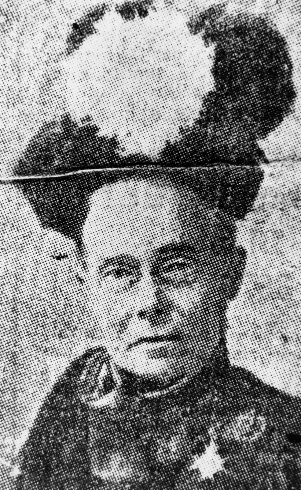
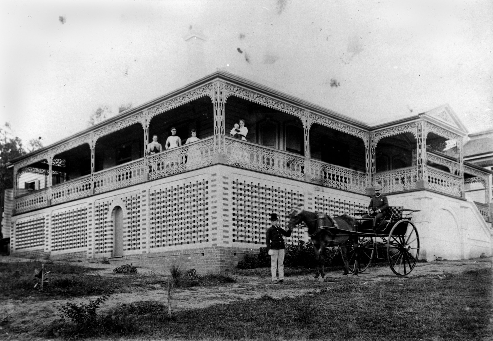
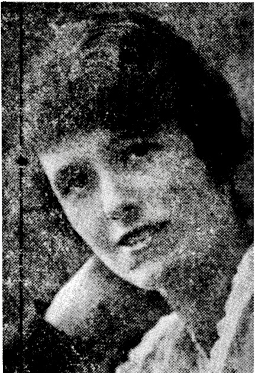
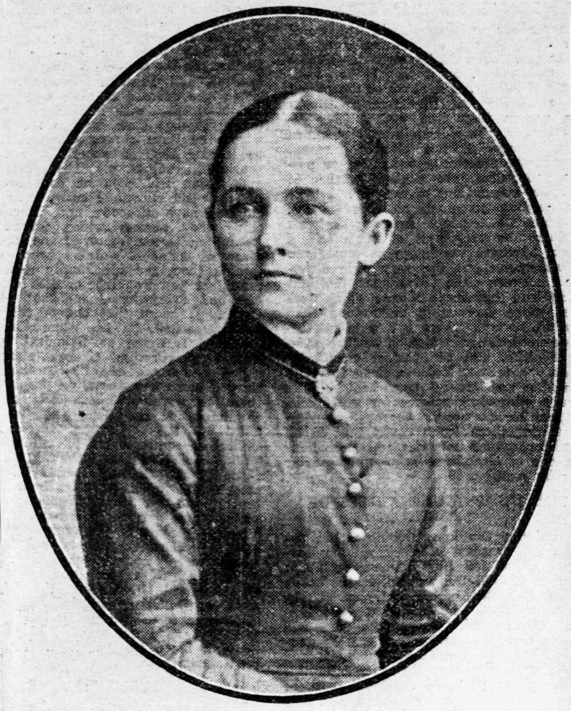

--8<-- "snippets/sem/stories/the-other-half.json"

# The Other Half 

**Stories about women who made an impact on Queensland**

--8<-- "snippets/toowong-cemetery-map.md"

## Annie Perry <small>(13‑70‑5)</small>

Annie Perry was the daughter of William Harcourt, a brass founder and his wife, Elizabeth Mills. She was born on 5 September 1834 in Edgbaston, a suburb of Birmingham in England. Annie arrived in Sydney with her parents and sister on the ship *La Hogue* on 26 October 1860. On 27 February 1862 she was married in St Philips’ Church in Sydney by the Anglican Dean of Sydney to William Perry, one of Brisbane’s early businessmen and later a member of the Qld Legislative Council.

At the time of her death, Annie was one of the longest serving members of the committees of the Children’s and Lady Bowen Hospitals. She also took a great interest in the Creche and Kindergarten Association after its formation in 1907, the Queensland Society for the Prevention of Cruelty and all movements that had as their aim the betterment of the conditions for women, children and animals. Annie
passed away at the age of 82 years on 12 May 1917.

<figure markdown>
  { width="70%" class="full-width" }
  <figcaption markdown>[Lady Bowen Lying-in Hospital on Wickham Terrace, Brisbane](https://onesearch.slq.qld.gov.au/permalink/61SLQ_INST/dls06p/alma99183512644802061), 1912 — State Library of Queensland.</figcaption>
</figure>

## Mary Harriett Griffith <small>(13‑77‑12)</small>

Mary Harriett Griffith was born on 4 November 1849 at Portishead, Somerset, England. She was the older sister of Sir Samuel Walker Griffith who was Colonial Secretary, Queensland Premier from 1883 to 1888, Chief Justice of the High Court of Australia and a principal author of the Constitution of Australia.

After the deaths of her parents Mary immersed herself in good works. She became founding secretary of the Brisbane Benevolent Society, honorary secretary of the Lady Musgrave Lodge, Queensland representative for the Travellers’ Aid Society, president of the YWCA in Brisbane, vice-president of the British (Australian) Red Cross Society during World War I and patroness in 1921 of St David’s Welsh Society as well as being involved in many other organisations. In 1911 Mary Griffith was created a Lady of Grace of the Order of the Hospital of St John of Jerusalem. Mary passed away on 27 July 1930 in her 81st year.

<figure markdown>
  { width="30%" class="full-width" }
  <figcaption markdown>[Mary Harriett Griffith, sister of Sir Samuel Walker Griffith](https://onesearch.slq.qld.gov.au/permalink/61SLQ_INST/dls06p/alma99183505134202061) — State Library of Queensland.</figcaption>
</figure>

## Leila Elizabeth Perry <small>(11‑45‑4)</small>

Leila was the daughter of John Markwell and his wife, Georgina Edmondstone and the granddaughter of Hon George Edmondstone, one of the early pioneers of Brisbane. John Markwell was one of John Dunmore Lang’s immigrants who had arrived in Brisbane on the *Chasely* in 1850 and had involved himself in land speculation and several businesses in Brisbane. Leila was born on 24 January 1868 in *Moorlands Villa* on the property at Auchenflower where the Wesley Hospital now stands. On 29 September 1885, at St Andrew’s Church at Lutwyche Leila married
into another prosperous merchant family, the Perrys. Her husband, William Herbert Francis Perry was the eldest son of William Perry and Annie Harcourt.

Leila and her husband were frequently featured and cited in the social pages of the Brisbane newspapers. Leila died at her home *[Miegunyah](https://www.miegunyah.org)*, Jordan Terrace, Bowen Hills on 17 March 1920.

<figure markdown>
  { width="70%" class="full-width" }
  <figcaption markdown>[On the verandah at Miegunyah, a residence in Brisbane, 1886](https://onesearch.slq.qld.gov.au/permalink/61SLQ_INST/dls06p/alma99183513641502061) — State Library of Queensland.</figcaption>
</figure>

## Magdalene Dick <small>(18‑35‑25)</small>

Magdalene Dick was born in Brecon, Wales around 1851. She was the daughter of David Price, a plumber, glazier and painter and his wife, Mary William or Williams. Magdalene came to Australia as a young girl and the family settled in Ballarat where she later married William Heddel Dick, a journalist who wrote for major newspapers in Sydney, Hobart and Brisbane and who established a penny newspaper in Toowong. Magdalene was also a journalist and sister of Thomas Evan Price who was the social and drama critic of the Sydney Morning Herald. 

After William’s death Magdalene became superintendent of the first group of female switchboard operators at the Brisbane telephone exchange.

<figure markdown>
  { width="70%" class="full-width" }
  <figcaption markdown>[Telephonists working at the, Brisbane Central telephone exchange, Brisbane, 1910](https://onesearch.slq.qld.gov.au/permalink/61SLQ_INST/bumb4u/alma99184003680302061) — State Library of Queensland.</figcaption>
</figure>

## Kathleen Eileen Sheehy <small>(7A‑135‑12)</small>

Kathleen Eileen Sheehy was born on 4 November 1892 at Gympie, the second of six children of Irish-born parents. She was the sister of Sir Joseph Sheehy KBE who served as Senior Puisne Judge of the Queensland Supreme Court and Administrator of the State of Queensland for three months in 1969 and Sir Christopher Sheehy, dairy industry administrator and public servant.

Kathleen joined the State teaching service in 1912. Following appointments at various schools throughout Queensland, Kathleen was appointed teacher-in-charge of the ‘backward’ classes at South Brisbane Boys’ School. In 1926 she recommended that these classes be referred to as ‘opportunity’ classes rather than ‘backward’ and her commendation was accepted by the Education Office in July that year. In 1935, the Dutton Park Opportunity School which catered for both boys and girls opened as the first of its type in this State with Kathleen Sheehy as teacher and three female assistants.

Kathleen retired at the end of the 1958 school year. She died on 22 April 1981 and was buried with Catholic rites in the family grave in Toowong Cemetery.

<figure markdown>
  { width="30%" class="full-width" }
  <figcaption markdown>Kathleen Sheehy, first Head Teacher of the Dutton Park Opportunity School, in [Female teachers 1860–1983](https://education.qld.gov.au/about-us/history/chronology-of-education-in-queensland/female-teachers), p30 — © The State of Queensland (Department of Education).</figcaption>
</figure>

## Mary ‘Eva’ O’Doherty <small>(7‑58‑27)</small>

Mary Anne Kelly (better known as ‘*Eva of The Nation*') was born in Headford, County Galway, at the home of her maternal grandparents, on 15 February 1830, the daughter of a wealthy gentleman-farmer Edward Kelly of Killeen near Portumna who had nationalist sympathies. At the age of twelve, Mary Kelly sent her first verse to Charles Gavan Duffy, founder of The Nation newspaper when it started in Dublin in 1842. The poem expressed her feelings towards the British who governed the whole of Ireland at that time. Mary Kelly later adopted the pen name of ‘Eva’. 

She became romantically involved with a young medical student Kevin O’Doherty who was one of the rising men in the Irish national movement. As a result of the Young Irelander Rebellion of 1848, Kevin O’Doherty was found guilty of sedition and sentenced to transportation to Van Dieman’s Land. ‘Eva’ continued to write prose and poetry with many lyrics mourning the absence of her then fiancé as she waited for his release. 

Despite a conditional pardon which forbade residence in the United Kingdom, Kevin O’Doherty entered illegally into Ireland. A few days later, the couple married in a clandestine ceremony in London. After Dr O’Doherty completed further medical studies, the family with by then three sons migrated to Australia, and made their way to Ipswich and later to Brisbane.

The family struck hard times later in life and, after Dr O’Doherty’s death, the Irish community conducted fund-raising activities to assist ‘Eva’. [Her poems](https://www.oldqldpoetry.com/eva-mary-odoherty) were published in 1909 with the help of a priest. Eva died from influenza on 19 May 1910 at the age of 81.

<figure markdown>
  { width="40%" class="full-width" }
  <figcaption markdown>[Portrait of Mary Eva O'Doherty](https://onesearch.slq.qld.gov.au/permalink/61SLQ_INST/dls06p/alma99183505559502061) — State Library of Queensland.</figcaption>
</figure>

## Mary Mayne & Mary Emelia Mayne <small>(7‑49‑9)</small>

Mary McIntosh was born ca. 16 August 1826 at Kilkishen, near Ennis, County Clare, Ireland. She migrated to Sydney as a single woman in the *Champion* in February 1842. On 9 April 1849 in Brisbane she married Patrick Mayne.

Mary and Patrick had six children, of whom three sons and two daughters reached adulthood. Patrick purchased a butchery in Queen Street Brisbane in 1849, built a substantial enterprise owning hotels, shops and houses, and speculated in land. He was on the first municipal council in Brisbane.

A codicil to Patrick’s will appointed Mary as executrix of the Mayne estate. After his death on 17 August 1865, Mary largely controlled the management of the estate. In March 1876 she bought *Moorlands Villa* to become the family home and almost six hectares of land on which it stood at Auchenflower. Mary died of coronary heart disease at the age of 63 on 4 September 1889.

Mary Emelia Mayne, born 31 December 1858, was the second youngest daughter of Mary and Patrick. [She was a philanthropist](https://trove.nla.gov.au/newspaper/article/22759764) along with her brother, James.

<figure markdown>
  { width="40%" class="full-width" }
  <figcaption markdown>[Emelia Mayne](https://onesearch.slq.qld.gov.au/permalink/61SLQ_INST/dls06p/alma99184003617102061). — State Library of Queensland.</figcaption>
</figure>

## Ann Drew <small>(5‑43‑22)</small>

Ann was born in 1822 at Ashton, in Devon England, daughter of John Cornish, a yeoman farmer and his wife Sarah Smalridge. On 21 December 1848 Ann married Richard Langler Drew at St James Church, Exeter.

Ann and Richard migrated to Victoria in about 1858 and three years later they moved to Queensland where Richard was appointed shipping master and secretary to the Marine Board. Over the next four decades, particularly after her husband’s death in 1869, Ann was deeply involved in the administration of a number of welfare institutions, including the Lady Bowen Hospital, [Female Refuge and Infants' Home](https://www.findandconnect.gov.au/ref/qld/biogs/QE00329b.htm), Lady Musgrave Lodge and the Social Purity Society. Ann also took part in agitation to repeal the Queensland Contagious Diseases Act of 1868. Ann died at Sandgate, near Brisbane, on 5 August 1907.

<figure markdown>
  { width="70%" class="full-width" }
  <figcaption markdown>[Female Refuge & Infants' Home, Brisbane, ca. 1885](https://onesearch.slq.qld.gov.au/permalink/61SLQ_INST/dls06p/alma99183513293302061). — State Library of Queensland.</figcaption>
</figure>

## Acknowledgements

Written by Lyn Maddock
