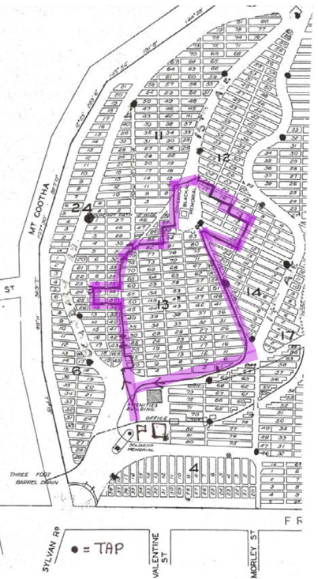

--8<-- "snippets/sem/stories/toowong-identities-1.json"

# Toowong Identities

**Stories to commemorate the centenary of the proclamation of the Town of Toowong in 1903**.

On 19 August 1903, the Shire of Toowong was proclaimed a town. At the time, the population numbered about 4700. The town grew rapidly, reaching 10,000 residents by 1922. Three years later the Toowong Town Council was absorbed into the Brisbane City Council.^1^ 

--8<-- "snippets/toowong-cemetery-map.md"

<!-- In August 2003, community celebrations were held to mark the centenary. 

These stories were conceived as part of commemorative activities. It features only a small number of those former Toowong residents and associates who contributed in some way to Toowong’s social history. 
-->

<!--
{ width="40%" }

???+ directions "Directions" 

    Commencing at the flagpole, walk behind the Amenities Block and cross Emma Miller Avenue. Head the path which separates Portions 9 and 13. In the second row to the right, behind the large white Petrie Family grave is the grey granite obelisk of...
-->

## Andrew Lang Petrie <small>[(13‑10‑7)](https://brisbane.discovereverafter.com/profile/31981437 "Go to Memorial Information" )</small>

The first member of his family born in Australia in 1854, Andrew Lang Petrie relocated the family’s stonemason’s yard from the corner of Queen and Wharf Street to the Toowong Cemetery gates in 1882. The site is now occupied by Toowong Mitsubishi.

--8<-- "snippets/john-petrie-and-sons-advertisement.md"

<!--
??? directions "Directions" 

    Immediately behind the is the family grave of...
-->

--8<-- "snippets/george-harpur-jones.md"

<!--
??? directions "Directions" 

    Proceed one section further up and to the left a few graves in is the ornate white marble monument of the...
-->

## Munce Family <small>[(9‑43‑11)](https://brisbane.discovereverafter.com/profile/31982449 "Go to Memorial Information" )</small>

Irishman William John Munce died at his Toowong home *Caltura* in 1892 aged 77. *Caltura*, believed to be located at 82 Jephson Street, was named after the Ceylonese birthplace of his wife, Elizabeth who died at Sandgate in 1901. One of their daughters, Ada Kate, never married and died at *Cultura* in 1944 aged 78.

<!--
??? directions "Directions" 

    Diagonally across the path on the right is the grave of ...
-->

--8<-- "snippets/charles-patterson.md"

<!--
??? directions "Directions" 

    Continue straight up the path passing eight rows of graves until you come to, on the left, the obelisk marking the grave of ...
-->
    
--8<-- "snippets/robert-cribb.md"

<!--
??? directions "Directions" 

    Continuing left along the same row you will come to ...
-->

--8<-- "snippets/henry-howard-payne.md"

<!--
??? directions "Directions" 

    Directly ahead of the Payne grave is ...
-->

--8<-- "snippets/john-melville.md"

<!--
??? directions "Directions" 

    Return to the main path. Look across to the right towards the centre of portion 13.
-->

--8<-- "snippets/henry-sleath.md"

<!--
??? directions "Directions" 

    Also in the centre of portion 13 is ...
-->

--8<-- "snippets/james-valentine.md"

<!--
??? directions "Directions" 

    Continuing up the path until you come to the small sandstone obelisk of ...
-->
  
--8<-- "snippets/francis-drummond-grenville-stanley.md"

<!--
??? directions "Directions" 

    Continuing up the hill until the path splits, turn left and a few graves down is the grave of...
-->

--8<-- "snippets/john-fewings.md"

<!--
??? directions "Directions" 

    Cross straight across the path and head in two sections until you reach the sarcophagus‑style monument to...
-->

--8<-- "snippets/thomas-finney.md"

<!--
??? directions "Directions" 

    Head straight up the hill until you reach cross‑mounted headstone of...
-->

--8<-- "snippets/arthur-palmer.md"

<!--
??? directions "Directions" 

    Pass the Blackall Monument until you reach, on the left, the wreath‑mounted obelisk of...
-->

--8<-- "snippets/william-richer.md"

<!--
??? directions "Directions" 

    Cross the road and head down the slope until you come across the broken column marking the grave of ...
-->

--8<-- "snippets/charles-siemon.md"

<!--
??? directions "Directions" 

    Head one section back towards the Blackall Monument and one section down the slope. The Watson Family headstone has been laid down. 
-->

## Archibald Watson <small>[(12‑13-2)](https://brisbane.discovereverafter.com/profile/31734740 "Go to Memorial Information" )</small>

Archibald was the Chairman of the Toowong Fire Brigade, which had built a [fire station in Jephson Street in 1919](https://heritage.brisbane.qld.gov.au/heritage-places/1703). He was the last Mayor of Toowong in 1925 and went on to serve as an Alderman on the Brisbane City Council between 1926 and 1931. He was Deputy Mayor from 1926 to 1931 and was Lord Mayor from February to May 1931.

{ width="70%" }  

*<small>[Early view of the Royal Exchange Hotel, Toowong, ca. 1908](http://onesearch.slq.qld.gov.au/permalink/f/1upgmng/slq_alma21220193590002061). The hotel and former fire station were situated in High Street, Toowong. The Jephson St Fire Station replaced the High Street Fire Station and was closed on 2 February 1981. — State Library of Queensland. </small>*

<!--
??? directions "Directions" 

    Head to the lower end of the section and follow the row of trees towards Frederick Street. Turn right into the row which contains the large, white, ornate monument of...
-->

--8<-- "snippets/jessie-philp.md"

<!--
??? directions "Directions" 

    Continue up the same row until you see on the right the sarcophagus of...
-->

--8<-- "snippets/augustus-charles-gregory.md"

<!--
??? directions "Directions" 

    Return to the main path which separates Portions 13 and 14 and head down the hill to the bottom. As you curve around to the right, in the front row of potion 13 is the grave of...
-->

--8<-- "snippets/alfred-roberts.md"

## Acknowledgements

Written by [Dr. Hilda Maclean](https://www.linkedin.com/in/dr-hilda-maclean-4819a711/).

Sponsored by Judy Magub, Councillor for Toowong, 1994—2007

{ width="15%" }

## Sources 

1: Leggett, S. and Grant, R. (eds) Toowong: A community’s history, Toowong, West Toowong Community Association Inc., 2003

<!--

## Brochure

**[Download this walk](../assets/guides/toowong-identities-1.pdf)** - designed to be printed and folded in half to make an A5 brochure.

-->
