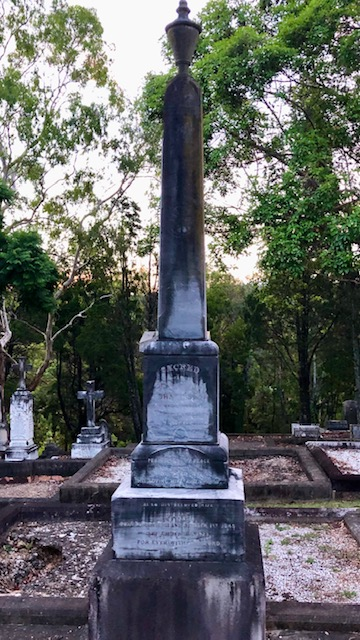
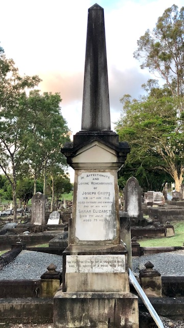

# Undertakers  

{ width="70%" }

*<small>[John Hislop Undertakers, Brisbane, ca. 1902](http://onesearch.slq.qld.gov.au/permalink/f/1c7c5vg/slq_alma21220144750002061), held by John Oxley Library, State Library of Queensland</small>*

--8<-- "snippets/george-barney-petrie.md"

--8<-- "snippets/alex-gow.md"

--8<-- "snippets/john-hislop.md"

{ width="70%" }

*<small>[John Hislop Undertakers in a funeral procession in Brisbane, ca. 1892](http://onesearch.slq.qld.gov.au/permalink/f/1upgmng/slq_alma21220116790002061), held by John Oxley Library, State Library of Queensland. It is believed the procession is in Sylvan Road (previously Cemetery Road) on corner of Kate Street.</small>*

--8<-- "snippets/alma-adlington.md"

--8<-- "snippets/george-sillett.md"

--8<-- "snippets/walter-barrett.md"

--8<-- "snippets/kate-mary-smith.md"

<!--
??? directions "Directions" 

    Walking directions to headstone... is the grave of...
    
    { width="15%" }  
    
    Walking directions to headstone... is the grave of...

    { width="15%" }  
-->

--8<-- "snippets/cannon-cripps.md"

## Further Reading 

- Maclean, H. 2012, *The Undertakers’ Picnic* in England, M. (comp.) [Toowong 1863 – 2011](http://www.toowong.org.au/books_for_sale.htm). Toowong, Qld. Toowong History Group
- Nolan, C. 2009, *A family undertaking: Alex Gow Funerals The history of a funeral business 1840-2009*. Newstead, Qld. Alex Gow Pty Ltd.

## Acknowledgements

Thank you to Laurel Shanley from [K. M. Smith Funerals](https://kmsmith.com.au) for providing the story of Kate Mary Smith

<!--

## Brochure

[Download the PDF of this walk](../assets/guides/undertakers.pdf), print it, and fold it in half to make an A5 booklet. 

-->
