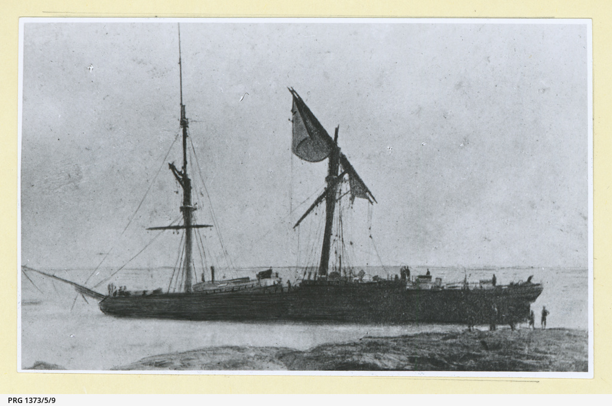

# At the mercy of the weather

{ width="70%" }  

*<small>[The 'Young Australia' wrecked at Moreton Island, Queensland](https://collections.slsa.sa.gov.au/resource/PRG+1373/5/9) — State Library of South Australia  - PRG 1373/5/9</small>*

<!--
[{ width="40%" }](../assets/toowong-identities-1-map-sml.jpg)

???+ directions "Directions" 

    Commencing at ...
--> 

--8<-- "snippets/no-spoilers.md"

--8<-- "snippets/robert-bulcock.md"

<!--
??? directions "Directions" 

    Proceed to...
-->

--8<-- "snippets/thomas-illidge.md"

<!--
??? directions "Directions" 

    Proceed to...
-->

--8<-- "snippets/joseph-bancroft.md"

<!--
??? directions "Directions" 

    Proceed to...
-->

--8<-- "snippets/james-brayden.md"

<!--
??? directions "Directions" 

    Proceed to...
-->

--8<-- "snippets/richard-henry-sholl.md"

<!--
??? directions "Directions" 

    Proceed to...
-->

--8<-- "snippets/daniel-rowntree-somerset.md"

<!--
??? directions "Directions" 

    Proceed to...
-->

--8<-- "snippets/james-clark.md"

<!--
??? directions "Directions" 

    Proceed to...
-->

--8<-- "snippets/charles-le-brocq.md"

<!--
??? directions "Directions" 

    Proceed to...
-->

--8<-- "snippets/edmund-macdonnell.md"

<!--
??? directions "Directions" 

    Proceed to...
-->

--8<-- "snippets/james-walker-cutten.md"

<!--
??? directions "Directions" 

    Proceed to...
-->

## Acknowledgements

Compiled and presented by Lyn Maddock

## Sources 

- [Australian Dictionary of Biography](https://adb.anu.edu.au), Australian National University
    - [Clark, James (1857–1933)](https://adb.anu.edu.au/biography/clark-james-5664)
    - [Bancroft, Thomas Lane (1860–1933)](https://adb.anu.edu.au/biography/bancroft-thomas-lane-5120)
    - [Bancroft, Joseph (1836–1894)](https://adb.anu.edu.au/biography/bancroft-joseph-2927)
- [Trove](https://trove.nla.gov.au), National Library of Australia
- [Family History Research](https://www.familyhistory.bdm.qld.gov.au) - The State of Queensland
- [Shining a Light on Queensland’s Lighthouses!](https://blogs.archives.qld.gov.au/2016/04/12/shining-a-light-on-queenslands-lighthouses/) - Queensland State Archives
- [Cape Moreton Lightstation](https://apps.des.qld.gov.au/heritage-register/detail/?id=600257) - The State of Queensland
- [CASE STUDY: The Bathhurst Bay Hurricane, March 1899](https://hardenup.org/umbraco/customContent/media/639_ButhurstBay_Cyclone_1899.pdf) - Harden Up Queensland
- [Bigger than Yasi? - Cyclone Mahina](https://jculibrarynews.blogspot.com/2012/12/special-collections-fossickings-16.html) - James Cook University Library
- [100-Year Anniversary of Innisfail Cyclone](https://www.weekendnotes.com/100-year-anniversary-of-innisfail-cyclone-innisfail-historical-society/) - Weekend Notes
- [The coffee barons of Bingil Bay and their legacy of tea](https://www.slq.qld.gov.au/blog/coffee-barons-bingil-bay-and-their-legacy-tea) - State Library of Queensland
- http://deceptionbayheritage.com/dr-joseph-bancrofts-house-deception-bay/ *(broken link)*
- http://deceptionbayheritage.com/bancroft-exhibition-horticulture/ *(broken link)*
- http://www.goldcoast.qld.gov.au/documents/bf/storms-east-coast-1770-2008.pdf *(broken link)*
- https://www.neradatea.com.au/the-nerada-story *(broken link)*

<!--

## Brochure

**[Download this walk](../assets/guides/at-the-mercy-of-the-weather.pdf)** - designed to be printed and folded in half to make an A5 brochure.

-->
