# Visit Toowong Cemetery

<!-- 
![Toowong Cemetery main entrance][image4]{ width="32.33%" .off-glb } ![Canon Garland Place][image5]{ width="32.33%" .off-glb } ![Headstone Symbolism Display][image6]{ width="32.33%" .off-glb }

[image1]: assets/main-entrance.jpg "The main entrance to Toowong Cemetery"
[image2]: assets/flag-pole.jpg "Canon Garland Place"
[image3]: assets/symbolism-display.jpg "Headstone Symbolism Display"
[image4]: assets/stone-of-remembrance-with-children-1924.jpg "Remembering those who have died in the line of duty"
[image5]: assets/unveiling-cross-of-sacrifice-16x9.jpg "Remembering those who have died in the line of duty"
[image6]: assets/unveiling-memorials-1924.jpg "Remembering those who have died in the line of duty"

-->

**Visit Toowong Cemetery and explore its history and stories.** 

You can explore the largest cemetery in Queensland every day between 6am and 6pm. It's lovely just to wander around, enjoy the green space and heritage that surrounds you.

<iframe width="560" height="315" src="https://www.youtube.com/embed/41fWB0IvDKU?controls=0" title="YouTube video player" frameborder="0" allow="accelerometer;  clipboard-write; encrypted-media; gyroscope; picture-in-picture" allowfullscreen></iframe>

  

## Things to do

<!--
*<small>[Toowong Cemetery, Brisbane - DJI Mavic aerial](https://youtu.be/41fWB0IvDKU) by Drone Runner. </small>* **<small></small>**. 
-->

  

-   :fontawesome-solid-person-burst:{ .lg .middle } **[Guided Tours](guided-tours.md)** 
  
    ---

    Our free guided tours are different every time. No need to book. 

    
-   :fontawesome-solid-balance-scale:{ .lg .middle } **[Federation Pavilion](federation-pavilion.md)**
  
    ---

    Learn about Queenslanders who played a lead role in the federation of Australia.
    

-   :fontawesome-solid-person-walking:{ .lg .middle } **[Self-Guided Walks](walks.md)**
 
    ---

    Explore Toowong Cemetery your way. Choose from our collection of self-guided walks.

  
-   :material-grave-stone:{ .lg .middle } **[Queensland's Oldest Headstones](../headstones/queenslands-oldest-headstones.md)**
 
    ---

    Visit Queenslands oldest headstone from 1831. 
    

<!-- 
## Guided Tours

Friends of Toowong Cemetery provide **free guided tours** — every tour is different. 

![Pat Hill's headstone][image11]{ width="32%" } ![Harry Potter's headstone][image9]{ width="32%" } ![Cherub headstone][image8]{ width="32%" }

[image4]: ../assets/140-commemoration-sml.png
[image5]: ../assets/museum.jpg
[image6]: ../assets/federation-pavilion.jpg
[image7]: ../assets/peter-jackson.jpg "Peter Jackson's Headstone"
[image8]: ../assets/cherub.jpg
[image9]: ../assets/harry-potter-16x9.jpg 
[image10]: ../assets/clasped-hands.jpg "We Part To Meet Again"
[image11]: ../assets/pat-hill-headstone.jpg 

**Guided tours are free** but [donations](../get-involved/donate.md) are appreciated to help us continue **[our work](../about/index.md)**.

Tours are on the **first Sunday of each month** (February to December) from **10:30am to 12:00**. 

There's no need to book, just meet under the flagpole in Canon Garland Place at the Toowong Cemetery. Parking is available inside the cemetery.

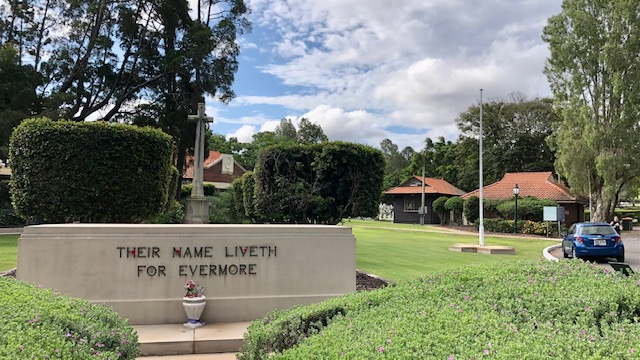{ width="98%" data-title="Guided tours start at Canon Garland Place" }

*<small>The Flagpole in Canon Garland Place</small>*

### Upcoming Guided Tours

Our next tour is on **Sunday 4 October 2026** and is titled, "**Odd Jobs**".

The tour is limited to 20 people. 

!!! Warning "What to bring"

    Wear enclosed shoes, a hat and sunscreen or bring an umbrella, and don't forget a bottle of water. 
    Some tours include steep hills and a walking stick or walking poles may be helpful.

## Toowong Cemetery Museum

The Museum may be open in conjunction with our guided tours if cemetery staff are on-site.

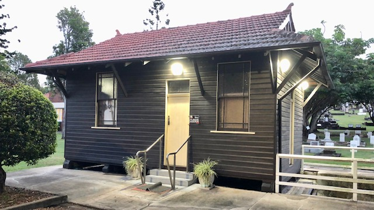{ width="98%" data-title="Toowong Cemetery Museum is open in conjunction with our guided tours"}

*<small>The Toowong Cemetery Museum is the former Sexton's office.</small>*

The Museum has an extensive display of photographs and artefacts.

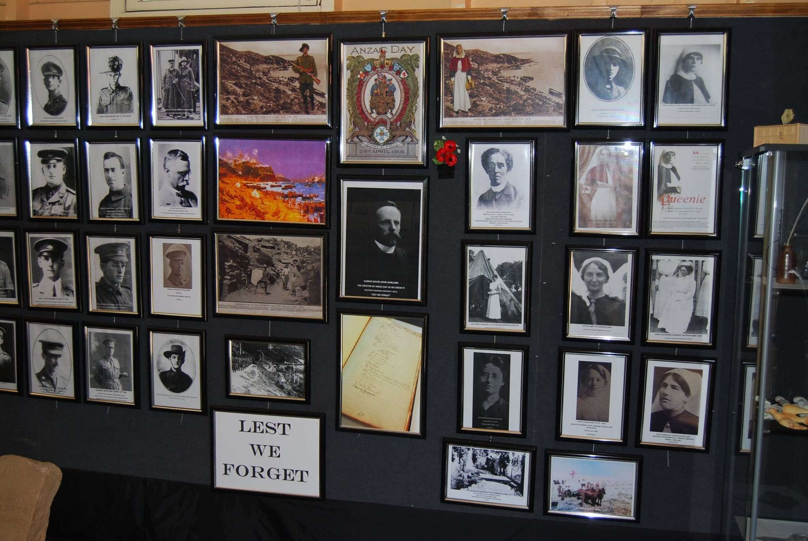{ width="48.5%" } 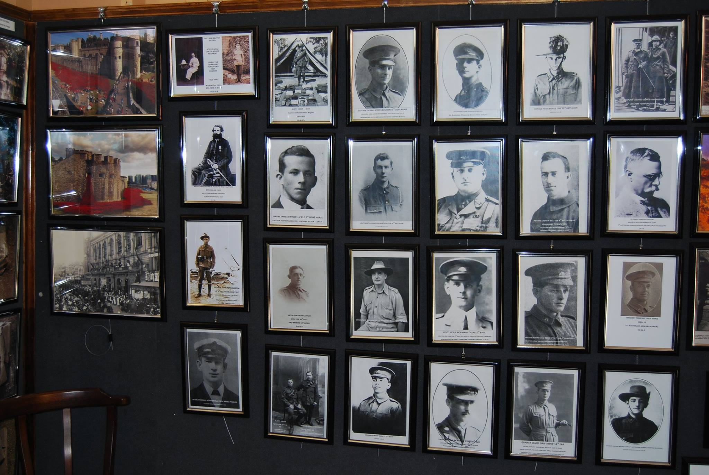{ width="48.5%" }
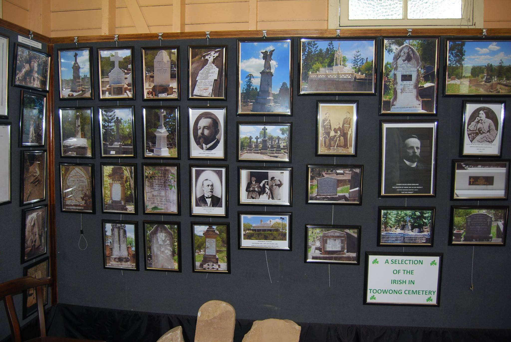{ width="48.5%" } 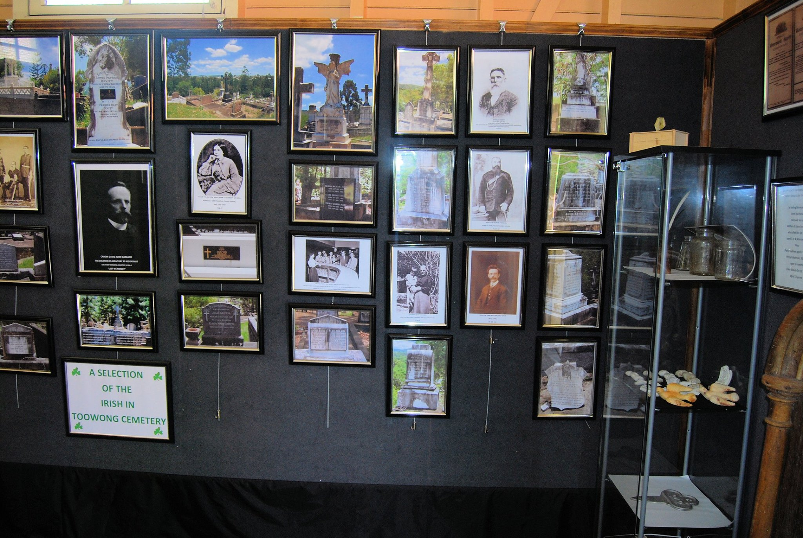{ width="48.5%" }

-->
<!-- 
## Self-Guided Walks

Explore graves of notable people that shape Queensland's past. Each self-guided walk has a map, directions, photos and stories about some of the people remembered in Toowong Cemetery. Choose a walk:
 

  

-   :fontawesome-solid-person-walking:{ .lg .middle } **[The Federation Walk](../walks/federation-walk.md)** 
  
    ---

    Discover the stories of Queenslander's who contributed to Australia's federation and our constitution.

    :fontawesome-regular-clock: 30 minutes  

    
-   :fontawesome-solid-person-walking:{ .lg .middle } **[Dr. Lilian Cooper walk](../walks/lilian-cooper-walk.md)**
  
    ---

    Uncover Brisbane's history along the gently sloping Dr. Lilian Cooper Drive.  

    :fontawesome-regular-clock: 1 hour  
    

-   :fontawesome-solid-person-walking:{ .lg .middle } **[The Jewish Walk](../walks/jewish-walk.md)**
 
    ---

    Learn about Jewish customs and local identities including a world champion wrestler and a bush balladeer.

    :fontawesome-regular-clock: 45 minutes  

-   :fontawesome-solid-person-walking:{ .lg .middle } **Mount Blackall walk**
  
    ---

    Discover the historic highlights on and around Mount Blackall.  *A new walk coming soon…* 

    :fontawesome-regular-clock: 1½ - 2 hours  

  

-->
<!-- 

## Headstone Symbolism Display

Discover the meaning of **[headstone symbols](../headstones/symbols.md)** at the Toowong Cemetery Symbolism display.

<figure markdown>
  { class="full-width" }
  <figcaption markdown>Toowong Cemetery Headstone Symbolism Display</figcaption>
</figure>
-->

<!-- 
## Federation Pavilion

Visit the **[Federation Pavilion](../about/federation-pavilion.md)** and learn about Queenslanders who played a lead role in the federation of Australia.

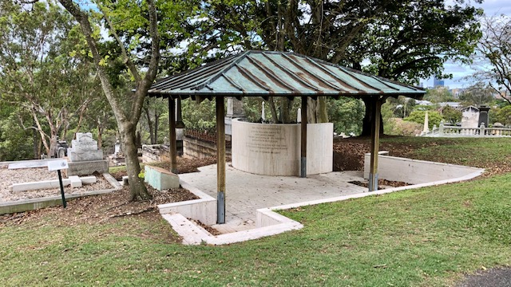

-->
<!-- 
## Queensland's Oldest Headstones

**[Queensland's oldest surviving headstone](../headstones/queenslands-oldest-headstones.md)** is from 15 November 1831 and can be found in Toowong Cemetery.

## Archaeological Dig Finds

Wander over to Portion 29A off Steele Rudd Avenue and see the **[lost Paddington Cemetery headstones](../headstones/lost-paddington-headstones.md)** we've uncovered in our **[Archaeological Digs](../headstones/archaeological-digs/)**.
-->

## Plan your trip

Toowong Cemetery is open everyday from 6am–6pm. Check the Brisbane City Council for [Office opening hours](https://www.brisbane.qld.gov.au/community-and-safety/community-support/cemeteries/toowong-cemetery#officehours).

<figure markdown>
  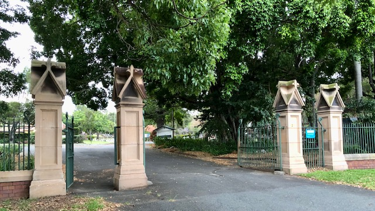{ class="full-width" }
  <figcaption markdown>The Toowong Cemetery Main Entrance was designed by the Colonial Architect **[F.D.G. Stanley](research/francis-drummond-grenville-stanley.md)** and erected in 1873–1874</figcaption>
</figure>

### Driving

Toowong Cemetery has two entrances:

- The main entrance at **[Frederick Street, Toowong](https://www.google.com/maps/place/Toowong+Cemetery/@-27.4772749,152.9818283,17z/data=!3m1!4b1!4m5!3m4!1s0x6b9150c2f0f2e23f:0xf02a35bd720a310!8m2!3d-27.4772714!4d152.9839608)**,  can only be entered via a slip road beside the Toowong roundabout, approaching from the west.
- The back entrance, **[opposite 26 Richer Street, Toowong](https://www.google.com/maps/place/25+Richer+St,+Toowong+QLD+4066/@-27.4737507,152.9767263,17z/data=!3m1!4b1!4m5!3m4!1s0x6b9150dd31b12cc5:0xc3a1deb2fe09484!8m2!3d-27.4737555!4d152.978915)** is much easier to access.

Parking is available inside the cemetery.

### Walking

If you're walking to Toowong Cemetery, in addition to the entries above, you can enter via:

- the pedestrian ramp from Mt Coot‑tha Road, opposite the Mt Coot‑tha Botanic Gardens. Turn right at the top of the ramp and walk downhill to go to Canon Garland Place.
- Frederick Street gate (opposite Sleath Street) that leads onto Steel Rudd Avenue (previously 4^th^ Avenue).
- the many informal entries off Birdwood Terrace.

<figure markdown>
  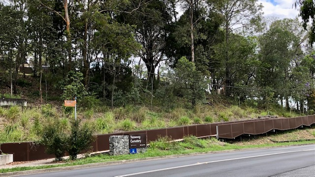{ class="full-width" }
  <figcaption markdown>Toowong Cemetery Pedestrian Entrance off Mt Coot‑tha Road. <b>[Bus stop 17, Mt Coot‑tha Rd](https://jp.translink.com.au/plan-your-journey/stops/001403/timetable/)</b> is nearby.</figcaption>
</figure>

### Public Transport

If you're using public transport to get here, use the **[TransLink Journey Planner](https://jp.translink.com.au/plan-your-journey/journey-planner)** to plan your trip. Be aware some results tell you to walk across the road at the Toowong roundabout - this is not safe and you may need to walk a long way to find a safe place to cross Milton Road or the Western Freeway. Options are: 

- cross Milton Road at its intersection with Morley Street.
- cross the Western Freeway using the [Canon Garland Overpass](https://garlandmemorial.com/canon-garland-overpass/), a bike and walking bridge accessed from Anzac Park.
- choose a bus that avoids the need to cross major roads (e.g. Routes **[470](https://jp.translink.com.au/plan-your-journey/timetables/bus/t/470)**, **[471](https://jp.translink.com.au/plan-your-journey/timetables/bus/t/471/outbound/)**, **[598](https://jp.translink.com.au/plan-your-journey/timetables/bus/t/598)**, **[599](https://jp.translink.com.au/plan-your-journey/timetables/bus/t/599)**).

### When you arrive

If you enter the main entrance, you'll find: 

- **Canon Garland Place** named after **[Canon David John Garland][Garland]**. The flagpole is the departure point for our **[guided tours](guided-tours.md)**.
- a **Museum** operated by the Friends of Toowong Cemetery.
- the **[Office](https://www.brisbane.qld.gov.au/libraries-venues-and-facilities/cemeteries/cemetery-locations-and-services/toowong-cemetery#location)**, where Brisbane City Council staff can help locate graves and answer your questions.
- **Toilets** – the only ones available in the cemetery are not wheel-chair accessible.

<!--  LAVATORY BUILDING - https://trove.nla.gov.au/newspaper/article/178409657?searchTerm=%22Brisbane%20general%20cemetery%22%20trustee -->

<figure markdown>
  { class="full-width" }
  <figcaption markdown>The Stone of Remembrance, Cross of Sacrifice, and Flagpole in Canon Garland Place</figcaption>
</figure>

If you enter via the Richer Street back gate, to get to Canon Garland Place:

- turn right into Dr. Lilian Cooper Drive (previously Boundary Road) and continue to the Shelter Shed.
- veer left at the Shelter Shed down the one‑way William Brown Avenue (previously 14^th^ Avenue).
- at the end, turn right into Emma Miller Avenue (previously 8^th^ Avenue) to arrive behind Canon Garland Place, where you can park on the right side of the road.

## Toowong Cemetery Map

### Toowong Cemetery Portion Map

There are 34 Portions in Toowong Cemetery, numbered 1 to 30 and also 2A, 7A, 15A, 29A. Portions contain many sections. Each section can contain up to 80 graves. The graves in a section are usually in two rows. Taps are located at the Shelter Sheds if you need water for flowers or cleaning headstones.

[Print the Toowong Cemetery Map :fontawesome-solid-map:](../assets/documents/toowong-cemetery-map.pdf "Print a high resolution version of the map. 2.1 Mb."){ .md-button .md-button--primary }

<figure markdown>
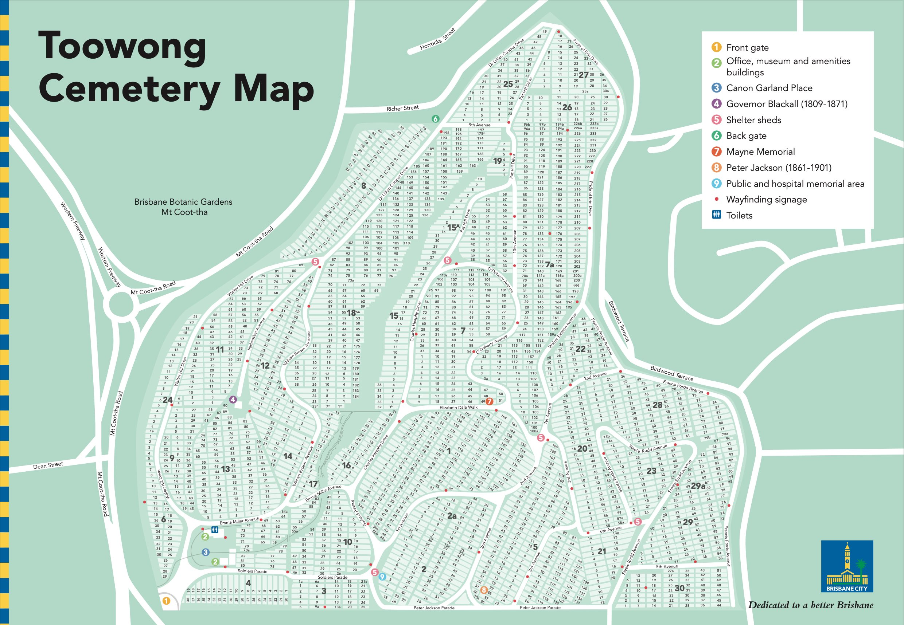{ width="100%" data-title="Toowong Cemetery Map" data-description="Portion numbers are the large numbers. Section numbers are the small numbers inside the light green rectangles. Grave numbers are not shown."}
  <figcaption markdown>Toowong Cemetery Map showing Portions, Sections and key features. [Toowong Cemetery Area Map](https://www.brisbane.qld.gov.au/sites/default/files/documents/2022-09/20220906-Toowong-Cemetery-Map-2022.pdf)  © [Brisbane City Council](https://www.brisbane.qld.gov.au) 2022, used under [Creative Commons Attribution 4.0 Licence](https://creativecommons.org/licenses/by/4.0/). Corrected on 4 March 2023 in consultation with Toowong Cemetery: Portion 10 Section, 85 and 83 swapped. Portion 7A, Sections 233a and 233b renamed to 234 and 235 respectively. Road name labels added and spelling corrected.</figcaption>
</figure>

### Toowong Cemetery Road Map 

<iframe src="https://www.google.com/maps/embed?pb=!1m10!1m8!1m3!1d3943.6078757500636!2d152.9825477508893!3d-27.474338574253586!3m2!1i1024!2i768!4f13.1!5e0!3m2!1sen!2sau!4v1642488281276!5m2!1sen!2sau" width="100%" height="450" style="border:0;" allowfullscreen="" loading="lazy"></iframe>

!!! warning "Cemetery Road Warnings"

    - **Walter Hill Drive is one way uphill** from Emma Miller Avenue to Dr. Lilian Cooper Drive. 
    - **William Brown Avenue is one way downhill** from Dr. Lilian Cooper Drive to Emma Miller Avenue.
    - **5^th^ Avenue is very steep** from Steele Rudd Avenue up to Francis Forde Avenue near the corner of Frederick St and Birdwood Tce. 

### Road Name Changes

Some cemetery road names have recently been changed to the names of notable people buried nearby. Not all maps and signs in the cemetery have been updated to reflect these changes: 

| New Road Name                              | Old Road Name | Notes                                                                |
| :----------                                | :--------     | :---------                                                           |
| **[Walter Hill][Walter Hill]** Drive       | Boundary Road | running parallel to Mt Coot‑tha Road                                 |
| **[Dr. Lilian Cooper][Cooper]** Drive       | Boundary Road | running parallel to Richer Street                                    |
| Pride of Erin Drive                        | Boundary Road | running parallel to Birdwood Terrace                                 |
| Francis Forde Avenue                       | Boundary Road | running parallel to Birdwood Terrace  closest to Frederick Street |
| **[Peter Jackson][Jackson]** Parade        | Boundary Road | running parallel to Frederick Street  furthest from the main entrance |
| Soldiers Parade                            | Boundary Road | running parallel to Frederick Street  closest to the main entrance    |
| **[Steele Rudd][Rudd]** Avenue             | 4^th^ Avenue  |                                                                      |
| Walter Ralston Avenue                      | 7^th^ Avenue  |                                                                      |
| **[Emma Miller][Miller]** Avenue           | 8^th^ Avenue  | behind Canon Garland Place                                           |
| **[Charles Heaphy][Heaphy]** Drive         | 8^th^ Avenue  | from the Shelter Shed to Emma Miller Avenue                          |
| **[Pat Hill][Pat Hill]** Drive             | 8^th^ Avenue  | from the Richer Street end to the Shelter Shed                       |
| **[O'Doherty][O'Doherty]** Avenue          | 11^th^ Avenue |                                                                      |
| **[Elizabeth Dale][Dale]** Walk            | 12^th^ Avenue |                                                                      |
| **[Garland][Garland]** Avenue              | 13^th^ Avenue |                                                                      |
| **[William Brown][Brown]** Avenue          | 14^th^ Avenue |                                                                      |
| Federation Avenue                          | 15^th^ Avenue |                                                                      |

<!-- Read about [local streets named after people buried in Toowong Cemetery](stories/toowong-street-name-origins.md).

!!! question "Volunteer - report a damaged sign"

    Unfortunately signs are often vandalised in the cemetery. Please **[report damaged signs to the Brisbane City Council](https://ofpm.brisbane.qld.gov.au/site/wss/form/report-it-traffic-signs).**
-->

## Attractions nearby

Combine your visit to Toowong Cemetery with a visit to other nearby attractions: 

- [Mt Coot‑tha Botanic Gardens](https://www.brisbane.qld.gov.au/things-to-see-and-do/council-venues-and-precincts/parks/botanic-gardens-in-brisbane/brisbane-botanic-gardens-mt-coot-tha) is a 15 minute walk from the cemetery. Our favourite attractions include:
    - [National Australia Remembers Freedom Wall](https://www.brisbane.qld.gov.au/things-to-see-and-do/council-venues-and-precincts/parks/botanic-gardens-in-brisbane/brisbane-botanic-gardens-mt-coot-tha/attractions/national-freedom-wall).
    - [Japanese Garden](https://www.brisbane.qld.gov.au/things-to-see-and-do/council-venues-and-precincts/parks/botanic-gardens-in-brisbane/brisbane-botanic-gardens-mt-coot-tha/attractions/japanese-garden).
    - [Sir Thomas Brisbane Planetarium](https://www.brisbane.qld.gov.au/things-to-see-and-do/council-venues-and-precincts/sir-thomas-brisbane-planetarium). 
    - [Australian Plant Communities](https://www.brisbane.qld.gov.au/things-to-see-and-do/council-venues-and-precincts/parks/brisbane-botanic-gardens-mt-coot-tha/attractions/australian-plant-communities).
- [Mt Coot‑tha Lookout](https://www.brisbane.qld.gov.au/things-to-see-and-do/council-venues-and-precincts/mt-coot-tha-precinct/mt-coot-tha-attractions/mt-coot-tha-lookout) – catch the [471 bus](https://jp.translink.com.au/plan-your-journey/timetables/bus/t/471/outbound/) from the Mt Coot‑tha Botanic Gardens.
- [Anzac Park](https://www.brisbane.qld.gov.au/things-to-see-and-do/council-venues-and-precincts/parks/parks-by-suburb/toowong-parks) a long walk via the Mt Coot‑tha Botanic Gardens, then across [Canon Garland Overpass](https://garlandmemorial.com/2022/06/03/canon-garland-overpass/) into Anzac Park.
- [Mt Coot‑tha Reserve](https://www.brisbane.qld.gov.au/things-to-see-and-do/council-venues-and-precincts/mt-coot-tha-precinct/mt-coot-tha-reserve) – drive to picnic areas, bush walks, or mountain bike riding. J. C. Slaughter Falls and Simpson Falls are our favourites.

<figure markdown>
  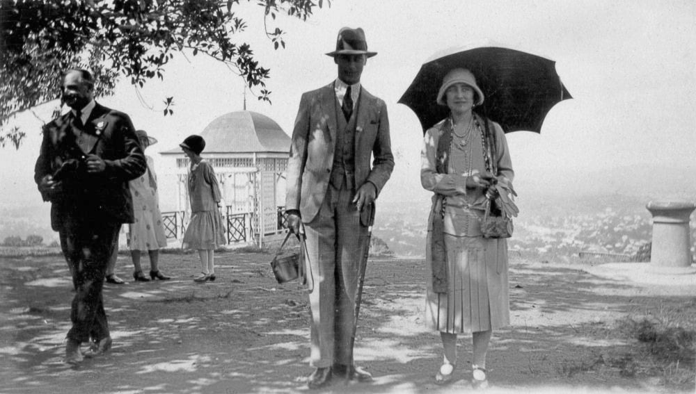{ class="full-width" width="70%"}
  <figcaption markdown>[Their Royal Highnesses, the Duke and Duchess of York enjoy a morning at Mt. Coot-tha, April 1927](http://onesearch.slq.qld.gov.au/permalink/f/1upgmng/slq_alma21218197470002061) — State Library of Queensland. The Duke of York was later King George VI, and the Duchess of York was later Queen Elizabeth the Queen Mother.</figcaption>
</figure>

<!-- Links -->

[main-entrance]: ../assets/main-entrance.jpg "Toowong Cemetery Main Entrance"
[Walter Hill]: ../research/walter-hill.md 
[Cooper]: ../research/lilian-cooper.md 
<!-- [Forde]: research/francis-forde.md "Read Francis' story" -->
[Forde]: https://adb.anu.edu.au/biography/forde-francis-michael-frank-12504 
[Jackson]: ../research/peter-jackson.md 
[Rudd]: ../research/arthur-hoey-davis.md "Read Steel Rudd's (Arthur Hoey Davis) story" 
<!-- [Ralston]: research/walter-ralston.md "Read Walter's story" -->
[Ralston]: https://adb.anu.edu.au/biography/ralston-walter-vardon-834
[Miller]: ../research/emma-miller.md 
[Heaphy]: ../research/charles-heaphy.md 
[Pat Hill]: ../research/pat-hill.md 
[Dale]: ../research/elizabeth-dale.md 
[Garland]: ../research/david-john-garland.md 
[O'Doherty]: ../research/kevin-izod-odoherty.md
[Brown]: ../research/william-walter-brown.md

<!-- include site-wide abbreviations -->

--8<-- "snippets/abbreviations.md"
