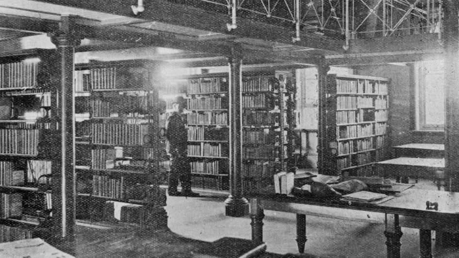

--8<-- "snippets/hide-toc.html"

<!-- 
-- 8< -- "snippets/sem/walks/index.json"
-->

# Toowong Cemetery Walks

**Free self-guided walks to help you explore the history and stories of Toowong Cemetery**

<!--
<figure markdown>
  {  class="full-width" }
  <figcaption markdown>[State Library of Queensland's reading room, Brisbane, 1902](http://onesearch.slq.qld.gov.au/permalink/f/1upgmng/slq_alma21298102690002061) - State Library of Queensland. Cropped.</figcaption>
</figure>

-->
Each walk has a map, directions, and stories about people remembered in Toowong Cemetery. Choose a walk:

<!--

-   :fontawesome-solid-person-walking:{ .lg .middle } **[Dr. Lilian Cooper walk](lilian-cooper-walk.md)**
  
    ---

    Uncover the history along Dr. Lilian Cooper Drive

    :fontawesome-regular-clock: 1 hour  
    
    :fontawesome-solid-stairs: Mostly flat

-   :fontawesome-solid-person-walking:{ .lg .middle } **[Mount Blackall walk](mount-blackall-walk.md)** 
 
    ---

    Explore some of the highlights on Mount Blackall

-->  

  

-   :fontawesome-solid-person-walking:{ .lg .middle } **[The Federation Walk](federation-walk)** 
  
    ---

    Discover the stories of Queenslander's who contributed to Australia's federation and our constitution.

    :fontawesome-regular-clock: 30 minutes  

    
-   :fontawesome-solid-person-walking:{ .lg .middle } **[Dr. Lilian Cooper walk](lilian-cooper-walk.md)**
  
    ---

    Uncover Brisbane's history along the gently sloping Dr. Lilian Cooper Drive.  

    :fontawesome-regular-clock: 1 hour  
    

-   :fontawesome-solid-person-walking:{ .lg .middle } **[The Jewish Walk](jewish-walk.md)**
 
    ---

    Learn about Jewish customs and local identities including a world champion wrestler and a bush balladeer.

    :fontawesome-regular-clock: 45 minutes  

-   :fontawesome-solid-person-walking:{ .lg .middle } **Mount Blackall walk**
  
    ---

    Discover the historic highlights on and around Mount Blackall.  *A new walk coming soon...* 

    :fontawesome-regular-clock: 1½ - 2 hours  
    

Self-guided walks in Toowong Cemetery are free. You can walk in the cemetery between 6am and 6pm.

<iframe width="560" height="315" src="https://www.youtube.com/embed/41fWB0IvDKU?controls=0" title="YouTube video player" frameborder="0" allow="accelerometer;  clipboard-write; encrypted-media; gyroscope; picture-in-picture" allowfullscreen></iframe>

  
<!--
*<small>[Toowong Cemetery, Brisbane - DJI Mavic aerial](https://youtu.be/41fWB0IvDKU) by Drone Runner. </small>* **<small></small>**. 
-->

Toowong Cemetery is the largest cemetery in Queensland. On your walk you should wear a hat and enclosed shoes, and take a water bottle. Toilets are available at Canon Garland Place within the cemetery.

[Visit Toowong Cemetery](../index.md#visit-toowong-cemetery){ .md-button .md-button--primary }

## Self-guided walk alternatives

Consider joining a **[Toowong Cemetery Guided Tour](../guided-tours.md)** or the visiting the **[headstone symbolism display](../headstones/symbols.md)**.

<!--

Find out how to [visit Toowong Cementry](../index.md#visit-toowong-cemetery) by car, on foot, or using public transport.

- **[Dr. Lilian Cooper walk](lilian-cooper-walk.md)** - uncover the history along Lilian Cooper Drive
- **[Mount Blackall walk](mount-blackall-walk.md)** - explore some of the highlights on Mount Blackall
- **[The Federation Walk](federation-walk.md)** -  discover Queensland's contribution to Australia's federation
- **[The Jewish Walk](jewish-walk.md)** - A self-guided walk around the Jewish portion of Toowong Cemetery
--> 

<!-- links to pages or pdfs 

[federation-walk]: federation-walk.md
[jewish-walk]: jewish-walk.md
-->