--8<-- "snippets/sem/walks/jewish-walk.json"

# The Jewish walk

**A self-guided walk through the Jewish portion of Toowong Cemetery** 

<figure markdown>
  
  <figcaption markdown>[The Brisbane Synagogue, ca. 1906](http://onesearch.slq.qld.gov.au/permalink/f/1upgmng/slq_alma21218659720002061). Erected in Margaret Street in 1885 and consecrated on 18 July 1886 - State Library of Queensland. Cropped.</figcaption>
</figure>

This is a Jewish Cemetery. Our population in Queensland is quite small, so its cemeteries number only ten and some have rarely been used. In Brisbane there is one at Toowong dating back from the 1870's and the other is at Mt Gravatt, which opened in 1966. Originally there was a small area in the old Lang Park (Paddington) Cemetery, but that was closed and the 3 known Jewish burials, and their monuments, were brought to Toowong in 1913. 

Jewish deceased are buried with their heads toward the East. This has a religious significance. Only one person is buried in each grave. Before the coffin is covered with earth, a small amount of soil of the Holy City of Jerusalem is sprinkled over it. Burial is conducted by a world‑wide, ancient organisation called the "[Chevra Kadisha](https://bck.net.au)" (The Sacred Society). It has a variety of duties, all of a compassionate nature, e.g. care of orphans and widows, comfort of the dying, charity, etc.

Examples of vandalism will be seen in this cemetery. This is a world‑wide malady and difficult to prevent, as the damage is usually done late at night. <!--It usually occurs during school vacations, indicating that the pupils, with no homework to do, are seeking cheap "thrills". --> On the occasions on which it occurs, the Chevra Kadisha promptly restores the damaged monuments. <!--Some only need to be stood up and secured; others are broken when they fall. If they are thin marble slabs, they break easily and it is better to mount them on a sloping cement plinth so they cannot be toppled again. If the headstone is badly broken, it must be replaced. It is not feasible to insure grave monuments against vandalism. -->

--8<-- "snippets/conditions-of-entry.md"

## Map

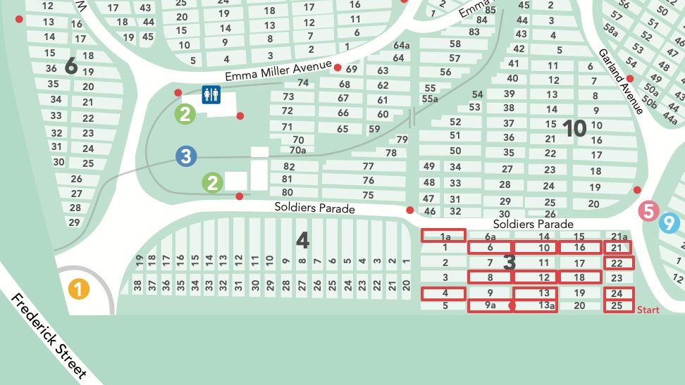

*<small>The Jewish Walk map, derived from the [Toowong Cemetery Area Map](https://www.brisbane.qld.gov.au/sites/default/files/documents/2022-09/20220906-Toowong-Cemetery-Map-2022.pdf)  © [Brisbane City Council](https://www.brisbane.qld.gov.au) 2022, used under [Creative Commons Attribution 4.0 Licence](https://creativecommons.org/licenses/by/4.0/).</small>*

???+ directions "Directions" 

    Starting at Section 25 in Portion 3 from the Peter Jackson Parade end and closest to Frederick street, walk down the first row, looking left. About the 16^th^ headstone from the start is the grave of...
    
    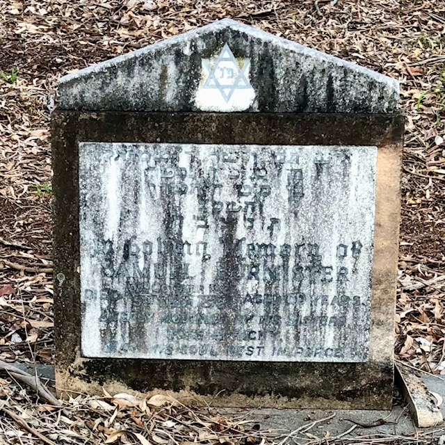{ width="20%" }

--8<-- "snippets/sam-burmister.md"

???+ directions "Directions" 

    Moving along another 14 headstones you will come across the grave of...
    
    { width="20%" }

--8<-- "snippets/morris-moskowitch.md"
<!-- TODO not in index -->

???+ directions "Directions" 

    Walking up another 6 headstones and still looking left you will come to the grave of...

    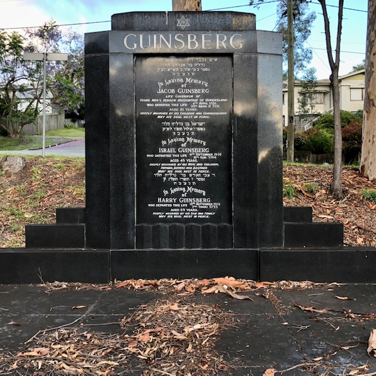{ width="20%" }

##The Guinsberg Family	<small>(3‑13A‑14/16)</small>

This type of massive monument is unusual for its size and is rarely utilised nowadays.

???+ directions "Directions" 

    Another 13 headstones along this same path is the grave of...
    
    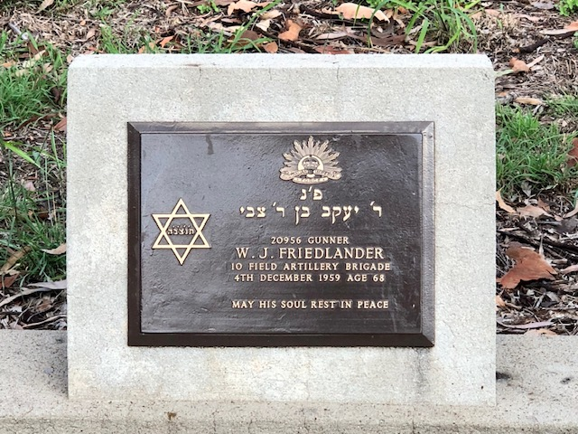{ width="20%" }
 
## Wilfred John Friedlander (AIF) <small>(3‑9A‑17)</small>

This is an example of the bronze plaques erected by the War Graves Commission over the graves of ex‑servicemen.

???+ directions "Directions" 

    The grave next to this one is the grave of…
    
    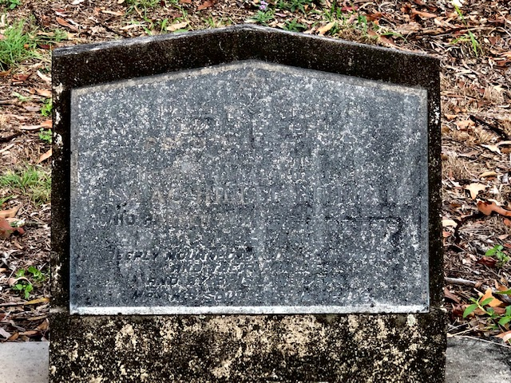{ width="20%" }

--8<-- "snippets/isaac-hillel-hillman.md"

???+ directions "Directions" 

    Walking to the end of this path walk around to the start of second path. Looking right, go to the seventh headstone, and you will see the large headstone of...
    
    { width="20%" }

--8<-- "snippets/jonas-myer-myers.md"

???+ directions "Directions" 

    Walk two graves along and you have reached the graves of...
    
    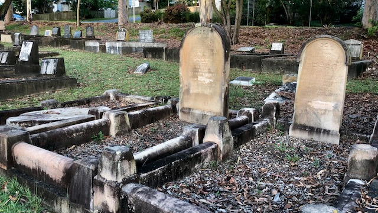{ width="20%" }

## Lawrence, Lawrence and Loewe <!-- (3‑ss‑gg)-->

These are the three monuments which were [transferred here from Lang Park](../headstones/moved-paddington-headstones.md). They are in sandstone, which is not used much nowadays for monuments.

Loewe's headstone has a carved pitcher or urn, from which water is being poured. Persons who are descended from the Biblical clan of Levi are called 'Levites' and they had certain duties in the ancient temple in Jerusalem. One was the 'laving' (i.e. washing) of the hands of the 'Cohen' i.e. Priest, before the service, hence the above mentioned pitcher.

There are many forms of the name 'Levy'. In this case, the name is 'Loewe'. Similarly, there are variants to the name of 'Cohen' and it will be seen that some who are identified as priests (see later notes) have other names such as Kangan, Konn, Kahn etc.

???+ directions "Directions" 

    Moving along the same path and another 12 headstones ahead is the grave of...
    
    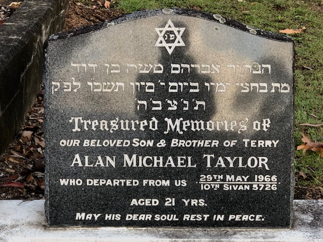{ width="20%" }

--8<-- "snippets/alan-taylor.md"

???+ directions "Directions" 

    Proceed along the path for another 11 headstones and you will come to the grave of...
    
    { width="20%" }

## Trooper Isaac Benjamen Lipstine <small>(3‑13‑9/10)</small>

This is a bronze plaque supplied by the War Graves Commission. Others are upright white marble headstones.

???+ directions "Directions" 

    Another 8 headstones along this path is the grave of...
    
    { width="20%" }

--8<-- "snippets/phyliss-mary-peixetto.md"

???+ directions "Directions" 

    Walking along another 8 headstones we come upon the grave of...
    
    { width="20%" }

--8<-- "snippets/henry-montague-bloom.md"

???+ directions "Directions" 

    Now walk around to the start of the third path. Looking LEFT the 23^rd^ headstone from the start is that of…
    
    { width="20%" }

--8<-- "snippets/myer-kangan.md"
  
???+ directions "Directions" 

    Behind Kangan's headstone is that of...
    
    { width="20%" }
    
## Louis Paul Fingereth, M.B.E. <small>(3‑18‑14)</small>

On this headstone can be seen an example of the configuration of the hands of a Cohen (a male descendant of the family of Aaron, Moses' brother. Aaron was the first high priest, who already functioned during the Exodus). With his hands held in this manner, and his head covered by his prayer shawl, he is entitled to bless the Congregation.

Note that not all the Cohanim (the plural) are named "Cohen". The Levites (male descendants of the tribe of Levi) who aided the Cohanim in the Temple Service, still, to this day "lave" the hands of the Cohanim with water, before they bless the Congregation during Services. On the monuments of Levites can be seen an urn or pitcher from which water is being poured. Cohanim obey certain restrictions but also have some ritual privileges.

???+ directions "Directions" 

    Moving also this path 6 more headstones, we come to the grave of...
    
    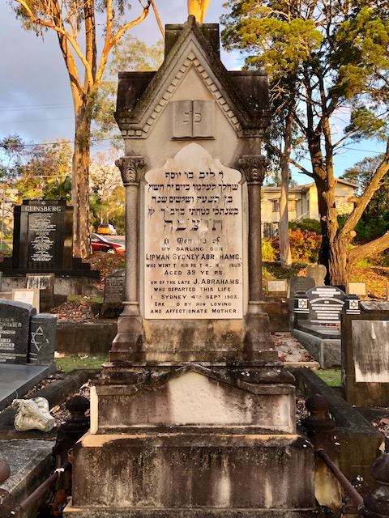{ width="20%" }

## Lipman Abrahams <small>(3‑12‑9)</small>

This is a beautiful carved sandstone monument. The symbol of the book would suggest that the person was well versed in the Hebrew religion. <!-- Today such a monument would cost over $100 000. There are few stonemasons about, who could do the work. -->

???+ directions "Directions" 

    Next to this beautiful monument is the grave of...
    
    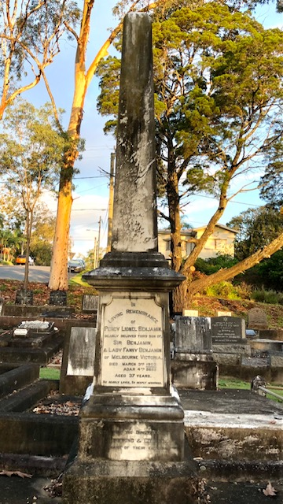{ width="20%" }

--8<-- "snippets/percy-benjamin.md"
 
???+ directions "Directions" 

    Walk along a couple of more headstones and you will see the striking sculpted red granite monument of **Flegeltaub**. Moving along another 4 headstones and still looking right you will see the headstone of...
    
    { width="20%" }

--8<-- "snippets/behr-raphael-lewin.md"

???+ directions "Directions" 

    A further 3 headstones along, we have the headstone of...
    <!--
    Can't find this headstone 
    { width="20%" }
    -->

## Cornelia Harris <!-- (3‑ss‑gg)-->

On this monument is a passage from Proverbs XXXI. It is a fine tribute to a goodly wife.

???+ directions "Directions" 

    Several of the next graves on both sides of the path form the centre of the oldest part of this Jewish Cemetery. Most of these monuments were cut in sandstone, quarried near Helidon. Another 3 headstones along is the headstone of...
    
    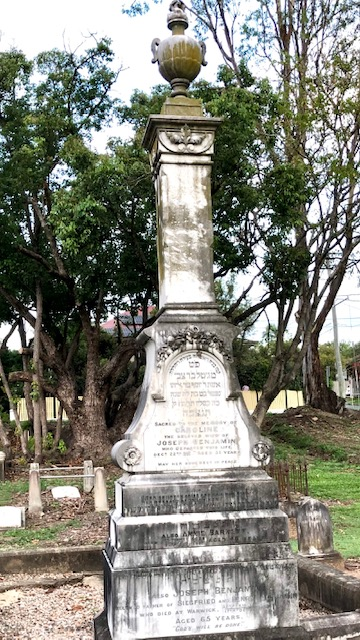{ width="20%" }

## Caroline Benjamin <!-- (3‑4‑20???)-->

The headstone and massive monument would weigh over one tonne. If sculpted today, it would cost an enormous amount.

<!--
??? directions "Directions" 

    Now go to the end of this 3^rd^ path and round to the start of the 4^th^ path and look to the right and to the 4^th^ grave of...
    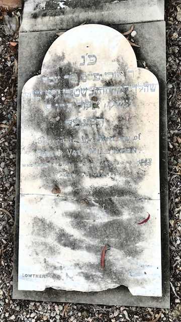{ width="20%" }

## Van Millingen  

==It would be a pity if this fine Grey‑Gum has to be destroyed before it does further damage. It may have been planted on this grave by someone who meant well but did not realise what damage it could ultimately do. Otherwise, it may have grown from a wind‑blown seed or a seed dropped by a bird. Perhaps the tree will be left to grow after all?==

??? directions "Directions" 

    Walking along the same path another 3 headstones you will come to the grave of...
    { width="20%" }
-->

???+ directions "Directions" 

    Now go to the end of this 3^rd^ path and round to the start of the 4^th^ path and look to the right and to the 7^th^ grave of...
    
    { width="20%" }

## Arthur Hyam <!-- (3‑ss‑gg)-->

You will see some columns with the top broken off. This is a well‑known symbol over the grave of a person who died at a young age. Later, you will see a monument on which is engraved a palm tree. An arm, wielding an axe has lopped off the tree top. This has the same significance.

???+ directions "Directions" 

    As you walk along this path a few headstones up you will notice some more of the old sandstone monuments. Further along you will come upon the white marble monument of...
    
    { width="20%" }

## Louis Michael Boock <small>(3‑22‑4)</small>

This is an example of the marble monuments erected by the Commonwealth War Graves Commission, over the graves of ex‑servicemen. Others are in bronze.

Several monuments along you will see one with only one Hebrew word on it, "SHEMOTH".

In compliance with the Commandment "Thou shalt not take the name of the Lord thy God in vain", the Jewish people are careful to avoid disrespect to any prayer book or other object carrying the Holy Name. Therefore, prayer books, etc. which, due to age or accident, are no longer usable are not trashed or burnt, but are placed in small coffins and buried in the consecrated ground of a Jewish Cemetery. Here is the headstone of one such grave bearing the word "SHEMOTH" (name) i.e. "THE HOLY NAME".

???+ directions "Directions" 

    The third grave after the SHEMOTH grave and in the rear row is that of…
    
    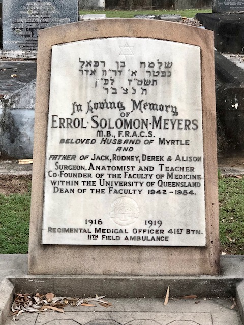{ width="20%" }

--8<-- "snippets/errol-solomon-meyers.md"

???+ directions "Directions" 

    Now walk round to the start of the fifth path. The first small monument is over another "SHEMOTH" burial. Hundreds of articles (mainly worn out books) are buried in each "SHEMOTH" grave.

    Walking along to the fifth monument and at the rear of it is the grave of...
    
    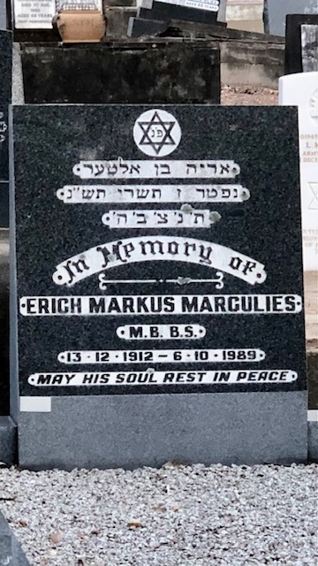{ width="20%" }

--8<-- "snippets/eric-mark-margulies.md"

???+ directions "Directions" 

    Moving along another 10 monuments you will come to the headstones of...
    
    { width="20%" }

## The Gerson Family <small>(3‑16‑3/4)</small>

These three identical monuments are an example of the work of vandals. It can be seen that they were broken off at the base with blows from behind. By mounting them on a sloping concrete pad, the broken pieces were brought together. Further vandalism is made less likely.

???+ directions "Directions" 

    Walking along another 12 monuments is the grave of...
    
    { width="20%" }

    
## Roy Mark Levy <small>(3‑10‑14A)</small>

He was a well‑known [cricketer](https://cricketarchive.com/Queensland/Players/16/16333/16333.html) representing Queensland in the Sheffield Shield series over many years.

???+ directions "Directions" 

    Walk along the path past 6 monuments, and you will be standing at the grave of...
    
    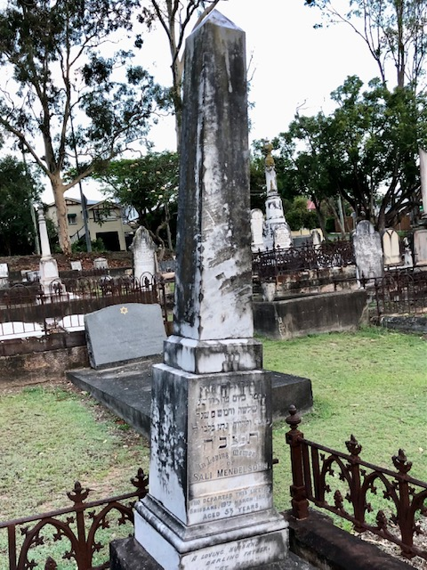{ width="20%" }

--8<-- "snippets/bezalel-saul-mendelsohn.md"

???+ directions "Directions" 

    Moving along the path for another 10 monuments, you will come to the grave of...
    
    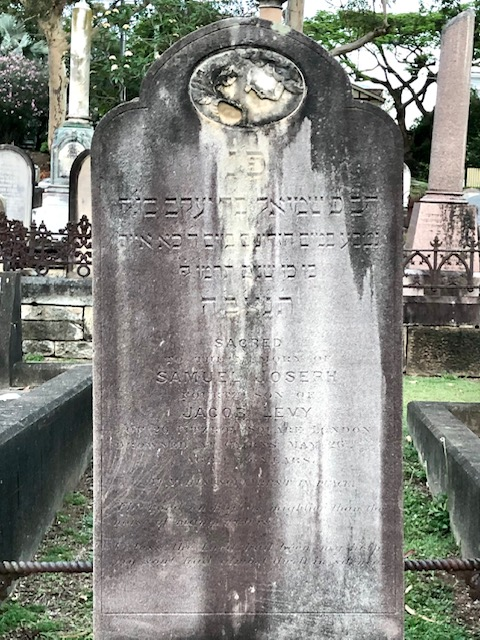{ width="20%" }

## Samuel Joseph Levy <small>(3‑8‑20/21)</small>

When a person dies at a relatively young age, it is sometimes symbolised by a "broken column" i.e. the life has been "broken off." On this monument there is a similar symbolism. An arm with an axe in the hand is seen reaching down from the clouds, and it has chopped the trunk of a palm‑tree which is seen falling.

???+ directions "Directions" 

    Walking along a couple of graves, we come across some more handsome sandstone monuments bearing the surname of **Phillips**.

    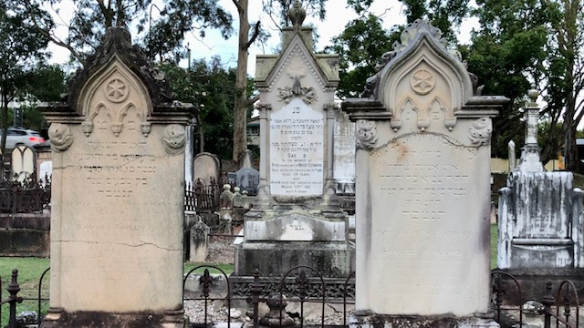{ width="20%" }

    Go to the end of the path and onto the road. The first monument is that of...
    
    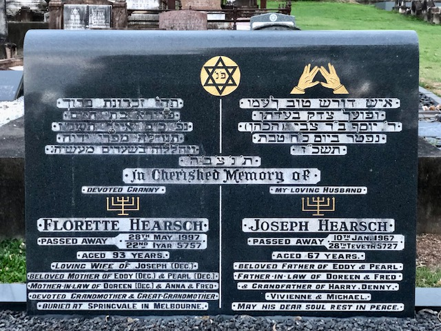{ width="20%" }

    
## Joseph Hearsch <small>(3‑1A‑1/2)</small>

Here you will see some of the pebbles or stones which are placed on monuments by those who visit the graves of the departed. They carry a three‑fold message:

> You are not forgotten.  
> See ‑ I have been here  
> And I have added a little to your memorial.

Please place your pebble on a grave!

We thank you for having "been here" too.

**SHALOM** (Peace) 

<!--
Should you have any questions arising from this visit, please jot them on a piece of paper with your name and phone number and hand them to the staff at the Sexton's Office and they will pass them on to me. Be assured that I'll get you the answers.
-->

## Acknowledgements

Text by Morris. S. Ochert OAM - Queensland Researcher, [Australian Jewish Historical Society](https://www.ajhs.com.au/)

<!-- 
Photography by: Joyce Simpson Sexton's Office Toowong Cemetery
-->

Edited by [Dr. Hilda Maclean](https://www.linkedin.com/in/dr-hilda-maclean-4819a711/) - Friends of Toowong Cemetery

<!--

## Brochure

**[Download this walk](../assets/guides/jewish-trail.pdf)** - designed to be printed and folded in half to make an A5 brochure.

-->
