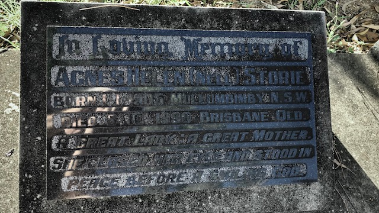

## Agnes Helen (Nell) Storie <small>(30‑36‑31)</small>

A former Bardon resident, Nell worked with the St Lukes Nursing Service. She was born in Mullumbimby, NSW in 1905 to William and Agnes Bassett. She married Victor Storie in Brisbane on 16 December 1930 and had three children. Nell died on 8 October 1990.

{ width="70%" }  

>In loving memory of  
>Agnes Helen (Nell) Storie  
>Born 1. 1. 1905 Mullumbimby N.S.W.  
>Died 8. 10. 1990 Brisbane Qld.  
>A Great Lady : A Great Mother  
>She closed her eyes and stood in  
>peace before a smiling God
