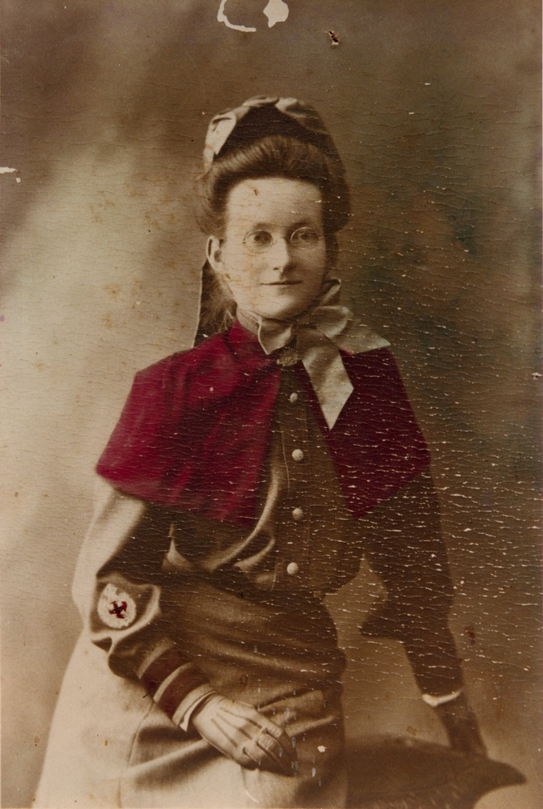

## Agnes Kathrine Isambert <small>(7‑59‑5/6)</small>

<!-- Katherine or Kathleen? --> 

Agnes Isambert was born in 1874. She trained at the Brisbane General Hospital between 1897 and 1899 and became a member of the ATNA in 1904 and a councillor of the Association between 1912 and 1919. Agnes was engaged in private nursing at the Walmer Nursing Home and the Colmslie Plague Hospital until 1913 when she returned to the Brisbane General Hospital to obtain her midwifery certificate. She then became Matron of the St Mary’s Hospital in Ipswich. From 1904 to 1914, Agnes was a member of the Australian Army Nursing Service Reserve. During World War One she sailed aboard the Kyarra and was eventually appointed to the No. 1 Australian General Hospital in Heliopolis in 1916. A former resident of Red Hill, she died on 7 June 1956 aged 83. She was the daughter of John and Margaret Isambert.

{ width="40%" }  

*<small>[30894 Agnes Kathrine Isambert papers 1902-1916](http://onesearch.slq.qld.gov.au/permalink/f/1upgmng/slq_alma21205962990002061) — State Library of Queensland.</small>*
