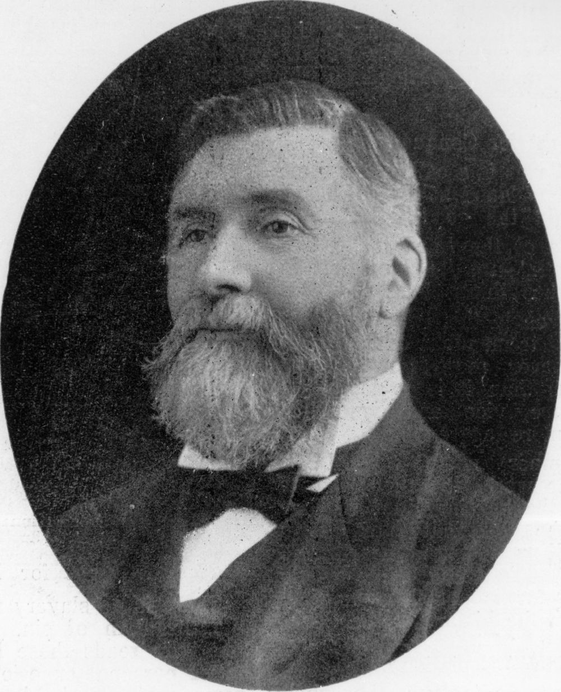

## Alexander Raff <small>(13‑79‑1)</small>

Alexander Raff was born in Forres, Elginshire, Scotland in July 1820, the third son of James and Margaret Raff. Alexander arrived in New South Wales in 1845, following his eldest brother, George who had arrived in 1841. After first settling in Victoria pursuing pastoral interests, Alexander arrived in Brisbane, aboard the schooner Souvenir on 9 April 1851.

Alexander was an active member of various organisations and societies, including the School of Arts, the Queensland Horticultural and Agricultural Society and the Queensland Philosophical Society. Raff was the first president of the Young Men's Christian Association in Queensland and, later, the men's steering committee for the Children's Hospital established in 1878. Alexander continued his pastoral interests in Queensland, on his property, Logie Plains on the Darling Downs. For many years from the 1880s Alexander Raff was a partner of Smellie and Co. In August 1884 Alexander Raff was appointed as a Member of the Legislative Council, a position he held until his resignation in June, 1910.

Raff married Elizabeth Millar Patterson, the elder daughter of a prominent Scottish medical family, in Sydney on 5 June 1862. The newly weds arrived in Brisbane aboard the Balclutha on 13 June 1862. Alexander and Elizabeth Raff had seven children, six of whom survived to adulthood. Raff was an elder in the Presbyterian Church. He died on 26 January 1914.

{ width="40%" }  

*<small>[Alex Raff](http://onesearch.slq.qld.gov.au/permalink/f/1upgmng/slq_alma21298083250002061) — State Library of Queensland.</small>* 
