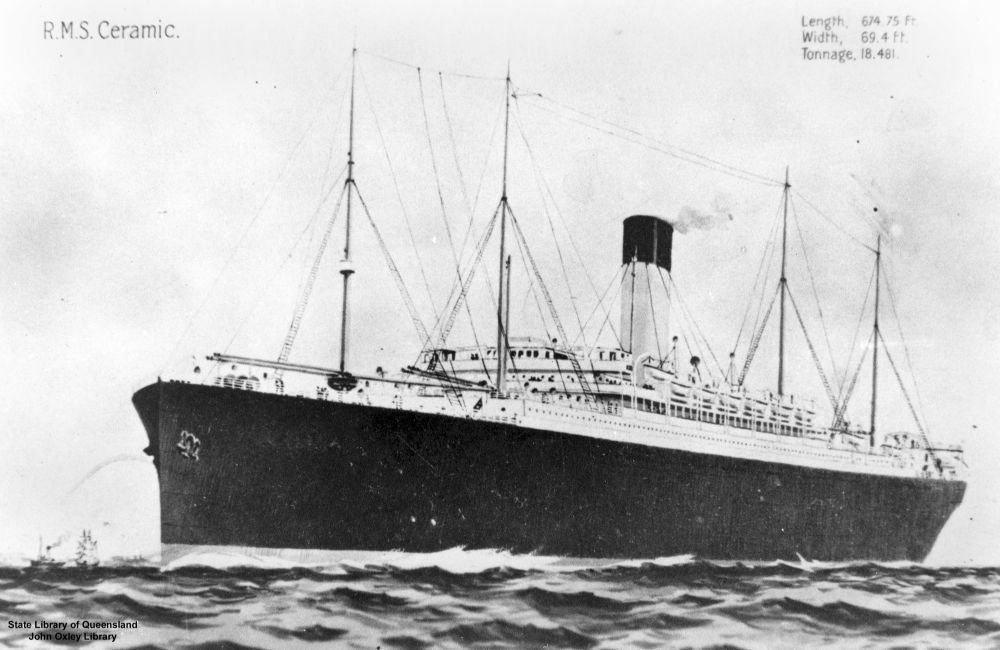

## Alexander Robert Morrison <small>(10‑76‑16)</small>

Service number: 3680. Australian Imperial Force

He was born in Aberdeen 9^th^ July 1885 to Alexander Robert Morrison and Margaret Gordon. His service papers show he was a carter and 
joined up 2 June 1917, intended to be with the 10^th^ reinforcements for the 47^th^ Battalion and the War Office decided the 25^th^ could do with him and finally they gave him to the 9^th^ Battalion. Next of Kin was his wife of 9 years Emily Elizabeth Morrison nee Lake Merivale St. South Brisbane. 

He was 31 years and 10 months old and stood 5' and 7½". Weight was 125lbs, chest 32" with medium complexion blue eyes and brown hair and Church of England. No children are recorded up to the end of 1914. He embarked on *HMAT Miltiades* on 2 August 1917 and returned 25 January 1919 on the *Ceramic*. *[SS Ceramic](https://en.wikipedia.org/wiki/SS_Ceramic)* was an 18,400-ton ocean-liner of the White Star Line launched in 1913, and later sold to the Shaw, Savill & Albion Line. In 1942 [German submarine U-515](https://en.wikipedia.org/wiki/German_submarine_U-515) sunk the *Ceramic*, leaving only one survivor from the 656 on board.

Alexander died on 2 May 1939.

{ width="70%" }  

*<small>[Ceramic (ship)](http://onesearch.slq.qld.gov.au/permalink/f/1upgmng/slq_alma21220457040002061) - State Library of Queensland. </small>* 
