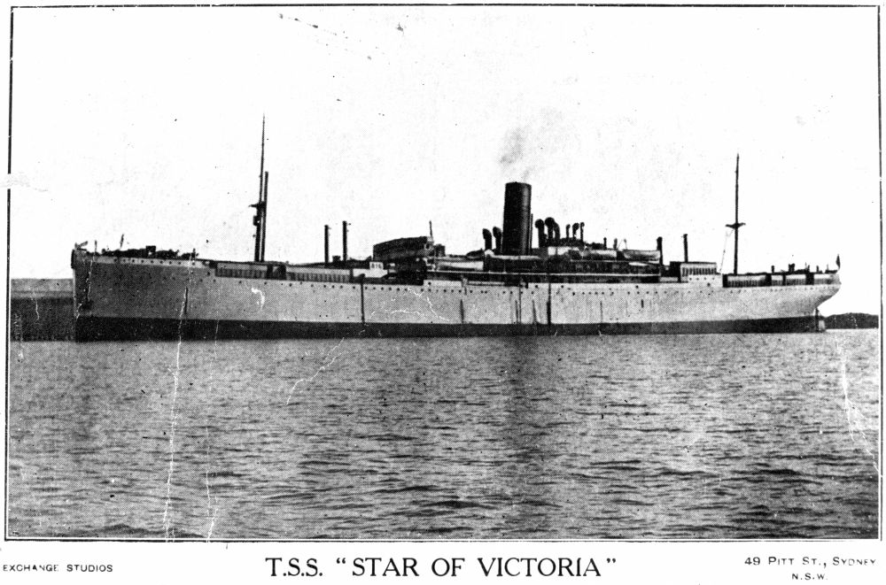
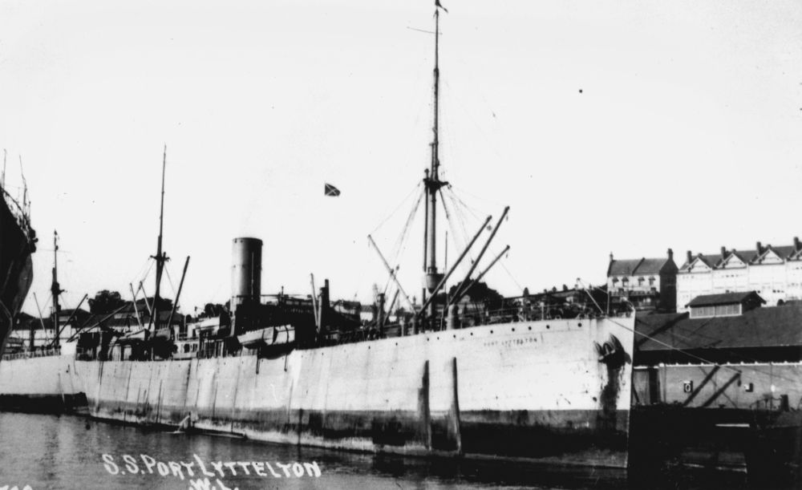

## Alexander William MacDonald <small>(10‑80‑18)</small>

Service number: 4484. Australian Imperial Force 

He was born in Turriff in Aberdeenshire ca. 1876 to Alexander MacDonald and ____ Duncan. He served 3½ years in the 92^nd^ Battalion, Gordon Highlanders in the 1^st^ Boer War. He served a further 2½ years in the Kings regiment in the 2^nd^ Boer War. His service papers show he was a labourer on joining up on 26 January 1916 in Townsville. His address was the Mourilyan Harbour Line Innisfail so probably was working on the railways. He was 40½ years old when he joined up in the 11^th^ reinforcements for the 26^th^ Battalion. Next of Kin was Annie Ray MacDonald his wife. He is described as being 5' 4½ inches 9 st 13 lbs, 39 inches in the chest, dark complexion. Hazel eyes and brown hair and a Presbyterian. He embarked 30 March 1916 on *HMAT The Star of Victoria* and returned to Australia 19 October 1917 on *HMAT Port Lyttelton*. Alexander died on 13 July 1941.

{ width="45%" }  { width="48.4%" }

*<small>[Star of Victoria (ship)](http://onesearch.slq.qld.gov.au/permalink/f/1upgmng/slq_alma21220409940002061) - State Library of Queensland. </small>*  
*<small>[Port Lyttelton (ship)](http://onesearch.slq.qld.gov.au/permalink/f/1upgmng/slq_alma21218360000002061) - State Library of Queensland.</small>*
