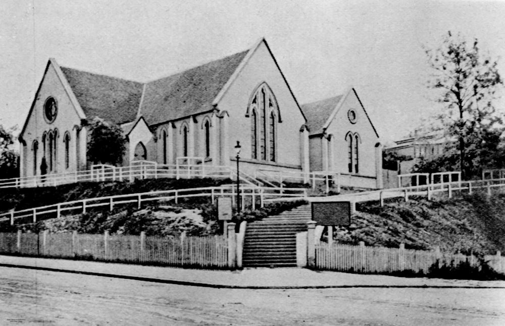

## Alfred John Raymond <small>(9‑32‑8)</small>

Alfred was born in Clifton, Bristol son of Henry George Raymond and Mary Ann Hewland. Alfred, like his father, was a carpenter. Alfred was a deeply devout man throughout his life and an active lay worker in the Congregational Church. In 1878, Alfred married Elizabeth Paul and they had two sons. In 1885–86, Alfred was a carpenter and living on Stanley Street, South Brisbane beside the river. Shortly after their arrival in Brisbane, their baby son Leslie died on 4 April 1884 and then exactly two years later Elizabeth died. They are buried nearby. 

On 20 June 1888, Alfred remarried, to Jessie Catherine Shearer, in the Congregational Church in Wharf Street. In the 1890s, the Raymond family lived in Kangaroo Point. It was while living there that Alfred became interested in politics and in 1894 he was elected as Alderman for the ward of Kangaroo Point. Although South Brisbane was then a separate town to Brisbane, Kangaroo Point was still a ward of Brisbane. Alfred represented Kangaroo Point from 1894 to 1899 when resigned from politics. However, he returned as Alderman for Kangaroo Point again from 1902 to 1903 and then from 1911 to 1924. He was [Mayor of Brisbane in 1912](https://trove.nla.gov.au/work/235651422?keyword=Alfred%20John%20Raymond).

{ width="30%" }  { width="63.69%" } 

*<small>[Alderman Alfred John Raymond](http://onesearch.slq.qld.gov.au/permalink/f/1upgmng/slq_alma21218818620002061) — State Library of Queensland.</small>*  
*<small>[Wharf Street Congregational Church, Brisbane, ca. 1909](http://onesearch.slq.qld.gov.au/permalink/f/1upgmng/slq_digitool52868). The church was erected in 1860 on the corner of Wharf and Adelaide Streets. It was enlarged in 1872 and renovated in 1883 when a new schoolroom was added. The building was demolished in 1928. — State Library of Queensland.</small>*
