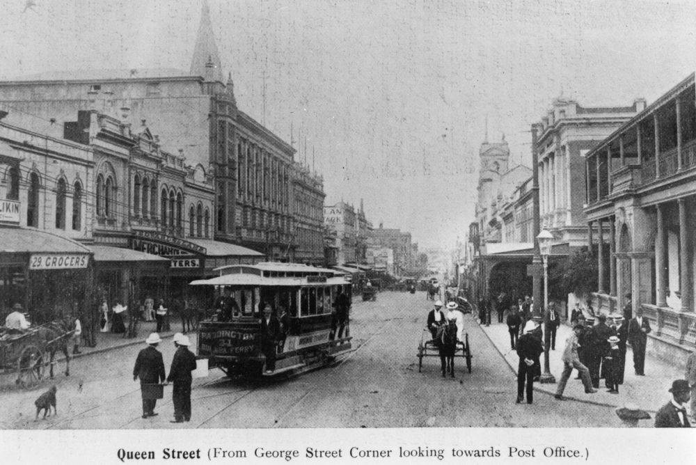

## Alfred Joseph Duggan <small>(7‑52‑5)</small>

Alfred Joseph Duggan was an assistant to Mr. Trouton, a chemist. The Chemist shop was on the [corner of George and Queen street](https://trove.nla.gov.au/newspaper/article/173512329?searchTerm=Trouton%20chemist), Brisbane, and was a "*[Direct Importer of Pure Drugs and Chemicals](https://trove.nla.gov.au/newspaper/article/3618576?searchTerm=Trouton%20chemist)"*. 

{ width="82%" } 

*<small>[Queen Street, looking north from George Street, Brisbane, ca. 1900](http://onesearch.slq.qld.gov.au/permalink/f/1upgmng/slq_alma21220189140002061) - State Library of Queensland</small>*

On Thursday, 13 November 1884, Alfred was riding his Penny Farthing bicycle along North Quay when he fell and injured the middle finger of his right hand. He was admitted to Brisbane Hospital with a Tetanus infection on Wednesday, 19 November 1884. Doctors agreed the finger needed to be amputated, Dr. Thomson performing the operation. [Alfred did not recover and died in hospital](https://trove.nla.gov.au/newspaper/article/184996065) on the night of Thursday, 20 November 1884. [His death was reported in *The Queenslander*](https://trove.nla.gov.au/newspaper/article/23976600?searchTerm=%22Joseph%20Duggan%22) on Saturday, 29 November 1884, noting the cause of death as, *"a wound of finger, tetanus, asphyxia".*

{ width="35%" }  { width="46.6%" }

>Erected  
>By his sorrowing mother  
>To the memory of  
>Joseph Alfred Duggan  
>Who died Nov 20^th^ 1884  
>In the 20^th^ year of his age  
>By a fall from his bicycle  
>May he rest in Peace  
> 
>Also his Mother  
>Ellen Duggan  
>Died May 17^th^ 1915 Aged 76 years  

Most sources and [official registers](https://www.familyhistory.bdm.qld.gov.au/details/32a9b6ceb3fa5a50b7a1c420e0a8b46d2db76fe730237c24fbff422d96463e82) use the name, *"Alfred Joseph Duggan"*, so it is unclear why the headstone is inscribed, *"Joseph Alfred Duggan"*. 

<!--
The headstone also states Alfred was, *"In the 20^th^ year of his age"* however *[The Queenslander](https://trove.nla.gov.au/newspaper/article/23976600?searchTerm=%22Joseph%20Duggan%22)* reported he was 19 years old. Perhaps he had his birthday after the accident.
-->

Alfred died intestate and *"[all the land, goods, chattels, credits, and effects](https://trove.nla.gov.au/newspaper/article/3438912?searchTerm=%22Alfred%20Duggan%22)"* of [under £35](https://trove.nla.gov.au/newspaper/article/19797033?searchTerm=%22Alfred%20Duggan%22) were given to his spinster sister, Miss Frances Lilian Duggan. Ironically, the two newspaper reports also mixed his sister's first and middle names.

{ width="68.1%" }  { width="27.4%" } 

*<small>[Bicycle racing at Toowong, Brisbane, Queensland, ca. 1885](http://onesearch.slq.qld.gov.au/permalink/f/1upgmng/slq_alma21220537210002061). Bicycle racing on a circular track at the Toowong Sportsground, around 1885. Photograph is taken from R. L. Drew's house, 15 Union Street, Taringa (now the site of the Brisbane Boys' College) - State Library of Queensland. Cropped. </small>*  
*<small>[Cyclist posing with a penny farthing bicycle, Queensland](http://onesearch.slq.qld.gov.au/permalink/f/1upgmng/slq_alma21218490680002061). Possibly G. Stombuco (who was came second in the Half-mile bicycle race without using
handles in the first Brisbane Amateur Cycling Club race) - State Library of Queensland</small>*

### Read more about bicycles in Brisbane in the 1800's

[Bicycles and Tricycles](https://trove.nla.gov.au/newspaper/article/19793260/2247447) in the *The Queenslander*, 8 September 1883, mentions electric bicycles, and argues that the *"art of cycling was essential to the national wealth."*

[Amateur Cycling Club](https://trove.nla.gov.au/newspaper/article/3432330?searchTerm=Amateur%20Cycling%20Club) in *The Brisbane Courier*, 23 July 1884, describes plans for the first race meeting of the Brisbane Amateur Cycling Club. *"It was proposed to have an Umbrella Race (without handles)"* but nearly every rider declined to enter. According to [The rise and fall of Richmond's cycling empire](https://richmond.com/the-rise-and-fall-of-richmonds-cycling-empire/article_90558ca2-2663-56a2-8e7f-4d854e58fab7.html), each rider in the umbrella race had to “ride the hundred yards, and then raise his umbrella and return with it over his head."

[Brisbane Amateur Cycling Club](https://trove.nla.gov.au/newspaper/article/174680451?searchTerm=Amateur%20Cycling%20Club) in *The Telegraph*, 28 July 1884, describes the results of the first race meeting of the Brisbane Amateur Cycling Club at the Toowong Sports Ground. Some of the prize winners from  the first Brisbane Amateur Cycling Club race are buried in Toowong Cemetery:

- Thomas Ballantine Aird (12-9-11) - Who won the One Mile Bicycle Scratch and One Mile Bicycle Handicap races. (Headstone not found.)
- Herbert Walter Atkinson (28-72-28) - Who came second to Aird in both races above. (Headstone not found.)
- Frederick William Geddes (1-147-15) - Who came third in both races above. (Headstone not found.)
- Arthur Cecil Palmer (13-88-3) - Who came a dead heat for second in the One Mile Bicycle Handicap (for Boys). He was 17 years old at the time. 

{ width="40%" }  
