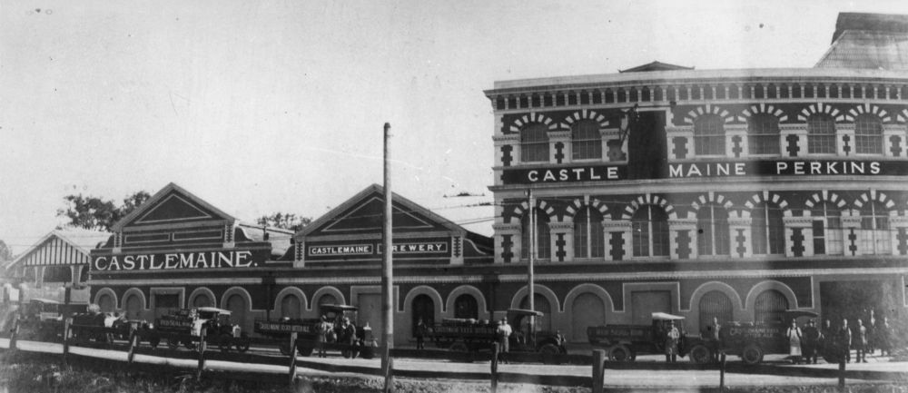

## Alois Wilhelm Leitner <small>(8‑40‑16A)</small> 

<!-- 1878‑1931 -->

Alois Wilhelm "Bill" Leitner was born in 1878 in the town of Lichtenstadt in Bohemia, now known as part of the Czech Republic. Leitner attained the degree of Master Brewer in 1902, emigrated to Australia and spent the next 18 years working in breweries across Victoria, New South Wales and South Australia. 

In 1910, the Castlemaine XXXX Brewery famously set out to develop a beer they believed would be better suited to the Queensland climate than those currently being sold which were modelled on the Victorian styles of the late 1880s. The XXXX Sparkling Ale, while receiving an enthusiastic reception by the Queensland public, was plagued with production problems. And so it was that Leitner was recruited to Castlemaine XXXX in 1920. Almost immediately he introduced new strains of yeast from Europe, ultimately resulting in the final release of XXXX Bitter Ale in 1924 to great acclaim and which remains today.

At the same time, XXXX introduced "Mr Fourex". The symbol, still recognised today, was that of a sharply dressed, yellow boater hat‑wearing gentleman.

Leitner remained with Castlemaine as their Head Brewer throughout the 1920s continuing to improve all aspects of production. Despite his sudden death in 1931, his creation still remains one of the best known brands in Queensland. Leitner was survived by his wife Alma, their three daughters and a son.  

{ width="18.35%" } { width="77%" } 

*<small>[Fourex beer advertisement by Castlemaine Perkins Ltd., 1920](http://onesearch.slq.qld.gov.au/permalink/f/1upgmng/slq_alma21218510830002061) - State Library of Queensland. </small>*  
*<small>[Staff and vehicles of Castlemaine Perkins Limited outside the brewery in Milton Road, Brisbane, ca. 1929](http://onesearch.slq.qld.gov.au/permalink/f/1upgmng/slq_alma21218338890002061) - State Library of Queensland. </small>*

<!--
‘[Ashgrove Time Capsule](https://www.househistories.org/ashgrove-time-capsule)’, House and Suburban Histories from South East Queensland
-->
