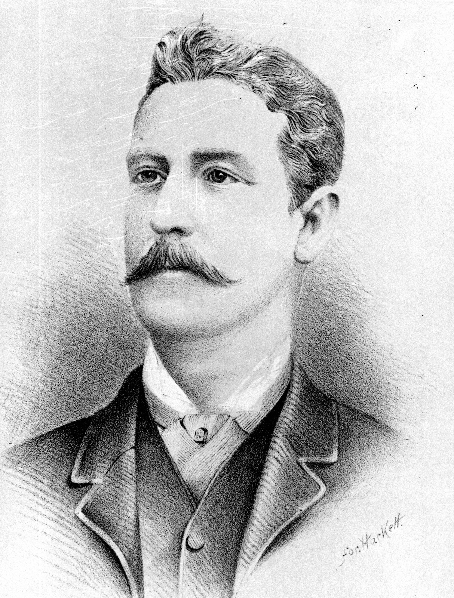
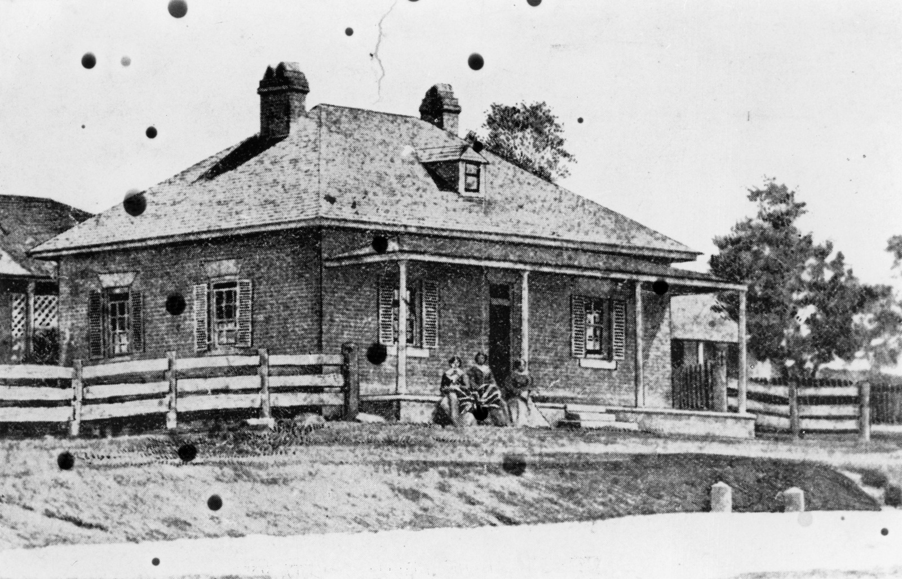
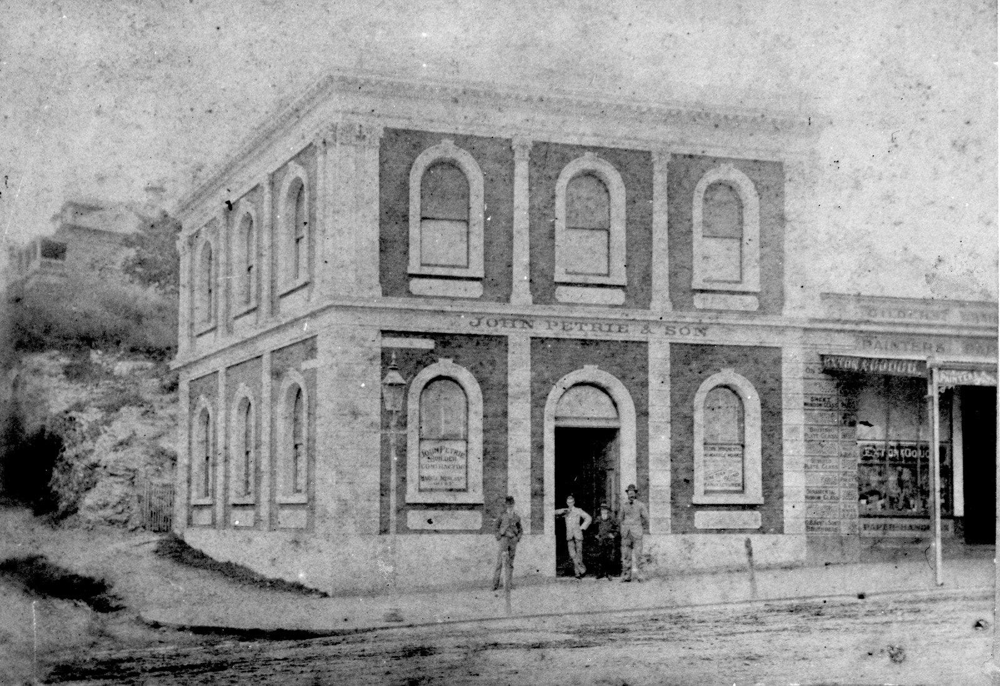
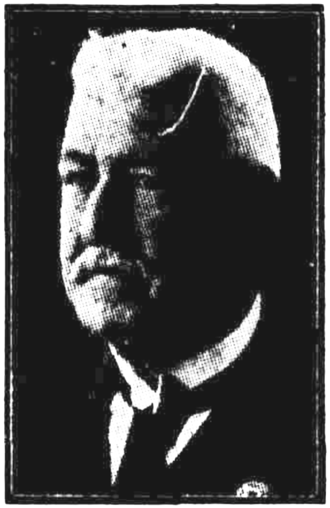

## Andrew Lang Petrie <small>[(13‑10‑7)](https://brisbane.discovereverafter.com/profile/31981437 "Go to Memorial Information" )</small>

Named after his grandfather, Andrew Lang Petrie was the eldest son of John Petrie. He was born 25 June 1854 in his father’s house at Petrie Bight. He was one of the first students enrolled at the Brisbane Normal School. 

<figure markdown>
  { width="30%" }
  <figcaption markdown>[Sketch of Andrew Lang Petrie](https://onesearch.slq.qld.gov.au/permalink/61SLQ_INST/dls06p/alma99184003784302061) — State Library of Queensland.</figcaption>
</figure>

<figure markdown>
  { width="70%" class="full-width" }
  <figcaption markdown>[Andrew Petrie's house at the corner of Queen and Wharf Streets, Brisbane, ca. 1859](https://onesearch.slq.qld.gov.au/permalink/61SLQ_INST/dls06p/alma99183512990302061) — State Library of Queensland. Andrew Petrie was the father of John Petrie and grandfather of Andrew Lang Petrie.</figcaption>
</figure>

In 1882 Andrew Lang Petrie became a partner in, and took over management of, his father’s reconstructed firm, John Petrie & Son. By then the business focused on cabinet making and joinery, brick and tile making and monumental masonry. 

<figure markdown>
  { width="70%"  class="full-width" }
  <figcaption markdown>[Premises of John Petrie & Son, Brisbane, ca. 1882](https://onesearch.slq.qld.gov.au/permalink/61SLQ_INST/dls06p/alma99183506004802061) — State Library of Queensland.</figcaption>
</figure>

The firm went bankrupt in the depression of 1894 but was later revived as monumental masons only. The [Monumental Works](https://trove.nla.gov.au/newspaper/article/216440929?searchTerm=headstones) was located opposite the main Toowong Cemetery gates. Andrew was a member of the Brisbane General Cemetery Board.

<figure markdown>
  { width="72%"  class="full-width" }
  <figcaption markdown>[Advertisement and etching for John Petrie & Sons, stonemasons in Brisbane, 1889](http://onesearch.slq.qld.gov.au/permalink/f/1upgmng/slq_digitool110812) — State Library of Queensland.</figcaption>
</figure>

He was elected a member of the Toombul Divisional Board and held the position for about five years until 1890 when the Hamilton Division split from Toombul. He went on to become the first chairman of the Hamilton board until the end of 1892. The following year he contested the Toombul seat in the Queensland Legislative Assembly and was elected with a large majority. He continued to represent this seat until his retirement in 1926. 

[Andrew Lang Petrie died on 1 April 1928](https://trove.nla.gov.au/newspaper/article/179319365?browse=ndp%3Abrowse%2Ftitle%2FT%2Ftitle%2F840%2F1928%2F04%2F02%2Fpage%2F19871822%2Farticle%2F179319365) after being ill for the previous 12 months. His residence, *[Mooloomburram](https://heritage.brisbane.qld.gov.au/heritage-places/157)* became part of St Margaret’s Anglican Girls’ School at Albion. 

<figure markdown>
  { width="30%" }
  <figcaption markdown>[Photograph of Andrew Lang Petrie](hhttps://trove.nla.gov.au/newspaper/article/179319365) in the Telegraph, 2 April 1928. Photo lightened.</figcaption>
</figure>

<!--
??? warning "Research"

    - https://www.fotc.au/research/andrew-lang-petrie/
    - https://trove.nla.gov.au/newspaper/article/179319365?searchTerm=monumental%20mason
    - https://trove.nla.gov.au/newspaper/article/21116002?searchTerm=monumental%20mason - Dr Rowe
    - https://www.flickr.com/photos/11000366@N02/6464581535
    - https://www.flickr.com/photos/11000366@N02/albums/72157604627922580
    - [From the OGA President - St Margaret's Anglican Girls School](https://www.google.com/url?sa=t&rct=j&q=&esrc=s&source=web&cd=&ved=2ahUKEwj4ru7OvKX8AhUD7zgGHYRwALMQFnoECEcQAQ&url=https%3A%2F%2Fwww.stmargarets.qld.edu.au%2FArticleDocuments%2F394%2FOGA%2520Newsletter_Issue_2_2014.pdf.aspx&usg=AOvVaw3Zy8TDuGgYSY__F4WmvR5N) - The name comes from the Maroochy Aboriginal dialect combining ‘mooloom’ (shady tree) with ‘burram’ (parrot).
    - Works:
        - Toowong Soldiers’ Memorial in Toowong Memorial Park.
        - [Trooper Cobb's Grave](https://apps.des.qld.gov.au/heritage-register/detail/?id=600333) 
        - [Carved R.R.Smellie's headstone](https://www.flickr.com/photos/11000366@N02/albums/72157604627922580)

    - [Advertisement for the manufacturer of stone memorials Andrew L. Petrie](https://onesearch.slq.qld.gov.au/permalink/61SLQ_INST/dls06p/alma99184003606302061), 1897.
-->